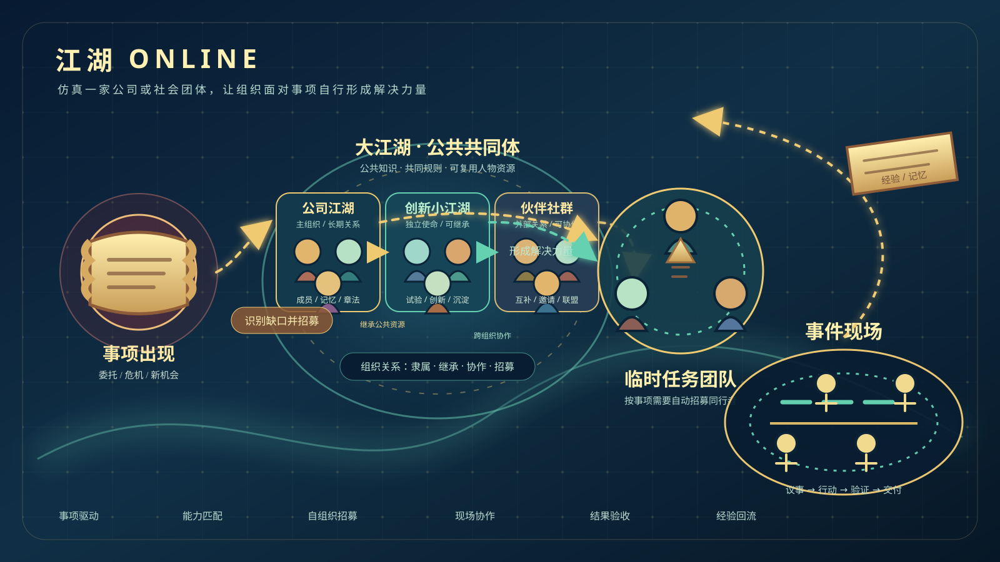

# Agent Arena

**中文名：江湖 Online**

Agent Arena 是一套面向组织场景的多 Agent 社会操作系统与工作流工厂。用户可以输入员工、研发、客户、运营等场景目标，连接自己的知识和工具，由平台构建可运行、可观察、可干预、可评估的多 Agent 协作与对抗工作流。

仓库内置一个不含 Mock 结果的完整生产流对照案例：同一开发任务分别由“单 Agent 生产基线”和“多 Agent 协作 / 对抗流”真实执行，交付真实代码、命令和自动化测试，再由同一独立裁判与平台隐藏验收集比较问题发现率、产出完整度、质量、耗时、Token 和人工介入。

案例说明与可审计指标口径见 [examples/production-flow-comparison/README.md](examples/production-flow-comparison/README.md)。启动平台后进入“实战擂台”即可安装人物、团队和两套可复用 WorkflowVersion；只有用户确认启动后才会调用真实模型并产生费用。

项目的调研、需求、设计决策与过程记录见 [docs/README.md](docs/README.md)。

## 江湖 Online 产品理念



这张图表达的不是传统软件模块关系，而是江湖 Online 要仿真的一个真实组织过程：一个事项出现后，组织不依赖预先写死的固定团队，而是从人物池中识别能力缺口、招募同行者、形成临时团队，并在事件现场完成解决和复盘。

- **事项出现**：可以是公司任务、客户需求、研发问题、危机事件或社会议题。
- **组织识别**：从事项目标判断需要哪些能力、角色、认知水平和协作关系。
- **组织关系**：大江湖提供公共知识和规则；公司组织、小江湖和伙伴社群之间存在隶属、继承、跨组织协作和临时招募关系。
- **自组织招募**：从组织的人物池中选择合适的人，允许根据任务临时补充人物，而不是依赖固定编制。
- **事件现场**：临时团队进入生产流，经历议事、行动、验证、失败修复和交付。
- **经验回流**：正式产物、结论、记忆和复盘结果沉淀回组织，使下一次事项可以形成更好的解决力量。

产品的技术实现、事件模型与运行状态机见 [系统架构、事件模型与运行状态机](docs/04-design/system-architecture.md)，项目过程文档见 [docs/README.md](docs/README.md)。

### 设计原则

1. 组织不是静态通讯录，而是能够感知事项、组织人物并持续生产结果的行动共同体。
2. 团队不是预先固定的部门，而是根据事项动态形成、解散和复用的解决单元。
3. 人物不是“需要一个某某角色”的占位符，而是有名字、能力、记忆、认知档位和组织关系的具体同行者。
4. 权力不是数据权限。它只影响结论在团队中的采纳与遵守程度；数据访问仍由知识范围和任务上下文决定。
5. 事件现场不是日志页面，而是生产流的运行时空间：每个行动都可观察，每个失败都可定位，每个结论都有产物依据。

## Docker 部署

需要 Docker Engine 24+ 和 Docker Compose v2。镜像已经包含 Vue 前端、FastAPI 后端、Python 3.13、Node.js 24、npm 和固定版本 `OpenClaw 2026.7.1-2`，不再依赖宿主机安装 OpenClaw。

首次使用先复制环境文件：

```bash
cp .env.docker.example .env.docker
```

运行时会把宿主机 `.data` 挂载为平台持久化目录，但 `.data` 已被 Git、Docker 构建上下文和交付脚本明确排除。源码仓库、源码包和镜像层都不会携带现有组织数据、知识文件、运行产物、SQLite 数据库、模型 Token 或本地加密密钥。

在项目根目录运行：

```bash
docker compose --env-file .env.docker up -d --build
```

启动后访问：

- Web：<http://localhost:8000>
- API 文档：<http://localhost:8000/docs>
- 健康检查：<http://localhost:8000/api/health>

查看状态与日志：

```bash
docker compose ps
docker compose logs -f jianghu-online
```

停止服务：

```bash
docker compose down
```

普通 `docker compose down` 不会删除宿主机 `.data`。不要直接删除 `.data/.jianghu-secret.key`，否则已保存的模型 Token 将无法解密。

### PostgreSQL 模式

默认模式使用部署机器自己的 `.data/jianghu.db`。新建正式 PostgreSQL 环境时，先在 `.env.docker` 设置强密码，再运行：

```bash
docker compose --env-file .env.docker -f compose.yaml -f compose.postgres.yaml up -d --build
```

该模式会创建新的 PostgreSQL 领域数据库；不会自动把现有 SQLite 数据覆盖进 PostgreSQL。知识文件、Agent 工作区、OpenClaw 状态和加密密钥仍保存在 `.data`。

### 配置模型服务

可以编辑不纳入 Git 的 `.env.docker`：

```dotenv
ANTHROPIC_BASE_URL=https://your-anthropic-compatible-endpoint.example.com
ANTHROPIC_AUTH_TOKEN=your-token
ANTHROPIC_DEFAULT_SONNET_MODEL=your-model-id
JIANGHU_PORT=8000
JIANGHU_DATA_DIR=./.data
POSTGRES_DB=jianghu
POSTGRES_USER=jianghu
POSTGRES_PASSWORD=replace-with-a-long-random-password
```

然后重新创建容器：

```bash
docker compose --env-file .env.docker up -d --build
```

也可以启动后在 Web 界面的“模型与凭据”中配置。模型凭据使用 `/app/.data/.jianghu-secret.key` 加密，备份时必须同时保留数据库和密钥。

### 可选登录与防爆破

默认不要求登录。若此实例需要限制访问，在未纳入 Git 的 `.env.docker` 中启用以下配置，然后重新创建容器：

```dotenv
AUTH_ENABLED=true
AUTH_USERS=admin:替换为高强度密码
AUTH_SESSION_SECRET=替换为至少32字符的随机字符串
AUTH_SESSION_TTL_MINUTES=480
AUTH_LOGIN_MAX_ATTEMPTS=5
AUTH_LOGIN_WINDOW_SECONDS=900
AUTH_LOCKOUT_SECONDS=900
```

`AUTH_USERS` 可配置多个账号，以英文逗号分隔，例如 `admin:密码,reviewer:密码`；账号与密码中请勿使用英文逗号或冒号。平台会以 HttpOnly 签名 Cookie 保存会话，并按“客户端 IP + 账号”在 15 分钟内限制 5 次失败尝试，达到上限后锁定 15 分钟。错误账号和错误密码使用相同提示，避免泄露账号是否存在。

当前通过 HTTP 局域网地址访问时，保持 `AUTH_COOKIE_SECURE=false`。部署到 HTTPS 反向代理后应设置 `AUTH_COOKIE_SECURE=true`；仅当反向代理可信且会正确覆盖客户端来源时，才设置 `AUTH_TRUST_PROXY=true`。

### 生成完整交付包

PowerShell 执行：

```powershell
.\scripts\package-docker.ps1
```

脚本会先执行凭据扫描，再构建镜像，并在 `dist/jianghu-online-docker-时间戳/` 生成：

- Docker 镜像归档；
- 不含 `.data` 和密钥的源码归档；
- Compose 文件和环境模板；
- SHA-256 校验文件；
- 独立恢复说明。

脚本发现真实 API Key、Bearer Token 或凭据变量值时会立即中止，且不会在错误输出中显示密钥内容。

## 本地开发

环境要求：

- Node.js 22+
- Python 3.13+

首次安装（PowerShell）：

```powershell
python -m venv .venv
.\.venv\Scripts\python.exe -m pip install -r server\requirements.txt
npm install
npm --prefix client install
```

启动 API 和前端开发服务器：

```powershell
npm run dev
```

- Client：<http://127.0.0.1:5173>
- API：<http://127.0.0.1:8003>
- API 文档：<http://127.0.0.1:8003/docs>

验证：

```powershell
npm test
```

生产模式下，Vue 构建产物由 FastAPI 同源托管；Docker 镜像采用同样的运行方式。
