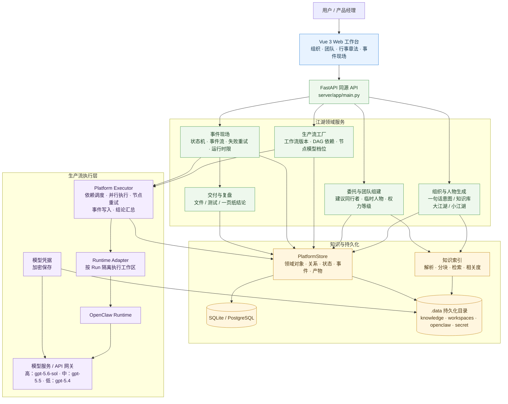
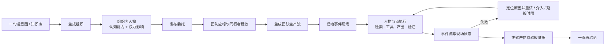

# Agent Arena

**中文名：多智能体协演场（江湖 Online）**

Agent Arena 是一套面向组织场景的多 Agent 社会操作系统与工作流工厂。用户可以输入员工、研发、客户、运营等场景目标，连接自己的知识和工具，由平台构建可运行、可观察、可干预、可评估的多 Agent 协作与对抗工作流。

仓库内置一个不含 Mock 结果的完整生产流对照案例：同一开发任务分别由“单 Agent 生产基线”和“多 Agent 协作 / 对抗流”真实执行，交付真实代码、命令和自动化测试，再由同一独立裁判与平台隐藏验收集比较问题发现率、产出完整度、质量、耗时、Token 和人工介入。

案例说明与可审计指标口径见 [examples/production-flow-comparison/README.md](examples/production-flow-comparison/README.md)。启动平台后进入“实战擂台”即可安装人物、团队和两套可复用 WorkflowVersion；只有用户确认启动后才会调用真实模型并产生费用。

项目的调研、需求、设计决策与过程记录见 [docs/README.md](docs/README.md)。

## 系统架构

Agent Arena 采用“前端工作台 + 领域 API + 持久化领域层 + 可插拔执行运行时”的分层结构。用户在江湖世界中创建组织、人物和团队，团队通过委托形成生产流，生产流执行时就是可观察、可干预、可复盘的事件现场。



### 核心运行闭环



### 分层职责

- **工作台层**：提供组织、团队、人物、知识库、行事章法和事件现场的可视化操作；事件现场展示人物行动、议事通信、文件测试、介入和结论。
- **领域 API 层**：统一承载组织生成、委托评估、团队提案、工作流版本、运行控制、模型配置和知识管理接口。
- **领域存储层**：`PlatformStore` 维护组织、Agent、团队、知识源、工作流、Run、任务、事件、产物和记忆；开发环境使用 SQLite，生产可切换 PostgreSQL。
- **知识层**：知识文件和笔记进入 `.data/knowledge`，经解析、分块和索引后按组织/团队范围检索，并在执行节点中作为可追溯上下文使用。
- **执行层**：`Platform Executor` 按工作流依赖执行节点，记录每一步事件；失败可定位、重试或人工介入，超时可延长，完成后汇总正式产物并生成一页纸结论。
- **模型与运行时层**：通过 Runtime Adapter 对接 OpenClaw 和模型服务；人物的认知能力决定模型档位，权力等级只影响结论的组织采纳程度，不作为数据访问权限。

### 关键设计约束

1. 事件现场是一次团队生产流的运行时视图，所有人物行动、通信、工具调用、失败、重试和产物都必须落到同一个 Run。
2. 组织、团队、工作流和人物均可独立编辑、版本化或复用，避免把一次任务配置硬编码成不可维护的 Demo。
3. 模型凭据只保存加密后的内容；运行数据、知识文件、工作区和凭据密钥统一落在 `.data`，便于备份与迁移。
4. 对外可见的结论来自正式节点产物和验收证据，不把模型内部不可复核的推理过程作为业务结果。

## Docker 部署

需要 Docker Engine 24+ 和 Docker Compose v2。镜像已经包含 Vue 前端、FastAPI 后端、Python 3.13、Node.js 24、npm 和固定版本 `OpenClaw 2026.7.1-2`，不再依赖宿主机安装 OpenClaw。

首次使用先复制环境文件：

```bash
cp .env.docker.example .env.docker
```

运行时会把宿主机 `.data` 挂载为平台持久化目录，但 `.data` 已被 Git、Docker 构建上下文和交付脚本明确排除。源码仓库、源码包和镜像层都不会携带现有组织数据、知识文件、运行产物、SQLite 数据库、模型 Token 或本地加密密钥。

在项目根目录运行：

```bash
docker compose --env-file .env.docker up -d --build
```

启动后访问：

- Web：<http://localhost:8000>
- API 文档：<http://localhost:8000/docs>
- 健康检查：<http://localhost:8000/api/health>

查看状态与日志：

```bash
docker compose ps
docker compose logs -f jianghu-online
```

停止服务：

```bash
docker compose down
```

普通 `docker compose down` 不会删除宿主机 `.data`。不要直接删除 `.data/.jianghu-secret.key`，否则已保存的模型 Token 将无法解密。

### PostgreSQL 模式

默认模式使用部署机器自己的 `.data/jianghu.db`。新建正式 PostgreSQL 环境时，先在 `.env.docker` 设置强密码，再运行：

```bash
docker compose --env-file .env.docker -f compose.yaml -f compose.postgres.yaml up -d --build
```

该模式会创建新的 PostgreSQL 领域数据库；不会自动把现有 SQLite 数据覆盖进 PostgreSQL。知识文件、Agent 工作区、OpenClaw 状态和加密密钥仍保存在 `.data`。

### 配置模型服务

可以编辑不纳入 Git 的 `.env.docker`：

```dotenv
ANTHROPIC_BASE_URL=https://your-anthropic-compatible-endpoint.example.com
ANTHROPIC_AUTH_TOKEN=your-token
ANTHROPIC_DEFAULT_SONNET_MODEL=your-model-id
JIANGHU_PORT=8000
JIANGHU_DATA_DIR=./.data
POSTGRES_DB=jianghu
POSTGRES_USER=jianghu
POSTGRES_PASSWORD=replace-with-a-long-random-password
```

然后重新创建容器：

```bash
docker compose --env-file .env.docker up -d --build
```

也可以启动后在 Web 界面的“模型与凭据”中配置。模型凭据使用 `/app/.data/.jianghu-secret.key` 加密，备份时必须同时保留数据库和密钥。

### 生成完整交付包

PowerShell 执行：

```powershell
.\scripts\package-docker.ps1
```

脚本会先执行凭据扫描，再构建镜像，并在 `dist/jianghu-online-docker-时间戳/` 生成：

- Docker 镜像归档；
- 不含 `.data` 和密钥的源码归档；
- Compose 文件和环境模板；
- SHA-256 校验文件；
- 独立恢复说明。

脚本发现真实 API Key、Bearer Token 或凭据变量值时会立即中止，且不会在错误输出中显示密钥内容。

## 本地开发

环境要求：

- Node.js 22+
- Python 3.13+

首次安装（PowerShell）：

```powershell
python -m venv .venv
.\.venv\Scripts\python.exe -m pip install -r server\requirements.txt
npm install
npm --prefix client install
```

启动 API 和前端开发服务器：

```powershell
npm run dev
```

- Client：<http://127.0.0.1:5173>
- API：<http://127.0.0.1:8003>
- API 文档：<http://127.0.0.1:8003/docs>

验证：

```powershell
npm test
```

生产模式下，Vue 构建产物由 FastAPI 同源托管；Docker 镜像采用同样的运行方式。
