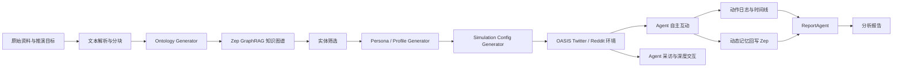

# MiroFish 框架调研

## 1. 调研信息

- 项目仓库：https://github.com/666ghj/MiroFish
- 调研基线：`main`
- 调研提交：`60757b3c825d577a1d7a86ab1ba6d5c21f51c261`
- 调研日期：2026-07-23
- 项目许可证：AGPL-3.0

## 2. 核心判断

MiroFish 不是传统的“多个岗位 Agent 串行完成任务”编排系统，而是一个基于知识图谱构造角色、让大量角色在规则环境中互动、再分析群体涌现结果的社会仿真框架。

它适合作为本项目的设计参考，但若用于生产流，还需要补充：

- 显式任务依赖与状态机
- 角色权限和工具边界
- 结构化产物传递
- 质量门禁和验收标准
- 红队攻击、缺陷修复和裁决闭环
- 生产流级别的成本、质量和效率评估

## 3. MiroFish 的目标

用户上传现实资料，例如新闻、政策、调研报告或小说，并描述推演问题。系统随后：

1. 从资料构建知识图谱。
2. 将人物、组织等实体转换为带人格和立场的 Agent。
3. 让 Agent 在 Twitter/Reddit 风格环境中自主互动。
4. 将互动行为重新写入记忆图谱。
5. 由 ReportAgent 检索图谱、采访 Agent 并形成预测报告。
6. 支持用户继续采访任意 Agent 或追问 ReportAgent。

## 4. 主流程



官方将流程划分为图谱构建、环境设置、模拟、报告生成和深度交互五个阶段。

## 5. 核心模块

| 模块 | 职责 | 对本项目的启发 |
| --- | --- | --- |
| `OntologyGenerator` | 根据资料和目标生成实体、关系类型 | 生产流开始前建立领域模型 |
| `GraphBuilderService` | 文本分块并提交 Zep 构建图谱 | Agent 共享事实源，而不只共享聊天记录 |
| `OasisProfileGenerator` | 将实体转换为 Agent 人格 | 从岗位、利益、能力和立场生成角色 |
| `SimulationConfigGenerator` | 生成活跃度、立场、事件和时间配置 | 将业务规则显式配置化 |
| `SimulationRunner` | 启停模拟、收集动作并维护环境进程 | 运行时和可观测层独立 |
| `ZepGraphMemoryUpdater` | 将 Agent 行为回写图谱 | 行为结果进入长期记忆 |
| `ReportAgent` | 使用 ReAct 和检索工具生成报告 | 由独立审计 Agent 汇总和复核 |
| Interview API | 运行后采访单个或多个 Agent | 支持复盘、解释和责任追踪 |

## 6. 协作与对抗机制

MiroFish 中的协作与对抗不是预定义工作流，而是通过以下条件涌现：

- 每个 Agent 具有不同背景、兴趣、性格和表达方式。
- Agent 可持有支持、反对、中立或观察等立场。
- Agent 只能通过环境允许的动作影响其他 Agent。
- 影响力、活跃度、传播阈值、推荐权重和回音室强度影响信息传播。

因此，其主要模拟对象是：

> 多个具有不同利益和认知的主体，在共享环境中进行局部决策，最终形成群体结果。

这不同于规划 Agent、执行 Agent、审核 Agent组成的生产任务流水线。

## 7. ReportAgent

ReportAgent 的工作方式值得重点借鉴：

1. 规划报告大纲。
2. 针对每个章节进行多轮 ReAct。
3. 自主选择检索工具。
4. 搜索图谱、进行全景检索、深度分析或采访模拟 Agent。
5. 分章节持久化，最后组装完整报告。

主要工具包括：

- `quick_search`
- `panorama_search`
- `insight_forge`
- `interview_agents`

在本项目中，可以将其演化为裁判/审计 Agent，使其能够回查证据、询问执行者并解释评分。

## 8. 技术栈与边界

- 前端：Vue 3、Vite
- 后端：Python、Flask
- LLM：兼容 OpenAI SDK 的接口
- 知识图谱和记忆：Zep Cloud
- 多 Agent 社会模拟：CAMEL-AI、OASIS
- 状态存储：本地 JSON、JSONL、SQLite 和目录文件
- 模拟执行：Twitter、Reddit 或双平台子进程

主要边界：

- 当前环境固定为社交媒体，不是通用生产任务运行时。
- 平级社会角色较多，缺少完整的任务依赖、返工和验收门禁。
- 图谱和长期记忆依赖 Zep Cloud。
- Agent 数量和模拟轮次增大时，LLM 成本会快速增长。
- 直接复用或修改代码时需要评估 AGPL-3.0 的网络服务开源义务。

## 9. 对本项目的可迁移设计

建议保留：

- 共享知识图谱
- 独立的人格、能力和立场
- 事件驱动的多轮环境
- 行为和结论写入长期记忆
- 可检索、可采访的独立报告 Agent

建议新增：

```text
输入资料
  -> 领域知识图谱
  -> 任务规划 Agent
  -> 多个专业执行 Agent 协作
  -> 红队 Agent 主动攻击方案
  -> 修订 Agent 处理缺陷
  -> 裁判 Agent 按证据和指标评分
  -> 最终报告与全链路复盘
```

## 10. 参考源码

- https://github.com/666ghj/MiroFish/blob/main/backend/app/services/graph_builder.py
- https://github.com/666ghj/MiroFish/blob/main/backend/app/services/oasis_profile_generator.py
- https://github.com/666ghj/MiroFish/blob/main/backend/app/services/simulation_config_generator.py
- https://github.com/666ghj/MiroFish/blob/main/backend/app/services/simulation_runner.py
- https://github.com/666ghj/MiroFish/blob/main/backend/app/services/zep_graph_memory_updater.py
- https://github.com/666ghj/MiroFish/blob/main/backend/app/services/report_agent.py
