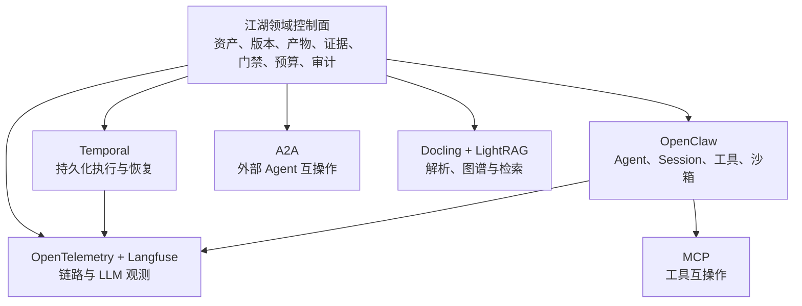
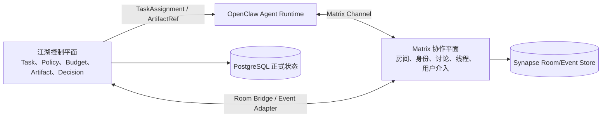

# 江湖 Online 开源实现调研与技术选型

> 日期：2026-07-29
> 状态：详细设计的确定选型依据
> 原则：先复用成熟基础设施，再补江湖 Online 独有的生产语义，不以 Star 数代替架构适配性。

## 1. 调研结论

江湖 Online 不应从零实现全部 Workflow、Agent 通信、知识解析、图谱检索、沙箱和可观测能力，也不应把某一个多 Agent 框架直接当成产品领域模型。

确定采用“开源底座 + 江湖领域控制面 + Adapter”的组合：

| 能力层 | 推荐方案 | 决策 |
| --- | --- | --- |
| 正式领域状态 | 江湖 Online + PostgreSQL | 自有；保存 WorkflowVersion、AgentBlueprintVersion、Run、Artifact、Evidence、Defect、Decision 等正式语义 |
| 持久化 Workflow | **Temporal** | 统一承担 Workflow History、Activity、Retry、Timer、Signal、取消、恢复和长任务执行 |
| Agent Runtime 与局部编排 | **OpenClaw Gateway + Adapter** | 直接采用其 Agent、Session、子 Agent、工具、沙箱和操作能力；平台仍掌握任务与产物状态 |
| 内部通信 | OpenClaw 原生消息/事件 + 江湖领域消息信封 | 不另造网络传输层 |
| 可观察协作房间 | **Matrix Room + Synapse 自托管** | 为人和 Agent 提供独立身份、房间、线程、历史和用户介入；不是 Workflow 状态源 |
| 外部 Agent 互操作 | **A2A Adapter** | 用于跨 Gateway、跨框架、远程市场 Agent |
| 工具互操作 | **MCP + Tool Gateway** | MCP 管工具发现和调用；不能代替 Agent-to-Agent 通信 |
| 文档解析 | **Docling** + 网页/Git 专用解析器 | 直接采用，保留统一 KnowledgeDocument 中间表示 |
| RAG 与知识图谱 | **PostgreSQL FTS + pgvector + LightRAG** | PostgreSQL 保存正式 Evidence、权限和向量；LightRAG 图索引可重建 |
| 代码执行 | **Docker + Git Worktree** | 统一承担真实代码生成、构建、启动和测试隔离 |
| 可观测 | OpenTelemetry + Langfuse | OTel 是跨服务标准；Langfuse负责 LLM trace、评估和 Prompt 观测 |

这不是“全部自研”，也不是“直接套一个框架”。复用边界如下：



读图说明：开源组件承担成熟的基础设施能力，江湖控制面只实现产品不可替代的领域约束。任何外部 Runtime 都不能直接把一次聊天或框架状态写成正式交付物。

## 2. 评价维度

每个候选按以下问题判断，而不是只比较功能数量：

1. 是否支持长任务、重启恢复、重试、取消、超时和幂等；
2. 是否能与 PostgreSQL 唯一真相源协调，是否引入第二套难以解释的正式状态；
3. 是否支持真实并行 Agent、独立上下文、工具执行与沙箱；
4. 是否允许 Workflow 和 Agent 作为可版本化资产保存和复用；
5. 是否能保留 Artifact、Evidence、Defect、Revision、Judge 等江湖领域语义；
6. 是否适合本地 MVP，后续能否横向扩展；
7. 许可证、部署复杂度、项目维护状态和锁定风险；
8. 是否能形成清晰 Adapter，而不是侵入产品 API 和数据库。

## 3. Workflow 与持久化执行引擎

| 方案 | 开源许可 | 强项 | 不足/风险 | 本项目结论 |
| --- | --- | --- | --- | --- |
| DBOS Transact Python | MIT | 基于 PostgreSQL 的轻量 durable workflow；部署简单 | 动态生成图、复杂人工等待、跨服务协调、版本演进和大规模运行经验弱于 Temporal | **不采用**。避免先用轻量引擎再迁移核心 Workflow Runtime |
| Temporal | MIT | 成熟 durable execution、Activity 重试、Timer、Signal、Update、Child Workflow、长任务恢复和规模化 Worker | 独立 Server 和确定性编程约束增加部署与开发复杂度 | **确定采用**。复杂多 Agent 长流程的可靠性和演进风险优先于少部署一个服务 |
| Prefect | Apache-2.0 | Python Flow/Task、调度、事件、监控、自托管 | 主要面向数据工作流；Artifact/Judge/对抗不是原生语义 | 借鉴运维 UI，不作为核心引擎 |
| Dagster | Apache-2.0 | 数据资产、物化、血缘、可观测性强 | 以数据资产和数据管道为中心，Agent 会话与动态协作不自然 | 借鉴资产血缘，不采用核心运行时 |
| LangGraph | MIT | Stateful Agent 图、checkpoint、HITL、memory、长运行 Agent | 与 OpenClaw 和 Temporal 形成重复编排与状态层 | **不采用**，仅参考其状态图设计 |

### 3.1 为什么选择 Temporal

江湖 Workflow 由模型生成，包含动态 fan-out/fan-in、子流程、人工等待、有限辩论、最长 60 分钟 Run、外部 Agent 和真实工具副作用。核心执行引擎一旦上线，迁移会影响全部 WorkflowVersion、运行恢复和审计，因此不采用“先 DBOS、以后再换 Temporal”的两阶段路线，直接选择成熟度更高的 Temporal。

- WFDL 是江湖的资产描述协议，不等于 Temporal SDK 代码；
- Compiler 把 WFDL 编译成 `CompiledWorkflow`；
- 通用 Temporal Workflow Interpreter 解释执行 `CompiledWorkflow`，不为每个 Workflow 动态生成 Python 源码；
- Agent、LLM、知识和工具调用全部封装为可重试 Activity；
- 人工介入和外部状态使用 Signal/Update；子图和并行分支使用 Child Workflow/Activity；
- 江湖业务 PostgreSQL 保存正式领域状态，Temporal 保存 Workflow History；通过 project/run/task/attempt 关联；
- Activity 重试不等于业务重复执行，所有外部调用必须使用幂等键并先查询未知状态；
- History 达到阈值时使用 Child Workflow 和 Continue-As-New，大 Artifact 只保存不可变引用。

### 3.2 Temporal 实施验证标准

- 服务在并行 Agent 节点中途被杀死，重启后不得重复提交正式 Artifact；
- 支持暂停等待人工审批、最长 60 分钟 Run、单节点 10 分钟超时；
- 5 个并发 Agent、3 轮辩论可恢复、可取消、可统计 Token/费用；
- WorkflowVersion 与 Temporal History 分离，旧版本可通过 Worker Versioning 兼容运行；
- 外部 OpenClaw 调用使用幂等键，未知状态先查询再补偿；
- 验证 Child Workflow、Continue-As-New、Signal/Update、取消传播和 History 大小控制。

## 4. Agent Runtime、组织方式与通信

| 方案 | 许可/状态 | 强项 | 不足/风险 | 本项目结论 |
| --- | --- | --- | --- | --- |
| OpenClaw | 开源项目，需锁定具体版本核验依赖许可 | 多长期 Agent、独立 Workspace/Session、子 Agent、真实工具操作、Docker sandbox、多渠道 Gateway | 主要是个人 Agent Gateway，不提供江湖的 Artifact/Evidence/Workflow 正式语义 | **确定采用**，通过 Adapter 使用，不作为领域真相源 |
| Microsoft Agent Framework | MIT | production-grade Agent/多 Agent Workflow 框架，Python/.NET | 与已选择的 OpenClaw Agent Runtime 和 Temporal Workflow 重叠 | **不采用** |
| AutoGen | 代码 MIT、文档另有许可；官方已进入 maintenance mode | message passing、event-driven runtime、group chat 经验丰富 | 新项目官方推荐转向 Microsoft Agent Framework | **不选主框架**，仅借鉴消息和团队模式 |
| CrewAI | MIT | Crew + Flow、角色协作、状态与分支、A2A/MCP | 与 OpenClaw Runtime 重叠，正式产物治理不足 | **不采用**，仅借鉴 Crew/Flow UX |
| CAMEL | Apache-2.0 | role-playing、社会模拟、Workforce 与多 Agent 研究模式 | 生产持久化、权限和正式产物需额外建设 | 借鉴拟人关系与协作/争辩行为 |
| MetaGPT | MIT | 软件公司角色、SOP、结构化消息和代码产物 | 流程偏软件开发且较固定 | 借鉴“角色 + SOP + 产物流转”，不能把软件流程写死到平台 |
| ChatDev | Apache-2.0 | Chat Chain、阶段化角色协作、软件开发 Demo | 以聊天链驱动，流程和角色更偏预置 | 借鉴可观察协作和 Demo 验收，不作为通用内核 |

### 4.1 OpenClaw 的准确定位

Workflow 绑定的是 `AgentBlueprintVersion` 与节点团队政策；运行时由 OpenClaw 将其物化为独立 Agent/Session，并提供工具和沙箱。江湖 Orchestrator 决定“谁在什么节点、依据什么输入、应交付什么”；OpenClaw 决定“Agent 如何实际调用模型和工具完成操作”。

### 4.2 A2A、MCP 与内部消息的边界

| 通信对象 | 采用方式 | 原因 |
| --- | --- | --- |
| 同一 OpenClaw Gateway 内 Agent | OpenClaw 原生消息/Session + 江湖领域信封 | 复用现有可靠通道，信封补充 run/task/artifact/visibility 语义 |
| 人与 Agent 可观察讨论 | Matrix Room + OpenClaw Matrix Channel | 提供房间成员、独立身份、线程、事件历史、@提及和跨客户端介入 |
| 外部或跨 Runtime Agent | A2A Adapter | A2A 面向 opaque agent application 的发现、任务和结果互操作 |
| Agent 调用工具/数据服务 | MCP，经 Tool Gateway 授权 | MCP 解决工具上下文和调用，不承担团队协作语义 |
| 正式产物共享 | Artifact/Evidence API + Blackboard 引用 | 不通过复制整段聊天传递正式状态 |

因此，原候选 `JHMP` 降级为“江湖领域消息信封”，不宣称是新协议。平台不自研传输、服务发现或远程 Agent 网络协议。

### 4.3 Matrix Room 是否作为 Agent 通信基础设施

Matrix 是开放的实时通信协议，Room 具有成员、权限、状态事件、消息事件、线程、历史同步和可选 Federation；Synapse 是成熟的开源 Homeserver。OpenClaw 已提供 Matrix Channel，因此江湖无需自己开发完整群聊服务器。

Matrix 与“江湖”的概念匹配度很高，但应采用**双平面设计**：



读图说明：Matrix 负责“大家在哪里交流以及用户如何看到和介入”；江湖控制平面负责“任务是否成立、谁被授权、交付物是否合格、流程是否推进”。Matrix 消息丢失、重复、迟到或被编辑，均不能直接改变正式 Run 状态。

| 江湖对象 | Matrix 映射 |
| --- | --- |
| Project / 大江湖 | Matrix Space，聚合多个长期房间 |
| Run / 小江湖 | 一个主 Room，保存本次运行的公开协作过程 |
| 多 Agent 节点 | 按需创建临时子 Room；普通节点使用主 Room Thread，避免房间爆炸 |
| Task / 辩论主题 | Thread root event，回复形成讨论链 |
| AgentInstance | 独立 Matrix User/虚拟用户，显示 Blueprint 名称、头像和本次实例标识 |
| Artifact/Defect/Decision | 只发送不可变引用卡片，正文和正式状态仍在 Artifact Service |
| 用户介入 | 房间发言转换为普通消息或平台命令；结构性命令必须二次确认 |

AgentInstance 身份统一由 Matrix Application Service 创建虚拟用户；不为每个运行实例手工注册普通 Bot 账号，以避免账号和密钥管理失控。

Matrix 不能替代 Temporal 的 Workflow History 和 Task Queue，不能替代 Artifact/Evidence/Decision，不能替代 A2A 的跨组织 Agent 互操作，也不能替代 MCP 和 Tool Gateway。

平台托管的生产 Room 默认关闭 Federation 和 E2EE，以支持权限检查、审计、检索与复盘。客户要求 E2EE 时，必须设计受控密钥托管、合规导出和不可检索提示；Federation 按组织/项目 Policy 开启。

## 5. 可视化 Workflow 产品参考

| 方案 | 值得复用/借鉴 | 不直接采用原因 |
| --- | --- | --- |
| Dify | Workflow Studio、运行日志、知识库和发布体验 | 使用自定义许可证；多 Agent 社会关系、争辩、裁判和正式产物不是核心 |
| Flowise | 可视化 Agent/Flow、节点生态 | 许可证与企业使用边界需逐版本核验；产品领域模型不匹配 |
| Langflow | MIT、可视化组件和 Agent Workflow | 更像开发者低代码构建器；缺少江湖资产/证据/对抗治理 |

结论：借鉴编辑器交互、节点配置、试运行和发布流程，不嵌入其 Workflow 数据模型。江湖 Workflow 必须可保存、派生、比较、上架市场，并默认冻结 Agent Blueprint。

## 6. 知识管理、RAG 与知识图谱

| 方案 | 许可 | 强项 | 风险 | 结论 |
| --- | --- | --- | --- | --- |
| Docling | MIT | PDF/Office/HTML/音视频等解析，统一文档表示，支持表格和版面，已有生态集成 | 网页抓取、Git 代码语义仍需专用解析器 | **确定采用** |
| LightRAG | MIT | 向量 + 图谱双层检索、增量更新、删除重建、引用、可用 PostgreSQL | LLM 抽取出的图不是正式事实；权限过滤和版本治理需平台包裹 | **确定采用** |
| RAGFlow | Apache-2.0 | 完整文档理解、RAG 流水线、Agent、管理 UI | 部署组件较重，整套引入会与平台知识服务和 Agent 层重叠 | 作为能力基准；仅在拆用收益明确时集成 |
| Microsoft GraphRAG | MIT | 社区摘要和全局问题分析能力强 | 索引成本高、增量更新较重，与 LightRAG 图索引重复 | **不采用** |
| LlamaIndex | MIT | Connector、Node、Index、Retriever 生态丰富 | 抽象层较多，容易渗入领域模型 | 连接器缺口时按组件采用 |
| Haystack | Apache-2.0 | 显式 Pipeline、检索/路由/生成组件化、生产部署成熟 | 又形成一套 Pipeline 编排；与 Temporal 和知识服务重叠 | **不采用** |

### 6.1 推荐知识流水线

```text
本地文件/网页/Git/历史 Artifact
  -> Connector
  -> Docling 或专用 Parser
  -> KnowledgeDocument 统一中间表示
  -> 结构感知切块
  -> Evidence/Chunk 正式入库（PostgreSQL）
  -> FTS + pgvector
  -> LightRAG 图索引投影
  -> 权限过滤、RRF、rerank
  -> ContextManifest 下发 Agent
```

正式知识、证据、来源版本、权限和反馈审核仍由江湖保存。LightRAG/GraphRAG 图谱是可重建索引，不得把未经审核的实体关系直接升级为组织事实。运行反馈先进入候选知识，人工或规则审核通过后发布新 KnowledgeVersion。

## 7. 代码执行、安全与可观测

| 能力 | 候选 | 结论 |
| --- | --- | --- |
| 本地代码执行 | Docker + Git Worktree | **确定采用**。每次 Run 独立工作树、容器、网络和资源策略，真实 build/run/test |
| 云端沙箱 | E2B（Apache-2.0） | **不采用**；代码执行统一使用 Docker + Git Worktree |
| Runtime 沙箱 | OpenClaw Docker/SSH/OpenShell backend | 与 OpenClaw Agent 工具策略共同使用，平台 Tool Gateway 再做一次授权 |
| 跨服务观测 | OpenTelemetry（Apache-2.0） | **确定采用**。trace/span/metric 贯通 API、Workflow、OpenClaw、知识和工具 |
| LLM 观测评估 | Langfuse | **确定采用自托管部署**；部署前逐项核验锁定版本及其组件许可证 |

## 8. 明确不采用的组合

1. 不采用“OpenClaw 会话树 = Workflow 状态机”：无法满足版本、产物、证据、门禁和恢复语义。
2. 不采用“LangGraph/AutoGen/CrewAI 任一框架对象 = 平台公开 Workflow”：会造成产品 API 和历史资产被框架版本绑定。
3. 不同时把 OpenClaw、CrewAI、Agent Framework 作为核心 Runtime：双重调度和消息状态难以审计。
4. 不从零开发文档解析、向量库、图谱抽取和 LLM trace。
5. 不把 A2A 当工具协议，也不把 MCP 当 Agent 团队通信协议。
6. 不采用 Neo4j、Qdrant、Chroma：正式知识栈统一为 PostgreSQL FTS + pgvector + LightRAG。

## 9. 确定选型的实施验证

验证不再承担二次选型职责，只用于发现配置、集成和实现缺陷；发现问题必须在已确定技术栈内修正。

| 验证项 | 验证对象 | 必须达到的结果 | 未通过处理 |
| --- | --- | --- | --- |
| Workflow | Temporal + 动态图解释器 + OpenClaw Activity | 恢复、幂等、取消、人工等待和 History 控制全部通过 | 修正 Workflow Interpreter、Activity 边界和 Temporal 配置 |
| Agent | OpenClaw 并行 Agent、独立上下文、取消、工具、重启映射 | 固化 OpenClaw Adapter 契约 | 修正 Adapter、Session 映射和运行 Policy |
| 协作房间 | Synapse + OpenClaw Matrix Channel + 独立 Agent 身份 + Thread | Room、身份、用户介入和审计映射全部通过 | 修正 MatrixRoomBridge 和 Synapse 配置 |
| 知识 | Docling + pgvector + LightRAG + 权限过滤 + 增量删除 | 解析、检索、图谱、引用和删除全部通过 | 修正解析、索引、权限过滤和图谱抽取参数 |
| 代码 | Worktree + Docker 中真实生成、启动、Playwright 测试 Demo | 真实 Demo 可运行、可测试、可复现 | 修正镜像、资源、网络和 Tool Gateway Policy |
| 可观测 | OTel trace 贯通一次多 Agent Run，Langfuse 关联模型与评估 | Trace、费用、Prompt、Judge 和反馈可追溯 | 修正埋点、关联 ID 和 Langfuse 配置 |

所有实施验证必须使用真实 LLM、真实并行 Agent、真实工具和真实产物，不接受 Mock 作为最终通过证据。

## 10. 官方来源

- [OpenClaw](https://github.com/openclaw/openclaw)、[Multi-agent routing](https://docs.openclaw.ai/concepts/multi-agent)、[Sub-agents](https://docs.openclaw.ai/tools/subagents)
- [DBOS Transact Python](https://github.com/dbos-inc/dbos-transact-py)、[Temporal](https://github.com/temporalio/temporal)、[Prefect](https://github.com/PrefectHQ/prefect)、[Dagster](https://github.com/dagster-io/dagster)
- [LangGraph](https://github.com/langchain-ai/langgraph)、[Microsoft Agent Framework](https://github.com/microsoft/agent-framework)、[AutoGen](https://github.com/microsoft/autogen)、[CrewAI](https://github.com/crewAIInc/crewAI)
- [A2A Protocol](https://github.com/a2aproject/A2A)、[CAMEL](https://github.com/camel-ai/camel)、[MetaGPT](https://github.com/FoundationAgents/MetaGPT)、[ChatDev](https://github.com/OpenBMB/ChatDev)
- [Matrix Specification](https://github.com/matrix-org/matrix-spec)、[Synapse](https://github.com/element-hq/synapse)、[OpenClaw Matrix Channel](https://docs.openclaw.ai/channels/matrix)
- [Dify](https://github.com/langgenius/dify)、[Flowise](https://github.com/FlowiseAI/Flowise)、[Langflow](https://github.com/langflow-ai/langflow)
- [RAGFlow](https://github.com/infiniflow/ragflow)、[LightRAG](https://github.com/HKUDS/LightRAG)、[Microsoft GraphRAG](https://github.com/microsoft/graphrag)、[LlamaIndex](https://github.com/run-llama/llama_index)、[Haystack](https://github.com/deepset-ai/haystack)、[Docling](https://github.com/docling-project/docling)
- [E2B](https://github.com/e2b-dev/E2B)、[OpenTelemetry](https://github.com/open-telemetry/opentelemetry-specification)、[Langfuse](https://github.com/langfuse/langfuse)

> 许可证结论以调研日仓库元数据和 LICENSE 为准。Dify、Flowise、Langfuse 等存在自定义许可或组件许可边界，上线或二次分发前必须由法务和依赖扫描再次确认。
