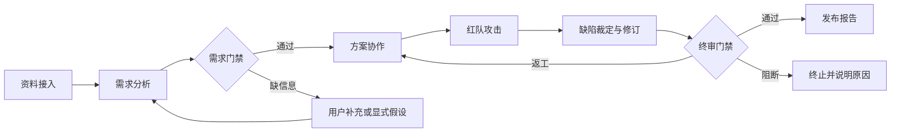

# 首个生产流：产品需求评审与方案攻防

- 版本：0.1
- 状态：方案草案
- 日期：2026-07-23

## 1. 工作假设

在尚未指定具体行业项目之前，首个可运行示例采用一个通用软件产品需求：

> 用户提交产品背景、原始需求和约束，多个 Agent 共同形成可实施方案；红队从业务、技术、安全和交付角度攻击方案；修订 Agent 处理有效缺陷；裁判 Agent 根据证据和验收量表决定通过、返工或终止。

该场景用于验证系统能力，不代表最终业务方向已经锁定。

## 2. 生产流目标

验证以下问题：

- 多 Agent 是否能比单 Agent 产出更完整、可追溯的方案。
- 专业 Agent 的协作是否能减少需求遗漏和方案冲突。
- 红队是否能发现执行团队未主动暴露的缺陷。
- 修订是否真正关闭缺陷，而不是只修改措辞。
- 裁判是否能够依据证据稳定评分并解释结论。
- 用户是否能在 Client 中观察、干预和复盘全过程。

## 3. 输入

### 3.1 必需输入

- 产品背景
- 原始需求描述
- 目标用户
- 期望业务结果
- 已知限制
- 最终交付物要求

### 3.2 可选输入

- 现有系统架构
- 用户研究或访谈
- 竞品资料
- API、数据字典或代码仓库
- 合规和安全要求
- 时间、预算和团队限制
- 自定义验收量表

### 3.3 支持格式

MVP 优先支持：

- Markdown
- TXT
- PDF
- DOCX
- 用户直接输入的表单内容

## 4. 最终输出

一次成功运行至少生成：

1. 结构化需求说明
2. 用户问题与目标映射
3. 范围和非目标
4. 关键用户流程或用例
5. 产品与技术方案
6. 风险、依赖和待确认问题
7. 红队攻击报告
8. 缺陷处置和修订记录
9. 裁判评分与最终结论
10. 全链路证据、消息和工具调用记录

## 5. 阶段定义

### 5.1 资料接入

动作：

- 解析文件和表单内容。
- 建立来源、片段和实体索引。
- 标识事实、用户要求、推断和未知信息。

退出条件：

- 所有输入均有来源标识。
- 解析失败项已明确展示。

### 5.2 需求分析

动作：

- 提取用户、问题、目标、约束和验收要求。
- 识别冲突、歧义、缺失信息和隐含假设。
- 形成结构化需求基线。

产物：

- `requirement_baseline`
- `open_questions`
- `assumption_register`
- `evidence_map`

### 5.3 需求门禁

通过条件：

- 目标用户、核心问题和业务目标存在。
- 范围与非目标明确。
- 高影响假设已得到确认或显式接受。
- 每个关键结论可追溯到输入证据或已标注推断。

失败处理：

- 可补充：请求用户补充。
- 可假设：记录风险后继续。
- 不可执行：终止运行并给出缺失清单。

### 5.4 方案协作

动作：

- 产品方案与技术方案并行起草。
- Agent 通过结构化提案、质疑和回应消息协作。
- 协调 Agent 合并一致部分并登记冲突。

产物：

- `product_proposal`
- `technical_proposal`
- `decision_log`
- `risk_register`
- `delivery_plan`

### 5.5 红队攻击

攻击维度：

- 需求真实性与价值
- 边界场景和异常流程
- 技术可行性和复杂度
- 安全、隐私与合规
- 数据质量和模型风险
- 成本、性能和可运维性
- 交付计划和组织依赖
- 证据不足与逻辑矛盾

每个攻击必须包含：

- 被攻击对象
- 缺陷描述
- 复现或推导步骤
- 证据
- 严重度
- 建议修复方向

### 5.6 缺陷裁定与修订

缺陷状态：

- `proposed`
- `accepted`
- `rejected`
- `needs_evidence`
- `fixed`
- `partially_fixed`
- `waived`

修订要求：

- 修订必须引用对应缺陷。
- 必须说明改动内容和影响范围。
- 对拒绝或豁免的缺陷必须提供理由。
- 红队对修订结果进行复测。

### 5.7 终审

裁判基于固定量表评分：

| 维度 | 建议权重 |
| --- | ---: |
| 需求完整性 | 20% |
| 用户价值与范围一致性 | 15% |
| 方案可行性 | 20% |
| 风险与安全 | 15% |
| 证据可追溯性 | 15% |
| 可交付性与可验证性 | 15% |

裁判结论：

- `approved`：达到总分门槛且无阻断缺陷。
- `rework_required`：存在可修复问题，返回方案阶段。
- `blocked`：输入或外部条件导致当前无法完成。

MVP 默认建议：

- 总分至少 80。
- 任一维度不得低于 60。
- 不允许存在未处置的阻断级缺陷。
- 最多进行 2 次完整返工，防止无限循环。

## 6. 人机协作点

用户可以在以下位置介入：

- 确认或否决高影响假设。
- 回答开放问题。
- 修改范围和约束。
- 在运行中注入新事件。
- 接受风险豁免。
- 要求重跑某个阶段。
- 与任意 Agent 或裁判 Agent 访谈。

所有人工操作均写入审计事件，不覆盖原始记录。

## 7. 对比实验

首个示例建议至少运行三组：

| 组别 | 配置 | 目的 |
| --- | --- | --- |
| A | 单 Agent 完成全部任务 | 建立基线 |
| B | 多 Agent 协作，无红队 | 测量协作增益 |
| C | 多 Agent 协作、红队和裁判 | 测量对抗闭环增益 |

比较指标：

- 最终质量评分
- 需求遗漏数
- 有效缺陷发现数
- 缺陷修复率
- 证据覆盖率
- 人工介入次数
- Token 成本
- 总运行时间

## 8. 非目标

MVP 暂不追求：

- 数百或数千 Agent 的大规模社会模拟
- 完整替代产品经理、架构师或安全人员
- 无人工确认地直接发布到生产
- 自动修改真实生产系统
- 一开始覆盖所有行业和生产流

## 9. 待用户确认

- 示例需求采用哪个具体产品主题。
- 是否接受上述 80 分通过门槛。
- 红队是否需要覆盖合规和隐私。
- 是否允许系统在信息不足时基于显式假设继续。
- 单次运行可接受的模型成本和等待时间。
