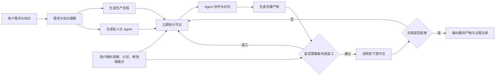

# 江湖 Online 产品需求文档（PRD）

## 0. 文档信息

| 项目 | 内容 |
| --- | --- |
| 产品名称 | 江湖 Online |
| 文档类型 | 产品需求文档（PRD） |
| 文档版本 | 1.0 |
| 日期 | 2026-07-25 |
| 状态 | 用户需求基线，可进入系统需求分析 |
| 需求来源 | 用户访谈、比赛要求、MiroFish 参考研究 |
| 原始记录 | `docs/02-requirements/jianghu-online-origin-requirements.md` |

### 0.1 版本记录

| 版本 | 日期 | 说明 |
| --- | --- | --- |
| 1.0 | 2026-07-25 | 汇总已确认愿景、MVP 范围、业务规则和比赛验收要求 |

### 0.2 需求优先级

| 优先级 | 含义 |
| --- | --- |
| P0 | MVP 必须实现；缺失则无法形成核心闭环或完成比赛验收 |
| P1 | MVP 应实现；可在核心闭环稳定后补齐 |
| P2 | 后续版本能力；本版仅预留产品方向 |

### 0.3 需求质量规范

本 PRD 使用以下两种方法约束需求质量：

1. 使用 SMART 原则定义产品目标和成功指标；
2. 使用 Given–When–Then 场景法描述核心验收条件。

功能需求表中的“验收要点”用于快速阅读；第 16 章的 Given–When–Then 场景作为核心业务流程的正式验收依据。

---

## 1. 产品背景

### 1.1 用户问题

现实生产任务通常需要多个角色共同完成。不同角色拥有不同知识、能力、立场和责任，工作过程中需要进行分工、交接、讨论、评审、质疑、攻防、返工和裁决。

单一 Agent 在复杂任务中容易出现：

- 专业视角不足；
- 遗漏风险和边界条件；
- 对用户或自身结论过度顺从；
- 结论缺少交叉验证；
- 讨论过程与正式产物混杂；
- 无法表达真实生产流程中的角色权责；
- 无法证明多 Agent 相比单 Agent 的实际价值。

现有多 Agent 产品还常见以下问题：

- 只展示多个角色聊天，没有步骤产物和生产流转；
- 流程、Agent 和提示词写死，只能运行固定案例；
- 用户需要先学习复杂的 Agent 和工作流配置；
- 最终只提供结果，无法观察协作、争辩和对抗过程；
- 生成内容缺少知识来源、版本和责任追溯；
- 人类只能旁观，无法随时加入或接管。

### 1.2 比赛背景

比赛要求选定一个真实生产流，设计至少三个不同角色的 Agent 进行协作与对抗，并提供可运行、可演示、有真实输入输出的完整系统。

比赛是江湖 Online 的阶段性验收场景，不是产品边界。平台不得围绕某一个固定案例硬编码。

---

## 2. 产品愿景与定位

### 2.1 产品愿景

> 让社会中不同身份的人，只需表达需求并提供自己的知识，就能构建一个由拟人化 Agent 参与的可运行生产流程；Agent 在流程中讨论、协作、争辩和对抗，通过步骤产物流转共同完成最终交付。

### 2.2 产品名称与核心表达

产品名称：

> **江湖 Online**

核心表达：

> 有人的地方就有江湖；有江湖的地方可以构建 Agent，也有 Agent 自己形成的江湖。

“江湖”包含：

- 人与 Agent；
- 不同身份、专业、立场和目标；
- 知识、关系、规则和权限；
- 协作、委托、讨论、竞争、攻防和仲裁；
- 可观察、可编辑、可介入、可复盘的生产过程。

### 2.3 产品定位

> 江湖 Online 是一个知识驱动、需求驱动的多 Agent 生产流程生成与运行平台。

平台利用：

- 用户提供的知识库内容；
- LLM 掌握的通用社会与行业生产知识；
- 可复用场景包中的参考流程和角色；

自动生成：

- 适合当前需求的标准生产流程；
- 具有身份、能力、立场和知识边界的拟人化 Agent；
- 节点内的协作、对抗和裁判机制；
- 可版本化、可流转的步骤产物。

### 2.4 产品原则

1. 用户目标优先于 Agent 配置。
2. 生产流程是执行骨架，Agent 是流程中的参与者。
3. 步骤产物是核心流转对象，聊天不是正式交付物。
4. 多 Agent 只用于有质量收益的节点，不为了展示而堆叠。
5. 自动生成后立即运行，同时允许用户随时调整。
6. 用户拥有最高决定权，但流程默认可以无人参与地自主完成。
7. 过程可观察，模型私有思维链不可见。
8. 事实、模型推导和假设必须区分。
9. 流程、Agent 和产物不可覆盖历史版本。
10. 比赛案例由通用能力构建，不写入核心逻辑。

---

## 3. 产品目标与非目标

### 3.1 MVP 产品目标

| ID | SMART 目标 | 衡量方式 | 时限 |
| --- | --- | --- | --- |
| G-01 | 用户只输入一句自然语言需求即可创建并启动生产流程 | 端到端测试中无需预先配置 Agent、流程或 Prompt 即进入运行状态 | MVP 验收前 |
| G-02 | 平台结合用户知识和 LLM 通用知识生成可编辑的有向生产任务图 | 生成结果包含节点、依赖、输入、输出、执行类型和终止条件，并可在界面编辑 | MVP 验收前 |
| G-03 | 平台从知识和任务中生成拟人化 Agent，并安排到合适节点 | 比赛场景至少生成 3 个职责或立场不同且可解释的 Agent | MVP 验收前 |
| G-04 | 平台支持确定性、单 Agent、多 Agent 协作、多 Agent 对抗、裁判和人工节点 | 核心节点类型均能在测试流程中创建和执行；比赛流程至少覆盖协作、对抗和裁判 | MVP 验收前 |
| G-05 | 用户能够观察 Agent 的讨论、辩论、质疑、回应和协作 | 运行视图可按节点和 Agent 查看公开消息、证据和关键决定 | MVP 验收前 |
| G-06 | 每个完成节点生成正式步骤产物，并可作为下游输入 | 端到端运行中所有完成节点均产生可追溯产物版本，下游引用明确版本 | MVP 验收前 |
| G-07 | 用户可以观察、加入、停止、修改和重新执行 | 关键交互均通过 Given–When–Then 场景测试 | MVP 验收前 |
| G-08 | 流程、Agent、步骤产物和裁判结果支持版本与来源追溯 | 抽查最终产物时可追溯至实际流程、Agent、模型、上游产物和知识版本 | MVP 验收前 |
| G-09 | 提供生产、江湖和产物三个联动视图 | 选择同一节点、Agent、知识或产物时，可在三个视图间相互定位 | MVP 验收前 |
| G-10 | 使用“产品需求到可开发方案”完成比赛验收 | 完成第 15 章全部必须交付物和端到端验收步骤 | 比赛提交前 |
| G-11 | 证明多 Agent 相比单 Agent 具有可测量价值 | 在相同输入下完成至少 2 组对比实验，并在至少一个质量或风险指标上优于单 Agent | 比赛提交前 |

### 3.1.1 SMART 原则解释

| 原则 | 在本 PRD 中的应用 |
| --- | --- |
| Specific（具体） | 每项目标明确描述用户、行为、对象和结果 |
| Measurable（可衡量） | 通过功能测试、端到端场景、版本追溯和对比实验衡量 |
| Achievable（可达成） | MVP 聚焦核心闭环，外部工具、多人系统和复杂长期学习后置 |
| Relevant（相关） | 所有目标直接服务于知识驱动、多 Agent 生产流程和比赛验收 |
| Time-bound（有时限） | 目标以 MVP 验收前或比赛提交前为完成期限 |

### 3.2 长期目标

- 服务开发、产品、客户、运营、分析、教育、研究和内容生产等广泛用户。
- 形成通用内核与多领域场景包生态。
- 支持多人、团队和组织级治理。
- 接入外部工具、MCP、企业数据和第三方 Agent。
- 支持经审批的长期记忆、经验沉淀和流程优化。

### 3.3 MVP 非目标

- 多用户账号、登录、团队、Workspace 和复杂 RBAC；
- MCP、任意 HTTP API、企业数据库和第三方 SaaS 接入；
- 大规模 Agent 社会仿真；
- 复杂知识图谱编辑、治理和跨数据源融合；
- 自动跨任务长期学习；
- 无需人工责任即可安全操作真实生产系统；
- 为所有行业预制完整生产流程；
- 将模型私有思维链展示给用户。

---

## 4. 目标用户

### 4.1 长期目标用户

江湖 Online 面向社会中的广泛用户，包括但不限于：

- 开发人员；
- 产品经理；
- 项目与研发负责人；
- 企业管理者；
- 运营人员；
- 数据分析和咨询人员；
- 教师、学生和研究人员；
- 内容创作者；
- 客户和消费者；
- 社区组织者。

### 4.2 MVP 核心用户

MVP 优先服务：

> 掌握任务目标和相关资料，但不要求掌握 Agent 编程的任务发起者。

### 4.3 使用模式

| 模式 | 用户能力 | 主要操作 |
| --- | --- | --- |
| 普通模式 | 无需了解多 Agent | 输入需求、上传知识、观察运行、获得产物 |
| 编辑模式 | 理解业务流程 | 修改节点、Agent、知识范围和执行策略 |
| 专业模式 | 了解模型与 Agent | 配置 LLM、Prompt、Schema、版本和运行参数 |

MVP 首屏以普通模式为主，同时提供编辑入口。

---

## 5. 核心用户场景

### 5.1 创建并运行生产流程

```text
输入一句自然语言需求
-> 可选上传或选择知识
-> 平台理解目标、约束和最终产物
-> 生成生产流程和 Agent
-> 立即执行
-> 用户观察或介入
-> 步骤产物持续流转
-> 输出最终产物
```

### 5.2 观察 Agent 江湖

用户查看：

- Agent 的身份、专业、立场和关系；
- Agent 当前所在节点和执行状态；
- 讨论、协作、辩论和对抗；
- Agent 使用的知识和证据；
- 哪些观点影响了正式产物。

### 5.3 调整流程或 Agent

```text
用户提出结构性修改
-> 当前节点停止
-> 形成待确认配置
-> 用户确认
-> 保存流程或 Agent 新版本
-> 用户点击重新执行
```

### 5.4 用户加入讨论

```text
用户向 Agent 补充说明
-> 当前对话轮次暂停
-> 消息加入节点讨论
-> Agent 接收新信息
-> 自动继续执行
```

### 5.5 单独重新执行节点

用户选择：

- 节点；
- 上游产物版本；
- 流程版本；
- Agent 版本；
- 可选补充输入；

单独执行并生成新的步骤产物版本。

### 5.6 复盘最终结果

用户从最终产物追溯：

- 使用的知识和原文；
- 上游步骤产物；
- 参与 Agent；
- 关键讨论和争议；
- 红队缺陷和修订；
- AI 与用户裁决；
- 流程、Agent、模型和产物版本。

---

## 6. 核心业务概念

| 概念 | 定义 |
| --- | --- |
| 项目 | 一组需求、知识、流程、Agent、运行和产物的本地隔离空间 |
| 生产流程 | 为完成用户目标而生成的有向任务图 |
| 节点 | 生产流程中的一个可执行步骤 |
| Agent 原型 | 可长期保存和复用的 Agent 定义 |
| Agent 实例 | 基于原型或动态配置创建的单次运行参与者 |
| 动态 Agent | 因当前知识或任务临时生成的 Agent |
| 消息 | Agent 与用户之间的讨论、提问、回应、攻击或协调信息 |
| 步骤产物 | 节点正式输出，可版本化并流转到下游 |
| 最终产物 | 生产流程完成后的最终业务交付物 |
| 证据 | 支持观点、产物、缺陷或裁决的原始知识引用 |
| 缺陷 | 对步骤产物提出的结构化问题 |
| 裁决 | AI 裁判或用户对候选、争议或产物作出的正式决定 |
| 场景包 | 某类生产任务的参考流程、Agent、产物和评价规则集合 |
| 运行 | 使用明确流程、Agent、模型和知识版本进行的一次执行 |
| 共享记忆 | 当前运行中供授权 Agent 共同读取、更新和引用的结构化协作黑板 |
| 小江湖 | 只配置完成目标所必需的 Agent、关系和互动，以效率、成本和清晰度优先 |
| 大江湖 | 在必要角色基础上扩展更多 Agent、视角、关系和群体互动，以多样性和涌现能力优先 |

---

## 7. 产品总体闭环



---

## 8. 功能需求

### 8.1 项目与启动

| ID | 需求 | 优先级 | 验收要点 |
| --- | --- | --- | --- |
| FR-PJ-001 | 用户可以创建、查看和进入多个本地项目 | P0 | 项目之间的需求、知识、流程和运行数据相互隔离 |
| FR-PJ-002 | 用户最低输入一句自然语言需求即可启动 | P0 | 不强制配置 Agent、流程或 Prompt |
| FR-PJ-003 | 用户可以可选上传资料、选择知识和补充约束 | P0 | 不提供可选内容时仍可运行 |
| FR-PJ-004 | 平台保存原始需求和后续补充内容 | P0 | 可查看来源、时间和版本 |
| FR-PJ-005 | 项目历史页展示最近运行及状态 | P1 | 可继续进入历史流程和产物 |
| FR-PJ-006 | 用户可以归档和恢复项目 | P1 | 归档项目不出现在默认活动列表且数据仍保留 |
| FR-PJ-007 | 用户可以删除本地项目及其数据 | P1 | 删除前明确展示范围并要求确认 |
| FR-PJ-008 | 用户可以导出项目数据包 | P1 | 包含需求、流程、Agent、知识索引、运行和产物元数据 |

### 8.2 需求与流程生成

| ID | 需求 | 优先级 | 验收要点 |
| --- | --- | --- | --- |
| FR-WF-001 | 平台结合 LLM 通用知识和用户知识生成生产流程 | P0 | 流程不是固定案例 |
| FR-WF-002 | 流程包含目标、节点、依赖、输入、输出和完成条件 | P0 | 所有节点具备可执行定义 |
| FR-WF-003 | 流程使用有向任务图 | P0 | 支持多上游、并行、条件分支和汇合 |
| FR-WF-004 | 流程支持有限返工循环 | P0 | 必须配置最大次数、预算或退出条件 |
| FR-WF-005 | 平台自动推荐节点执行类型 | P0 | 可推荐确定性、单 Agent、多 Agent、裁判、人工或汇合节点 |
| FR-WF-006 | 流程生成后默认立即执行 | P0 | 不等待逐节点人工确认 |
| FR-WF-007 | 用户可以查看和编辑流程 | P0 | 支持修改节点、依赖、目标、输入、输出和策略 |
| FR-WF-008 | 流程支持版本管理和差异查看 | P0 | 新版本不改变历史运行 |
| FR-WF-009 | 每次运行绑定明确流程版本 | P0 | 可从运行追溯流程版本 |
| FR-WF-010 | 场景包可以作为流程生成参考 | P1 | 场景包不是不可修改的固定流程 |
| FR-WF-011 | 系统根据用户目标生成最终验收契约 | P0 | 至少包含最终产物、质量条件、允许假设和失败条件 |
| FR-WF-012 | 系统解释生成节点和 Agent 的主要原因 | P0 | 用户可以查看节点来源、角色必要性和模型推导 |
| FR-WF-013 | 自动执行前进行静态校验 | P0 | 校验通过后无需用户确认即可立即运行 |
| FR-WF-014 | 静态校验检查依赖、必需输入、不可达节点和无界循环 | P0 | 严重错误阻止节点启动并展示原因 |
| FR-WF-015 | 静态校验检查 Agent、知识权限、裁判独立性和资源上限 | P0 | 不满足核心约束时进入可修复状态 |

### 8.3 节点执行

| ID | 需求 | 优先级 | 验收要点 |
| --- | --- | --- | --- |
| FR-ND-001 | 每个节点定义必需输入和可选输入 | P0 | 必需输入缺失时进入明确异常状态 |
| FR-ND-002 | 节点可以接收多个上游产物版本 | P0 | 输入引用具体产物 ID 和版本 |
| FR-ND-003 | 无依赖节点可以并行执行 | P0 | 每个并行节点独立记录状态和结果 |
| FR-ND-004 | 条件节点可以按规则、Agent 结论或用户决定分支 | P0 | 分支依据和结果可追溯 |
| FR-ND-005 | 汇合节点可以组合多个分支产物 | P0 | 不得静默忽略缺失的必需分支 |
| FR-ND-006 | 每个节点支持单独执行 | P0 | 不需要从流程起点重跑 |
| FR-ND-007 | 单独执行可选择上游产物版本 | P0 | 新结果可以继续供下游使用 |
| FR-ND-008 | 节点具有完成、失败、停止、阻断等明确状态 | P0 | 非正常结束不能标记为成功 |

### 8.4 Agent 生成与管理

| ID | 需求 | 优先级 | 验收要点 |
| --- | --- | --- | --- |
| FR-AG-001 | 平台从知识和任务中识别所需角色并生成 Agent | P0 | Agent 与具体知识、角色或任务有关联 |
| FR-AG-002 | Agent 具有身份、专业、职责、立场、知识和行为风格 | P0 | 不同 Agent 可被用户区分 |
| FR-AG-003 | Agent 可以形成关系并在节点中互动 | P0 | 支持协作、挑战、评审、仲裁等关系 |
| FR-AG-004 | 用户可以查看和编辑 Agent | P0 | 支持修改身份、职责、模型、知识范围和策略 |
| FR-AG-005 | Agent 支持独立版本管理 | P0 | 运行记录实际使用的 Agent 版本 |
| FR-AG-006 | 平台支持 Agent 原型与运行实例分离 | P0 | 单次运行上下文不污染原型 |
| FR-AG-007 | 平台可以临时生成动态 Agent | P0 | 用户可决定是否保存为原型 |
| FR-AG-008 | 运行记忆写入长期原型前必须由用户确认 | P1 | 未确认记忆只属于当前运行 |

### 8.5 多 Agent 协作与对抗

| ID | 需求 | 优先级 | 验收要点 |
| --- | --- | --- | --- |
| FR-MA-001 | 支持分工协作 | P0 | 子任务和汇总结果可追溯 |
| FR-MA-002 | 支持并行独立提案 | P0 | 保留每个候选方案 |
| FR-MA-003 | 支持评审与修订 | P0 | 修订产生新产物版本 |
| FR-MA-004 | 支持红蓝对抗 | P0 | 攻击、回应和处置形成正式记录 |
| FR-MA-005 | 支持有限轮次辩论 | P0 | 具有最大轮次和提前终止条件 |
| FR-MA-006 | 支持投票或评分 | P1 | 规则、权重和结果可查看 |
| FR-MA-007 | 支持层级指挥和子任务委派 | P1 | 主管和执行 Agent 职责分离 |
| FR-MA-008 | 多 Agent 节点定义参与者、可见范围、交互策略和汇总方式 | P0 | 缺失关键规则时不得无限自由对话 |
| FR-MA-009 | 简单节点不强制使用多个 Agent | P0 | 系统可生成确定性或单 Agent 节点 |

### 8.6 Agent 通信

| ID | 需求 | 优先级 | 验收要点 |
| --- | --- | --- | --- |
| FR-CM-001 | 节点内支持公开讨论频道 | P0 | 节点参与 Agent 可查看授权消息 |
| FR-CM-002 | 支持 Agent 间定向消息 | P0 | 接收者、回复关系和时间可追溯 |
| FR-CM-003 | 支持节点广播 | P0 | 新事实或规则可发送给节点参与者 |
| FR-CM-004 | 支持结构化子任务委派 | P0 | 包含目标、输入、输出和完成条件 |
| FR-CM-005 | 跨节点通信通过步骤产物或正式 Handoff | P0 | 不允许绕过流程私下传递正式结果 |
| FR-CM-006 | 支持提案、问题、回应、攻击、修订、裁判请求等消息类型 | P0 | 页面可按类型筛选 |
| FR-CM-007 | 平台执行消息路由、权限和上下文过滤 | P0 | 私有知识不会被无权限 Agent读取 |
| FR-CM-008 | 所有可观察通信进入运行记录 | P0 | 可按节点和 Agent 回放 |
| FR-CM-009 | 讨论消息与正式步骤产物严格区分 | P0 | 消息不会自动成为下游正式输入 |

### 8.7 独立裁判与多 LLM

| ID | 需求 | 优先级 | 验收要点 |
| --- | --- | --- | --- |
| FR-JD-001 | 平台必须具备独立裁判 Agent | P0 | 裁判不参与被裁判产物的生成和修改 |
| FR-JD-002 | 裁判用于争议、候选选择、重要质量门或最终验收 | P0 | 普通节点不强制配置裁判 |
| FR-JD-003 | 裁判输出评分、理由、证据和正式结论 | P0 | 支持通过、返工和阻断 |
| FR-JD-004 | 平台支持配置一个或多个 LLM | P0 | 每个配置记录供应商、模型和能力等级 |
| FR-JD-005 | 默认选择用户标记的最高能力 LLM 作为裁判模型 | P0 | 用户可以调整 |
| FR-JD-006 | 只有一个 LLM 时仍创建独立裁判 Agent | P0 | 使用独立身份、指令和上下文 |
| FR-JD-007 | 重新裁判产生新结果版本 | P0 | 不覆盖旧裁判结果 |
| FR-JD-008 | 用户可以担任裁判并覆盖 AI 结论 | P0 | AI 原结论和用户理由同时保留 |
| FR-JD-009 | 用户可以新增、编辑、停用和测试 LLM 配置 | P0 | 测试结果明确显示成功、失败和模型信息 |
| FR-JD-010 | 用户可以设置 LLM 能力等级和用途 | P0 | 普通 Agent 与裁判的模型选择使用当前配置版本 |
| FR-JD-011 | LLM 配置和凭据变更产生可追溯配置版本 | P0 | 历史运行不显示密钥但可识别使用的配置版本 |

### 8.8 步骤产物与版本

| ID | 需求 | 优先级 | 验收要点 |
| --- | --- | --- | --- |
| FR-AR-001 | 每个生产节点可以生成正式步骤产物 | P0 | 产物独立于聊天保存 |
| FR-AR-002 | 步骤产物支持类型、结构和状态 | P0 | 下游能够读取明确结构 |
| FR-AR-003 | 产物支持不可覆盖的版本管理 | P0 | 重跑生成新版本 |
| FR-AR-004 | 产物记录上游产物、节点、Agent、知识和模型来源 | P0 | 可形成完整来源链 |
| FR-AR-005 | 下游节点引用具体产物版本 | P0 | 版本变更不会静默替换输入 |
| FR-AR-006 | 用户可以查看产物版本差异 | P0 | 至少支持正文或结构变化对比 |
| FR-AR-007 | 最终产物可追溯到关键步骤产物和证据 | P0 | 用户可逐级跳转 |
| FR-AR-008 | 缺陷、修订和裁决与目标产物版本关联 | P0 | 不出现无法定位对象的评审意见 |
| FR-AR-009 | 节点正式提交产物前进行 Schema 和必需字段校验 | P0 | 校验失败的产物不得作为合格下游输入 |
| FR-AR-010 | 最终产物依据运行开始时的验收契约进行检查 | P0 | 未满足条件时进入返工、阻断或带风险完成状态 |
| FR-AR-011 | 用户可以人工修订步骤产物或最终产物 | P1 | 人工修订创建新版本并记录用户、原因和差异 |
| FR-AR-012 | 人工修订后的产物可以作为后续节点或新运行输入 | P1 | 明确引用人工修订版本，不改变历史输入 |

### 8.9 混合知识库

| ID | 需求 | 优先级 | 验收要点 |
| --- | --- | --- | --- |
| FR-KB-001 | 保存用户上传的原始文档及版本 | P0 | 解析结果不覆盖原文 |
| FR-KB-002 | 支持基础关键词和语义检索 | P0 | 返回来源文档和片段 |
| FR-KB-003 | 从知识中抽取基础实体和关系 | P0 | 可生成知识图谱 |
| FR-KB-004 | 图谱实体和关系尽可能关联原文证据 | P0 | 无证据推导标记为假设或推导 |
| FR-KB-005 | 知识分为公共知识、Agent 私有知识和运行知识 | P0 | 权限范围实际影响 Agent 上下文 |
| FR-KB-006 | Agent 输出可以引用使用的知识片段 | P0 | 用户可跳转到原文 |
| FR-KB-007 | 保存步骤产物库和运行记忆 | P0 | 产物与临时记忆分离 |
| FR-KB-008 | 运行知识写入长期知识前需用户确认 | P1 | 不自动污染公共知识 |
| FR-KB-009 | 运行中新增或替换正式知识输入属于结构性介入 | P0 | 停止受影响节点并产生新输入版本 |
| FR-KB-010 | 系统区分可信来源、用户输入、模型推导和外部文档指令 | P0 | Agent 和裁判可查看知识类型与信任边界 |

### 8.9.1 共享记忆

共享记忆是单次生产运行中的结构化协作空间，不等同于公共知识、Agent 私有记忆、聊天记录或步骤产物。

| ID | 需求 | 优先级 | 验收要点 |
| --- | --- | --- | --- |
| FR-MM-001 | 每次运行拥有独立共享记忆 | P0 | 不同运行的共享记忆相互隔离 |
| FR-MM-002 | 授权 Agent 可以读取当前节点或运行范围的共享记忆 | P0 | 未授权 Agent 无法读取 |
| FR-MM-003 | 共享记忆保存当前目标、已确认事实、约束、决定、开放问题和产物索引 | P0 | 内容结构化且可按类型查看 |
| FR-MM-004 | Agent 和用户可以提出共享记忆更新 | P0 | 更新记录提出者、来源、时间和作用范围 |
| FR-MM-005 | 共享记忆更新支持新增、修正和废止，不直接覆盖历史 | P0 | 可查看变更记录和当前有效值 |
| FR-MM-006 | 共享记忆条目可以引用原始知识、消息、步骤产物或用户决定 | P0 | 关键条目具有来源链 |
| FR-MM-007 | 多个 Agent 对同一共享事实产生冲突时，系统标记冲突并按规则处理 | P0 | 不静默选择其中一项 |
| FR-MM-008 | 共享记忆变化能够通知受影响的 Agent | P0 | Agent 后续行动使用当前有效版本 |
| FR-MM-009 | 用户可以查看、补充、修正或锁定共享记忆条目 | P0 | 用户拥有最高决定权 |
| FR-MM-010 | 共享记忆不会自动成为长期公共知识或 Agent 原型记忆 | P0 | 跨运行写回需要用户确认 |

共享记忆的典型内容：

- 当前生产目标；
- 当前节点目标；
- 已确认事实；
- 有效约束；
- 用户决定；
- 裁判决定；
- 已解决和未解决问题；
- 当前采用的假设；
- 关键风险；
- 可供后续引用的步骤产物索引；
- 当前流程状态和责任人。

共享记忆不应保存：

- 模型私有思维链；
- 无需共享的 Agent 私有草稿；
- 未经整理的全部聊天记录；
- 无权限公开的私有知识；
- 凭据和敏感控制信息。

### 8.10 用户介入与运行控制

| ID | 需求 | 优先级 | 验收要点 |
| --- | --- | --- | --- |
| FR-HI-001 | 流程默认无人参与也可运行至终态 | P0 | 不逐节点等待用户审批 |
| FR-HI-002 | 用户可以随时向一个或多个 Agent 发送消息 | P0 | 消息进入当前节点上下文 |
| FR-HI-003 | 讨论介入只暂停当前对话轮次并自动继续 | P0 | 不创建流程或 Agent 新版本 |
| FR-HI-004 | 结构性介入立即停止当前节点 | P0 | 保留停止前记录 |
| FR-HI-005 | 结构性修改确认后保存新版本 | P0 | 用户点击后才重新执行 |
| FR-HI-006 | 用户可以停止、终止、重新执行或接管节点 | P0 | 用户操作高于 Agent 自动决策 |
| FR-HI-007 | 用户可以加入讨论、担任角色或裁判 | P0 | 用户行为进入正式记录 |
| FR-HI-008 | 用户推翻 AI 裁决时保留双方结论 | P0 | 最终结果标记人工覆盖 |
| FR-HI-009 | 平台识别讨论介入和结构性介入 | P1 | 不确定时提示用户确认影响 |

### 8.11 可视化工作台

| ID | 需求 | 优先级 | 验收要点 |
| --- | --- | --- | --- |
| FR-UI-001 | 页面风格简洁并参考 MiroFish 的观察体验 | P0 | 首屏不堆叠复杂配置 |
| FR-UI-002 | 提供生产视图 | P0 | 展示任务图、状态、Agent、输入和产物 |
| FR-UI-003 | 提供江湖视图 | P0 | 展示知识图谱、Agent、角色和关系 |
| FR-UI-004 | 提供产物视图 | P0 | 展示正文、来源、版本、缺陷和裁决 |
| FR-UI-005 | 三个视图相互联动 | P0 | 选择节点、Agent、知识或产物可跨视图定位 |
| FR-UI-006 | 展示 Agent 的可观察讨论、辩论、协作和对抗输出 | P0 | 不只展示最终产物 |
| FR-UI-007 | 支持按节点、Agent 和事件类型筛选过程 | P0 | 可查看完整互动链 |
| FR-UI-008 | 展示统一运行状态和控制入口 | P0 | 包含版本、进度、成本、停止和重跑 |
| FR-UI-009 | 不展示模型私有思维链 | P0 | 只展示观点、理由摘要、证据和行动 |

### 8.12 场景包

| ID | 需求 | 优先级 | 验收要点 |
| --- | --- | --- | --- |
| FR-SC-001 | 平台采用通用内核与场景包 | P1 | 核心逻辑不绑定特定行业 |
| FR-SC-002 | 场景包可以包含参考流程、Agent、产物和评价规则 | P1 | 生成时可以动态调整 |
| FR-SC-003 | 场景包支持版本管理 | P1 | 历史运行绑定原版本 |
| FR-SC-004 | MVP 提供“产品需求到可开发方案”场景包 | P0 | 可处理任意产品需求，不固定具体产品 |

### 8.13 运行历史、结果导出与对比

| ID | 需求 | 优先级 | 验收要点 |
| --- | --- | --- | --- |
| FR-RP-001 | 系统持久化项目、运行、事件和产物 | P0 | 应用重启后仍可查看历史记录 |
| FR-RP-002 | 用户可以查看同一项目的历史运行列表 | P0 | 展示状态、流程版本、时间、成本和最终产物 |
| FR-RP-003 | 用户可以导出最终产物 | P0 | MVP 至少支持 Markdown 和结构化 JSON |
| FR-RP-004 | 导出结果包含必要的版本和来源摘要 | P0 | 能识别流程、Agent、模型和产物版本 |
| FR-RP-005 | 系统支持比较单 Agent 与多 Agent 运行 | P0 | 可并列查看最终产物、评分、风险、成本和耗时 |
| FR-RP-006 | 系统保存对比实验所使用的相同输入和评价量表 | P0 | 对比结果能够复现和解释 |
| FR-RP-007 | 用户可以导出对比结果 | P1 | 可用于比赛报告或测试报告 |
| FR-RP-008 | 每次运行保存可复现清单 | P0 | 包含需求、知识、流程、Agent、模型、Prompt、参数和产物版本 |
| FR-RP-009 | 用户可以从历史运行复制配置并重新运行 | P1 | 新运行保留与原运行的派生关系 |
| FR-RP-010 | 中断运行可从最近安全检查点恢复 | P1 | 恢复不会覆盖已提交产物 |

### 8.14 大江湖与小江湖

江湖 Online 支持不同规模的 Agent 江湖。江湖规模影响 Agent 数量、认知多样性、关系复杂度、讨论范围、运行成本和耗时，但不改变生产流程以步骤产物为核心的基本规则。

#### 8.14.1 小江湖

小江湖遵循“只使用必要参与者”的原则：

- 仅生成完成当前生产目标所必需的 Agent；
- 优先复用职责明确的核心 Agent；
- 简单节点使用确定性执行或单 Agent；
- 只在确有价值的节点使用协作、对抗和裁判；
- 减少重复角色、无效讨论和不必要关系；
- 优先控制运行时间、Token 和成本；
- 保持流程、责任和产物流转清晰。

小江湖适用于：

- MVP 默认运行；
- 日常生产任务；
- 时间或成本敏感任务；
- 目标和流程相对明确的任务；
- 用户希望快速获得可交付结果的场景。

#### 8.14.2 大江湖

大江湖在必要角色基础上增加更多参与者和认知差异：

- 同一专业可以存在多个不同背景或立场的 Agent；
- 可以增加利益相关方、专家、观察者、反方、边缘角色和模拟用户；
- 可以形成团队、阵营、层级或关系网络；
- 可以开展更多并行提案、多轮讨论、群体辩论、投票和竞争；
- 可以观察观点传播、联盟、分歧、共识和群体涌现；
- 可以在高风险或高不确定性节点扩大参与范围；
- 仍需设置预算、轮次、终止条件和正式产物汇总机制。

大江湖适用于：

- 复杂决策；
- 高风险评审；
- 多利益相关方场景；
- 需要认知多样性的研究和推演；
- 希望观察群体互动和涌现结果的场景；
- 用户愿意用更高成本和时间换取更多视角的任务。

#### 8.14.3 规模选择与生成

| ID | 需求 | 优先级 | 验收要点 |
| --- | --- | --- | --- |
| FR-JH-001 | 用户可以选择自动、小江湖或大江湖模式 | P1 | 选择结果记录在运行配置中 |
| FR-JH-002 | 自动模式根据任务复杂度、风险、预算和认知多样性需要推荐规模 | P1 | 推荐理由可查看 |
| FR-JH-003 | 小江湖只生成必要 Agent 和关系 | P0 | 系统能够说明每个 Agent 的必要性 |
| FR-JH-004 | 大江湖可以扩展同专业多角色、利益相关方和不同立场 Agent | P1 | 新增角色具有可解释差异 |
| FR-JH-005 | 江湖规模可以作用于整个运行或指定节点 | P1 | 无需让全部节点同时扩容 |
| FR-JH-006 | 大江湖仍使用正式步骤产物向下游流转 | P1 | 群体讨论不能代替节点产物 |
| FR-JH-007 | 大江湖必须设置 Agent 数、轮次、Token、时间或成本上限 | P1 | 达到边界后进入明确终态 |
| FR-JH-008 | 用户可以查看大江湖与小江湖的质量、风险、耗时和成本差异 | P1 | 对比使用相同输入和评价量表 |
| FR-JH-009 | 修改江湖规模或成员构成属于结构性介入 | P1 | 停止当前节点并产生新配置版本 |
| FR-JH-010 | 系统识别职责、知识和立场高度重复的 Agent | P1 | 大江湖扩容时提示同质化和冗余风险 |

#### 8.14.4 共同约束

- 大江湖和小江湖使用同一套生产流程、Agent、通信、共享记忆、产物和版本机制；
- “大”与“小”不使用固定人数定义，由任务、配置和预算决定；
- 大江湖不代表每个节点都有大量 Agent；
- 小江湖不代表取消协作、对抗或独立裁判；
- 无论规模大小，Agent 必须具有职责或认知差异；
- 无论规模大小，流程都必须能够自主运行到明确终态；
- 用户始终拥有最高决定权。

### 8.15 运行后深度交互

运行结束后，用户可以继续采访参与本次运行的 Agent，理解产物形成过程，但采访不会自动改变已提交产物。

| ID | 需求 | 优先级 | 验收要点 |
| --- | --- | --- | --- |
| FR-IN-001 | 用户可以在运行结束后选择并采访任意 Agent | P1 | Agent 基于本次运行允许的记忆和产物回答 |
| FR-IN-002 | 用户可以向多个 Agent 发送同一问题并比较回答 | P1 | 回答分别保存并标记 Agent |
| FR-IN-003 | 用户可以向独立裁判追问评分和结论 | P1 | 裁判回答引用原裁决、标准和证据 |
| FR-IN-004 | 运行后采访与原运行记录分离 | P1 | 不反向修改原消息、裁决和产物 |
| FR-IN-005 | 用户可将采访结论转为新一轮正式输入 | P1 | 转换后通过结构性介入或新运行生效 |

---

## 9. 首个比赛场景包

### 9.1 场景名称

> 产品需求到可开发方案

### 9.2 输入

- 任意产品原始需求；
- 可选背景资料和知识；
- 可选用户、目标、限制和期望产物。

### 9.3 参考流程

```text
需求与知识接入
-> 需求澄清
-> 用户与价值分析
-> 产品方案
-> 技术可行性分析
-> 多 Agent 交叉评审
-> 红队攻击
-> 修订
-> 独立裁判
-> 输出标准 PRD 和实施建议
```

实际节点、Agent 和执行策略由平台根据输入动态生成，不要求与参考流程完全一致。

### 9.4 参考角色

- 需求分析 Agent；
- 用户研究或业务 Agent；
- 产品方案 Agent；
- 技术可行性 Agent；
- 红队 Agent；
- 修订 Agent；
- 独立裁判 Agent。

具体数量和角色由平台动态决定，但比赛演示至少包含三个职责不同的 Agent。

### 9.5 主要产物

- 需求澄清结果；
- 用户与价值分析；
- 产品方案；
- 技术可行性建议；
- 评审意见；
- 红队缺陷；
- 修订记录；
- 裁判结果；
- 标准 PRD；
- 实施建议。

---

## 10. 业务规则

### BR-001 自动执行

流程和 Agent 生成后默认立即执行，不等待用户逐节点确认。

### BR-002 用户最高决定权

用户正式决定高于 AI 决定，但不得删除或覆盖 AI 原结论。

### BR-003 结构性修改

修改流程、Agent、知识权限、正式输入或验收规则时：

1. 立即停止当前节点；
2. 保存当前状态；
3. 用户确认新配置；
4. 生成新版本；
5. 用户点击重新执行。

### BR-004 讨论介入

普通补充、提问或意见不产生配置版本，Agent 接收后自动继续。

### BR-005 历史不可覆盖

流程、Agent、步骤产物和裁判结果产生新版本，不覆盖历史版本。

### BR-006 多 Agent 使用原则

平台仅在专业分工、认知差异、候选竞争、风险审查或交叉验证有价值时使用多 Agent。

### BR-007 独立裁判

裁判不得参与被裁判产物的生成和修改。只有一个 LLM 时也必须使用独立身份、指令和上下文。

### BR-008 有限循环

所有自动辩论、返工和重试必须有最大次数、预算或终止条件。

### BR-009 知识边界

Agent 只能读取被授权的公共知识、私有知识、上游产物和运行上下文。

### BR-010 假设透明

LLM 使用通用知识补全的信息必须标记为建议、推导或假设，不得伪装成用户事实。

### BR-011 通信边界

节点内允许公开讨论和定向通信；跨节点的正式信息必须通过步骤产物或 Handoff 传递。

### BR-012 消息与产物分离

讨论内容不自动成为正式产物；正式产物必须由节点显式提交。

### BR-013 运行资源边界

生产流程、节点、辩论、返工和裁判运行应受用户配置或系统默认的时间、轮次、Token 或成本上限约束。达到上限时必须停止或阻断，不得伪装为成功。

### BR-014 共享记忆一致性

共享记忆采用带来源和版本的结构化更新。Agent 不得直接覆盖历史条目；存在冲突时必须保留各方主张并由规则、裁判或用户确认当前有效结论。

### BR-015 江湖规模

小江湖以最小必要 Agent 集合为默认原则；大江湖通过增加具有实际认知或利益差异的 Agent 扩大讨论和推演范围。新增 Agent 必须说明作用，且不得绕过预算、通信、产物和终止规则。

### BR-016 先校验后自动执行

“生成后立即执行”指生产流程和 Agent 通过系统静态校验后自动执行，不要求用户确认。存在缺失必需输入、无界循环、不可达节点、无效 Agent 引用、裁判不独立或资源边界缺失等阻断问题时，不得强行启动。

### BR-017 验收契约稳定性

一次运行开始时应固定验收契约版本。运行中修改最终产物、质量条件或失败条件属于结构性介入，必须产生新流程或输入版本。

### BR-018 运行后采访边界

运行后采访属于解释性互动，不修改原运行事实。需要影响正式结果时，应转化为新输入、重新执行节点或创建新运行。

### BR-019 人工修订

用户对正式产物的人工修改必须创建新产物版本并记录修改者、原因和差异，不得覆盖 Agent 原始产物。

### BR-020 项目删除

删除项目属于不可逆操作。系统必须在执行前展示将删除的知识、流程、Agent、运行和产物范围，并要求用户明确确认。

---

## 11. 状态要求

### 11.1 运行状态

- `draft`
- `generating`
- `running`
- `stopping`
- `stopped`
- `completed`
- `blocked`
- `failed`
- `cancelled`

### 11.2 节点状态

- `pending`
- `ready`
- `running`
- `waiting`
- `completed`
- `stopped`
- `blocked`
- `failed`
- `skipped`

### 11.3 产物状态

- `draft`
- `submitted`
- `under_review`
- `accepted`
- `rejected`
- `superseded`

### 11.4 缺陷状态

- `proposed`
- `accepted`
- `rejected`
- `needs_evidence`
- `fixed`
- `partially_fixed`
- `waived`

---

## 12. 非功能需求

### 12.1 可用性

| ID | 需求 |
| --- | --- |
| NFR-US-001 | 新用户无需理解 Agent 和流程配置即可启动一次运行 |
| NFR-US-002 | 页面优先展示当前流程、Agent 行为和产物 |
| NFR-US-003 | 结构性修改前明确提示停止、版本和重跑影响 |
| NFR-US-004 | 错误状态使用用户可理解的说明，不伪装成功 |

### 12.2 可靠性

| ID | 需求 |
| --- | --- |
| NFR-RL-001 | 停止、失败、阻断和预算耗尽不得标记为完成 |
| NFR-RL-002 | 每个循环必须可终止 |
| NFR-RL-003 | 历史版本和运行记录不可被新执行覆盖 |
| NFR-RL-004 | 节点重试或重复提交不得无意生成重复正式产物 |
| NFR-RL-005 | 外部 LLM 不可用时保留当前状态并给出可恢复错误 |
| NFR-RL-006 | 应用正常重启后可重新加载已保存项目、历史运行和产物 |

### 12.3 可追溯性

| ID | 需求 |
| --- | --- |
| NFR-TR-001 | 每次运行记录流程、Agent、模型、知识和产物版本 |
| NFR-TR-002 | 每个关键结论可关联知识、上游产物或明确假设 |
| NFR-TR-003 | 用户和 Agent 的正式决定均有时间、对象和理由 |
| NFR-TR-004 | 最终产物可以逐级追溯到关键步骤产物 |
| NFR-TR-005 | 每次运行保存足以解释和重建配置的可复现清单 |

### 12.4 安全与隐私

| ID | 需求 |
| --- | --- |
| NFR-SE-001 | LLM 凭据不得写入代码仓库或普通运行日志 |
| NFR-SE-002 | Agent 私有知识不得被无权限 Agent 读取 |
| NFR-SE-003 | 页面不得展示模型私有思维链、密钥或隐藏控制上下文 |
| NFR-SE-004 | 明确告知哪些数据会发送到外部 LLM 或云端知识服务 |
| NFR-SE-005 | 上传文档中的指令性文本不得自动获得系统指令或流程控制权限 |
| NFR-SE-006 | 知识、消息和运行记忆写入前应保留来源与信任类型，防止未经确认的信息污染共享记忆 |
| NFR-SE-007 | 裁判上下文应过滤与裁决无关或可能破坏独立性的生成过程信息 |

### 12.5 性能与成本

| ID | 需求 |
| --- | --- |
| NFR-PC-001 | 页面能够持续展示运行进度和新事件 |
| NFR-PC-002 | 支持记录各节点和 Agent 的耗时、Token 与估算成本 |
| NFR-PC-003 | 并行节点在资源允许时并行运行 |
| NFR-PC-004 | 辩论、返工和重试受轮次与成本限制 |

### 12.6 本地部署

| ID | 需求 |
| --- | --- |
| NFR-DP-001 | 前后端可在本地启动并完成完整流程 |
| NFR-DP-002 | README 提供依赖、配置、安装、启动和使用说明 |
| NFR-DP-003 | 默认本地保存项目、原始文件、流程、产物和运行记录 |
| NFR-DP-004 | 云端依赖、环境变量和数据边界必须明确说明 |
| NFR-DP-005 | 导出的 Markdown 和 JSON 可脱离运行页面独立查看 |

---

## 13. MVP 范围

### 13.1 P0 核心闭环

1. 本地单用户、多项目。
2. 一句话需求启动。
3. 基础文件上传和原文保存。
4. 基础文本检索与知识图谱。
5. 动态生产流程生成。
6. 有向任务图执行。
7. 拟人化 Agent 生成。
8. 单 Agent、多 Agent 协作和对抗。
9. 受平台治理的 Agent 通信。
10. 运行级和节点级共享记忆。
11. 独立裁判和多 LLM 配置。
12. 步骤产物版本与下游流转。
13. 用户讨论介入和结构性修改。
14. 生产、江湖、产物三个联动视图。
15. “产品需求到可开发方案”场景包。
16. 单 Agent 与多 Agent 对比实验。
17. 小江湖最小必要 Agent 生成与运行。
18. 自动执行前的流程静态校验。
19. 运行验收契约与产物 Schema 校验。
20. 可复现运行清单。

### 13.2 P1 增强能力

- 场景包保存与版本；
- Agent 原型复用和动态 Agent 转正；
- 运行经验经确认后写回；
- 更完善的投票、层级委派和筛选；
- 更完整的版本差异；
- 更丰富的知识检索和图谱交互。
- 大江湖规模选择、局部扩容和规模效果对比。
- 运行后采访 Agent 和裁判。
- 安全检查点恢复和历史配置派生运行。

### 13.3 P2 后续能力

- 多用户与团队 Workspace；
- 外部工具、MCP 和企业系统；
- 长期记忆与自动学习；
- 场景包导入、导出和分享；
- 云端托管和多租户；
- 外部 Agent 协议；
- 大规模社会模拟。

---

## 14. 成功指标

以下指标使用 SMART 原则定义。标记为“基线目标”的数值可在系统需求分析和测试设计时根据实际模型能力校准，但不得删除对应衡量维度。

| ID | 维度 | SMART 指标 | MVP/比赛目标 |
| --- | --- | --- | --- |
| KPI-01 | 可运行性 | 从用户提交一句需求到创建运行，不要求预先手工创建 Agent 或流程 | 核心验收用例通过率 100% |
| KPI-02 | 端到端完成 | 有效输入能够运行到完成、失败或阻断等明确终态 | 测试运行终态准确率 100% |
| KPI-03 | 泛化性 | 更换产品需求后不修改核心代码即可重新生成流程和 Agent | 至少使用 2 组不同产品需求验证 |
| KPI-04 | 流程完整性 | 生成流程的节点具有输入、输出、依赖、执行类型和终止条件 | 必需字段完整率 100% |
| KPI-05 | Agent 差异性 | 比赛流程中 Agent 在职责、知识或立场上存在可解释差异 | 至少 3 个不同角色 Agent |
| KPI-06 | 协作可追溯 | 多 Agent 分工、公开消息、候选结果和汇总关系可回放 | 核心协作节点追溯率 100% |
| KPI-07 | 对抗有效性 | 对抗产生有明确对象、理由和处置结果的有效缺陷 | 比赛运行至少发现 1 项被接受并推动修订的缺陷 |
| KPI-08 | 产物流转 | 下游节点引用明确的上游产物版本 | 核心流程引用明确率 100% |
| KPI-09 | 来源追溯 | 最终产物关键结论可追溯到步骤产物、知识证据或显式假设 | 关键结论追溯率基线目标不低于 90% |
| KPI-10 | 用户控制 | 用户能够加入讨论、停止节点、修改结构并重新执行 | 核心控制场景通过率 100% |
| KPI-11 | 版本安全 | 重新执行或修改不会覆盖历史流程、Agent、裁判和产物版本 | 历史覆盖事故为 0 |
| KPI-12 | 多 Agent 价值 | 多 Agent 版本在完整性、风险发现或人工评分中优于单 Agent | 至少 1 个核心质量指标提升 |
| KPI-13 | 成本透明 | 每次运行显示总耗时、Token 和估算成本 | 记录覆盖率 100% |
| KPI-14 | 本地交付 | 按 README 在干净环境完成安装并运行比赛场景 | 比赛提交前成功复现至少 1 次 |
| KPI-15 | 共享记忆一致性 | 关键共享事实和决定具有来源、当前状态和变更记录 | 核心运行条目追溯率 100%，静默覆盖为 0 |
| KPI-16 | 江湖规模有效性 | 相同输入下比较小江湖和大江湖的质量收益与额外成本 | 大江湖新增 Agent 均具有可解释作用，且结果展示质量、风险、耗时和成本差异 |
| KPI-17 | 静态校验有效性 | 无界循环、缺失必需输入、无效引用和裁判不独立在运行前被发现 | 核心阻断规则检出率 100% |
| KPI-18 | 验收契约覆盖 | 每次正式运行具有明确最终产物、质量条件和失败条件 | 正式运行覆盖率 100% |
| KPI-19 | 运行可复现性 | 历史运行保存完整配置清单并可用于派生重跑 | 核心配置记录完整率 100% |
| KPI-20 | 验证场景覆盖 | 平台完成通用流程泛化、长期战略分析和需求交付阻塞识别三类验证 | 三类验证均形成可追溯产物和明确裁判结论 |

---

## 15. 比赛验收标准

### 15.1 必须交付

- 可运行 Demo；
- 本地运行说明；
- 代码仓库或核心代码说明；
- README；
- 至少一个完整生产流程运行；
- 至少三个职责不同的 Agent；
- 至少一个协作环节；
- 至少一个对抗或质疑环节；
- 完整步骤产物和最终产物；
- 单 Agent 与多 Agent 对比；
- 质量、准确性或效率提升说明。

### 15.2 端到端验收场景

1. 用户创建项目。
2. 用户输入任意产品需求，并可选上传资料。
3. 平台生成知识图谱、生产流程和至少三个不同角色 Agent。
4. 流程自动开始执行。
5. 至少一个节点发生多 Agent 协作。
6. 至少一个节点发生讨论、质疑或红蓝对抗。
7. 独立裁判对重要争议或最终产物作出裁决。
8. 每个完成节点生成可查看的步骤产物。
9. 下游节点引用明确的上游产物版本。
10. 用户能够查看 Agent 的公开讨论和证据。
11. 用户能够加入讨论并让 Agent 自动继续。
12. 用户能够修改 Agent 或流程，停止节点并保存新版本。
13. 用户能够点击重新执行并获得新产物版本。
14. 系统输出标准 PRD 和实施建议。
15. 用户能够从最终产物追溯知识、步骤产物、Agent 和裁决。

### 15.3 不通过条件

- 只能运行固定案例；
- Agent 或流程写死且用户不能调整；
- 只有多个聊天角色，没有步骤产物流转；
- 只展示最终结果，不展示协作与对抗过程；
- 没有独立裁判能力；
- 重跑会覆盖历史产物；
- 没有真实 LLM Agent 执行；
- 无法停止运行；
- 无法说明多 Agent 相比单 Agent 的价值；
- 只有 PPT、提示词或静态流程图。

### 15.4 重点验证场景目标

以下验证场景用于检验江湖 Online 是否真正具备通用生产流程生成、长期知识分析和隐含交付风险识别能力。验证使用的材料属于运行输入，不得硬编码到流程、Agent、Prompt 或裁判答案中。

#### VS-01 课题内任意两个生产流程

目标：

> 从比赛课题允许的生产流程方向中选择任意两个不同流程，使用同一套平台通用能力分别完成端到端运行。

候选方向包括但不限于：

- 需求到交付；
- 问题定位与处置；
- 数据分析；
- 安全与质量评审；
- 测试设计；
- 与比赛要求等价的其他真实生产流程。

SMART 验证标准：

- Specific：两个流程具有不同目标、节点、Agent 角色和最终产物；
- Measurable：两个流程均完成需求输入、流程生成、Agent 生成、协作或对抗、步骤产物流转和最终产物输出；
- Achievable：允许复用通用内核、场景包和 Agent 原型；
- Relevant：两个流程共同证明平台没有绑定单一固定案例；
- Time-bound：在比赛提交前完成并保留可复现运行记录。

通过条件：

- 不修改核心代码即可创建并运行两个流程；
- 每个流程至少包含三个职责不同的 Agent；
- 每个流程至少包含一个协作或对抗节点；
- 每个流程形成独立的步骤产物链和最终产物；
- 每个流程具有独立裁判或用户终审结论；
- 能说明两个流程为何采用不同的节点和 Agent 组织方式。

#### VS-02 托管云最近四年战略延续性分析

目标：

> 构建托管云混合知识库，分析材料所覆盖的最近四个年度的战略，解释战略的延续性、变化及驱动因素，并推演如果继续执行当前战略可能产生的结果。

时间范围规则：

- “最近四年”以知识材料实际覆盖的最近四个年度为准；
- 系统在运行开始前明确展示采用的起止年度；
- 不得使用材料未覆盖的年度伪装成事实；
- 如材料不足四年，应明确指出缺失年度并降低结论置信度。

输入：

- 最近四个年度的托管云战略、规划、复盘、经营、产品或项目资料；
- 可选的组织、市场、客户、竞争和技术背景材料；
- 来源、日期、文档版本和知识权限。

预期生产流程至少覆盖：

```text
资料接入与时间归档
-> 年度战略要素抽取
-> 战略主题与目标对齐
-> 延续、变化和中断识别
-> 多 Agent 交叉解释
-> 红队挑战因果关系和证据
-> 未来延续情景推演
-> 独立裁判
-> 战略延续性分析报告
```

最终产物至少包含：

- 四年战略时间线；
- 持续不变的核心主题；
- 各年度新增、调整、弱化或终止的方向；
- 战略延续性的证据和反证；
- 变化背后的可能驱动因素，并区分事实和推导；
- 如果继续当前战略的基准、积极和风险情景；
- 各情景成立的前提、领先指标、风险和观察点；
- 证据不足和待确认问题；
- 独立裁判对完整性、证据和推演合理性的评价。

通过条件：

- 关键战略结论能够引用到具体年度和原始材料；
- 能区分“战略口号重复”与“资源、产品或行动上的真实延续”；
- 至少提供一个支持延续性的解释和一个挑战该解释的反方观点；
- 未来推演使用条件化情景，不将预测表达为确定事实；
- 材料不足时明确输出证据不足，而不是补造组织事实。

#### VS-03 安全算力 2.0 需求交付评审与 VLAN 阻塞识别

目标：

> 基于托管云知识和安全算力 2.0 需求，自动构建完整的需求交付评审生产流程，检验系统能否识别“当前无法找到具备 VLAN 划分能力的供应商，进而导致需求无法交付”的关键阻塞问题。

输入：

- 托管云相关产品、架构、供应商、网络和交付知识；
- 安全算力 2.0 的原始需求、范围、验收条件和约束；
- 与 VLAN 划分、网络隔离、供应商能力、采购或交付相关的材料；
- 已知事实、会议记录、调研记录、供应商反馈或风险记录。

预期生产流程至少覆盖：

```text
需求与知识接入
-> 需求澄清和验收条件提取
-> 产品与技术方案分析
-> 网络隔离和 VLAN 能力拆解
-> 供应商能力与依赖分析
-> 交付链路和关键路径分析
-> 多 Agent 交叉评审
-> 红队攻击和缺口验证
-> 独立裁判
-> 需求交付评审报告
```

目标关键发现：

```text
安全算力 2.0 存在 VLAN 划分或等价网络隔离要求
-> 交付依赖供应商提供对应能力
-> 当前供应商候选或供应能力无法满足该要求
-> 供应商能力缺口成为交付关键阻塞
-> 如果不解决，将导致方案无法验收或整体无法交付
```

通过条件：

- 系统从知识和需求中建立 VLAN 要求、供应商能力和交付结果之间的依赖链；
- 识别该问题是需求、技术、采购、供应商或交付环节中的关键阻塞，而不是普通优化项；
- 结论引用明确证据；若只有间接证据，应标注为高风险假设并请求验证；
- 若输入材料确实不包含相关证据，系统不得为了命中预期答案而虚构结论；
- 输出受影响需求、验收条件、交付节点、风险等级和责任边界；
- 给出可验证的后续动作，例如供应商能力确认、替代方案评估、需求调整或交付阻断升级；
- 红队对“是否真的无法交付”提出反证要求，独立裁判根据证据作出最终判断。

---

## 16. Given–When–Then 验收场景

### AC-001 一句话创建并启动生产流程

```gherkin
Given 用户已打开本地运行的江湖 Online
And 用户尚未手工创建 Agent、流程或 Prompt
When 用户输入一句明确的自然语言需求并提交
Then 系统应创建一个新项目或项目任务
And 系统应保存原始需求
And 系统应生成生产流程和 Agent
And 系统应进入运行状态
And 系统不应要求用户逐节点确认后才开始执行
```

### AC-002 使用知识生成流程和拟人化 Agent

```gherkin
Given 用户已提交需求并上传至少一份相关资料
When 系统完成资料解析和知识抽取
Then 系统应保存原始资料和解析结果
And 系统应生成可查看的基础知识图谱
And 系统应生成与需求和知识相关的 Agent
And 每个 Agent 应具有可辨识的身份、职责、专业或立场
And 图谱实体或 Agent 结论应能关联原文来源或标记为模型推导
```

### AC-003 生成可执行的有向任务图

```gherkin
Given 系统已经理解用户需求和可用知识
When 系统生成生产流程
Then 流程应包含明确的节点和依赖
And 每个节点应定义输入、输出、执行类型和完成条件
And 流程应支持表达并行、分支、汇合或有限返工
And 用户应能够查看并编辑生成的流程
```

### AC-004 按需选择节点执行类型

```gherkin
Given 生产流程包含简单处理节点和复杂评审节点
When 系统为节点选择执行方式
Then 简单节点可以使用确定性执行或单 Agent
And 需要专业分工的节点可以使用多 Agent 协作
And 需要质疑或竞争的节点可以使用多 Agent 对抗
And 系统不应强制所有节点都使用多个 Agent
```

### AC-005 节点内 Agent 通信

```gherkin
Given 当前节点由多个 Agent 参与
When Agent 进行分工、提问、回应、质疑或辩论
Then 系统应通过节点频道或定向消息传递信息
And 每条消息应记录发送者、接收者、节点、类型和时间
And 需要证据的消息应能够引用知识或产物
And 无权限 Agent 不应收到私有知识
And 用户应能够查看和筛选公开通信
```

### AC-006 跨节点正式信息流转

```gherkin
Given 上游节点已完成并生成步骤产物
When 下游节点满足执行条件
Then 下游节点应读取明确的上游产物版本
And 系统应记录产物 ID、版本和来源节点
And 上游讨论消息不应自动作为正式下游输入
And 下游产物应保留对实际使用上游版本的引用
```

### AC-007 多 Agent 协作生成步骤产物

```gherkin
Given 当前节点配置为多 Agent 协作
And 多个 Agent 已获得各自任务和知识范围
When Agent 完成子任务并提交候选结果
Then 系统应保留各子任务结果
And 指定的汇总机制应生成正式步骤产物
And 正式产物应记录参与 Agent 和关键输入
And 用户应能从产物返回相关协作过程
```

### AC-008 红蓝对抗与修订

```gherkin
Given 蓝方 Agent 已提交一个候选步骤产物
When 红方 Agent 对该产物进行攻击
Then 红方应提交具有目标对象、问题、理由和严重程度的缺陷
And 蓝方或修订 Agent 应回应、修订或说明拒绝理由
And 修订应生成新的产物版本
And 原产物和原缺陷记录应继续保留
```

### AC-009 独立裁判

```gherkin
Given 一个候选产物或争议需要裁决
And 独立裁判 Agent 未参与该产物的生成和修改
When 裁判执行评审
Then 裁判应读取允许的产物、验收标准和证据
And 裁判应输出评分、理由、证据引用和正式结论
And 结论应为通过、返工或阻断之一
And 裁判结果应记录实际模型和配置版本
```

### AC-010 单 LLM 下的裁判独立性

```gherkin
Given 用户只配置了一个 LLM
When 系统创建独立裁判 Agent
Then 裁判可以使用同一个底层 LLM
But 裁判必须使用独立身份、系统指令和运行上下文
And 裁判不得参与候选产物生成和修订
And 裁判结果必须独立保存
```

### AC-011 用户加入讨论

```gherkin
Given 多 Agent 正在当前节点进行讨论
When 用户向一个或多个 Agent 补充普通说明
Then 系统应在安全输出点暂停当前对话轮次
And 用户消息应加入当前节点讨论记录
And 相关 Agent 应接收新信息并自动继续
And 系统不应创建流程或 Agent 新版本
And 系统不应要求用户手动重新执行
```

### AC-012 用户进行结构性修改

```gherkin
Given 当前节点正在运行
When 用户修改流程、Agent、正式输入、知识权限或验收标准
Then 系统应立即停止当前节点
And 系统应保留停止前的运行记录
And 系统应展示待确认的新配置
When 用户确认保存
Then 系统应创建新的流程或 Agent 版本
And 系统不应自动继续运行
And 用户应能够点击重新执行
```

### AC-013 节点独立重新执行

```gherkin
Given 一个节点已经执行过并具有历史产物
When 用户选择该节点、上游产物版本和 Agent 版本并点击重新执行
Then 系统应只执行选定节点及其必要动作
And 系统不应要求从流程起点重新运行
And 系统应生成新的节点执行记录和步骤产物版本
And 历史产物不应被覆盖
```

### AC-014 用户覆盖 AI 裁决

```gherkin
Given AI 独立裁判已经作出正式结论
When 用户以裁判或最终批准者身份作出不同决定
Then 用户决定应成为当前最终决定
And 系统应保留 AI 原结论
And 系统应保存用户理由、时间和身份
And 结果应明确标记为人工覆盖
```

### AC-015 三个视图联动

```gherkin
Given 用户正在查看同一次生产运行
When 用户在生产视图中选择一个节点
Then 江湖视图应定位相关 Agent 和知识
And 产物视图应定位该节点的步骤产物
When 用户选择一个 Agent、知识实体或产物
Then 其他视图应能够定位对应对象
And 视图切换应保留当前选择和运行位置
```

### AC-016 Agent 可观察输出与私有思维边界

```gherkin
Given Agent 正在执行、讨论或辩论
When 用户查看 Agent 过程
Then 系统应展示观点、理由摘要、证据、问题、回应和行动
And 系统可以展示工具或检索结果摘要
But 系统不应展示模型私有思维链
And 系统不应展示密钥、隐藏控制上下文或无权限私有知识
```

### AC-017 有限循环与异常终止

```gherkin
Given 一个节点配置了辩论、返工或重试循环
When 循环达到最大轮次、预算或退出条件
Then 系统应停止继续循环
And 系统应进入完成、失败、阻断、停止或人工处理状态
And 系统不应将异常终止标记为成功
And 用户应能够查看终止原因和已产生的产物
```

### AC-018 无用户参与的自治完成

```gherkin
Given 用户已启动一个输入有效的生产流程
And 用户在运行期间不进行任何介入
When 系统执行全部可执行节点
Then 系统应自动完成协作、对抗、裁判和产物流转
And 系统应运行至明确终态
And 成功时应输出最终产物和完整过程记录
```

### AC-019 泛化到不同产品需求

```gherkin
Given 系统已完成一组产品需求的端到端运行
When 用户创建新项目并输入内容不同的另一组产品需求
Then 系统应在不修改核心代码的情况下重新生成流程和 Agent
And 新流程、Agent 和产物应反映新的需求和知识
And 系统不应复用与新任务无关的固定案例内容
```

### AC-020 多 Agent 与单 Agent 对比

```gherkin
Given 已准备相同的需求、知识和验收量表
When 分别运行单 Agent 基线和多 Agent 协作对抗流程
Then 系统应保存两组独立结果
And 系统应比较质量、风险发现、证据覆盖、耗时和成本
And 比赛提交前至少一个核心质量或风险指标应显示多 Agent 版本优于基线
```

### AC-021 应用重启后的历史恢复

```gherkin
Given 用户已创建项目并完成或中断至少一次运行
And 项目、运行事件和步骤产物已持久化
When 用户正常重启江湖 Online 并重新进入该项目
Then 系统应展示历史运行列表
And 用户应能够查看当时的流程、Agent、事件和产物版本
And 系统不应因应用重启而丢失已提交的正式产物
```

### AC-022 最终产物导出

```gherkin
Given 一次生产流程已经形成最终产物
When 用户选择导出最终结果
Then 系统应至少提供 Markdown 和结构化 JSON
And 导出内容应包含最终产物正文
And 导出内容应包含流程、Agent、模型和产物版本摘要
And 用户应能够在不打开运行页面的情况下查看导出文件
```

### AC-023 对比结果展示

```gherkin
Given 单 Agent 和多 Agent 运行使用相同需求、知识和评价量表
And 两组运行均已进入明确终态
When 用户打开结果对比
Then 系统应并列展示最终产物或其摘要
And 系统应展示质量评分、有效风险、证据覆盖、耗时、Token 和估算成本
And 系统应保留两组运行的输入、配置和版本引用
And 用户应能够识别多 Agent 在哪些指标上改善或退化
```

### AC-024 Agent 通过共享记忆协作

```gherkin
Given 多个 Agent 正在同一次生产运行中协作
And 其中一个 Agent 已形成需要其他 Agent 使用的已确认事实或决定
When 该 Agent 将内容提交到共享记忆
Then 系统应保存条目类型、内容、提出者、来源、时间和作用范围
And 授权 Agent 应能够读取该条目的当前有效版本
And 后续 Agent 输出应能够引用该共享记忆条目
And 系统不应要求 Agent 通过重复读取全部聊天记录获得该信息
```

### AC-025 共享记忆冲突处理

```gherkin
Given 共享记忆中已有一个当前有效事实或决定
When 另一个 Agent 提交与其冲突的新主张
Then 系统不应静默覆盖原条目
And 系统应保留双方内容和来源
And 系统应将条目标记为冲突或待裁决
And 规则、独立裁判或用户应能够确认当前有效结论
And 决定后仍应保留完整变更历史
```

### AC-026 共享记忆跨运行写回

```gherkin
Given 一次运行已经形成共享记忆和候选经验
When 运行结束
Then 系统不应自动将共享记忆写入长期公共知识或 Agent 原型
When 用户选择并确认需要长期保存的条目
Then 系统应将其作为具有来源的新知识或新 Agent 版本保存
And 原运行共享记忆应继续保持不变
```

### AC-027 小江湖生成

```gherkin
Given 用户选择小江湖或系统自动判定任务适合小江湖
When 系统生成生产流程和 Agent
Then 系统应只生成完成任务所必需的 Agent
And 系统应能够说明每个 Agent 的职责和必要性
And 简单节点不应为了增加人数而强制使用多个 Agent
And 流程仍应在必要节点支持协作、对抗和独立裁判
```

### AC-028 大江湖生成与运行

```gherkin
Given 用户选择大江湖
And 用户已设置或接受 Agent 数、轮次、时间、Token 或成本边界
When 系统生成 Agent 江湖
Then 系统可以创建更多具有不同背景、立场或利益的 Agent
And 系统可以为指定节点配置更多并行提案、讨论、辩论或投票
And 新增 Agent 应具有可解释的差异和作用
And 节点仍应生成正式步骤产物并向下游流转
And 达到资源或轮次上限时系统应进入明确终态
```

### AC-029 运行中切换江湖规模

```gherkin
Given 当前节点正在以小江湖或大江湖配置运行
When 用户修改江湖规模或参与 Agent 构成
Then 系统应将该操作识别为结构性介入
And 系统应停止当前节点并保留已有记录
And 系统应生成待确认的新配置版本
When 用户确认并点击重新执行
Then 新节点执行应使用新的江湖规模和 Agent 版本
And 历史运行及产物不应被覆盖
```

### AC-030 自动执行前静态校验

```gherkin
Given 系统已经生成生产流程、Agent 和运行资源边界
When 系统准备自动启动第一个节点
Then 系统应检查节点依赖、必需输入、不可达节点和循环退出条件
And 系统应检查 Agent 引用、知识权限和裁判独立性
And 系统应检查时间、轮次、Token 或成本边界
And 校验通过时系统应无需用户确认直接开始运行
But 存在阻断问题时系统不应启动受影响节点
And 系统应展示问题位置、原因和建议修复方式
```

### AC-031 验收契约与产物 Schema

```gherkin
Given 用户已提交需求
When 系统生成生产流程
Then 系统应同时生成具有版本的验收契约
And 验收契约应定义最终产物、质量条件、允许假设和失败条件
When 节点提交正式步骤产物
Then 系统应校验产物 Schema 和必需字段
And 校验失败的产物不应作为合格输入流转到下游
When 最终产物形成
Then 独立裁判或规则应依据运行开始时的验收契约进行检查
```

### AC-032 可复现运行清单

```gherkin
Given 一次生产运行已经启动
When 系统保存运行记录
Then 系统应记录原始需求、知识版本和验收契约版本
And 系统应记录流程、Agent、模型、Prompt 和关键参数版本
And 系统应记录上游产物、随机或采样配置及运行资源边界
And 用户应能够从历史运行查看该清单
When 用户从历史运行创建派生运行
Then 新运行应保留与原运行的派生关系
```

### AC-033 运行后采访 Agent

```gherkin
Given 一次生产运行已经进入明确终态
When 用户选择一个参与 Agent 并提出问题
Then Agent 应基于本次运行允许的记忆、公开消息和产物回答
And 回答应与原运行记录分开保存
And 回答不应反向修改原步骤产物或裁判结论
When 用户决定将采访结论用于正式生产
Then 系统应将其转换为新运行输入或结构性介入
```

### AC-034 文档指令与记忆污染防护

```gherkin
Given 用户上传的文档包含要求模型忽略系统规则或泄露其他知识的指令性文本
When 系统解析、检索或向 Agent 提供该文档
Then 系统应将其视为来源内容而不是系统控制指令
And Agent 不应因此获得额外权限或绕过生产流程
And 该内容写入共享记忆前应保留来源和信任类型
And 涉及冲突事实时系统应标记冲突而不是静默覆盖已确认内容
```

### AC-035 LLM 配置与连接测试

```gherkin
Given 用户需要接入一个新的 LLM
When 用户填写连接信息、模型标识、能力等级和允许用途并执行测试
Then 系统应返回明确的连接测试结果
And 成功时系统应保存不包含明文密钥展示的配置版本
And 用户应能够指定该配置用于普通 Agent 或独立裁判
And 历史运行应继续引用当时使用的旧配置版本
```

### AC-036 用户人工修订产物

```gherkin
Given 一个步骤产物或最终产物已经正式提交
When 用户编辑内容并填写修订原因后保存
Then 系统应创建新的人工修订版本
And 系统应保留 Agent 原始产物
And 新版本应记录用户、时间、原因和差异
And 后续节点或新运行应能够明确选择人工修订版本作为输入
```

### AC-037 项目删除确认

```gherkin
Given 用户选择删除一个本地项目
When 系统展示该项目包含的知识、流程、Agent、运行和产物范围
Then 系统应要求用户进行明确确认
And 在确认前系统不应删除任何项目数据
When 用户确认删除
Then 系统应删除该项目范围内的数据
And 其他项目的数据不应受到影响
```

### AC-038 任意两个生产流程泛化验证

```gherkin
Given 已从比赛课题范围选择两个目标、角色和最终产物不同的生产流程
And 两个流程均提供了各自的需求和基础知识
When 用户分别启动两个流程
Then 系统应在不修改核心代码的情况下生成各自的任务图和 Agent
And 每个流程应至少包含三个职责不同的 Agent
And 每个流程应包含协作或对抗机制
And 每个流程应形成独立的步骤产物链和最终产物
And 系统应保存两个流程的可复现运行清单和裁判结论
```

### AC-039 托管云四年战略延续性分析

```gherkin
Given 用户已构建包含托管云最近四个可用年度材料的混合知识库
And 每份材料具有来源、日期和版本
When 用户要求分析托管云战略的延续性及继续执行的可能结果
Then 系统应明确本次分析采用的四年起止范围
And 系统应形成逐年战略时间线
And 系统应识别持续主题、变化、中断和可能驱动因素
And 关键结论应引用对应年度的原始材料
And 多 Agent 应同时提出支持延续性和挑战延续性的观点
And 系统应输出具有前提条件的未来情景、风险和观察指标
And 独立裁判应评价证据充分性和推演合理性
But 材料不足时系统不应虚构缺失年度的组织事实
```

### AC-040 VLAN 供应商能力交付阻塞识别

```gherkin
Given 用户已提供托管云知识和安全算力 2.0 需求
And 材料包含或能够支持分析 VLAN 划分、供应商能力和交付依赖
When 系统执行完整需求交付评审
Then 系统应提取 VLAN 划分或等价网络隔离要求
And 系统应分析该要求对供应商能力的依赖
And 系统应判断供应商能力缺口是否构成交付关键阻塞
And 结论应引用需求、供应商反馈或交付材料中的证据
And 系统应说明受影响的验收条件、交付节点和风险等级
And 红队应挑战无法交付结论的证据和替代方案
And 独立裁判应根据证据输出成立、待验证或不成立的结论
But 输入缺少相关证据时系统不应为了命中预期答案而虚构问题
```

---

## 17. 对比实验要求

至少运行两组相同输入实验：

| 组别 | 配置 |
| --- | --- |
| A | 单 Agent 独立完成最终产物 |
| B | 江湖 Online 动态生产流程 + 多 Agent 协作/对抗 + 独立裁判 |

建议增加：

| 组别 | 配置 |
| --- | --- |
| C | 多 Agent 协作，但关闭对抗环节 |

对比维度：

- 需求遗漏数；
- 有效风险或缺陷数；
- 缺陷修复率；
- 最终产物完整性；
- 证据覆盖率；
- 裁判或人工评分；
- Token 成本；
- 总耗时；
- 用户介入次数。

---

## 18. 风险与应对

| 风险 | 影响 | 产品应对 |
| --- | --- | --- |
| LLM 生成的流程不符合真实组织实践 | 流程质量不稳定 | 标记假设、允许编辑、保留场景包参考 |
| Agent 使用同一模型导致观点同质化 | 对抗流于形式 | 使用不同身份、知识、立场、上下文和可选模型 |
| Agent 无限讨论 | 成本和时间失控 | 最大轮次、预算和终止条件 |
| 图谱抽取遗漏原文信息 | Agent 依据不完整 | 保留原文库与文本检索，不只依赖图谱 |
| 用户介入破坏运行一致性 | 结果无法复现 | 区分讨论介入与结构性介入 |
| 裁判与产出 Agent 不独立 | 自评偏差 | 独立身份、指令、上下文和结果记录 |
| 多 Agent 成本高但收益不明显 | 产品价值不足 | 节点按需使用多 Agent并进行基线对比 |
| MVP 范围过大 | 无法按期完成比赛 | 外部工具、多人、长期学习和复杂图谱后置 |

---

## 19. 依赖与约束

### 18.1 MVP 依赖

- 至少一个可调用的 LLM；
- 本地前后端运行环境；
- 文档解析能力；
- 基础文本检索能力；
- 基础知识图谱生成和展示能力；
- 数据与文件本地持久化能力。

### 18.2 约束

- MVP 为本地单用户；
- 外部工具接入不作为必须能力；
- 云端 LLM 或图谱服务可能需要用户自行配置凭据；
- 比赛演示必须使用真实输入和真实 Agent 输出；
- 具体演示产品不属于固定产品需求。

---

## 20. 后续系统需求分析输入

系统需求分析应基于本 PRD进一步确定：

1. 领域对象和数据关系；
2. 生产流程运行状态机；
3. 有向任务图调度和循环控制；
4. 生产流程静态校验和验收契约模型；
5. Agent 原型、实例和版本模型；
6. 消息、Handoff 和步骤产物协议；
7. 步骤产物 Schema 和质量门；
8. 共享记忆的数据结构、范围、冲突和版本机制；
9. 大江湖与小江湖的规模策略、资源边界和局部扩容机制；
10. LLM 接入与裁判隔离机制；
11. 混合知识库及信任边界的技术实现；
12. 运行事件、可观察性、检查点和恢复机制；
13. 可复现运行清单和派生运行关系；
14. 三个联动视图的信息架构；
15. 本地部署、数据目录和配置方式；
16. 单 Agent/多 Agent 及不同江湖规模的评测方案；
17. MVP 迭代拆分和验收测试。

---

## 21. 待系统需求分析确定的事项

以下事项不改变本 PRD 产品方向，但需要在系统需求分析中选择具体方案：

- MVP 支持的首批文件格式；
- LLM 接口兼容范围；
- 用户配置模型能力等级的方式；
- 知识图谱存储与可视化组件；
- 向量检索实现；
- 消息总线和实时事件协议；
- 流程与 Agent 版本号规则；
- 步骤产物 Schema 表达方式；
- 单次运行默认轮次、时间和成本上限；
- 单 Agent 与多 Agent 质量评分量表；
- 本地数据备份和迁移方式。
