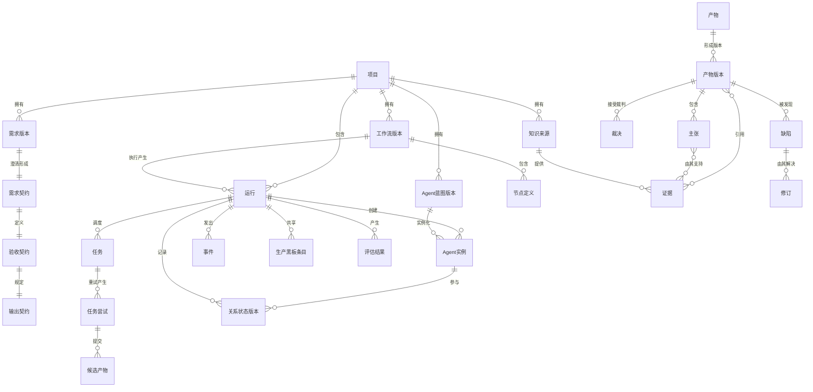
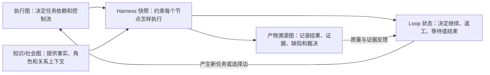

# 江湖 Online 系统需求规格说明书（SRS）v1.0

## 0. 文档信息

| 项目 | 内容 |
| --- | --- |
| 文档类型 | 系统需求规格说明书 |
| 版本 | 1.0 |
| 日期 | 2026-07-27 |
| 状态 | 系统设计与实现基线 |
| 上游需求 | `jianghu-online-prd-v1.0.md`、`user-requirements-v2.md`、`first-production-flow.md` |
| 架构决策 | `ADR-0005-domain-runtime-and-pluggable-agent-adapters.md` |
| 首个验收场景 | 产品需求到可开发技术方案，包含协作、红队、修订和裁判 |

### 0.1 目的

本文把产品需求转换为可设计、可实现、可测试的系统需求。本文不规定所有内部类和数据库字段，但规定系统边界、领域语义、组件职责、接口契约、可靠性和验收门槛。

### 0.2 规范用语

- **必须**：P0 强制要求，不满足则系统不能通过 MVP 验收。
- **应该**：P1 要求，允许在 P0 核心闭环稳定后补齐。
- **可以**：P2 或扩展能力。

### 0.3 需求编号

| 前缀 | 领域 |
| --- | --- |
| SR-ARC | 总体架构 |
| SR-DOM | 领域模型 |
| SR-WF | 流程定义与生成 |
| SR-OR | 编排与执行 |
| SR-EX | Agent 执行适配 |
| SR-AG | Agent 与社会关系 |
| SR-CX | 上下文、消息与生产黑板 |
| SR-AR | Artifact、Evidence 与版本 |
| SR-DB | 对抗、缺陷、修订与裁判 |
| SR-KB | 知识与检索 |
| SR-HI | 人工介入与控制 |
| SR-EV | 事件、Trace 与可观察性 |
| SR-EL | 评测实验室 |
| SR-API | API 与实时协议 |
| SR-SEC | 安全与权限 |
| SR-REL | 可靠性与一致性 |
| SR-PERF | 性能与容量 |
| SR-DEP | 部署与运维 |
| SR-HAR | Harness Engineering：受控执行环境与执行快照 |
| SR-LOOP | Loop Engineering：持续推进、验证、恢复与终止 |
| SR-GRAPH | Graph Engineering：图建模、编译、执行与演化 |

## 1. 系统目标与边界

### 1.1 系统目标

系统必须支持以下端到端闭环：

```text
用户需求与知识
-> 目标、约束和验收契约
-> Workflow 与 Agent Team 草案
-> 静态校验和版本冻结
-> 确定性流程与 Agent 节点运行
-> Candidate Artifact
-> Schema/Evidence/Quality Gate
-> 正式 Artifact Version
-> 协作、攻击、缺陷、修订和裁决
-> 最终交付与全链路追溯
-> 单 Agent/多 Agent 对比评测
```

### 1.2 MVP 系统边界

MVP 包含：

- 本地单用户、多项目隔离；
- 自然语言需求和文件输入；
- 内置自适应 Grill Me 需求访谈；
- 本地文档与网页搜索知识输入；
- Workflow、Agent、知识和运行版本；
- 确定性、单 Agent、协作、对抗、裁判、人工和汇合节点；
- Native Agent Adapter；
- 至少一个外部图/Agent 框架 POC Adapter；
- PostgreSQL 持久化、Redis Worker、对象存储和 SSE；
- 生产、江湖、产物三个联动视图；
- 运行历史、报告和对比实验。
- 隔离工作区中的真实代码生成、构建、启动和测试；
- 匿名浏览、搜索和安装公共场景包市场。

MVP 不包含：

- 复杂多人 Workspace/RBAC；
- 大规模自由 Swarm；
- 未经审批的在线自演化；
- 任意真实生产系统的高风险写操作；
- 完整 A2A 市场；
- 将模型私有思维链展示或持久化。

## 2. 总体架构需求

| ID | 系统需求 | 优先级 | 验证方式 |
| --- | --- | --- | --- |
| SR-ARC-001 | 系统必须采用 API-first 架构，Client 不拥有核心业务状态机 | P0 | 架构审查、API 测试 |
| SR-ARC-002 | PostgreSQL 中的领域状态必须是 Workflow、Run、Task、Artifact、Evidence 和 Decision 的唯一真相源 | P0 | 故障恢复测试 |
| SR-ARC-003 | 外部 Agent 框架不得直接修改全局运行状态或正式 Artifact | P0 | Adapter 契约测试 |
| SR-ARC-004 | 长任务不得在 HTTP 请求线程中直接执行 | P0 | 并发与超时测试 |
| SR-ARC-005 | 系统必须区分领域 Orchestrator 与 Agent Execution Adapter | P0 | 代码依赖审查 |
| SR-ARC-006 | 模型、Agent 框架、检索、向量库和对象存储必须通过接口隔离 | P0 | 替换性测试 |
| SR-ARC-007 | 系统必须具有不依赖外部 Agent 框架的 Native Adapter 基线 | P0 | 端到端测试 |
| SR-ARC-008 | 外部框架不可用时，不得破坏历史运行读取和 Native Adapter 运行 | P0 | 降级测试 |
| SR-ARC-009 | 所有组件必须使用统一 Project、Run、Task、Attempt 和 Trace 标识关联 | P0 | Trace 查询测试 |
| SR-ARC-010 | 自动生成 Workflow 在执行前必须经过静态校验和版本冻结 | P0 | 校验测试 |

## 3. 核心领域模型

### 3.1 领域聚合

这张图描述的不是数据库表，而是系统中各类核心业务对象如何组成一条完整生产链。

阅读方式：

- `||--o{` 可以理解为“一个对象可以拥有多个下级对象”；
- `}o--o{` 可以理解为“双方可以多对多关联”；
- 左侧通常是上游容器或来源，右侧通常是其版本、运行实例、产物或记录；
- 图中出现 `Version` 的对象都是不可原地覆盖的历史版本；
- 图中出现 `Run`、`Task`、`Attempt`、`Instance` 的对象都属于某一次实际运行。

从业务上看，整张图可以先按四条主线理解：

```text
项目定义线：项目 -> 需求版本 / 知识来源 / 流程版本 / Agent 定义版本

运行执行线：流程版本 -> 节点定义 -> 运行 -> 任务 -> 执行尝试

产物流转线：执行尝试 -> 候选产物 -> 正式产物版本 -> 缺陷 / 修订 / 裁决

知识追溯线：知识来源与上游产物 -> Evidence -> Claim / 正式产物
```



图中的中文名称与系统对象对应如下：`项目 = Project`、`需求版本 = RequirementVersion`、`需求契约 = RequirementContract`、`验收契约 = AcceptanceContract`、`输出契约 = OutputContract`、`工作流版本 = WorkflowVersion`、`运行 = Run`、`任务 = Task`、`任务尝试 = TaskAttempt`、`Agent蓝图版本 = AgentBlueprintVersion`、`Agent实例 = AgentInstance`、`关系状态版本 = RelationshipStateVersion`、`候选产物 = CandidateArtifact`、`产物版本 = ArtifactVersion`、`证据 = Evidence`、`缺陷 = Defect`、`修订 = Revision`、`裁决 = Decision`。中文用于业务阅读，英文名称继续作为 API、数据库和代码中的统一技术名称。

#### 3.1.1 项目定义关系

`Project` 是本地项目的总容器。一个项目中可以保存多份需求版本、知识来源、流程版本和 Agent 定义版本。

- 用户最初输入的需求以及后续 Grill Me 澄清内容保存为 `RequirementVersion` 和 `RequirementContract`；
- 根据需求动态生成的生产流程保存为 `WorkflowVersion`；
- 流程中的每一个步骤保存为 `NodeDefinition`；
- 动态生成或用户保存的 Agent 角色定义保存为 `AgentBlueprintVersion`；
- 原始文档、网页快照和代码资料保存为 `KnowledgeSource`。

这些定义对象可以不断产生新版本，但已经被历史运行使用的版本不能修改。

#### 3.1.2 运行执行关系

`Run` 表示某个项目使用一组固定版本执行的一次完整生产活动。

```text
WorkflowVersion
-> Run
-> Task
-> TaskAttempt
```

- 一个 `WorkflowVersion` 可以被执行多次，因此可以产生多个 `Run`；
- 一个 `Run` 根据流程节点创建多个 `Task`；
- 一个 `Task` 因为失败重试、用户重跑或返工，可以产生多个 `TaskAttempt`；
- 每次运行实际参与的 Agent 保存为 `AgentInstance`，它与长期保存的 AgentBlueprint 分离；
- 运行过程中的全部状态变化保存为 `Event`；
- Agent 之间共享的事实、约束、问题和决定保存为 `BlackboardEntry`。

这样设计后，用户可以清楚地区分“流程是怎么定义的”和“这一次实际是怎么运行的”。

#### 3.1.3 正式产物流转关系

Agent 或确定性节点不能直接生成正式产物。它们首先提交 `CandidateArtifact`，再经过结构、证据和质量校验。

```text
TaskAttempt
-> CandidateArtifact
-> 校验
-> ArtifactVersion
```

- 校验失败的 Candidate 不能成为下游正式输入；
- 校验通过后才生成不可变的 `ArtifactVersion`；
- 下游任务必须引用明确的 ArtifactVersion，而不是“最新产物”或聊天记录；
- 重试、重跑、人工修改和返工都会生成新的 ArtifactVersion，不覆盖旧版本。

#### 3.1.4 缺陷、修订和裁决关系

红队、评审 Agent 或用户发现的问题保存为 `Defect`，并且必须指向被检查的具体 ArtifactVersion。

```text
ArtifactVersion
-> Defect
-> Revision
-> 新 ArtifactVersion
-> Decision
```

- `Defect` 记录问题、严重度、证据、影响和建议；
- `Revision` 记录某个缺陷如何被处理，以及处理后产生了哪个新版本；
- `Decision` 保存规则 Gate、独立裁判或用户作出的通过、返工或阻断结论；
- 旧版本上的裁决不会自动适用于新版本。

#### 3.1.5 知识与证据关系

`Evidence` 是连接原始知识、运行过程和正式产物的桥梁。

- Evidence 可以来自用户文档片段、网页快照、代码、工具结果、上游 Artifact 或用户确认事实；
- 一个 ArtifactVersion 可以引用多个 Evidence；
- 一个 Evidence 也可以支持多个 Artifact 或 Claim；
- 产物中的关键结论可以进一步拆分为 `Claim`，并分别关联其依据；
- 最终用户可以从结论逐级跳转到步骤产物、Agent、任务和原始资料。

#### 3.1.6 为什么要这样拆分

这套领域聚合主要解决五个问题：

1. **可复现**：Run 固定引用当时使用的需求、流程、Agent、模型和知识版本；
2. **可恢复**：Task 与 TaskAttempt 分离，失败后能够安全重试；
3. **可追溯**：最终产物可以追溯到上游产物、证据、Agent 和工具；
4. **可攻防**：缺陷、修订和裁决都有明确目标版本；
5. **不依赖聊天**：正式生产过程围绕 Artifact 流转，消息只负责讨论和协调。

### 3.2 对象定义

| 对象 | 系统含义 |
| --- | --- |
| Project | 需求、知识、配置、流程、多次运行和产物的隔离容器 |
| RequirementVersion | 原始需求及补充、澄清和结构化理解的不可变版本 |
| RequirementContract | Grill Me 访谈后形成的目标、约束、知识边界、风险和用户决定 |
| AcceptanceContract | 最终产物、质量、证据、允许假设、预算和失败条件 |
| OutputContract | 根据当前需求动态生成的最终产物类型、结构、运行方式和验收方法 |
| WorkflowVersion | 冻结的可执行生产任务图 |
| NodeDefinition | 节点目标、输入、输出、执行策略、预算、Gate 和终止条件 |
| AgentBlueprintVersion | Agent 身份、职责、立场、知识、工具、模型、权限和输出契约版本 |
| Run | 绑定固定版本的一次生产流执行 |
| Task | 某 Run 中对 NodeDefinition 的一次调度实例 |
| TaskAttempt | Task 的一次具体执行尝试 |
| AgentInstance | 某 Run 中由 Blueprint 或动态配置产生的隔离参与者 |
| RelationshipStateVersion | 两个或多个 Agent 在特定作用域内的信任、合作、冲突、依赖、影响和谈判状态版本，并记录形成该状态的事件来源 |
| BlackboardEntry | 运行内共享的事实、约束、问题、决定、信号和索引 |
| CandidateArtifact | Agent/节点提交但尚未通过正式 Gate 的候选输出 |
| ArtifactVersion | 通过提交校验的不可变正式产物版本 |
| Evidence | 来源片段、上游产物、工具结果或用户确认事实 |
| Claim | 产物中的可追溯主张，可关联一个或多个 Evidence |
| Defect | 针对特定 Artifact Version 的结构化问题 |
| Revision | 缺陷处置与新 Artifact Version 的关系 |
| Decision | 规则、AI 裁判或用户对候选、缺陷或产物作出的正式结论 |
| Event | 追加式领域事件 |
| EvaluationResult | 对 Run、Agent、Workflow 或策略的质量、成本、时延和稳定性结果 |
| ScenarioPackage | 从成功运行中沉淀的参考流程、Agent 模式、Artifact Schema、评价规则和方法知识版本 |

### 3.3 领域约束

| ID | 系统需求 | 优先级 |
| --- | --- | --- |
| SR-DOM-001 | 所有可复现对象必须具有稳定 ID、版本、创建时间、来源和状态 | P0 |
| SR-DOM-002 | 已被 Run 引用的 Requirement、Workflow、Agent、Knowledge 和 Model 配置版本不得原地修改 | P0 |
| SR-DOM-003 | AgentBlueprint 与 AgentInstance 必须分离 | P0 |
| SR-DOM-004 | Task 与 TaskAttempt 必须分离，重试创建新 Attempt | P0 |
| SR-DOM-005 | CandidateArtifact 与 ArtifactVersion 必须分离 | P0 |
| SR-DOM-006 | 消息不得自动成为正式 Artifact 或 Blackboard 已确认事实 | P0 |
| SR-DOM-007 | Defect、Revision 和 Decision 必须引用明确目标版本 | P0 |
| SR-DOM-008 | 系统必须区分事实、用户声明、模型推导、假设和外部不可信指令 | P0 |
| SR-DOM-009 | 历史版本只能归档或失效，不得被静默覆盖 | P0 |
| SR-DOM-010 | 删除 Project 时必须明确级联范围并经用户确认 | P1 |
| SR-DOM-011 | RequirementContract 和 OutputContract 必须版本化并记录用户确认或自动接受的推荐项 | P0 |
| SR-DOM-012 | OutputContract 必须按当前目标动态生成，不得由核心内核固定为软件、文档或其他单一产物类型 | P0 |

## 4. Workflow 定义与生成需求

### 4.1 Workflow Definition

每个 WorkflowVersion 必须包含：

- 目标和最终 AcceptanceContract；
- 动态生成并经用户确认的 OutputContract；
- NodeDefinition 集合；
- 有向边、条件、并行和汇合关系；
- 输入/输出 Artifact Schema；
- Agent、Knowledge、Tool、Model 和 Policy Binding；
- 预算、超时、重试和终止策略；
- 人工检查点；
- Evaluation Plan；
- 生成依据和解释摘要。

### 4.2 系统需求

| ID | 系统需求 | 优先级 | 验证方式 |
| --- | --- | --- | --- |
| SR-WF-001 | 系统必须从 RequirementContract、OutputContract 和知识从零生成 Workflow 草案 | P0 | 多输入端到端测试 |
| SR-WF-002 | Workflow 必须支持顺序、并行、条件、汇合和有限循环 | P0 | 图执行测试 |
| SR-WF-003 | 每个节点必须定义目标、输入、输出、完成条件和执行策略 | P0 | Schema 校验 |
| SR-WF-004 | 节点执行类型至少包括 deterministic、single_agent、multi_agent、judge、human、merge | P0 | 类型覆盖测试 |
| SR-WF-005 | multi_agent 节点必须配置参与者、协议、上下文、汇总和终止方式 | P0 | 静态校验 |
| SR-WF-006 | 循环必须具有最大次数、预算或确定退出条件 | P0 | 无界循环测试 |
| SR-WF-007 | 系统必须解释节点和 Agent 的生成原因 | P0 | UI/API 检查 |
| SR-WF-008 | 用户必须能修改节点、边、Agent、输入输出和策略并生成新版本 | P0 | 编辑与版本测试 |
| SR-WF-009 | Run 启动后必须绑定固定 WorkflowVersion | P0 | 历史追溯测试 |
| SR-WF-010 | 系统应该支持 Workflow YAML/JSON 导入导出 | P1 | 导入导出测试 |
| SR-WF-011 | 系统应该允许场景模板影响生成，但不得把模板作为不可修改流程 | P1 | 模板变体测试 |
| SR-WF-012 | 系统可以离线评价并优化 Workflow，但在线发布前必须生成新版本并重新校验 | P2 | 演化门禁测试 |
| SR-WF-013 | Workflow Generator 必须具有版本化生成规范、标准 Prompt、节点类型、Artifact Contract 和 Policy | P0 | 版本追溯测试 |
| SR-WF-014 | 首次生成不得依赖固定流程模板；场景包只能作为用户可选参考知识 | P0 | 无场景包端到端测试 |
| SR-WF-015 | 生成结果缺少必需能力、质量 Gate 或 Output Contract 覆盖时必须阻断并自动修复 | P0 | 缺陷 Workflow 测试 |
| SR-WF-016 | 自动修复默认最多 3 次，并保存每次草案、错误和差异；耗尽后进入 `generation_failed` | P0 | 修复上限测试 |
| SR-WF-017 | 平台必须自动判断节点使用确定性、单 Agent 或多 Agent，并保存风险、质量收益、成本和时延理由 | P0 | 生成解释测试 |
| SR-WF-018 | 用户可覆盖节点执行策略，系统必须预览影响、创建新 WorkflowVersion 并重新静态校验 | P0 | 编辑验收测试 |

### 4.3 静态校验

| ID | 校验要求 | 阻断级别 |
| --- | --- | --- |
| SR-WF-VAL-001 | 检查起点、终点、不可达节点和悬空边 | 阻断 |
| SR-WF-VAL-002 | 检查必需输入、Artifact Schema 和上下游类型兼容 | 阻断 |
| SR-WF-VAL-003 | 检查循环终止、预算和最大迭代 | 阻断 |
| SR-WF-VAL-004 | 检查 Agent、模型、工具和知识 Binding 是否存在 | 阻断 |
| SR-WF-VAL-005 | 检查权限是否允许 Agent 读取输入和使用工具 | 阻断 |
| SR-WF-VAL-006 | 检查裁判是否参与被裁判 Artifact 的生成或修改 | 阻断 |
| SR-WF-VAL-007 | 检查同一 Agent 是否同时拥有提案、修改和最终批准全部权力 | 警告或阻断 |
| SR-WF-VAL-008 | 检查预算、并发、超时和重试上限 | 阻断 |
| SR-WF-VAL-009 | 检查所有分支是否有明确汇合、结束或取消语义 | 阻断 |
| SR-WF-VAL-010 | 检查 AcceptanceContract 是否能映射到最终节点输出 | 阻断 |

## 5. Orchestrator 与任务执行需求

### 5.1 Run 状态

```text
draft -> validating -> ready -> running
running -> awaiting_human -> running
running -> paused -> running
running -> completed | blocked | failed | cancelled
```

只有通过最终 AcceptanceContract 和终审 Gate 的 Run 可以进入 `completed`。

### 5.2 Task 状态

```text
pending -> ready -> leased -> running -> submitted -> validating -> completed
running -> retry_wait -> ready
running -> awaiting_human -> running
running -> failed | cancelled | blocked
validating -> rejected -> retry_wait | blocked
```

### 5.3 系统需求

| ID | 系统需求 | 优先级 |
| --- | --- | --- |
| SR-OR-001 | Orchestrator 必须根据依赖和条件推进 Task，不允许 Worker 直接推进全局 Run | P0 |
| SR-OR-002 | 无依赖且资源允许的 Task 必须能够并行执行 | P0 |
| SR-OR-003 | Worker 获取 Task 必须使用租约，租约超时后可安全回收 | P0 |
| SR-OR-004 | 每个 TaskAttempt 必须具有幂等键 | P0 |
| SR-OR-005 | 系统必须区分重试、重新执行和返工 | P0 |
| SR-OR-006 | 自动重试不得改变 Workflow、Agent 或输入版本 | P0 |
| SR-OR-007 | 重新执行必须创建新 Attempt，可选择输入 Artifact Version | P0 |
| SR-OR-008 | 返工必须由 Defect、Decision 或 Gate 触发，并生成新 Artifact Version | P0 |
| SR-OR-009 | Task 超时、取消、阻断和预算耗尽不得标记为完成 | P0 |
| SR-OR-010 | 系统必须支持 Run/Task 暂停、恢复、取消和级联停止 | P0 |
| SR-OR-011 | 系统必须持久化检查点，至少位于正式 Artifact 提交和人工等待边界 | P0 |
| SR-OR-012 | 进程重启后必须识别 running/leased Task 并恢复、回收或转为明确异常状态 | P0 |
| SR-OR-013 | 汇合节点不得静默忽略缺失的必需分支 | P0 |
| SR-OR-014 | 条件分支必须保存判断输入、规则、模型/用户结论和结果 | P0 |
| SR-OR-015 | Orchestrator 必须强制执行 Run、Task、Token、费用、时长和循环预算 | P0 |
| SR-OR-016 | Run 必须使用系统默认硬限制：最多 5 个并发 Agent、辩论最多 3 轮、单节点 10 分钟、单 Run 60 分钟，用户可在允许范围内调整 | P0 |
| SR-OR-017 | 模型配置必须提供费用或 Token 上限；达到上限后停止新增调用并进入 `budget_exhausted` | P0 |

## 6. Agent Execution Adapter 需求

### 6.1 Adapter 类型

- Native LLM Adapter：MVP 必须实现；
- Graph/Team Adapter：LangGraph 或 Microsoft Agent Framework POC；
- AgentScope Adapter：Worker、团队、事件和沙箱 POC；
- OpenClaw/A2A Adapter：P1；
- Mock Adapter：自动化测试必须实现。

### 6.2 执行请求

| ID | 系统需求 | 优先级 |
| --- | --- | --- |
| SR-EX-001 | 所有 Adapter 必须实现统一 start/cancel/events/result/health 能力 | P0 |
| SR-EX-002 | 请求必须携带 Task Contract、输入版本、输出 Schema、Agent Snapshot、Context Manifest 和执行策略 | P0 |
| SR-EX-003 | Adapter 必须返回平台生成的幂等键与外部运行标识映射 | P0 |
| SR-EX-004 | Adapter 不得自行扩大工具、知识、文件或网络权限 | P0 |
| SR-EX-005 | Adapter 必须支持平台取消；无法硬取消时必须隔离迟到结果 | P0 |
| SR-EX-006 | Adapter 返回的输出必须先保存为 CandidateArtifact | P0 |
| SR-EX-007 | Adapter 必须返回明确 error_type，不得以空成功替代超时或异常 | P0 |
| SR-EX-008 | Adapter 必须记录框架、版本、模型和运行参数 | P0 |
| SR-EX-009 | Adapter 事件必须映射到统一事件类型 | P0 |
| SR-EX-010 | Adapter 健康异常不得阻止读取历史领域数据 | P0 |
| SR-EX-011 | 同一 Task Contract 必须能够使用 Mock 或 Native Adapter 执行 | P0 |
| SR-EX-012 | 外部 Adapter 应支持能力声明，供 Orchestrator 判断是否支持暂停、流式、沙箱、子 Agent 等能力 | P1 |
| SR-EX-013 | 平台必须定义 OpenClaw Adapter，将长期 Agent 身份、渠道、外部账号、Skills、工具、沙箱、定时任务和子 Agent 能力映射为平台统一执行协议 | P1 |
| SR-EX-014 | OpenClaw Gateway、Session、Binding、Sub-agent 和内部任务状态不得成为 Workflow、Artifact、Evidence 或 Decision 的正式真相源 | P0 |
| SR-EX-015 | 外部操作型 Agent 必须返回标准事件、工具执行证据、外部对象引用、候选产物、费用和明确终态；消息回复本身不得直接视为正式完成 | P0 |
| SR-EX-016 | Adapter 必须声明支持的操作能力、身份方式、审批模式、幂等能力、取消能力、恢复能力和沙箱强度，Harness Compiler 据此决定是否允许执行 | P0 |
| SR-EX-017 | 外部运行时故障、重启或结果回传失败时，平台必须能够识别未知结果并执行查询、补偿、人工核对或安全重试，禁止默认视为未执行 | P0 |

### 6.3 Agent Run 输出

必须包含：

- `status`：completed/blocked/failed/cancelled/timeout；
- `candidate_artifact`；
- `claims` 与 `evidence_refs`；
- `public_reason_summary`；
- `tool_calls` 摘要；
- `usage`：token、费用、时延；
- `external_run_ref`；
- `error`；
- `adapter_metadata`。

系统不得保存或向用户展示模型私有思维链。

## 7. Agent、团队与社会关系需求

| ID | 系统需求 | 优先级 |
| --- | --- | --- |
| SR-AG-001 | AgentBlueprint 必须包含身份、职责、目标、能力、立场、行为边界和版本 | P0 |
| SR-AG-002 | AgentBlueprint 必须绑定模型策略、工具、知识、权限、预算和输入输出 Schema | P0 |
| SR-AG-003 | 系统必须支持从需求和知识生成动态 Agent | P0 |
| SR-AG-004 | 动态 Agent 默认只属于当前 Workflow/Run，保存为原型需用户确认 | P0 |
| SR-AG-005 | AgentInstance 必须隔离运行上下文和临时记忆 | P0 |
| SR-AG-006 | 系统必须支持 collaborates_with、reviews、challenges、arbitrates、reports_to、supplies 和 observes 关系 | P0 |
| SR-AG-007 | 关系必须影响消息、知识、Artifact 和操作权限 | P0 |
| SR-AG-008 | 多 Agent 节点必须使用最小必要团队，不得为了展示强制增加 Agent | P0 |
| SR-AG-009 | Agent 不得自我声明越权或提高自身信誉以绕过 Policy | P0 |
| SR-AG-010 | 系统应该记录 Agent 的质量、缺陷命中、返工、成本和时延指标 | P1 |
| SR-AG-011 | Agent 声誉只能用于推荐和路由，不得突破权限 | P1 |
| SR-AG-012 | 系统可以支持外部 A2A Agent 的能力卡、Endpoint 和授权 | P1 |
| SR-AG-013 | Agent 必须结合平台生产方法知识、用户知识和当前任务动态生成，不得要求固定角色名称 | P0 |
| SR-AG-014 | 每次运行必须形成任务相关的 AgentBlueprintVersion；该版本可以从已有 Agent 复用、派生或从零生成，并必须记录选择、继承和修改来源 | P0 |
| SR-AG-015 | 运行中 Agent 可在节点策略允许时动态创建 AgentInstance，并提交创建理由和 Task Contract | P0 |
| SR-AG-016 | 动态 Agent 受并发、预算和当前节点权限上限约束，不得自行获得新增高风险权限 | P0 |
| SR-AG-017 | 平台必须提供可版本化的 Agent 库，保存 AgentBlueprint、能力标签、适用领域、知识边界、工具、权限需求、模型兼容性和历史评价 | P0 |
| SR-AG-018 | 用户输入需求后，系统必须根据 RequirementContract、Workflow 节点能力、知识范围、权限、预算和历史表现，从已有 Agent 库检索并推荐候选 Agent | P0 |
| SR-AG-019 | Agent 选择必须支持系统自动选择、用户手动指定、用户排除、用户替换以及混合选择 | P0 |
| SR-AG-020 | 系统选择已有 Agent 时必须展示匹配理由、能力覆盖、知识适配、预计质量、费用、时延、权限和主要风险 | P0 |
| SR-AG-021 | 已有 Agent 不足以覆盖节点契约时，系统必须识别能力缺口并派生或从零生成补充 Agent，不得仅因库中存在近似 Agent 就降低契约要求 | P0 |
| SR-AG-022 | 选中的长期 AgentBlueprint 不得直接带入历史私有上下文；每次 Run 必须创建隔离 AgentInstance 和新的 Harness Snapshot | P0 |
| SR-AG-023 | 用户修改 Agent 选择、角色、知识或权限后，系统必须创建新的 AgentBlueprintVersion 或 WorkflowVersion，并重新执行静态校验 | P0 |
| SR-AG-024 | Agent 的历史评分只能作为推荐信号；系统必须保留评价场景、样本量、模型版本和时间范围，禁止用单一全局分数决定所有任务 | P1 |
| SR-AG-025 | 所有拟人化 Agent 必须使用统一行为出发框架：身份、职责、目标、立场/利益、知识边界、关系、当前情境、制度与权限；具体行为由这些要素的不同配置共同产生 | P0 |
| SR-AG-026 | AgentBlueprint 必须支持行为倾向配置，至少包括协作意愿、质疑强度、风险偏好、证据门槛、妥协条件、冲突处理方式、表达风格和对规则的服从边界 | P0 |
| SR-AG-027 | 同一 Agent 在协作、讨论、争辩、竞争、抗争、谈判、妥协和仲裁场景中必须保持身份与核心目标连续，但可根据关系、事件和收益风险改变策略与表达 | P0 |
| SR-AG-028 | 不同 Agent 面对同一 Artifact 或事件时，应能够基于不同职责、知识、立场、利益和证据门槛形成不同主张，系统不得用统一答案模板伪装人格差异 | P0 |
| SR-AG-029 | Agent 的拟人化表现必须受 Task Contract、Policy、权限、事实证据和安全边界约束；性格或利益不得成为越权、捏造事实或拒绝强制规则的理由 | P0 |
| SR-AG-030 | 行为决策必须输出可审计的公开理由摘要，说明相关身份、目标、立场、关系、证据和规则，但不得要求或保存模型私有思维链 | P0 |
| SR-AG-031 | Agent 关系和关键事件可以更新信任、合作意愿、冲突强度和谈判姿态；更新必须形成有来源、有时间和有作用域的 RelationshipStateVersion | P0 |
| SR-AG-032 | 人格不得退化为固定刻板印象；同一人格在证据变化、关系变化或用户裁决后必须能够合理修正主张和行为 | P0 |
| SR-AG-033 | 平台必须支持长期操作型 Agent，其身份、能力、知识、关系和评价可跨 Run 复用，但每次执行仍创建隔离 AgentInstance 和 Harness Snapshot | P1 |
| SR-AG-034 | 操作型 Agent 可以拥有独立外部身份与账号，并明确记录其本人身份、委托人、代表关系、授权来源和授权有效期，不得冒充用户 | P1 |
| SR-AG-035 | 操作权限至少划分为只读/草拟、审批后写入、受限自主执行三个等级，并允许按工具、资源、对象、时间和金额进一步收窄 | P0 |
| SR-AG-036 | Agent 可以执行浏览器、Shell、代码、文件、消息、邮件、日历、知识库、定时任务和已授权业务系统操作，但所有能力必须来自 Tool Registry 和 Harness 授权 | P0 |
| SR-AG-037 | 平台必须支持专业 Agent Lane，明确 Owns、Non-goals、Chat Budget、Handoff Rule、Tool Posture、优先级和并发上限 | P1 |
| SR-AG-038 | 一个 Agent 遇到不属于其职责的操作时，必须生成类型化 Handoff，至少包含目标 Agent、目标、必要上下文、Artifact 引用、权限要求和下一步动作 | P0 |
| SR-AG-039 | 重型、多步骤或工具密集工作可以派生后台 AgentInstance；派生必须受最大深度、最大并发、父级权限上限、预算和级联取消约束 | P0 |
| SR-AG-040 | 定时或事件触发的主动 Agent 必须绑定 StandingOrderVersion、触发条件、操作范围、硬禁止项、审批规则、预算和停用开关 | P1 |
| SR-AG-041 | 对外发送、发布、创建、修改、删除、支付或生产系统变更必须按风险策略执行预览、审批、幂等、结果确认和补偿记录 | P0 |

## 8. 上下文、消息与生产黑板

### 8.1 Context Manifest

Context Manifest 必须显式列出：

- Task Contract；
- 可见输入 Artifact Version；
- 允许的 Evidence；
- Blackboard 条目；
- 最近消息、摘要或指定消息；
- Knowledge 查询范围；
- 敏感字段处理；
- Token 上限和截断策略。

### 8.2 Blackboard Entry 类型

- confirmed_fact；
- constraint；
- decision；
- open_question；
- conflict；
- task_signal；
- artifact_index；
- risk；
- user_instruction；
- assumption。

### 8.3 系统需求

| ID | 系统需求 | 优先级 |
| --- | --- | --- |
| SR-CX-001 | 系统必须以 Context Manifest 控制每次 Agent 调用上下文 | P0 |
| SR-CX-002 | 系统不得默认传递完整会话历史 | P0 |
| SR-CX-003 | 跨节点正式信息只能通过 Artifact、Blackboard 或类型化 Handoff 传递 | P0 |
| SR-CX-004 | 消息必须标记类型、发送者、接收者、节点、回复关系和可见范围 | P0 |
| SR-CX-005 | Handoff 必须说明是否转移控制权、责任和是否返回调用者 | P0 |
| SR-CX-006 | 委托必须包含目标、输入、输出、完成条件、预算和父任务 | P0 |
| SR-CX-007 | Blackboard 更新必须追加版本，不得直接覆盖历史 | P0 |
| SR-CX-008 | 冲突事实必须标记为 conflict，不得静默选择 | P0 |
| SR-CX-009 | 关键冲突必须能够转化为 verification Task | P0 |
| SR-CX-010 | 用户可以锁定或修正 Blackboard 条目 | P0 |
| SR-CX-011 | Blackboard 条目必须支持来源引用和有效状态 | P0 |
| SR-CX-012 | Context Policy 必须执行权限过滤和 Token 预算 | P0 |
| SR-CX-013 | 系统应该统计每条通信链路的消息量、Token 和有效贡献 | P1 |
| SR-CX-014 | 系统可以根据评测结果优化 Agent 通信拓扑，但不能突破 Policy | P2 |

## 9. Artifact、Evidence 与版本需求

### 9.1 Artifact 生命周期

```text
draft candidate
-> submitted
-> schema_validating
-> evidence_validating
-> quality_validating
-> accepted as ArtifactVersion
或 rejected/blocked
```

### 9.2 系统需求

| ID | 系统需求 | 优先级 |
| --- | --- | --- |
| SR-AR-001 | 每个生产节点必须声明预期 Artifact 类型和 Schema | P0 |
| SR-AR-002 | Agent 输出必须先成为 CandidateArtifact | P0 |
| SR-AR-003 | CandidateArtifact 通过 Schema、必需字段和大小限制后才可进入证据校验 | P0 |
| SR-AR-004 | 需要证据的 Claim 必须关联 Evidence 或明确标记为假设/推导 | P0 |
| SR-AR-005 | 正式 ArtifactVersion 一经创建不得原地修改 | P0 |
| SR-AR-006 | 重试、重跑、返工和人工编辑必须创建新版本 | P0 |
| SR-AR-007 | ArtifactVersion 必须记录上游版本、TaskAttempt、Agent、模型、工具、知识和 Workflow 版本 | P0 |
| SR-AR-008 | 下游必须引用具体 ArtifactVersion，不得只引用“最新” | P0 |
| SR-AR-009 | 系统必须支持 Artifact 正文或结构差异查看 | P0 |
| SR-AR-010 | Evidence 必须记录来源类型、位置、版本、时间、权限和信任类型 | P0 |
| SR-AR-011 | Evidence 原文不可用时必须显示断链状态，不得伪造内容 | P0 |
| SR-AR-012 | 最终 Artifact 必须能反向追溯关键 Claim、Evidence 和修订链 | P0 |
| SR-AR-013 | 大文件内容必须存入 Artifact Storage，数据库保存元数据和校验值 | P0 |
| SR-AR-014 | Artifact 提交必须支持内容校验和幂等键 | P0 |
| SR-AR-015 | 人工修订必须记录操作者、原因和差异 | P1 |

## 10. 协作、对抗、缺陷与裁判需求

### 10.1 P0 协议

| 协议 | 必须阶段 |
| --- | --- |
| parallel_experts | 多个独立提案 -> 汇总 |
| review_revise | 提案 -> 评审 -> 修订 -> 复核 |
| red_blue | 蓝队产物 -> 红队攻击 -> 缺陷裁定 -> 修订 -> 红队复测 |
| bounded_debate | 立场初始化 -> 多轮主张/挑战/回应 -> 终止 -> 裁决 |
| committee | 多评委独立评分 -> 聚合 -> 异议记录 |
| supervisor_delegate | 规划 -> 子任务 -> 汇总 -> 验收 |

### 10.2 Defect Schema

每个 Defect 至少包含：

- 目标 ArtifactVersion；
- 类型和严重度；
- 问题描述；
- Evidence；
- 复现或反例；
- 影响；
- 建议；
- 提出者；
- 状态；
- 处置和 Revision 引用。

### 10.3 系统需求

| ID | 系统需求 | 优先级 |
| --- | --- | --- |
| SR-DB-001 | 对抗必须绑定明确目标 ArtifactVersion 和攻击目标 | P0 |
| SR-DB-002 | 辩论必须有最大轮次、预算和提前终止条件 | P0 |
| SR-DB-003 | 系统必须保留各独立候选方案，不得只保留汇总结果 | P0 |
| SR-DB-004 | 攻击意见必须结构化为 Defect 或明确的非缺陷观点 | P0 |
| SR-DB-005 | Defect 必须经过接受、拒绝、合并、延期或需验证的裁定 | P0 |
| SR-DB-006 | 接受的 Defect 必须关联 Revision 或风险接受 Decision | P0 |
| SR-DB-007 | Revision 必须产生新 ArtifactVersion | P0 |
| SR-DB-008 | 红队复测必须基于新版本并保存关闭/未关闭结论 | P0 |
| SR-DB-009 | 裁判必须与被裁判产物的生成和修改角色隔离 | P0 |
| SR-DB-010 | Decision 必须包含评分、理由摘要、Evidence 和 pass/rework/block 结论 | P0 |
| SR-DB-011 | 规则 Gate、AI Judge 和 Human Decision 必须分别保存 | P0 |
| SR-DB-012 | 用户可以覆盖 AI Decision，但双方结论均保留 | P0 |
| SR-DB-013 | 目标 ArtifactVersion 变化后，旧 Decision 不得自动适用于新版本 | P0 |
| SR-DB-014 | 系统应该支持逐 Claim 的置信度和争议状态，但不得表示为未经校准的事实概率 | P1 |
| SR-DB-015 | MVP 允许只配置一个模型；裁判仍必须使用独立 Agent 身份、上下文和 Prompt，并记录是否与执行 Agent 使用同一模型 | P0 |

### 10.4 Output Contract 决策优先级

系统必须按以下优先级确定最终产物：

```text
用户明确指定
> 用户资料中的验收要求
> 平台根据目标动态推导
```

若缺失信息会显著改变最终产物类型、合规边界或不可逆操作，Grill Me 必须暂停等待用户回答；低风险缺失可以使用明确标记的推荐假设。

## 11. 知识、检索与记忆需求

| ID | 系统需求 | 优先级 |
| --- | --- | --- |
| SR-KB-001 | 系统必须保存原始上传文件、内容校验值和版本 | P0 |
| SR-KB-002 | 解析结果必须关联原始来源位置 | P0 |
| SR-KB-003 | 系统必须支持关键词和向量检索 | P0 |
| SR-KB-004 | 检索结果必须返回来源、片段、位置、版本和相关度 | P0 |
| SR-KB-005 | 系统必须支持基础实体与关系抽取，图关系可由关系表实现 | P0 |
| SR-KB-006 | 知识必须区分 Project、Run、Node、Agent 私有和共享范围 | P0 |
| SR-KB-007 | 知识访问必须受 Agent 和 Task 权限约束 | P0 |
| SR-KB-008 | 外部文档中的指令必须作为不可信内容处理 | P0 |
| SR-KB-009 | 模型生成内容写入长期知识前必须经过证据、冲突和人工确认 | P1 |
| SR-KB-010 | 运行临时记忆不得自动污染 AgentBlueprint 或公共知识 | P0 |
| SR-KB-011 | 系统应该提供检索调试，展示查询、过滤、命中和未命中原因 | P1 |
| SR-KB-012 | 系统可以在后续版本接入 GraphRAG 或专用图数据库，但不得改变 Evidence 语义 | P2 |
| SR-KB-013 | MVP 必须提供统一 Search/Fetch Gateway，Agent 不得仅凭搜索摘要生成正式 Evidence | P0 |
| SR-KB-014 | 网页 Evidence 必须保存标题、URL、抓取时间、正文片段、引用位置和内容校验值 | P0 |
| SR-KB-015 | 网页内容必须标记为不可信外部输入，后续页面变化不得改写历史 Evidence | P0 |
| SR-KB-016 | 知识冲突权威顺序必须为：用户锁定决定、用户正式资料、可信网页证据、已审核平台/场景知识、LLM 通用知识 | P0 |
| SR-KB-017 | 实质冲突必须创建 `conflict` Blackboard 条目，并按影响触发验证 Task 或用户裁决 | P0 |
| SR-KB-018 | 知识接入必须支持“解析分块 -> Ontology -> Entity/Relation -> Evidence Binding”的 MiroFish 式构建链路 | P0 |
| SR-KB-019 | Ontology 必须按 Project/Requirement 动态生成并版本化，不能只使用固定全局实体类型 | P0 |
| SR-KB-020 | Entity 和 Relation 必须尽可能关联原始 Source、片段、位置和版本 | P0 |
| SR-KB-021 | 系统必须支持基于实体、关系、关键词和向量的混合检索接口 | P0 |
| SR-KB-022 | 知识图谱必须同时服务 Workflow 生成、Agent Persona 生成、运行上下文、江湖视图和 Evidence 追溯 | P0 |
| SR-KB-023 | 运行行为、消息和 Agent 推导必须先进入 Run Memory，不得直接写入长期可信图谱 | P0 |
| SR-KB-024 | Run Memory 写回长期知识前必须执行去重、冲突、Evidence 和审批检查 | P0 |
| SR-KB-025 | Report/Judge Agent 必须能够按授权查询图谱、检索 Artifact/Evidence 并采访运行中的 AgentInstance | P0 |
| SR-KB-026 | Knowledge Graph Service 必须通过后端接口隔离，允许从 PostgreSQL 关系表迁移到 Neo4j、Nebula、Zep 等实现 | P0 |
| SR-KB-027 | 外部图数据库不得成为 Workflow、Artifact、Evidence 或 Decision 的唯一真相源 | P0 |

### 11.1 知识数据分层

| 数据层 | 主要内容 | MVP 存储建议 |
| --- | --- | --- |
| Source Layer | 原始文件、网页快照、代码和附件 | Artifact Storage + PostgreSQL 元数据 |
| Chunk Layer | 文本片段、位置、解析版本和向量 | PostgreSQL + pgvector/可替换接口 |
| Ontology Layer | 实体类型、关系类型和约束 | PostgreSQL 版本表 |
| Graph Layer | Entity、Relation、时间、置信度和 Evidence Binding | PostgreSQL 关系表，后续可投影到图数据库 |
| Runtime Memory | 事实、假设、冲突、消息、行为和临时关系 | PostgreSQL Run/Blackboard 表 |
| Artifact Knowledge | Artifact、Claim、Defect、Revision 和 Decision | PostgreSQL 领域表 |
| Approved Knowledge | 经审核的长期方法、事实和场景知识 | PostgreSQL + 检索索引 |

## 12. 人工介入与运行控制需求

| ID | 系统需求 | 优先级 |
| --- | --- | --- |
| SR-HI-001 | 系统默认应能无人运行至终态 | P0 |
| SR-HI-002 | 用户可以向当前节点一个或多个 Agent 补充消息 | P0 |
| SR-HI-003 | 普通讨论介入只影响当前上下文，不自动创建 Workflow 新版本 | P0 |
| SR-HI-004 | 修改流程、Agent、知识输入、工具权限或验收条件属于结构性介入 | P0 |
| SR-HI-005 | 结构性介入必须停止受影响 Task，保存当前记录并创建新版本 | P0 |
| SR-HI-006 | 结构性介入后必须由用户显式重新执行 | P0 |
| SR-HI-007 | 用户可以暂停、恢复、取消、重试、重新执行和接管 | P0 |
| SR-HI-008 | 高风险工具调用必须进入人工审批状态 | P0 |
| SR-HI-009 | 用户可以作为提案者、评审者或裁判参与，行为进入审计记录 | P0 |
| SR-HI-010 | 人工等待不计入 Agent 执行时长，但必须计入总历时 | P0 |
| SR-HI-011 | 系统必须清晰展示人工操作的影响范围 | P0 |
| SR-HI-012 | Workflow 生成前必须运行内置自适应 Grill Me，逐项澄清高影响问题 | P0 |
| SR-HI-013 | 低风险问题可使用版本化推荐答案；用户可以一次接受低风险推荐并继续 | P0 |
| SR-HI-014 | Grill Me 必须输出结构化 RequirementContract，并在生成 Workflow 前展示摘要 | P0 |

## 13. 事件、Trace 与可观察性需求

### 13.1 事件信封

```json
{
  "event_id": "evt_...",
  "sequence": 42,
  "project_id": "proj_...",
  "run_id": "run_...",
  "task_id": "task_...",
  "attempt_id": "attempt_...",
  "agent_instance_id": "agent_...",
  "type": "candidate.submitted",
  "visibility": "project",
  "payload": {},
  "correlation_id": "trace_...",
  "causation_id": "evt_...",
  "schema_version": 1,
  "created_at": "2026-07-27T00:00:00+08:00"
}
```

### 13.2 系统需求

| ID | 系统需求 | 优先级 |
| --- | --- | --- |
| SR-EV-001 | 所有状态变化必须先持久化事件，再向 Client 发布 | P0 |
| SR-EV-002 | 每个 Run 的 sequence 必须单调递增 | P0 |
| SR-EV-003 | Client 必须能从最后 sequence 断点续订 | P0 |
| SR-EV-004 | 事件必须支持 correlation_id 和 causation_id | P0 |
| SR-EV-005 | 大 Artifact 不得完整塞入事件流，只发送摘要和引用 | P0 |
| SR-EV-006 | 系统必须记录 Agent 消息、工具、模型、候选、产物、缺陷、裁决和人工操作事件 | P0 |
| SR-EV-007 | 事件不得包含密钥、完整敏感输入或私有思维链 | P0 |
| SR-EV-008 | 系统必须按 Run、Task、Agent 和事件类型查询和回放 | P0 |
| SR-EV-009 | 系统必须统计 Token、费用、时延、错误、重试和人工等待 | P0 |
| SR-EV-010 | 系统应该兼容 OpenTelemetry 导出 | P1 |

## 14. Evaluation Lab 需求

### 14.1 实验单位

Experiment 必须固定：

- 输入 RequirementVersion 和 KnowledgeVersion；
- AcceptanceContract；
- Workflow/Agent/Model/Prompt/Tool 版本；
- 随机性参数；
- 评价规则；
- 重复次数。

### 14.2 指标

- 规则通过率；
- 人工评分和裁判评分；
- Evidence 覆盖率；
- 有效 Defect 发现率；
- Defect 关闭率；
- Artifact Schema 成功率；
- Token、费用、总时延；
- 人工介入次数与等待；
- 运行稳定性和结果方差；
- 通信 Token 与有效消息比例。

### 14.3 系统需求

| ID | 系统需求 | 优先级 |
| --- | --- | --- |
| SR-EL-001 | 系统必须支持相同输入下单 Agent 与多 Agent 运行对比 | P0 |
| SR-EL-002 | 系统必须分别保存确定性规则、AI Judge 和人工评分 | P0 |
| SR-EL-003 | 系统必须展示质量收益与成本、时延代价 | P0 |
| SR-EL-004 | 比赛验收前至少完成两组同题对比 | P0 |
| SR-EL-005 | 系统必须支持按 Workflow、Agent、Model 和策略聚合结果 | P0 |
| SR-EL-006 | 评价 Dataset 和规则必须版本化 | P0 |
| SR-EL-007 | 系统应该支持批量运行和回归门禁 | P1 |
| SR-EL-008 | 自动优化 Workflow 必须基于独立验证集，并保留原版本 | P2 |

## 15. API 与实时协议需求

### 15.1 API 分组

```text
/api/projects
/api/requirements
/api/sources
/api/knowledge
/api/agents
/api/tools
/api/models
/api/workflows
/api/runs
/api/tasks
/api/artifacts
/api/evidence
/api/defects
/api/decisions
/api/evaluations
/api/adapters
```

### 15.2 必需 API 行为

| ID | 系统需求 | 优先级 |
| --- | --- | --- |
| SR-API-001 | 所有写请求必须进行 Pydantic/Schema 校验 | P0 |
| SR-API-002 | 创建 Run 必须指定或冻结 Requirement、Workflow、Agent、Model 和 Knowledge 版本 | P0 |
| SR-API-003 | 控制 API 必须包含 start、pause、resume、cancel、retry、rerun 和 human-input | P0 |
| SR-API-004 | SSE Endpoint 必须支持 `after_sequence` | P0 |
| SR-API-005 | 所有分页列表必须使用稳定排序和游标或明确分页参数 | P0 |
| SR-API-006 | API 错误必须包含稳定 error_code、用户消息和可选详情 | P0 |
| SR-API-007 | 幂等写操作必须接受 idempotency key | P0 |
| SR-API-008 | Artifact 下载必须校验 Project 范围和权限 | P0 |
| SR-API-009 | 历史 API 必须返回实际使用版本，不得按当前配置重新解释 | P0 |
| SR-API-010 | Adapter 健康和能力声明必须可查询 | P0 |
| SR-API-011 | API 应提供 OpenAPI 文档 | P1 |

## 16. Client 系统需求

### 16.1 核心视图

| 视图 | 必须显示 |
| --- | --- |
| 生产视图 | Workflow、Task、状态、输入、Agent、预算、分支和产物 |
| 江湖视图 | Agent、身份、关系、知识范围、当前节点、消息和冲突 |
| 产物视图 | Artifact、版本、Claim、Evidence、Defect、Revision 和 Decision |

### 16.2 系统需求

| ID | 系统需求 | 优先级 |
| --- | --- | --- |
| SR-UI-001 | 三个视图必须通过统一对象 ID 联动定位 | P0 |
| SR-UI-002 | Client 必须显示当前 Run、Workflow 和关键配置版本 | P0 |
| SR-UI-003 | Client 必须显示运行状态、成本、时延、等待和控制操作 | P0 |
| SR-UI-004 | Client 必须区分消息、Blackboard 条目、Candidate 和正式 Artifact | P0 |
| SR-UI-005 | Client 必须展示公开理由摘要、Evidence 和行动，不展示私有思维链 | P0 |
| SR-UI-006 | Client 必须支持节点、Agent、事件、缺陷严重度和状态筛选 | P0 |
| SR-UI-007 | Client 必须展示断线重连状态，并从最后 sequence 恢复 | P0 |
| SR-UI-008 | 结构性修改前必须预览影响范围 | P0 |
| SR-UI-009 | Workflow 和 Agent 编辑必须创建草案并显示校验错误 | P0 |
| SR-UI-010 | 系统应该提供运行对比和 Artifact Diff 页面 | P1 |

## 17. 安全需求

| ID | 系统需求 | 优先级 |
| --- | --- | --- |
| SR-SEC-001 | 所有服务端操作必须校验 Project 范围 | P0 |
| SR-SEC-002 | 模型和工具凭据只能保存在服务端配置或密钥存储 | P0 |
| SR-SEC-003 | 日志、事件和导出必须脱敏密钥和敏感字段 | P0 |
| SR-SEC-004 | Agent 工具权限必须由 Tool Gateway 强制执行 | P0 |
| SR-SEC-005 | 高风险、不可逆或外部写操作必须人工批准 | P0 |
| SR-SEC-006 | 上传文件必须校验类型、大小、路径和恶意内容 | P0 |
| SR-SEC-007 | 外部文档和工具输出必须视为不可信输入并防御提示注入 | P0 |
| SR-SEC-008 | Agent Workspace 不得被视为安全沙箱，危险工具必须使用真实隔离 | P0 |
| SR-SEC-009 | 沙箱 Agent 不得派生为权限更高或非沙箱 Agent | P0 |
| SR-SEC-010 | 工具调用必须记录调用者、参数摘要、结果引用和审批 | P0 |
| SR-SEC-011 | 不得持久化或展示模型私有思维链 | P0 |
| SR-SEC-012 | 运行导出必须明确数据范围并排除密钥 | P0 |
| SR-SEC-013 | 未来多人模式必须支持最小权限和职责分离 | P1 |
| SR-SEC-014 | 每个代码执行 Task 必须使用独立 Git Worktree 或复制工作目录，并在受限沙箱中运行 | P0 |
| SR-SEC-015 | 沙箱必须限制可见目录、网络、CPU、内存、进程数和执行时间 | P0 |
| SR-SEC-016 | Agent 不得直接修改用户主工作区；变更必须形成 Patch/Commit Candidate，经用户批准后应用 | P0 |
| SR-SEC-017 | 测试、构建、启动和扫描结果必须形成可追溯 Artifact | P0 |

## 17.1 公共场景包市场安全需求

| ID | 系统需求 | 优先级 |
| --- | --- | --- |
| SR-MKT-001 | 本地应用必须支持匿名浏览、搜索、下载和安装公共场景包 | P0 |
| SR-MKT-002 | 场景包发布通过独立市场服务、CLI 或 Git 审核流程完成，本地应用不要求账号体系 | P0 |
| SR-MKT-003 | 场景包必须包含签名、版本、兼容范围、来源、权限声明和安全扫描结果 | P0 |
| SR-MKT-004 | 普通场景包只能包含声明式内容，不得安装后自动执行 Python、Shell 或其他代码 | P0 |
| SR-MKT-005 | 可执行扩展必须作为独立插件，经签名、扫描、用户二次授权后在沙箱运行 | P0 |
| SR-MKT-006 | 系统必须记录安装、升级、权限、文件变化、工具调用、代码执行、网络访问、操作者、时间和结果日志 | P0 |
| SR-MKT-007 | 已安装场景包不得自动升级；用户查看差异、权限变化和兼容信息后手动安装新版本 | P0 |
| SR-MKT-008 | 新场景包版本不得改变历史 Run；项目迁移必须显式创建新引用版本 | P0 |
| SR-MKT-009 | 插件必须支持禁用、卸载和版本回滚 | P0 |

## 18. 可靠性、一致性与恢复需求

| ID | 系统需求 | 优先级 |
| --- | --- | --- |
| SR-REL-001 | Event、TaskAttempt、Candidate 和 Artifact 提交必须幂等 | P0 |
| SR-REL-002 | 事件必须先提交数据库事务，再发送 SSE | P0 |
| SR-REL-003 | Worker 重试不得创建重复正式 ArtifactVersion | P0 |
| SR-REL-004 | 门禁必须基于固定 ArtifactVersion 执行 | P0 |
| SR-REL-005 | 裁判运行期间目标版本变化时，旧裁判结果必须失效 | P0 |
| SR-REL-006 | 迟到的 Adapter 结果必须根据 Attempt 状态丢弃或隔离 | P0 |
| SR-REL-007 | 租约必须带心跳和到期时间，回收动作必须记录事件 | P0 |
| SR-REL-008 | 服务重启后必须重建可运行 Task 队列 | P0 |
| SR-REL-009 | 外部模型/工具超时必须记录失败，不得伪造空成功 | P0 |
| SR-REL-010 | 对象存储写入与数据库元数据必须通过临时状态或补偿保持一致 | P0 |
| SR-REL-011 | Run 达到终态后不得继续自动推进 Task | P0 |
| SR-REL-012 | 备份恢复后 Artifact 校验值和引用必须保持一致 | P1 |

## 19. 性能与容量需求

MVP 的目标不是大规模社会模拟，但必须为真实并行工作流提供可接受体验。

| ID | 系统需求 | MVP 目标 |
| --- | --- | --- |
| SR-PERF-001 | 普通非模型 API P95 响应时间 | 本机部署下不超过 500ms |
| SR-PERF-002 | Run 创建到首个状态事件 | 不超过 2s，不含模型排队 |
| SR-PERF-003 | SSE 新事件发布延迟 | 数据库提交后 P95 不超过 1s |
| SR-PERF-004 | 单 Run 并行 Task | 默认至少 5，可配置 |
| SR-PERF-005 | 单多 Agent 节点参与者 | P0 默认上限 8，可配置 |
| SR-PERF-006 | 有限辩论轮次 | 默认不超过 3，硬上限可配置 |
| SR-PERF-007 | 单 Run 事件量 | 至少支持 10 万条可分页查询 |
| SR-PERF-008 | 单 Project Artifact 元数据 | 至少支持 1 万版本 |
| SR-PERF-009 | 大文件和 Artifact | 不进入 SSE 或普通 JSON 主体 |
| SR-PERF-010 | 预算耗尽检测 | 下一次模型/工具调用前阻断 |

以上数值为 MVP 工程目标，原型实测后可以形成性能基线 ADR。

## 20. 部署与运维需求

### 20.1 MVP 部署

```text
docker compose
  - web
  - api
  - orchestrator/worker
  - postgres
  - redis
```

对象存储开发期可使用挂载目录，必须通过统一接口访问。

### 20.2 系统需求

| ID | 系统需求 | 优先级 |
| --- | --- | --- |
| SR-DEP-001 | MVP 必须支持 Docker Compose 单机启动 | P0 |
| SR-DEP-002 | 配置必须区分开发、测试和生产环境 | P0 |
| SR-DEP-003 | 数据库迁移必须版本化 | P0 |
| SR-DEP-004 | 服务必须提供 liveness 和 readiness | P0 |
| SR-DEP-005 | Adapter、模型、数据库、Redis 和对象存储健康状态必须可观察 | P0 |
| SR-DEP-006 | 关键配置变更必须记录版本或审计日志 | P0 |
| SR-DEP-007 | 系统必须提供结构化日志并携带 Trace ID | P0 |
| SR-DEP-008 | 生产部署应该支持 PostgreSQL 和对象存储备份 | P1 |
| SR-DEP-009 | Worker 应能水平扩展，但同一 TaskAttempt 仍由租约保证单执行所有权 | P1 |

## 21. MVP 技术实现顺序

### 阶段 1：领域闭环

1. Project、Requirement、Workflow、Run、Task、Event；
2. Native Adapter 与 Mock Adapter；
3. CandidateArtifact -> ArtifactVersion；
4. SSE 和运行控制；
5. 单 Agent 端到端流程。

### 阶段 2：协作与对抗

1. AgentBlueprint/Instance；
2. parallel_experts；
3. review_revise；
4. Defect/Revision；
5. independent Judge；
6. red_blue 和 bounded_debate。

### 阶段 3：知识、视图和实验

1. Source/Evidence/Claim；
2. Blackboard/Context Manifest；
3. 三视图联动；
4. 单/多 Agent 同题实验；
5. 最终报告和导出。

### 阶段 4：框架 POC

1. LangGraph 与 Microsoft Agent Framework 对比；
2. AgentScope Worker/沙箱；
3. 根据门禁形成后续 ADR；
4. OpenClaw/A2A 后置验证。

## 22. 首个端到端验收场景

### 22.1 输入

- 一份真实产品需求；
- 可选背景资料；
- 约束、时间和交付格式；
- 可用模型配置。

### 22.2 必须完成

- 通过 Grill Me 形成 RequirementContract；
- 根据用户目标动态生成 OutputContract；
- 从零生成 Workflow 和动态 Agent 团队；
- 生成需求分析、方案、红队缺陷、修订和裁判等过程 Artifact；
- 实际生成符合本次 OutputContract 的可运行软件 Demo，而非仅生成开发文档；
- 在独立 Worktree 和沙箱中安装依赖、构建、启动并测试 Demo；
- 保存代码、依赖、配置、测试、构建、运行证据、限制和完整来源链；
- 核心 E2E 验收失败时不得进入 `completed`；
- 生成 Run Report、Evidence Trace 和单/多 Agent 对比结果。

### 22.3 Given–When–Then 验收

#### 场景 A：自动生成并启动

- Given 用户只输入一份需求；
- When 用户创建 Run；
- Then 系统先完成自适应 Grill Me，再从零生成可执行 Workflow 和至少三个职责不同的 Agent，通过静态校验后启动。

#### 场景 B：步骤产物流转

- Given 需求分析节点完成；
- When 下游方案节点启动；
- Then 它引用明确的 Requirement Analysis ArtifactVersion，而非聊天历史。

#### 场景 C：红队返工

- Given 红队对技术方案提出高严重度有效 Defect；
- When 裁定接受并触发修订；
- Then 系统生成新 ArtifactVersion，并由红队对新版本复测。

#### 场景 D：独立裁判

- Given 修订后的技术方案；
- When Judge 执行终审；
- Then Judge 输出评分、Evidence、理由摘要和 pass/rework/block，且未参与目标版本生成。

#### 场景 E：人工结构性介入

- Given 流程正在执行；
- When 用户替换正式知识输入或修改 Agent 职责；
- Then 受影响 Task 停止，系统保存新版本，只有用户重新执行后继续。

#### 场景 F：故障恢复

- Given Worker 在 Candidate 提交前异常退出；
- When 服务恢复；
- Then 租约到期后创建安全重试，不产生重复 ArtifactVersion。

#### 场景 G：价值对比

- Given 相同需求、知识和评价标准；
- When 分别运行单 Agent 与多 Agent 红队流程；
- Then 系统展示质量、Defect、Evidence、成本和时延差异，并至少在一个预先定义指标上验证多 Agent 收益。

#### 场景 H：真实代码交付

- Given 用户目标要求产出软件 Demo；
- When 编码、构建和测试节点运行；
- Then 系统在隔离 Worktree 和沙箱中完成真实代码修改、启动和 E2E 测试，主工作区保持不变，最终结果包含可复现运行证据。

#### 场景 I：场景包沉淀与市场安装

- Given 一次成功运行；
- When 用户将其沉淀为场景包并通过市场流程发布；
- Then 另一台本地应用可以匿名查看权限与版本信息、安装声明式场景包并从零生成新的 Workflow，历史运行不受包升级影响。

#### 场景 J：从已有 Agent 库组建团队

- Given 平台已经保存多个具有不同身份、能力、知识、工具权限和历史评价的 Agent；
- And 用户输入一份新的真实需求；
- When 系统完成 Grill Me 并生成 Workflow 草案；
- Then 系统按每个节点的能力契约检索已有 Agent，展示候选匹配理由、能力缺口、预计质量、费用、时延和权限影响；
- And 用户可以接受系统推荐，也可以指定、排除或替换 Agent；
- And 系统为最终入选 Agent 创建隔离的 AgentInstance 和 Harness Snapshot；
- And 如果已有 Agent 无法覆盖全部能力，系统只针对缺口派生或从零生成补充 Agent；
- And 最终团队及选择依据进入新的 WorkflowVersion，通过静态校验后才能运行。

#### 场景 K：拟人化 Agent 的差异化协作与抗争

- Given 三个 Agent 使用同一底层模型并读取同一份正式 Artifact；
- And 三者分别具有不同职责、立场、利益、知识边界、关系状态和行为倾向；
- When 系统先运行协作讨论，再注入职责冲突并进入有限争辩或谈判；
- Then 三个 Agent 应表现出可解释的不同关注点、证据门槛、质疑方式、妥协条件和表达风格；
- And 每个 Agent 的行为都能追溯到统一的身份—目标—立场—知识—关系—规则框架；
- And Agent 不得因为拟人化立场而越权、捏造证据或突破安全规则；
- And 当新证据或用户裁决出现时，Agent 能更新关系状态或修正主张，而不是机械坚持原立场。

#### 场景 L：长期操作型 Agent 完成跨工具生产任务

- Given 平台 Agent 库中存在一个长期研发 Agent，绑定独立工作空间、代码工具、浏览器和受限网络权限；
- And 用户需求要求生成并验证一个可运行 Demo；
- When Workflow 将编码节点分配给该 Agent；
- Then 平台为本次执行创建独立 Harness Snapshot，并通过 OpenClaw Adapter 或等价操作运行时执行；
- And Agent 可以派生受限测试 Agent，在隔离 Worktree/沙箱中修改代码、安装依赖、构建、启动并运行浏览器测试；
- And 所有命令、代码差异、测试结果、浏览器验证和外部对象引用返回平台形成 Evidence 和 CandidateArtifact；
- And 只有通过 Artifact Gate、测试 Gate 和独立 Judge 后才能成为正式交付；
- And Agent 不得直接修改主工作区、扩大网络权限或代表用户执行未授权的外部发布。

#### 场景 M：委托 Agent 代表用户执行外部操作

- Given 一个 Agent 拥有自己的外部身份，并被用户授予“草拟消息”和“审批后发送”的有限委托；
- When Workflow 要求其根据正式 Artifact 向指定渠道发送结果；
- Then Agent 必须先生成发送预览，显示发送身份、委托人、目标、内容、附件、权限和风险；
- And 用户批准后，系统使用幂等键执行一次发送并保存外部消息标识和操作证据；
- And 未获批准、授权过期或目标超出范围时必须阻断，其他 Agent 不得代为绕过。

## 23. 需求追溯摘要

| PRD 目标 | 主要系统需求 |
| --- | --- |
| G-01 一句话启动 | SR-WF-001、SR-OR-001、SR-EX-001 |
| G-02 可编辑有向图 | SR-WF-002~010 |
| G-03 动态 Agent | SR-AG-001~008 |
| G-04 多类节点 | SR-WF-004、SR-DB-001~014 |
| G-05 观察互动 | SR-CX、SR-EV、SR-UI |
| G-06 正式步骤产物 | SR-AR-001~015 |
| G-07 用户介入 | SR-HI-001~011 |
| G-08 版本追溯 | SR-DOM、SR-AR、SR-EV |
| G-09 三视图联动 | SR-UI-001~010 |
| G-10 比赛案例 | 第 22 章 |
| G-11 多 Agent 价值 | SR-EL-001~008 |
| 受控、可复现的 Agent 执行环境 | SR-HAR-001~010 |
| 长任务持续推进、恢复与可靠终止 | SR-LOOP-001~011 |
| 流程、知识和产物关系的图工程 | SR-GRAPH-001~012 |

## 24. 尚待 POC 确认

以下不是开放的产品方向，而是需要原型给出工程结论的实现选择：

1. Redis Worker 具体库；
2. LangGraph 与 Microsoft Agent Framework 是否进入主路径；
3. AgentScope 是否承担 Agent Worker/沙箱；
4. PostgreSQL 原生事件表是否满足事件量，是否需要专用 Event Store；
5. pgvector 是否满足首版检索规模；
6. SSE 是否足够覆盖所有实时交互；
7. Artifact Schema 的首批类型集合；
8. 模型结构化输出和裁判稳定性；
9. P0 的实际并发、Token 和费用上限；
10. 是否在 MVP 后立即实现 A2A/OpenClaw Adapter。

## 25. 已确认产品决策

以下决策来自 2026-07-27 Grill Me，优先于本文早期可能存在的实现假设：

1. MVP 必须使用真实 LLM、真实并行 Agent、真实 Artifact 和真实代码完成端到端验收；Simulator 仅用于测试和降级。
2. MVP 允许只配置一个模型；裁判必须拥有独立身份、上下文和 Prompt，并标记是否与执行 Agent 共用模型。
3. 静态校验通过后自动运行；高风险外部写操作必须人工审批。
4. MVP 为本地单用户，但包含匿名公共场景包市场访问。
5. 正式知识输入包含本地文档和网页搜索；网页必须形成可复现 Evidence。
6. Workflow 首次从零生成；本次 Agent 编队也从当前需求重新规划，但成员可以从已有 Agent 库选择、从已有蓝图派生或按能力缺口从零生成。场景包由成功运行后沉淀，也可作为后续可选参考知识。
7. 平台固定的是 Artifact 基础协议，OutputContract 根据每次用户目标动态生成，不能把最终产物固定为文档或软件。
8. 首个“需求到开发”验收必须实际生成、运行和测试软件 Demo，而不是只生成方案文档。
9. 平台内置自适应 Grill Me，先明确 RequirementContract，再生成 Workflow。
10. 节点是否使用多 Agent 由平台自动判断，用户可覆盖并触发新版本和重新校验。
11. Agent 可在受控节点中动态创建新 AgentInstance。
12. 公共市场场景包声明式运行；可执行代码必须走独立插件、沙箱、授权和全量操作日志。

## 26. Harness、Loop 与 Graph Engineering 强制要求

### 26.1 三者在江湖 Online 中分别解决什么问题

这三类工程不是三个可选框架，也不是给现有架构换名字，而是平台运行内核必须同时满足的三组能力：

| 工程主线 | 核心问题 | 江湖 Online 中的责任边界 |
| --- | --- | --- |
| Harness Engineering | 一个 Agent 在什么身份、上下文、工具、权限、模型、预算和隔离环境中工作 | 把节点任务编译成可复现、可审计、适配器无关的 `ExecutionHarnessSnapshot` |
| Loop Engineering | 一项长任务如何持续推进、检查进度、纠错、恢复，并在正确条件下停止 | 维护 Goal、Plan、Action、Observation、Evaluation、Revision 和 Checkpoint 的持久闭环 |
| Graph Engineering | 工作如何被表达成图、怎样保证图合法、怎样执行和演化 | 管理执行图、知识/社会图、产物溯源图三类有类型、有版本的图 |

三者的组合关系是：Graph 决定“下一步允许走到哪里”，Harness 决定“这一步在什么受控条件下执行”，Loop 决定“执行后如何判断是否继续、返工、恢复或终止”。任何一个外部 Agent 框架只能作为 Adapter 实现其中部分能力，不能成为这三类平台状态的唯一真相源。

### 26.2 Harness Engineering 系统需求

`ExecutionHarnessSnapshot` 是每次 `TaskAttempt` 启动前冻结的执行信封，至少包含任务契约、Agent 身份、独立 Prompt、上下文清单、输入 ArtifactVersion、知识绑定、工具及权限、模型参数、预算、超时、工作区、沙箱、网络策略、输出 Schema、Gate、停止条件和 Adapter 版本。

| ID | 系统需求 | 优先级 | 验证方式 |
| --- | --- | --- | --- |
| SR-HAR-001 | 每个 TaskAttempt 必须绑定不可变的 ExecutionHarnessSnapshot，运行中不得静默改变 Prompt、模型、工具、权限、知识或输入版本 | P0 | 快照一致性测试 |
| SR-HAR-002 | Harness 必须使用平台统一协议编译，并能映射到 Native 或外部 Adapter；外部框架私有配置不得替代平台快照 | P0 | Adapter 契约测试 |
| SR-HAR-003 | Harness 必须按最小权限下发文件、网络、代码执行、外部写入和密钥能力；动态派生 Agent 不得获得父节点未持有的权限 | P0 | 权限提升攻击测试 |
| SR-HAR-004 | 代码类任务必须绑定隔离工作区、可复现依赖环境和沙箱策略，并保存命令、退出码、日志与产物引用 | P0 | 真实 Demo E2E |
| SR-HAR-005 | 上下文必须通过 ContextManifest 显式列出来源、版本、用途、可信级别和裁剪结果，禁止依赖不可复现的隐式会话状态 | P0 | 重放测试 |
| SR-HAR-006 | Prompt、角色、Policy、工具定义、Schema 和模型配置必须独立版本化并生成内容摘要 | P0 | 审计与哈希测试 |
| SR-HAR-007 | Judge 即使复用同一模型，也必须使用独立身份、独立上下文、独立 Prompt 和独立 Harness Snapshot，且不得读取被评对象的私有草稿上下文 | P0 | 裁判隔离测试 |
| SR-HAR-008 | Harness 必须在执行前进行权限、Schema、预算、依赖、沙箱和敏感数据预检；不通过不得调用真实模型或工具 | P0 | 失败前零调用测试 |
| SR-HAR-009 | 平台必须记录公开执行轨迹、工具调用摘要、Token、费用、时延和错误，但不得保存或展示模型私有思维链 | P0 | 数据审计测试 |
| SR-HAR-010 | 相同快照的重放必须能够解释环境差异和非确定性来源；系统不得虚假承诺 LLM 输出逐字确定 | P0 | 可复现性报告测试 |

### 26.3 Loop Engineering 系统需求

Loop 不等同于简单 `while` 循环。平台需要把长任务拆成可持久化状态转换：

```text
Goal -> Plan -> Action -> Observation -> Evaluation
                     ^                    |
                     |---- Revision ------|
```

每次 Action 都必须落到一个可审计的 TaskAttempt；每次 Observation 必须来自工具结果、Artifact、事件或用户输入；Evaluation 必须产生明确的继续、返工、等待、阻断或结束决定。

| ID | 系统需求 | 优先级 | 验证方式 |
| --- | --- | --- | --- |
| SR-LOOP-001 | 每个可循环节点必须定义目标、当前进度、开放事项、成功条件、失败条件、最大轮次、预算、超时和退出原因 | P0 | 静态编译测试 |
| SR-LOOP-002 | 平台必须持久化 Plan、Action、Observation、Evaluation、Revision 与 Checkpoint，Worker/进程重启后可继续 | P0 | 故障注入恢复测试 |
| SR-LOOP-003 | 每轮继续前必须验证上轮是否产生有效新证据、有效产物变化、缺陷收敛或计划进展 | P0 | 无进展循环测试 |
| SR-LOOP-004 | 系统必须检测重复调用、重复消息、同缺陷反复出现、产物摘要不变和计划长期不变等停滞/doom-loop 信号 | P0 | 人工构造死循环测试 |
| SR-LOOP-005 | 达到停滞阈值后必须执行受控恢复策略，包括重规划、替换策略或 Agent、缩小任务、请求裁判/用户；不得无界重复 | P0 | 恢复路径测试 |
| SR-LOOP-006 | 默认上限必须为最多 5 个并发 Agent、3 轮辩论、单节点 10 分钟、单 Run 60 分钟；Token/费用阈值耗尽进入 `budget_exhausted` | P0 | 边界值测试 |
| SR-LOOP-007 | 重试必须新建 TaskAttempt、复用幂等键并区分瞬态失败、确定性失败、质量返工和用户重跑 | P0 | 重复提交测试 |
| SR-LOOP-008 | Loop 的完成必须由 AcceptanceContract、OutputContract、Gate 和 Judge/用户决策共同约束，Agent 自称完成不得直接结束 Run | P0 | 伪完成测试 |
| SR-LOOP-009 | 人工暂停、审批、修改和接管必须形成 Checkpoint；结构性修改创建新版本并从受影响边界重新执行 | P0 | 人工介入恢复测试 |
| SR-LOOP-010 | 平台必须展示当前目标、当前轮次、进展证据、开放问题、剩余预算、预计完成路径和停止原因 | P0 | UI/API 验收 |
| SR-LOOP-011 | Run 必须以 `completed`、`failed`、`blocked`、`cancelled`、`budget_exhausted`、`generation_failed` 等明确终态结束，禁止“仍在运行但无人可推进”的悬挂状态 | P0 | 租约与终态扫描测试 |

### 26.4 Graph Engineering 系统需求

平台至少维护三种相互关联、但不能混为同一数据库图的逻辑图：

1. **执行图**：描述 Workflow 节点、边、条件、并行、汇合、有限循环和子图；
2. **知识与社会图**：描述 Ontology、Entity、Relation、Evidence、Persona、Agent 身份与关系；
3. **生产溯源图**：描述 Requirement、TaskAttempt、ArtifactVersion、Claim、Evidence、Defect、Revision 和 Decision 的来源关系。



读图方式：执行图选择当前可运行节点，知识图为节点准备必要上下文，Harness 将它们冻结成一次真实执行；执行结果进入产物溯源图，Loop 再依据质量、证据和预算决定继续、返工或结束。图之间通过稳定 ID 和版本引用连接，不共享可被任意修改的隐式状态。

| ID | 系统需求 | 优先级 | 验证方式 |
| --- | --- | --- | --- |
| SR-GRAPH-001 | 三类图必须使用显式节点类型、边类型、方向、属性 Schema、约束和版本，禁止以无类型 JSON 关系替代正式协议 | P0 | Schema Registry 测试 |
| SR-GRAPH-002 | Workflow Generator 可从零决定节点数量、顺序、并行关系、有限循环和 Agent，但生成图必须通过语法、类型、连通性、可达性、权限、预算和 Artifact Contract 编译 | P0 | 随机图/反例测试 |
| SR-GRAPH-003 | 编译器必须检测悬空边、不可达节点、非法环、缺少汇合、输入输出类型不兼容、无生产者 Artifact 和无退出条件循环 | P0 | 静态校验测试 |
| SR-GRAPH-004 | 自动修复必须依据结构化编译诊断修改草案并保留修订记录；达到上限后进入 `generation_failed` | P0 | 三次失败验收 |
| SR-GRAPH-005 | WorkflowVersion 必须不可变；编辑、自动修复、策略覆盖和图优化均创建新版本，并提供节点/边/契约差异 | P0 | 版本差异测试 |
| SR-GRAPH-006 | 执行图必须定义 fan-out/fan-in、条件边、有限循环、取消传播、失败传播和子图边界的确定语义 | P0 | 并发图执行测试 |
| SR-GRAPH-007 | 图执行状态必须投影自正式 Run/Task/Event 状态；前端画布或外部图框架不得成为真相源 | P0 | 状态一致性测试 |
| SR-GRAPH-008 | 知识图中的 Entity/Relation/Persona 必须尽可能绑定 Evidence；模型推断关系必须标记来源类型、置信度和有效时间 | P0 | 来源追溯测试 |
| SR-GRAPH-009 | 生产溯源图必须支持从最终交付反查 Requirement、上游 Artifact、TaskAttempt、Agent、Harness、工具结果、Evidence、Defect 和 Decision | P0 | 全链路查询测试 |
| SR-GRAPH-010 | 图查询服务必须支持按权限和 Project 隔离，并限制深度、返回量、执行时间和高成本遍历 | P0 | 越权与压力测试 |
| SR-GRAPH-011 | 平台可以优化图的并行度、Agent 数量和上下文路径，但必须证明不破坏依赖、权限、证据、质量 Gate 和历史可复现性 | P1 | 优化前后等价性测试 |
| SR-GRAPH-012 | 图存储后端必须可替换；MVP 可用 PostgreSQL 关系表/递归查询实现，领域协议不得绑定 Neo4j、Zep 或某一执行框架 | P0 | 后端替换审查 |

### 26.5 MVP 联合验收门槛

除第 22 章既有验收外，MVP 必须增加以下联合测试：

1. 用同一 WorkflowVersion 和 Harness Snapshot 执行两次，能够比较并解释模型非确定性、环境、输入和工具结果差异；
2. 在真实 LLM 调用、真实并行 Agent、真实代码构建期间强制终止 Worker，恢复后从 Checkpoint 继续且不重复发布 ArtifactVersion；
3. 注入无出口环、输入输出不匹配、越权工具和超预算图，编译器必须在真实调用发生前阻断；
4. 构造连续三轮无有效进展的 Agent 行为，系统必须识别停滞并执行恢复或进入明确终态；
5. 从最终 Demo 的测试结论反向遍历到代码版本、构建日志、需求条目、执行 Harness、参与 Agent、引用证据、红队缺陷和裁判结论；
6. 将同一节点从 Native Adapter 切换至候选外部 Adapter 后，平台级 Graph、Loop、Artifact 和审计语义保持不变。
