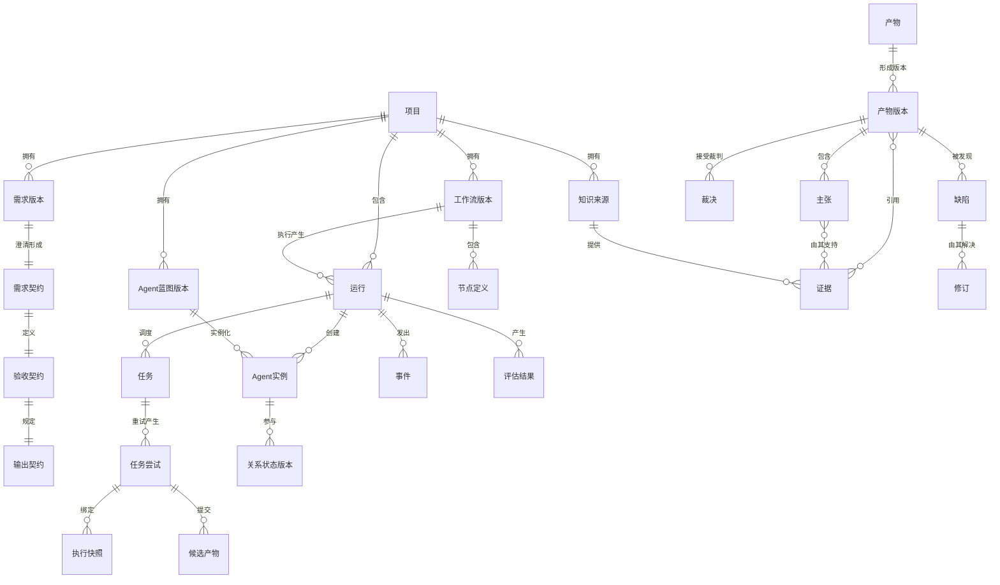

# 江湖 Online 系统需求规格说明书（SRS）v2.0

## 0. 文档信息

| 项目 | 内容 |
| --- | --- |
| 产品名称 | 江湖 Online |
| 文档类型 | 完整版系统需求规格说明书 |
| 版本 | 2.0 候选基线 |
| 日期 | 2026-07-28 |
| 状态 | 待用户确认 |
| 上游输入 | PRD v1.0、用户需求 v2、系统需求 v1、ADR-0005、竞品与开源方案调研 |
| 本版新增重点 | Workflow/Agent 资产复用、拟人化协作、受控执行、任务恢复、长期操作型 Agent、数据库选型、知识库组织与反馈更新 |

### 0.1 文档目的

本文规定江湖 Online 的系统边界、领域语义、功能需求、数据与知识要求、运行控制、安全、可靠性、性能和端到端验收标准。本文是后续总体设计、数据库设计、接口设计、开发计划和测试方案的需求输入。

本文暂不规定具体代码目录、类结构、数据库表字段和云资源拓扑；这些内容在本需求确认后进入总体设计。

### 0.2 规范用语

- **必须 / P0**：MVP 强制要求，不满足则不能通过验收。
- **应该 / P1**：产品方向已确定，可以在 P0 核心闭环后完成。
- **可以 / P2**：扩展能力，不影响 MVP 核心验收。

### 0.3 本版与旧版关系

本文件整合并重新组织 `system-requirements-v1.md` 及后续确认内容。v1 保留为历史需求登记册；v2 经用户确认后成为新的系统需求基线。既有 `SR-*` 细粒度编号继续有效，本版按能力域汇总并补充数据库、知识治理和操作型 Agent 要求。

## 1. 产品定位与系统目标

江湖 Online 是一个知识驱动、需求驱动的多 Agent 生产流程生成与运行平台。

平台面向社会中不同身份的用户，提供“建设生产流程资产”和“使用已有流程完成具体任务”两个并列主场景：

1. 用户可以描述要建立的生产流程类型，由系统构建或优化 Workflow 与多 Agent，并在确认后保存为可复用资产；
2. 用户可以选择已有 Workflow，再输入本次具体任务，通过自适应 Grill Me 明确任务需求并创建 Run；
3. 从已有 Agent 库选拔和复用拟人化 Agent，必要时派生适配，没有适用 Agent 时再新建；
4. 让 Agent 在流程中协作、委托、讨论、争辩、竞争、攻防和仲裁；
5. 通过可版本化步骤产物流转完成最终交付；
6. 在需要时执行代码、浏览器、Shell、文件和已授权外部系统操作；
7. 允许用户观察、编辑、介入、暂停、恢复和复盘；
8. 将成功经验沉淀为可复用 Agent、知识和场景包。

### 1.1 核心闭环

```text
场景一：建设或优化生产流程资产
描述流程类型与生产目标
-> WorkflowConstructionContract
-> 检索已有 Workflow 和 Agent
-> 新建 / 派生优化 / 组合重构
-> 编译、自动修复和用户确认
-> 保存 WorkflowVersion / AgentBlueprintVersion

场景二：使用已有流程完成具体任务
选择 WorkflowVersion
-> 输入本次具体任务与知识
-> 自适应 Grill Me
-> RequirementContract / AcceptanceContract / OutputContract
-> 绑定 Agent、知识、权限、模型和预算
-> 创建 Run 并持续执行
-> CandidateArtifact / Gate / Defect / Revision / Decision
-> 最终交付、运行报告和全链路追溯
```

### 1.2 产品原则

| 编号 | 原则 |
| --- | --- |
| PR-01 | 用户目标优先于 Agent 配置。 |
| PR-02 | Workflow 是执行骨架，Agent 是流程中的参与者。 |
| PR-03 | Artifact 是正式流转对象，聊天不是正式交付物。 |
| PR-04 | 多 Agent 只用于有质量收益的节点。 |
| PR-05 | Workflow 和 Agent 都是可保存、可检索、可评价、可复用的版本化资产。 |
| PR-06 | 资产使用遵循“复用优先、派生适配其次、无适用资产时新建”；复用不能绕过当前需求、权限和静态校验。 |
| PR-07 | 用户拥有最高决定权，流程默认可以无人参与自主完成。 |
| PR-08 | 事实、用户声明、模型推导、假设和外部指令必须区分。 |
| PR-09 | 流程、Agent、知识、Prompt、模型、产物和裁决不可覆盖历史版本。 |
| PR-10 | 平台展示公开理由和证据，不展示模型私有思维链。 |
| PR-11 | 比赛案例由通用平台能力构建，不写死在核心逻辑中。 |

## 2. 系统范围

### 2.1 MVP 范围

- 本地单用户、多项目隔离；
- 自然语言、文件和网页知识输入；
- 内置自适应 Grill Me；
- Requirement、Acceptance 和 Output Contract；
- Workflow/Agent 资产库检索、复用、派生适配和按需新建；
- 可视化、可编辑、可版本化的执行图；
- 已有 Agent 库检索、推荐、选择、排除和替换；
- OpenClaw Adapter 和 OpenClaw Gateway，作为 P0 主要多 Agent 运行框架；
- 统一 Agent Execution Port，避免产品 API 直接暴露 OpenClaw 内部对象；
- 真实 LLM、真实并行 Agent 和真实 Artifact；
- 协作、争辩、对抗、修订和独立裁判；
- 真实代码生成、构建、启动、测试和浏览器验证；
- PostgreSQL、Redis Worker、对象存储和 SSE；
- 本地文档与网页搜索知识；
- 知识来源、证据、冲突、反馈和版本管理；
- 生产、江湖和产物视图；
- 公共 Agent 与场景包市场，支持匿名浏览、搜索、比较和安装；
- 单 Agent 与多 Agent 对比实验。

### 2.2 P1 范围

- 独立外部身份、邮件、日历、消息渠道和定时任务；
- 专业 Agent Lane 和类型化 Handoff；
- 专用图数据库或外部知识服务 POC；
- 多用户 Workspace 和组织权限。

### 2.3 非目标

- 无限规模、无预算约束的自由 Swarm；
- 未经审批的任意生产系统写操作；
- 将某一个 Agent 框架作为产品领域真相源；
- 公开或持久化模型私有思维链；
- 用固定软件开发模板代替从零 Workflow 生成；
- 在 MVP 中建设完整企业 IAM、计费和多租户云平台。

## 3. 总体系统约束

| ID | 系统需求 | 优先级 |
| --- | --- | --- |
| SR-ARC-001 | 系统必须采用 API-first 架构，Client 不拥有核心业务状态机。 | P0 |
| SR-ARC-002 | PostgreSQL 中的领域状态必须是 Workflow、Run、Task、Artifact、Evidence、Defect、Revision 和 Decision 的唯一正式真相源。 | P0 |
| SR-ARC-003 | OpenClaw 负责 Agent 和多 Agent 的实际运行，但不得绕过江湖 Online 直接发布正式 Artifact、Evidence、Defect、Revision、Decision 或验收状态。 | P0 |
| SR-ARC-004 | 系统必须区分领域 Orchestrator 与 Agent Execution Adapter。 | P0 |
| SR-ARC-005 | 模型、Agent 运行时、检索、图后端、对象存储和工具必须通过接口隔离。 | P0 |
| SR-ARC-006 | 长任务不得在 HTTP 请求线程中直接执行。 | P0 |
| SR-ARC-007 | 所有组件必须使用统一 Project、Run、Task、Attempt、Agent 和 Trace 标识。 | P0 |
| SR-ARC-008 | Workflow 在运行前必须经过静态校验、自动修复和版本冻结。 | P0 |
| SR-ARC-009 | OpenClaw Adapter 必须作为 P0 默认 Agent 运行路径，覆盖单 Agent、多 Agent 路由、父子委托、隔离上下文、工具和沙箱。 | P0 |
| SR-ARC-010 | OpenClaw 不可用时不得影响历史数据、Workflow、Artifact、Evidence 和 Decision 的读取；未开始的 Agent 任务进入明确不可用状态，不得伪造降级结果。 | P0 |

## 4. 核心领域模型

### 4.1 领域关系总览



读图说明：上半部分描述需求、流程和 Agent 的版本定义；中间描述一次真实 Run 如何产生 Task、Attempt、AgentInstance 和执行条件快照；下半部分描述候选产物如何经过证据、缺陷、修订和裁决成为正式交付。所有带“版本”的对象均不可原地覆盖。

### 4.2 关键对象

| 对象 | 系统含义 |
| --- | --- |
| Project | 需求、知识、Agent、流程、运行和产物的隔离容器 |
| RequirementContract | Grill Me 后形成的目标、范围、约束、知识边界、风险和用户决定 |
| AcceptanceContract | 完成条件、质量、证据、预算和失败条件 |
| OutputContract | 当前需求动态决定的最终交付类型、结构、运行方式和验收方法 |
| WorkflowVersion | 冻结、可编译和可执行的生产任务图 |
| AgentBlueprintVersion | Agent 身份、能力、人格、立场、知识、工具、权限和行为契约版本 |
| AgentInstance | 某次 Run 中隔离运行的 Agent 参与者 |
| RelationshipStateVersion | Agent 间信任、合作、冲突、影响和谈判状态版本 |
| Task / TaskAttempt | 节点调度实例与每次具体执行尝试 |
| AgentExecutionSnapshot | 某次 Attempt 使用的不可变身份、上下文、工具、权限、模型、预算和沙箱配置 |
| CandidateArtifact | 尚未通过正式 Gate 的候选输出 |
| ArtifactVersion | 通过校验的不可变正式产物 |
| Evidence / Claim | 来源证据与产物中的可追溯主张 |
| Defect / Revision / Decision | 缺陷、修订和正式裁决 |
| KnowledgeSourceVersion | 文档、网页、代码、数据库或外部知识源版本 |
| KnowledgeCandidate | 尚未进入可信知识层的候选知识 |
| KnowledgeFeedback | 用户或运行对知识的纠错、确认、过时、冲突和质量反馈 |
| ScenarioPackage | 从成功运行沉淀的声明式参考资产 |

### 4.3 领域不变量

- 被 Run 引用的 Requirement、Workflow、Agent、Prompt、Knowledge、Model 和 Policy 版本不得修改；
- Task 重试必须创建新的 TaskAttempt；
- AgentBlueprint 与 AgentInstance 必须分离；
- CandidateArtifact 与 ArtifactVersion 必须分离；
- 聊天消息不能自动成为正式 Artifact 或可信知识；
- Defect、Revision、Decision、Feedback 必须引用明确目标版本；
- 删除、归档和失效不得静默破坏历史 Run 的可读取性；
- 所有正式状态转换必须留下 Event 和操作者来源。

## 5. 需求澄清与契约生成

| ID | 系统需求 | 优先级 |
| --- | --- | --- |
| SR-REQ-001 | 平台必须内置自适应 Grill Me，在信息不足、冲突或高风险时自动提问。 | P0 |
| SR-REQ-002 | Grill Me 的问题数量和深度必须根据不确定性、风险和用户回答动态调整。 | P0 |
| SR-REQ-003 | 用户未回答非阻断问题时，系统可以使用显式标记的默认值或假设继续；高影响问题不得静默假设。 | P0 |
| SR-REQ-004 | 系统必须生成版本化 RequirementContract、AcceptanceContract 和 OutputContract。 | P0 |
| SR-REQ-005 | OutputContract 必须按当前目标动态生成，平台不得将最终交付固定为文档或软件。 | P0 |
| SR-REQ-006 | 契约必须区分用户事实、外部事实、模型推断、假设、开放问题和已确认决定。 | P0 |
| SR-REQ-007 | 用户修改目标、范围、验收或高影响约束时必须产生新契约版本并执行影响分析。 | P0 |
| SR-REQ-008 | 平台必须区分 WorkflowConstructionContract 与具体任务 RequirementContract；前者描述一类生产流程的适用范围和标准输入输出，后者描述一次具体 Run 的目标与验收。 | P0 |
| SR-REQ-009 | Workflow 构建完成后必须先由用户确认并保存资产，不得因为构建完成自动创建具体任务 Run。 | P0 |

## 6. Workflow 复用、生成与结构校验

### 6.1 Workflow 资产使用原则

在 Workflow 建设场景中，系统必须根据 WorkflowConstructionContract 从 Registry 检索可复用、可派生或可组合的 Workflow。在具体任务执行场景中，用户必须先选择或确认一个 WorkflowVersion，再绑定 RequirementContract、AcceptanceContract、OutputContract、知识、权限、预算和运行环境。

```text
检索候选 WorkflowVersion
-> 兼容性与覆盖度评估
-> 完全适用：复用并绑定当前需求
-> 部分适用：创建派生 WorkflowVersion 并适配
-> 无适用项：从零生成 WorkflowVersion
-> Workflow 编译、Policy 校验和版本冻结
```

无论复用、派生还是从零生成，系统都可以根据当前需求决定或调整：

- 节点数量；
- 节点顺序；
- 串行与并行关系；
- 条件分支与汇合；
- 有限循环和返工；
- Agent 数量和角色；
- 节点执行策略；
- 中间 Artifact 类型。

历史 WorkflowVersion 不得原地修改。WorkflowVersion 必须固定其 AgentBlueprintVersion 和关系绑定；完全复用时保留这些 Agent 绑定，只重新绑定当前任务 Contract、知识快照、运行 Policy、模型可用性和预算。发生节点、边、Artifact Contract、Agent、知识要求、工具或 Policy 定义调整时必须产生新的派生 WorkflowVersion。

### 6.2 Workflow Registry 与适用性要求

每个可复用 WorkflowVersion 至少保存：

- 名称、用途、适用问题和不适用条件；
- 输入需求特征、AcceptanceContract 和 OutputContract 特征；
- 节点能力、Artifact Contract、Gate 和终止条件；
- 所需 Agent 能力、工具、知识和权限；
- 风险等级、预算和运行环境要求；
- 来源、父版本和派生链；
- 使用次数、成功率、质量、费用、时延和失败模式；
- 发布范围：私有、项目、用户或公共市场；
- 当前状态和兼容版本。

| ID | 系统需求 | 优先级 |
| --- | --- | --- |
| SR-WFR-001 | 平台必须提供可版本化 Workflow Registry，支持保存、搜索、筛选、查看、复制、派生、归档和发布 Workflow。 | P0 |
| SR-WFR-002 | 用户构建 Workflow 时，系统必须先检索已有 Workflow，再决定直接复用、创建副本派生优化、组合重构或新建。 | P0 |
| SR-WFR-003 | Workflow 匹配必须评估目标、输入输出、能力覆盖、Artifact Contract、知识、工具、权限、预算、风险和环境。 | P0 |
| SR-WFR-004 | 系统必须展示候选 Workflow 的匹配理由、覆盖项、缺口、冲突、预计质量、费用和时延。 | P0 |
| SR-WFR-005 | 用户可以接受推荐、指定 Workflow、排除候选或要求从零生成。 | P0 |
| SR-WFR-006 | 完全复用必须保留 WorkflowVersion 固定的 AgentBlueprintVersion 绑定，重新绑定当前任务 Contract、知识快照、运行 Policy 和预算并执行静态校验。 | P0 |
| SR-WFR-007 | 部分适用时必须创建派生 WorkflowVersion，记录继承、修改、新增和删除内容及适配理由。 | P0 |
| SR-WFR-008 | 无适用 Workflow 时才从零生成，并记录已评估候选和未采用原因。 | P0 |
| SR-WFR-009 | 成功 Run 可以保存为 Workflow 资产或场景包，但保存前必须移除项目私有数据和固定运行实例。 | P0 |
| SR-WFR-010 | Workflow 历史评价必须按场景和版本保存，不能以单一全局成功率替代适用性判断。 | P1 |
| SR-WFR-011 | 平台首页必须提供“构建/优化 Workflow”和“选择 Workflow 执行任务”两个明确入口。 | P0 |
| SR-WFR-012 | 用户认为已有 Workflow 不符合要求时，系统必须支持创建副本、按用户要求优化、重新校验并保存为新 WorkflowVersion。 | P0 |
| SR-WFR-013 | 具体任务 Run 必须引用用户选择或确认的 frozen WorkflowVersion；不得在后台静默替换为另一个流程。 | P0 |
| SR-WFR-014 | 用户只输入具体任务但未选择 Workflow 时，系统可以推荐候选，但必须在用户确认或显式自动选择 Policy 生效后才能创建 Run。 | P0 |
| SR-WFR-015 | Workflow 构建流程的正式结果是可复用资产；具体任务执行流程的正式结果是 Artifact 和 Run Report，两者不得混为同一状态机。 | P0 |
| SR-WFR-016 | WorkflowVersion 必须固定节点使用的 AgentBlueprintVersion、职责和关系；创建 Run 时只实例化 AgentInstance，不重新执行 Agent 选拔。 | P0 |
| SR-WFR-017 | Agent 运行时替换只能使用 WorkflowVersion 中预先声明并校验的备用 Blueprint；否则必须创建派生 WorkflowVersion、重新编译并由用户确认。 | P0 |

### 6.3 图需求

| ID | 系统需求 | 优先级 |
| --- | --- | --- |
| SR-WF-001 | Workflow 必须支持顺序、并行、条件、fan-out、fan-in、有限循环、返工和子图。 | P0 |
| SR-WF-002 | 每个节点必须定义目标、输入 Artifact、输出 Contract、执行策略、完成条件、Gate、预算和终止条件。 | P0 |
| SR-WF-003 | 节点类型至少包括 deterministic、single_agent、multi_agent、judge、human、merge 和 external_operation。 | P0 |
| SR-WF-004 | 图必须使用显式节点类型、边类型、方向、属性 Schema 和版本。 | P0 |
| SR-WF-005 | Workflow 编译器必须检查语法、类型、入口出口、可达性、循环、依赖、输入输出、权限、预算和能力覆盖。 | P0 |
| SR-WF-006 | 编译器必须阻断悬空边、不可达节点、非法环、无退出循环、缺少生产者的 Artifact 和不兼容数据流。 | P0 |
| SR-WF-007 | 自动修复必须依据结构化诊断，保留每次修改记录；达到上限后进入 `generation_failed`。 | P0 |
| SR-WF-008 | 用户修改节点、边、Agent 或执行策略时必须创建新 WorkflowVersion 并重新编译。 | P0 |
| SR-WF-009 | 系统必须解释节点、Agent 和执行策略的生成或选择理由。 | P0 |
| SR-WF-010 | 图优化不得破坏依赖、权限、证据、质量 Gate 和历史可复现性。 | P1 |

### 6.4 三类逻辑图

1. **执行图**：Workflow、Node、Gate、条件、循环和子图；
2. **知识与社会图**：Ontology、Entity、Relation、Persona、Agent 和关系；
3. **生产溯源图**：Requirement、Attempt、Artifact、Claim、Evidence、Defect、Revision 和 Decision。

三类图是逻辑 Schema，不要求 MVP 使用三个图数据库。

## 7. Agent 库、选拔与团队生成

### 7.1 Agent 来源

系统必须先从 Agent Registry 检索候选，再决定直接复用、派生适配或新建。最终编队仍需根据当前 Workflow 的节点能力和关系要求重新组建。成员可以来自：

- 已有 AgentBlueprintVersion；
- 已有 Agent 的派生版本；
- 平台生产方法和岗位知识生成的新 Agent；
- 用户新建或指定 Agent；
- 外部 A2A/OpenClaw Agent；
- 节点运行中受控派生的临时 AgentInstance。

AgentBlueprintVersion 可以被不同 Workflow 和 Run 复用，但每次 Run 必须创建新的 AgentInstance。若当前任务需要修改 Agent 的职责、人格、知识、工具、权限或模型策略，则必须创建派生 AgentBlueprintVersion，不能修改原版本。

### 7.2 Agent Registry 需求

| ID | 系统需求 | 优先级 |
| --- | --- | --- |
| SR-AG-001 | Agent 库必须保存身份、职责、能力、领域、人格、立场、知识边界、工具、权限、模型、适用场景和历史评价。 | P0 |
| SR-AG-002 | 系统必须按节点能力契约、知识范围、权限、预算、历史表现和团队互补性推荐已有 Agent。 | P0 |
| SR-AG-003 | Agent 选择必须支持自动选择、用户指定、排除、替换和混合模式。 | P0 |
| SR-AG-004 | 推荐必须展示匹配理由、能力覆盖、知识适配、质量、费用、时延、权限和风险。 | P0 |
| SR-AG-005 | 已有 Agent 存在能力缺口时必须派生或生成补充 Agent，不得降低节点 Contract。 | P0 |
| SR-AG-006 | 入选 Agent 必须创建新的隔离 AgentInstance，不得携带其他项目私有上下文。 | P0 |
| SR-AG-007 | 用户改变 Agent 选择、知识、职责或权限后必须重新版本化和校验。 | P0 |
| SR-AG-008 | 历史评价必须保留场景、样本、模型和时间范围，不得用单一全局分数决定所有任务。 | P1 |
| SR-AG-009 | 用户必须能够将新建或派生 Agent 保存到 Agent Registry，并选择私有、项目、用户或公共发布范围。 | P0 |
| SR-AG-010 | 系统必须记录 Agent 的父版本、继承内容、覆盖内容和创建原因。 | P0 |
| SR-AG-011 | 完全复用 AgentBlueprintVersion 时也必须重新检查当前节点的知识、工具、权限、模型和预算兼容性。 | P0 |
| SR-AG-012 | 没有适用 Agent 时系统才新建，并记录候选 Agent 未采用原因和能力缺口。 | P0 |

### 7.3 动态 Agent

- 动态 Agent 默认只属于当前 Workflow/Run；
- 保存为长期 Agent 需用户确认；
- 动态派生不得提高权限；
- 最大并发默认 5；
- 派生必须记录理由、父 Agent、Task Contract、预算和终止条件；
- 级联取消必须覆盖派生 Agent。

### 7.4 大江湖与小江湖

“大江湖”和“小江湖”描述的是某次 Run 或某个节点实际参与的 Agent 社会规模、关系复杂度和互动强度，不是 Agent Registry 中一共有多少 Agent，也不是两套不同的运行引擎。

```text
Agent Registry：平台可选择的全部 Agent 资产
        |
        v
当前需求和 Workflow
        |
        v
本次参与江湖
  -> 小江湖：最小必要团队
  -> 大江湖：扩展角色、立场、关系和互动
```

无论大小江湖，都使用相同的 Workflow、Artifact、Evidence、权限、版本、预算和裁判机制。区别主要体现在：

| 维度 | 小江湖 | 大江湖 |
| --- | --- | --- |
| 目标 | 快速、清晰、低成本地完成交付 | 增加认知多样性、利益相关方和群体检验 |
| Agent 数量 | 最小必要参与者 | 在必要角色上增加不同背景、立场或利益的成员 |
| 关系结构 | 简单职责和少量协作/评审关系 | 团队、阵营、层级、联盟、竞争和观察关系 |
| 互动方式 | 必要协作、独立复核和有限红队 | 并行提案、群体讨论、多方争辩、投票、竞争和谈判 |
| 使用范围 | 默认 Run，或普通节点 | 高风险、高不确定性或多利益相关方节点 |
| 费用和时延 | 优先控制 | 用户接受更高费用和时延换取更多视角 |
| 正式输出 | 节点 Artifact | 仍然是节点 Artifact，群聊不能代替正式输出 |

### 7.5 小江湖

小江湖遵循“最小必要参与者”原则：

- 优先复用职责明确的已有 Workflow 和 Agent；
- 只选择完成当前目标所需的 Agent；
- 简单节点优先使用确定性程序或单 Agent；
- 需要独立复核时可以采用“生产 Agent + Reviewer”；
- 高风险节点仍可使用红队和独立 Judge；
- 删除职责、知识和立场高度重复的成员；
- 保持责任、关系、产物和决策链清晰；
- 优先满足时间和费用约束。

小江湖适用于：

- MVP 默认运行；
- 日常生产任务；
- 目标和验收相对明确的任务；
- 时间或费用敏感任务；
- 依赖较强、不适合大规模并行的任务；
- 用户希望尽快获得可交付结果的场景。

小江湖不等于单 Agent，也不等于取消争辩和裁判。系统仍必须在确有必要时配置多个 Agent。

### 7.6 大江湖

大江湖在必要角色基础上扩大参与范围和认知差异：

- 同一专业可以存在多个不同经验、方法、风险偏好或立场的 Agent；
- 可以增加用户代表、客户、管理者、专家、监管者、观察者、反方、红队和边缘角色；
- 可以形成团队、阵营、层级、委托、联盟、竞争和对抗关系；
- 可以并行产生多个独立提案；
- 可以进行有限轮次的群体讨论、争辩、谈判、投票或竞争；
- 可以观察观点传播、分歧、共识、联盟和群体结果；
- 可以只扩大高风险节点，不要求整个 Workflow 全程保持大规模；
- 必须设置汇总者、收敛规则、正式 Artifact 和明确终止条件。

大江湖适用于：

- 高风险决策；
- 高不确定性研究；
- 多利益相关方需求；
- 需要认知多样性的方案评审；
- 需要模拟不同群体反应的场景；
- 需要观察协作、冲突、联盟和涌现的场景；
- 用户愿意承担更高费用和时延的任务。

大江湖不等于无限 Agent，也不等于所有人自由聊天。每个参与者必须有明确的身份、作用、上下文、权限、预算和退出条件。

### 7.7 江湖规模选择

用户创建 Run 时可以选择：

- `auto`：系统按需求自动推荐；
- `small`：优先使用最小必要团队；
- `large`：在指定范围扩大参与者和互动；
- `custom`：用户指定节点、角色、人数、关系和互动规则。

自动推荐至少考虑：

- 任务复杂度和专业跨度；
- 风险和错误影响；
- 需求不确定性；
- 利益相关方数量；
- 是否需要独立方案、多方复核或社会模拟；
- 可并行程度；
- 历史同类任务中扩容的质量收益；
- Token、费用、时间和工具容量；
- Agent 同质化和协调成本。

系统必须展示推荐规模、作用范围、增加或减少的 Agent、预期质量收益、费用、时延和风险。用户拥有最终选择权。

### 7.8 作用范围与切换

江湖规模可以作用于：

1. **整个 Run**：设置默认团队规模和关系复杂度；
2. **Workflow 子图**：某个阶段采用不同规模；
3. **单个节点**：只在关键决策、红队或评审节点扩大；
4. **返工轮次**：第一次使用小江湖，质量不足时扩大为大江湖；
5. **对比实验**：同一输入分别运行大小江湖。

运行中改变江湖规模、成员构成、关系或互动协议属于结构性介入：

- 当前受影响 Task 必须暂停或停止；
- 已产生的消息、Candidate 和 Artifact 保留；
- 系统生成新的 WorkflowVersion 或运行配置版本；
- 重新执行能力、权限、预算、上下文和图结构校验；
- 用户确认后从受影响边界重新运行；
- 历史 Run 和产物不得覆盖。

### 7.9 大小江湖系统需求

| ID | 系统需求 | 优先级 |
| --- | --- | --- |
| SR-JH-001 | 系统必须支持 auto、small、large 和 custom 江湖规模策略，并保存在 WorkflowVersion 和 Run 配置中。 | P0 |
| SR-JH-002 | 小江湖必须只选择完成目标所需的 Agent，并解释每个 Agent 的必要性。 | P0 |
| SR-JH-003 | 小江湖的简单节点不得为了展示多 Agent 而增加参与者。 | P0 |
| SR-JH-004 | 小江湖仍必须允许在高风险节点配置 Reviewer、红队和独立 Judge。 | P0 |
| SR-JH-005 | 大江湖必须允许同专业多角色、多利益相关方、不同立场和关系网络。 | P1 |
| SR-JH-006 | 大江湖新增 Agent 必须具有可解释的能力、知识、立场、利益或关系差异。 | P1 |
| SR-JH-007 | 系统必须检测能力、知识、立场和输出高度重复的 Agent，并提示同质化与冗余。 | P1 |
| SR-JH-008 | 江湖规模必须可以配置在整个 Run、子图或单节点，而不是强制所有节点使用同一规模。 | P1 |
| SR-JH-009 | 大江湖必须设置 Agent 数、并发、轮次、Token、费用、时间、消息量和工具容量边界。 | P1 |
| SR-JH-010 | 大江湖必须定义汇总者、收敛规则、冲突处理、正式输出和终止条件。 | P1 |
| SR-JH-011 | 大小江湖都必须通过 ArtifactVersion 向下游流转，群聊、投票和多数意见不能直接成为正式产物。 | P0 |
| SR-JH-012 | 自动模式必须解释规模推荐依据、作用节点、预计质量、费用、时延和协调风险。 | P0 |
| SR-JH-013 | 用户修改江湖规模或成员构成时必须创建新版本并重新校验。 | P0 |
| SR-JH-014 | 系统必须支持同一需求下大小江湖的质量、缺陷、证据、费用、时延和稳定性对比。 | P1 |
| SR-JH-015 | 达到资源或轮次边界后，系统必须停止扩容和新增互动，并进入汇总、裁决或明确终态。 | P0 |
| SR-JH-016 | 大江湖中的动态派生 Agent 必须受当前 Run 权限和预算上限约束，不得形成无限层级。 | P0 |

## 8. 拟人化行为与社会关系

### 8.1 同源异态模型

所有 Agent 使用相同的行为出发框架：

```text
身份与职责
+ 目标、利益与底线
+ 知识与证据边界
+ 人格行为倾向
+ 与其他参与者的关系
+ 当前情境和历史事件
+ 制度、权限和资源约束
-> 当前主张、策略、行动和公开理由摘要
```

相同出发框架不代表相同答案。不同 Agent 应因职责、立场、知识、利益、关系和证据门槛不同，在协作、争辩、竞争、抗争、谈判、妥协和仲裁中呈现稳定且可解释的差异。

### 8.2 行为要求

| ID | 系统需求 | 优先级 |
| --- | --- | --- |
| SR-PERSONA-001 | AgentBlueprint 必须支持协作意愿、质疑强度、风险偏好、证据门槛、妥协条件、冲突方式和表达风格。 | P0 |
| SR-PERSONA-002 | 同一 Agent 必须保持身份和核心目标连续，但能根据证据、关系和用户裁决改变策略。 | P0 |
| SR-PERSONA-003 | 不同 Agent 对同一 Artifact 应能形成不同且有依据的关注点和主张。 | P0 |
| SR-PERSONA-004 | 系统不得用统一答案模板加不同语气伪装人格差异。 | P0 |
| SR-PERSONA-005 | 人格、立场和利益不得成为越权、捏造事实或违反强制 Policy 的理由。 | P0 |
| SR-PERSONA-006 | Agent 必须输出公开理由摘要，但不得输出或保存私有思维链。 | P0 |
| SR-PERSONA-007 | 信任、合作、冲突和谈判姿态变化必须形成 RelationshipStateVersion 并引用触发事件。 | P0 |
| SR-PERSONA-008 | 人格不得退化为固定刻板印象，Agent 必须能在新证据出现后合理修正。 | P0 |

## 9. 协作、争辩、对抗与裁判

### 9.1 P0 协议

- parallel_experts；
- supervisor_delegate；
- peer_review；
- typed_handoff；
- bounded_debate；
- red_blue；
- revise_retest；
- independent_judge；
- human_arbitration。

### 9.2 系统要求

| ID | 系统需求 | 优先级 |
| --- | --- | --- |
| SR-COL-001 | 多 Agent 节点必须定义参与者、关系、上下文、轮次、发言/行动规则、汇总和终止方式。 | P0 |
| SR-COL-002 | 主张、质疑、回应、让步、拒绝、妥协和裁定必须使用类型化消息或 Artifact。 | P0 |
| SR-COL-003 | 红队必须针对明确 ArtifactVersion 提交 Defect，不得直接修改被攻击产物。 | P0 |
| SR-COL-004 | Defect 必须包含严重度、证据、影响、复现或反例、建议和状态。 | P0 |
| SR-COL-005 | 修订必须产生新的 ArtifactVersion 并记录处理的 Defect。 | P0 |
| SR-COL-006 | 红队必须能够对修订版本复测。 | P0 |
| SR-COL-007 | Judge 必须使用独立身份、独立上下文、独立 Prompt 和独立执行配置。 | P0 |
| SR-COL-008 | Judge 不得参与被评版本生成，不得修改被评产物。 | P0 |
| SR-COL-009 | 单模型部署允许，但必须明确标记同模型裁判并保持上下文和 Prompt 隔离。 | P0 |
| SR-COL-010 | 用户拥有最终裁决权，覆盖 AI 决定必须形成新的 Decision。 | P0 |

## 10. Agent 执行环境与权限约束

每个 TaskAttempt 必须绑定不可变 `AgentExecutionSnapshot`，至少包含：

- Task Contract；
- Agent 身份和版本；
- 独立 Prompt 版本；
- Context Manifest；
- 输入 ArtifactVersion；
- Knowledge Binding；
- Tool Binding 和权限；
- 模型和参数；
- Token、费用和时间预算；
- 工作区、沙箱和网络策略；
- 输出 Schema；
- Gate 和停止条件；
- Adapter 及版本；
- 内容摘要和创建时间。

| ID | 系统需求 | 优先级 |
| --- | --- | --- |
| SR-EXEC-001 | Attempt 运行中不得静默改变 Prompt、模型、工具、权限、知识和输入版本。 | P0 |
| SR-EXEC-002 | Agent 执行配置必须由平台统一生成，并能映射到不同 Adapter。 | P0 |
| SR-EXEC-003 | 所有工具和外部操作必须按最小权限下发。 | P0 |
| SR-EXEC-004 | 真实调用前必须完成权限、预算、Schema、依赖、沙箱和敏感数据预检。 | P0 |
| SR-EXEC-005 | Context Manifest 必须明确来源、版本、用途、可信级别和裁剪结果。 | P0 |
| SR-EXEC-006 | Prompt、角色、Policy、工具定义、Schema 和模型配置必须独立版本化并生成摘要。 | P0 |
| SR-EXEC-007 | 代码任务必须绑定隔离 Worktree/副本和可复现执行环境。 | P0 |
| SR-EXEC-008 | 系统必须记录工具调用、Token、费用、时延、错误和环境差异。 | P0 |
| SR-EXEC-009 | 重放必须能够解释输入、配置、环境和模型非确定性差异，不承诺逐字一致。 | P0 |

## 11. 任务推进、返工与运行恢复

### 11.1 持续推进过程

```text
Goal -> Plan -> Action -> Observation -> Evaluation
                     ^                    |
                     |---- Revision ------|
```

### 11.2 推进与终止要求

| ID | 系统需求 | 优先级 |
| --- | --- | --- |
| SR-RUN-001 | 可返工任务必须定义目标、进度、开放事项、成功、失败、最大轮次、预算、超时和退出原因。 | P0 |
| SR-RUN-002 | Plan、Action、Observation、Evaluation、Revision 和 Checkpoint 必须持久化。 | P0 |
| SR-RUN-003 | 每轮继续前必须验证是否产生新证据、产物变化、缺陷收敛或计划进展。 | P0 |
| SR-RUN-004 | 系统必须检测重复调用、重复消息、产物不变、缺陷不收敛和反复 Handoff。 | P0 |
| SR-RUN-005 | 停滞后必须重规划、替换策略/Agent、缩小任务、请求裁判/用户或进入明确终态。 | P0 |
| SR-RUN-006 | Agent 自称完成不得直接结束 Task 或 Run。 | P0 |
| SR-RUN-007 | 重试必须创建新 Attempt，并区分瞬态失败、确定性失败、质量返工和用户重跑。 | P0 |
| SR-RUN-008 | 暂停、审批和结构性修改必须形成 Checkpoint。 | P0 |
| SR-RUN-009 | 系统必须展示当前目标、轮次、进展证据、开放问题、剩余预算和停止原因。 | P0 |

### 11.3 默认资源上限

- 最多 5 个并发 Agent；
- 辩论最多 3 轮；
- 单节点最多 10 分钟；
- 单 Run 最多 60 分钟；
- 模型配置必须设置 Token 或费用上限；
- 达到 Token/费用上限后停止新增调用并进入 `budget_exhausted`；
- 用户可在平台允许范围内调整，未填写时使用系统默认值。

### 11.4 终态

Run 必须进入明确终态：`completed`、`failed`、`blocked`、`cancelled`、`budget_exhausted` 或 `generation_failed`。系统必须扫描并处理无人推进的悬挂任务。

## 12. Artifact、Evidence 与正式产物流转

### 12.1 Artifact 基础协议

通用平台只固定 Artifact 基础协议：

- ID、类型和 Schema 版本；
- 所属 Project、Run、Task 和 Attempt；
- 创建者 Agent/用户/规则；
- 输入来源和上游 Artifact；
- 内容或对象存储引用；
- 内容摘要；
- Claim 和 Evidence；
- 状态和创建时间；
- 父版本和修订关系；
- 可见范围和敏感级别。

具体业务字段由场景包或本次 OutputContract 定义。

### 12.2 正式产物要求

- Agent 先提交 CandidateArtifact；
- Candidate 必须通过结构、证据和质量 Gate；
- 通过后生成不可变 ArtifactVersion；
- 下游必须引用明确 ArtifactVersion；
- 返工、重跑、人工修改均产生新版本；
- 旧版本只可归档或失效，不得覆盖；
- 关键 Claim 必须能够关联 Evidence；
- 最终交付必须可反向追溯至需求、Agent、执行配置、工具、代码、测试、缺陷和裁决。

## 13. 数据库与存储选型需求

### 13.1 选型结论

| 数据类型 | MVP 选型 | 定位 |
| --- | --- | --- |
| 正式领域状态 | PostgreSQL | 唯一真相源 |
| 关系/图数据 | PostgreSQL 关系表、递归查询和投影 | MVP 图数据基础 |
| 向量检索 | pgvector 或可替换向量接口 | 语义检索，不是事实真相源 |
| 异步队列/租约 | Redis | 调度加速与临时协调，不是正式状态源 |
| 原始文件和大产物 | 本地对象目录抽象，兼容 S3 | Blob 内容存储 |
| 全文检索 | PostgreSQL FTS 起步，可替换搜索引擎 | 关键词检索 |
| 图数据库 | Neo4j/Nebula/Zep 等后续 POC | 复杂图查询投影，不直接承载正式领域版本 |

### 13.2 PostgreSQL 强制要求

| ID | 系统需求 | 优先级 |
| --- | --- | --- |
| SR-DATA-001 | PostgreSQL 必须保存所有正式对象、版本、状态转换、引用和审计元数据。 | P0 |
| SR-DATA-002 | 正式领域更新必须使用事务、唯一约束、外键或等价一致性机制。 | P0 |
| SR-DATA-003 | Run、Task、Attempt、Artifact 发布和外部操作必须支持幂等键。 | P0 |
| SR-DATA-004 | 版本对象必须采用追加式写入，不允许原地覆盖历史内容。 | P0 |
| SR-DATA-005 | Redis 中的数据丢失后，系统必须能根据 PostgreSQL 恢复或重建调度状态。 | P0 |
| SR-DATA-006 | 对象存储只保存内容，数据库必须保存版本、摘要、媒体类型、大小、权限和来源引用。 | P0 |
| SR-DATA-007 | 向量索引和图投影必须能够从正式 Source、Chunk、Entity、Relation 和 Evidence 数据重建。 | P0 |
| SR-DATA-008 | 数据库迁移必须版本化、可审计，并具有升级前备份和失败恢复方案。 | P0 |
| SR-DATA-009 | 敏感字段和密钥不得以明文进入普通领域表、日志、向量索引或 Artifact。 | P0 |
| SR-DATA-010 | 数据保留、归档、项目删除和来源删除必须明确级联范围并经用户确认。 | P0 |

### 13.3 为什么 MVP 不直接使用图数据库作为主库

- 正式流程需要强事务、版本、约束和审计；
- Artifact、Evidence、Defect、Decision 等对象更适合关系型一致性管理；
- MVP 图规模可由关系表和递归查询承担；
- 专用图数据库可以作为查询投影，避免形成第二真相源；
- 后续只有在多跳查询、图算法、规模或性能证据明确时才引入。

## 14. 知识库全生命周期需求

### 14.1 知识层次

```text
原始知识层：文件、网页快照、代码、外部数据
-> 解析层：文档、页面、Chunk、结构和元数据
-> 语义层：Ontology、Entity、Relation、Claim、Embedding
-> 证据层：Evidence、来源位置、时间、摘要和可信级别
-> 运行层：检索结果、Run Memory、Agent Observation、KnowledgeCandidate
-> 治理层：冲突、反馈、审核、发布、失效、回滚和质量评价
```

### 14.2 知识来源接入

平台必须支持：

- 本地文件；
- 用户粘贴文本；
- 网页搜索与网页抓取；
- 代码仓库和代码文件；
- 上游 Artifact；
- 用户确认事实；
- P1 外部数据库、API、MCP 和业务系统。

每个 KnowledgeSourceVersion 必须保存：

- 来源类型和原始位置；
- 上传者或获取者；
- 获取时间和有效时间；
- 文件/网页摘要；
- 内容摘要 Hash；
- 解析器和版本；
- 权限和敏感级别；
- 抓取参数、HTTP 元数据和网页快照；
- 当前状态：active、superseded、stale、revoked、deleted。

### 14.3 网页知识要求

| ID | 系统需求 | 优先级 |
| --- | --- | --- |
| SR-KB-001 | 网页必须通过统一 Search/Fetch Gateway 获取。 | P0 |
| SR-KB-002 | 搜索结果摘要不能直接成为正式 Evidence，必须获取并保存原始页面或可核验内容。 | P0 |
| SR-KB-003 | 网页 Evidence 必须保存 URL、标题、抓取时间、引用片段、位置、内容摘要和可用性状态。 | P0 |
| SR-KB-004 | 页面变化后必须创建新的 SourceVersion，不得覆盖旧快照。 | P0 |
| SR-KB-005 | 页面不可访问、内容变化或可信度下降时必须标记相关 Evidence 影响范围。 | P0 |

### 14.4 解析、Ontology 与图谱构建

参考 MiroFish 的有效链路：

```text
Source
-> Parser / Chunker
-> Ontology Generator
-> Entity / Relation / Claim Extractor
-> Evidence Binder
-> Keyword / Vector / Graph Index
-> Persona / Workflow Context Provider
```

系统要求：

- Ontology 必须按 Project、需求和知识版本动态生成；
- Ontology 修改必须版本化；
- Entity、Relation 和 Claim 应尽可能绑定原始 Chunk/Evidence；
- 模型推断关系必须标记为 inference，并保存置信度、模型和时间；
- 用户确认的事实必须标记确认人和确认时间；
- 冲突信息不得静默合并；
- Embedding 只用于检索，不得决定事实真实性；
- 图投影必须能从 PostgreSQL 正式数据重建。

### 14.5 检索与上下文

| ID | 系统需求 | 优先级 |
| --- | --- | --- |
| SR-KB-010 | 检索必须支持关键词、向量、关系、来源、时间、权限和 Artifact 关联过滤。 | P0 |
| SR-KB-011 | 每次检索必须记录查询、过滤条件、索引版本、返回 Evidence 和排序信息。 | P0 |
| SR-KB-012 | Agent 只能检索本次执行配置授权范围内的知识。 | P0 |
| SR-KB-013 | Context Manifest 必须记录实际选入上下文的 Chunk、Evidence、裁剪和摘要。 | P0 |
| SR-KB-014 | 检索不到证据时必须明确返回未知，不得让模型将常识猜测伪装为知识库事实。 | P0 |
| SR-KB-015 | 冲突证据应同时呈现来源、时间、可信度和冲突状态。 | P0 |

### 14.6 运行记忆与长期知识隔离

运行中产生的消息、观察、模型结论和临时总结必须先进入 Run Memory，不得直接污染长期知识。

```text
Run Observation / Agent Memory
-> KnowledgeCandidate
-> 去重与来源检查
-> 冲突检测
-> 证据与可信度检查
-> 自动规则或人工审核
-> 发布为新 KnowledgeVersion / 拒绝 / 暂存
```

### 14.7 反馈类型

系统必须支持以下 KnowledgeFeedback：

| 类型 | 含义 |
| --- | --- |
| confirm | 用户或规则确认知识有效 |
| incorrect | 内容错误 |
| outdated | 内容已过时 |
| conflict | 与其他来源冲突 |
| incomplete | 信息不完整 |
| duplicate | 重复知识 |
| permission_issue | 权限或敏感范围错误 |
| source_unavailable | 来源不可访问 |
| low_quality | 解析、分块、抽取或表述质量低 |
| useful / not_useful | 对当前任务是否有帮助 |
| missing_knowledge | 运行中发现知识缺口 |

### 14.8 知识反馈处理

| ID | 系统需求 | 优先级 |
| --- | --- | --- |
| SR-KB-FB-001 | 反馈必须引用明确 SourceVersion、Chunk、Entity、Relation、Claim、Evidence 或 KnowledgeVersion。 | P0 |
| SR-KB-FB-002 | 反馈必须保存来源主体、Run/Task、反馈类型、证据、严重度、时间和处理状态。 | P0 |
| SR-KB-FB-003 | Agent 反馈默认是候选意见，不能直接修改可信知识。 | P0 |
| SR-KB-FB-004 | 确定性校验可以自动处理格式、失链、重复、Hash 变化和来源不可用问题。 | P0 |
| SR-KB-FB-005 | 高影响事实纠错、冲突裁决、权限变化和长期知识写回必须经过用户或授权审核者确认。 | P0 |
| SR-KB-FB-006 | 接受反馈必须创建新知识版本，并保存旧版本、修改原因、影响范围和处理者。 | P0 |
| SR-KB-FB-007 | 拒绝反馈必须保存理由，不得删除原反馈。 | P0 |
| SR-KB-FB-008 | 系统必须支持批量反馈、合并重复反馈和关联同一根因。 | P1 |
| SR-KB-FB-009 | 知识反馈不得反向覆盖历史 Run 使用的知识快照。 | P0 |

### 14.9 更新与重建

知识更新分为：

1. **来源更新**：文件新版本、网页变化、API 数据变化；
2. **解析更新**：解析器、OCR、Chunk 策略变化；
3. **语义更新**：Ontology、实体抽取、关系抽取变化；
4. **治理更新**：纠错、冲突裁决、权限或可信度变化；
5. **索引更新**：Embedding 模型、全文索引或图投影变化。

每次更新必须：

- 生成变更预览；
- 显示新增、修改、失效、冲突和影响对象；
- 创建新版本而不是覆盖；
- 支持局部重建；
- 保留索引构建状态和失败信息；
- 允许回滚当前发布指针；
- 不影响历史 Run 的固定知识快照；
- 对受影响的 Agent、Workflow、Artifact 和 Claim 生成影响提示。

### 14.10 知识质量评价

平台必须计算或展示：

- 来源覆盖率；
- Evidence 绑定率；
- 无来源 Claim 比例；
- 冲突数量和未处理时长；
- 过时知识比例；
- 重复率；
- 检索命中率；
- 用户 useful/not_useful 反馈；
- Agent 引用后被 Judge/红队否定的比例；
- 解析和索引失败率；
- 权限异常数量；
- 知识写回接受率和回滚率。

### 14.11 知识删除与撤销

- 删除来源必须显示受影响 Evidence、Claim、Artifact、Agent 和历史 Run；
- 历史 Run 已引用的内容默认进入 revoked/archived，不做物理删除；
- 法规或用户明确要求物理删除时，系统必须执行受控擦除并保留不含敏感内容的审计记录；
- 被撤销来源不得继续进入新 Run 检索；
- 向量和图索引必须同步删除或失效；
- 删除失败必须进入可重试任务和告警。

### 14.12 知识库的组织形式

知识库不能只是一个文件列表或一个向量集合。平台必须同时提供“管理组织”和“语义组织”两套结构。

#### 14.12.1 管理组织层次

```text
平台知识空间
  -> 行业/生产方法知识库

用户知识空间
  -> 用户长期知识库

项目知识空间
  -> 当前 Project 的需求、文档、网页、代码和历史产物

场景包知识空间
  -> 场景方法、参考角色、Artifact Schema 和评价规则

Agent 私有知识空间
  -> 该 Agent 被授权使用的专业知识和长期记忆

Run 临时知识空间
  -> 本次运行观察、临时结论、开放问题和候选知识
```

不同知识空间之间不能默认互相可见。每次运行通过 `KnowledgeBindingVersion` 明确绑定哪些知识空间、集合、版本和查询能力。

#### 14.12.2 空间内组织结构

```text
KnowledgeSpace
-> KnowledgeLibrary
-> Collection
-> Source
-> SourceVersion
-> Document / Page / CodeUnit
-> Chunk
-> Claim / Entity / Relation / Event
-> Evidence
-> Index Projection
```

| 对象 | 作用 |
| --- | --- |
| KnowledgeSpace | 权限、所有权、生命周期和隔离边界 |
| KnowledgeLibrary | 一个相对独立的知识库，例如“公司制度”“产品资料”“研发规范” |
| Collection | 面向主题、部门、产品、时间或用途的管理集合 |
| SourceVersion | 某份原始资料在特定时间的不可变版本 |
| Document/Page/CodeUnit | 保留原始结构的内容对象 |
| Chunk | 用于检索和引用的最小内容片段 |
| Claim | 从资料中识别出的可验证陈述 |
| Entity | 人、组织、系统、产品、需求、技术等对象 |
| Relation | 实体、Claim、Artifact 和事件之间的关系 |
| Event | 带时间的业务或运行事件 |
| Evidence | 指回原始来源位置的正式证据 |
| Index Projection | 全文、向量、图和时间索引的可重建投影 |

#### 14.12.3 Collection 组织维度

一个知识对象可以通过标签和关系同时出现在多个 Collection 中，但原始 SourceVersion 只保存一份。Collection 至少支持以下组织维度：

- 按组织：公司、部门、团队、项目；
- 按领域：产品、研发、销售、法务、财务、运营；
- 按主题：安全、架构、定价、客户、流程；
- 按对象：某产品、某客户、某系统、某需求；
- 按时间：当前有效、历史版本、规划中、已失效；
- 按可信等级：已确认、可信来源、模型推断、待验证、冲突；
- 按敏感等级：公开、项目内、Agent 私有、受限、机密；
- 按用途：Workflow 生成、Agent 生成、任务执行、Judge、报告和评估。

### 14.13 知识图谱组织要求

#### 14.13.1 图谱不是独立真相源

知识图谱是对正式知识对象的语义关系投影。PostgreSQL 保存 OntologyVersion、Entity、Relation、Claim、Evidence 和版本元数据；Knowledge Graph Service 提供图查询。未来可以将相同数据投影到 Neo4j、Nebula、Zep 等后端。

#### 14.13.2 Ontology

OntologyVersion 至少定义：

- 实体类型；
- 关系类型；
- 属性 Schema；
- 方向和基数；
- 时间属性；
- 允许的来源类型；
- Evidence 要求；
- 合并与冲突规则；
- 权限与敏感级别；
- 与 Artifact Schema 的映射。

平台可以根据当前需求和资料生成项目 Ontology 草案，但必须经过 Schema 校验。Ontology 更新必须产生新版本，并评估对实体、关系、检索和历史查询的影响。

#### 14.13.3 图谱核心关系

平台至少支持以下关系族：

| 关系族 | 示例 |
| --- | --- |
| 组织关系 | belongs_to、reports_to、owns、serves |
| 能力关系 | has_capability、requires_capability、uses_tool |
| 知识关系 | knows、derived_from、supports、contradicts |
| 需求关系 | satisfies、depends_on、conflicts_with、constrains |
| 生产关系 | generated_by、reviewed_by、revises、judged_by |
| 社会关系 | collaborates_with、challenges、trusts、opposes、delegates_to |
| 时间关系 | valid_from、valid_to、supersedes、occurred_before |
| 风险关系 | causes、exposes、mitigates、blocks |

每条 Relation 必须保存：主体、客体、类型、OntologyVersion、来源、Evidence、置信度、有效时间、创建方式和状态。

#### 14.13.4 实体消歧与合并

| ID | 系统需求 | 优先级 |
| --- | --- | --- |
| SR-KG-001 | 实体抽取后必须先进入候选区，执行名称、别名、类型、属性和关系消歧。 | P0 |
| SR-KG-002 | 实体合并必须保留原候选、匹配依据和合并决定，允许撤销错误合并。 | P0 |
| SR-KG-003 | 同名不同实体不得仅依据名称自动合并。 | P0 |
| SR-KG-004 | 不同名称的同一实体应支持 alias、external_id 和人工确认合并。 | P0 |
| SR-KG-005 | Relation 冲突必须并存并显示来源，不得由最后写入值覆盖。 | P0 |
| SR-KG-006 | Entity 和 Relation 的权限不得高于其来源 Evidence 的可见范围。 | P0 |

### 14.14 知识使用方式

知识在平台中至少有六种用途。

#### 14.14.1 需求澄清

Grill Me 使用知识判断：

- 用户是否已经提供答案；
- 需求与现有制度或事实是否冲突；
- 哪些高影响信息缺失；
- 哪些术语需要按用户领域解释；
- 哪些内容只能作为假设。

知识不能替用户决定业务目标。知识库中的历史做法只能作为参考，不能自动覆盖当前用户要求。

#### 14.14.2 Workflow 生成

Workflow Generator 可以查询：

- 当前领域的标准生产活动；
- 相关制度、风险和审批要求；
- 可用 Agent、工具和能力；
- 历史成功场景包；
- 当前 OutputContract 所需 Artifact；
- 过去运行的失败模式。

系统必须记录使用了哪些知识、Workflow 和场景参考。已有 Workflow 完全适用时可以复用；部分适用时创建派生版本；没有适用流程时再从零生成。

#### 14.14.3 Agent 生成与选拔

Agent Planner 使用知识图谱查询：

- 哪些职业或能力能够覆盖节点 Contract；
- 哪些已有 Agent 掌握相关知识；
- Agent 与用户、项目和其他 Agent 的关系；
- Agent 可用工具和权限；
- 历史质量、成本和缺陷表现；
- 团队立场和能力是否互补。

知识图谱只提供候选和依据，最终选择仍受 Workflow、Policy、预算和用户决定约束。

#### 14.14.4 节点执行

节点运行时按 Task Contract 选择检索策略：

| 策略 | 适用情况 | 主要输出 |
| --- | --- | --- |
| direct_lookup | 已知对象、ID、术语或精确事实 | 精确记录和 Evidence |
| keyword_search | 关键词、制度条款、错误信息 | 匹配 Chunk |
| semantic_search | 表达不同但语义相关 | 向量相似 Chunk |
| graph_neighborhood | 查询对象关系、上下游和影响范围 | 子图和路径 |
| multi_hop_graph | 跨多个实体追踪原因、依赖或责任 | 多跳路径及每跳 Evidence |
| temporal_query | 查询某一时间点有效的知识 | 时间切片 |
| hybrid_retrieval | 关键词、向量、图和重排序组合 | 综合 Evidence Bundle |
| full_source_read | 高风险结论或摘要不足 | 原文和结构化位置 |

检索结果必须包装为 `EvidenceBundle`，至少包含查询目的、命中内容、来源、图路径、可信度、冲突、时间有效性和裁剪说明。

#### 14.14.5 协作、争辩和对抗

- 协作 Agent 可以共享已授权 EvidenceBundle；
- 争辩 Agent 必须围绕 Claim 和 Evidence 提出挑战；
- 红队可以查询冲突关系、依赖链、历史缺陷和失败案例；
- Agent 不得通过知识图谱读取未授权的私有关系或知识；
- 新发现的冲突先进入 Blackboard 和 KnowledgeCandidate；
- 讨论中的多数意见不能自动改写知识事实。

#### 14.14.6 Judge、报告和追溯

Judge/Report Agent 可以使用：

- 快速精确检索；
- 全景关系查询；
- Claim-Evidence 覆盖检查；
- 冲突和过时知识查询；
- 最终 Artifact 的生产溯源图；
- 受控采访参与 Agent。

Judge 必须区分：来源事实、用户确认、模型推断、运行观察和 Agent 主张。

### 14.15 知识查询规划

平台必须由 `KnowledgeQueryPlanner` 根据任务风险和问题类型决定查询方式，而不是每次都把全部知识放入上下文。

```text
Task Contract
-> Query Intent Classification
-> Knowledge Scope & Permission Check
-> Retrieval Plan
-> Keyword / Vector / Graph / Source Reader
-> Evidence Deduplication & Conflict Detection
-> Rerank
-> EvidenceBundle
-> Context Manifest
```

| ID | 系统需求 | 优先级 |
| --- | --- | --- |
| SR-KG-010 | Query Planner 必须记录选择检索方式的公开理由和查询预算。 | P0 |
| SR-KG-011 | 高风险结论必须优先读取原始来源，不得只依赖向量摘要或图谱属性。 | P0 |
| SR-KG-012 | 多跳图查询的每一跳都必须能返回 Relation 来源和 Evidence。 | P0 |
| SR-KG-013 | 检索结果必须去重，并显式保留相互冲突的 Evidence。 | P0 |
| SR-KG-014 | 系统必须限制图查询深度、节点数、返回量和执行时间。 | P0 |
| SR-KG-015 | Agent 可以请求补充检索，但必须受当前节点 Token、费用和时间预算约束。 | P0 |
| SR-KG-016 | 检索缓存必须绑定 Query、权限、知识版本和索引版本，权限或版本变化后不得误用旧缓存。 | P0 |

### 14.16 知识绑定与隔离

每个 WorkflowVersion 必须定义 `KnowledgeBindingVersion`，每个节点可以在其范围内进一步收窄。

KnowledgeBindingVersion 至少包含：

- 可访问 KnowledgeSpace；
- Library 和 Collection 范围；
- 固定 Source/Knowledge 版本或版本选择规则；
- 允许的检索策略；
- 时间有效性规则；
- 敏感等级；
- 是否允许 Agent 私有知识；
- 是否允许网页补充搜索；
- 是否允许生成 KnowledgeCandidate；
- 是否允许提交长期写回申请；
- 查询、Token 和费用预算。

| ID | 系统需求 | 优先级 |
| --- | --- | --- |
| SR-KG-020 | 节点不得扩大 Workflow 已绑定的知识范围。 | P0 |
| SR-KG-021 | Agent 私有知识进入正式产物前必须形成可共享 Evidence 或标记为不可验证主张。 | P0 |
| SR-KG-022 | Judge 可以拥有更广的审计读取范围，但不得读取模型私有思维或无关个人数据。 | P0 |
| SR-KG-023 | 场景包知识必须与用户项目知识分层，安装场景包不得自动获得项目私有知识。 | P0 |
| SR-KG-024 | 跨项目知识复用必须经过显式发布或授权，不能直接读取其他 Project 的 Run Memory。 | P0 |

### 14.17 知识管理操作

用户必须能够：

- 创建和命名 KnowledgeSpace、Library 和 Collection；
- 上传、粘贴、抓取、更新、归档和删除 Source；
- 查看解析状态和失败原因；
- 查看 Chunk、Ontology、Entity、Relation、Claim 和 Evidence；
- 修改 Collection、标签、权限和有效时间；
- 查看和处理实体消歧候选；
- 查看冲突和过时知识；
- 提交、审核和处理 KnowledgeFeedback；
- 预览知识更新差异和影响范围；
- 发布、撤销和回滚 KnowledgeVersion；
- 重建全文、向量和图索引；
- 查看哪些 Workflow、Agent、Run 和 Artifact 使用了某条知识；
- 导出知识清单、来源和质量报告。

### 14.18 知识图谱验收场景

#### AC-KG-01 从资料构建可追溯图谱

- Given 用户上传产品文档、组织制度和系统架构资料；
- When 系统解析并构建 Ontology、Entity 和 Relation；
- Then 每个关键实体和关系都能跳转到原始 SourceVersion、Chunk 和 Evidence；
- And 模型推断关系明确标记 inference 和置信度。

#### AC-KG-02 图谱辅助 Agent 选拔

- Given 某 Workflow 节点要求安全审查、代码执行和特定领域知识；
- When Agent Planner 查询知识与能力图谱；
- Then 系统推荐满足能力、工具和知识范围的 Agent，并解释关系路径和能力缺口。

#### AC-KG-03 多跳影响分析

- Given 一条技术约束被用户标记为过时；
- When 系统执行多跳图查询；
- Then 系统展示受影响的 Requirement、Workflow 节点、Agent、Artifact、Claim 和历史 Run；
- And 每一跳关系都有来源和 Evidence。

#### AC-KG-04 冲突知识用于争辩

- Given 两个可信来源对同一业务规则给出不同结论；
- When 多 Agent 进入争辩节点；
- Then 系统将两组 Evidence 同时提供给不同立场 Agent；
- And 争辩结果进入 Defect、Decision 或 KnowledgeFeedback，而不是直接覆盖任一来源。

#### AC-KG-05 权限隔离

- Given 某 Agent 只被授权访问公开产品资料；
- And 图谱中存在关联的受限客户数据；
- When Agent 执行图邻域或多跳查询；
- Then 返回结果不得泄露受限节点、属性、关系或可推断敏感信息。

#### AC-KG-06 运行反馈写回

- Given Agent 在执行过程中发现一条缺失知识；
- When Agent 提交 KnowledgeCandidate 和 Evidence；
- Then 候选进入审核流程；
- And 只有审核通过后生成新 KnowledgeVersion、更新图谱和索引；
- And 历史 Run 仍保持原知识快照。

## 15. 上下文、消息和生产黑板

### 15.1 Context Manifest

必须包含 Task Contract、输入 ArtifactVersion、Evidence、Blackboard、允许消息、知识查询范围、敏感处理、Token 上限和截断策略。

### 15.2 Blackboard 类型

- confirmed_fact；
- constraint；
- decision；
- open_question；
- conflict；
- risk；
- assumption；
- task_signal；
- artifact_index；
- user_instruction。

### 15.3 消息边界

- 跨节点正式信息必须通过 Artifact、Blackboard 或类型化 Handoff；
- 消息必须包含发送者、接收者、节点、类型、回复关系和可见范围；
- 私有消息不得自动进入共享上下文；
- 外部文档中的指令默认视为不可信内容；
- 消息摘要必须可追溯到原消息；
- 聊天不得覆盖用户正式决定和 Artifact。

## 16. OpenClaw 多 Agent 运行与操作能力

### 16.1 P0 定位

OpenClaw 是江湖 Online 的 P0 默认 Agent 和多 Agent 运行框架，负责：

- 装载 Agent 身份、人格文件、工作空间和模型配置；
- 为不同 Agent 隔离会话、上下文、认证和工作目录；
- 多 Agent 路由和目标 Agent 选择；
- 主 Agent 向子 Agent 的任务委托和并行执行；
- Agent 间消息、Handoff 和结果回传；
- Skills、MCP、浏览器、Shell、代码、文件和外部工具执行；
- 沙箱、工具白名单和运行时权限控制；
- 渠道、定时任务和长期操作型 Agent 能力。

江湖 Online 负责：

- Requirement、Acceptance 和 Output Contract；
- Workflow Registry、WorkflowVersion 和节点依赖；
- Agent Registry、团队选拔和江湖规模；
- Task、TaskAttempt 和运行状态；
- AgentExecutionSnapshot 和平台级权限决策；
- Artifact、Evidence、Defect、Revision 和 Decision；
- 用户审批、预算、质量 Gate、独立 Judge 和最终验收。

### 16.2 OpenClaw 多 Agent 运行需求

| ID | 系统需求 | 优先级 |
| --- | --- | --- |
| SR-OC-001 | 所有 P0 LLM Agent 节点默认通过 OpenClaw Adapter 创建或调用 OpenClaw Agent/Session。 | P0 |
| SR-OC-002 | OpenClaw Agent 必须能够映射到 AgentBlueprintVersion 和 AgentInstance，并保存双向运行标识。 | P0 |
| SR-OC-003 | 每个 Agent 必须具有隔离工作空间、会话、上下文和权限配置；不得复用其他 Agent 的私有 Session。 | P0 |
| SR-OC-004 | 系统必须支持多个长期 Agent 共用 Gateway，并按平台选择结果确定性路由到目标 Agent。 | P0 |
| SR-OC-005 | multi_agent 节点必须支持并行调用多个 OpenClaw Agent，并允许在策略范围内直接通信或通过协调 Agent 汇总。 | P0 |
| SR-OC-006 | 系统必须支持 OpenClaw 子 Agent 委托，并限制最大深度、并发、预算、工具和父级权限上限。 | P0 |
| SR-OC-007 | OpenClaw 消息、announce 或 Session 完成只能形成平台事件和 CandidateArtifact，不能直接将 Task 标记为正式完成。 | P0 |
| SR-OC-008 | OpenClaw 工具调用必须经过平台下发权限和 OpenClaw 运行时策略双重约束。 | P0 |
| SR-OC-009 | Adapter 必须将 OpenClaw 的启动、消息、工具、子 Agent、完成、失败、取消和用量映射为统一平台事件。 | P0 |
| SR-OC-010 | OpenClaw Gateway 重启、回传丢失或 Session 状态不明时，平台必须进入恢复或人工核对流程。 | P0 |
| SR-OC-011 | OpenClaw 版本、Agent 配置、Skills、模型、工具策略、沙箱和外部运行 ID 必须进入 AgentExecutionSnapshot 和审计记录。 | P0 |
| SR-OC-012 | 系统必须提供 OpenClaw Gateway、Agent、模型、工具和沙箱的健康检查与连接测试。 | P0 |
| SR-OC-013 | 平台必须保留 Agent Execution Port，使未来能够接入其他运行时，但 MVP 不要求实现第二套完整多 Agent 运行框架。 | P0 |

### 16.3 长期操作型 Agent

平台必须支持跨 Run 复用的长期 AgentBlueprint。Agent 可以具有独立外部身份、账号、专业 Lane、Standing Orders 和工具能力，但每次执行仍创建隔离 AgentInstance 和执行配置快照。

### 16.4 操作等级

| 等级 | 能力 |
| --- | --- |
| L1 只读/草拟 | 读取、分析和生成草案，不产生外部写入 |
| L2 审批后写入 | 预览并经用户或规则审批后执行外部写入 |
| L3 受限自主 | 按 StandingOrderVersion 在硬边界内主动执行 |

### 16.5 操作能力

在 Tool Registry 和本次执行权限授权下，Agent 可以执行：

- 浏览器操作；
- Shell 和代码执行；
- 文件读写；
- Git/Worktree；
- 消息、邮件和日历；
- 定时任务；
- MCP、插件和业务系统 API；
- 知识查询和受控写回。

### 16.6 外部写操作

```text
OperationIntent
-> Policy Check
-> Preview Artifact
-> Approval
-> Idempotent Execution
-> External Verification
-> Operation Evidence
-> Success / Compensation / Manual Reconciliation
```

不可安全重试的操作超时后必须先查询外部状态，不得盲目再次执行。

### 16.7 OpenClaw 与平台状态边界

- OpenClaw 是 P0 多 Agent 运行框架，可以承接长期身份、渠道、Skills、工具、沙箱、定时任务和后台子 Agent；
- OpenClaw Gateway、Session、Binding、消息和内部任务是 Agent 运行状态，不是江湖 Online 正式生产状态；
- Adapter 必须返回标准事件、工具证据、外部对象引用、候选产物、费用和终态；
- OpenClaw 不得直接推进 Workflow、发布 ArtifactVersion 或修改 Decision；
- 外部运行结果未知时必须查询、补偿、人工核对或安全重试。

## 17. 真实代码与软件交付能力

当 OutputContract 要求软件交付时，系统必须：

- 生成真实代码，而不是只生成文档；
- 为编码 Task 建立独立 Git Worktree 或工作副本；
- 在 Docker 或等价沙箱中安装依赖；
- 执行构建、单元测试、集成测试和 E2E；
- 启动 Demo 并进行浏览器验证；
- 保存源码、依赖、配置、命令、日志、退出码、测试报告、截图或页面证据；
- 主工作区保持不变；
- 合并、应用 Patch 或 Commit Candidate 必须经用户确认；
- 核心 E2E 失败时 Run 不得进入 completed。

## 18. 人工介入与用户最高决定权

用户可以：

- 回答 Grill Me；
- 暂停、恢复、取消 Run；
- 加入讨论；
- 向 Agent 提问；
- 修改 Workflow、Agent、知识、工具权限、预算和验收；
- 指定、替换、排除 Agent；
- 修改 Artifact；
- 接受、拒绝或豁免 Defect；
- 覆盖 AI Judge；
- 重新执行节点；
- 接管任务；
- 审批外部操作。

结构性修改必须创建新 WorkflowVersion、AgentBlueprintVersion、KnowledgeVersion 或 ContractVersion，并从受影响边界重新运行。

系统必须在用户修改前展示预计质量、费用、时延、权限、证据和历史可比性影响。

## 19. API 与实时协议

### 19.1 API 域

- Project / Requirement / Contract；
- Knowledge / Source / Evidence / Feedback；
- Agent Registry / Blueprint / Relationship；
- Workflow / Graph Validation / Version Diff；
- Run / Task / Attempt / Control；
- Artifact / Claim / Defect / Revision / Decision；
- Tool / Operation / Approval；
- Evaluation / Report / Comparison；
- Agent Package / Scenario Package / Marketplace；
- Event / Trace / SSE。

### 19.2 API 要求

- 写 API 必须支持幂等和并发冲突检测；
- 长任务创建后返回任务标识，不阻塞 HTTP；
- SSE 断线后支持按 Cursor 补发；
- 错误必须有稳定 error_code、可公开说明和 Trace ID；
- API 不暴露外部框架原生对象作为平台契约；
- 所有版本化写入返回新版本 ID；
- 高风险操作必须返回 approval_required 而非静默失败。

## 20. Client 系统需求

### 20.1 核心视图

1. **生产视图**：Workflow、节点状态、依赖、预算和运行控制；
2. **江湖视图**：Agent 身份、关系、立场、讨论、冲突和状态；
3. **产物视图**：Artifact、Evidence、Defect、Revision、Decision 和版本差异；
4. **知识管理视图**：来源、解析、Ontology、图谱、反馈、冲突、更新和质量；
5. **Agent 库视图**：搜索、能力、人格、权限、评价、版本和选拔理由；
6. **运行控制台**：事件、工具、费用、审批、错误和恢复；
7. **评估实验室**：单/多 Agent 对比和历史结果。
8. **公共市场**：Agent、场景包的浏览、搜索、比较、详情、安装和版本管理。

### 20.2 UI 要求

- 三大核心视图必须通过同一 Run/Task/Agent/Artifact ID 联动；
- 图中选择节点时展示 Agent、输入、输出、证据、费用和事件；
- 图必须配中文说明，不能只展示技术实体名；
- 用户能查看 Agent 选择理由和能力缺口；
- 用户能看到当前任务进度、剩余预算和停止原因；
- 知识反馈和更新必须提供差异预览；
- 不显示私有思维链；
- 高风险操作必须使用明确审批界面。

## 21. 公共 Agent 与场景包市场

公共 Agent 市场和公共场景包市场必须在 P0 同期上线，使用统一 Marketplace，但作为两类不同资产管理。

### 21.1 市场资产类型

| 资产 | 主要内容 | 安装后的去向 |
| --- | --- | --- |
| Agent Package | AgentBlueprint、人格说明、能力、适用领域、知识要求、工具声明、模型建议、权限要求、评价方法 | Agent Registry |
| Scenario Package | Workflow 参考、节点能力、Agent 模式、Artifact Schema、Gate、评价规则和方法知识 | Workflow Registry / Scenario Library |
| Plugin Package | 可执行工具或扩展代码 | 独立插件管理与沙箱 |

Agent Package 和 Scenario Package 默认只能包含声明式内容。可执行代码、二进制、安装脚本和动态依赖必须作为 Plugin Package 单独发布、授权和运行。

### 21.2 公共 Agent 市场

用户必须能够像选择市场 Agent 一样完成：

```text
浏览或搜索 Agent
-> 查看身份、人格、能力、适用场景和示例
-> 查看模型、工具、知识和权限要求
-> 查看质量、费用、时延、版本和用户评价
-> 与其他 Agent 比较
-> 安装到本地 Agent Registry
-> 在 Workflow 生成或编辑时选择
-> 为当前需求复用、派生或替换
```

Agent 商品详情至少展示：

- 名称、头像、简介和拟人身份；
- 职责、目标、立场和行为倾向；
- 能力标签和适用/不适用场景；
- 所需知识类型和知识边界；
- 所需模型和兼容模型；
- Skills、MCP 和工具声明；
- 文件、网络、Shell、浏览器和外部账号权限要求；
- 是否需要 OpenClaw 特定能力或版本；
- 输入、输出和 Handoff Contract；
- 发布者、签名、版本、更新时间和变更记录；
- 安装量、评分、评价样本、质量、费用和时延指标；
- 已知限制、风险和安全扫描结果；
- 示例任务和公开运行结果。

### 21.3 公共场景包市场

场景包详情至少展示：

- 适用目标和不适用条件；
- 参考 Workflow 和关键节点；
- 所需 Agent 能力和推荐 Agent；
- Artifact Schema、Gate 和评价规则；
- 知识和工具要求；
- 预计费用、时间、并发和江湖规模；
- 示例输入、输出和公开运行结果；
- 版本、兼容性、变更记录和风险。

安装场景包后仍必须根据当前需求执行 Workflow 适用性评估：完全适用时复用，部分适用时派生，没有适用资产时新建。

### 21.4 市场搜索与推荐

市场至少支持按以下条件检索和筛选：

- 关键词；
- Agent/场景包类型；
- 领域和能力；
- 适用任务；
- 模型兼容性；
- 工具和 OpenClaw 能力；
- 权限风险；
- 质量、费用和时延；
- 评分、安装量和更新时间；
- 发布者和签名状态；
- 免费/付费状态预留。

推荐排序不得只依据安装量或评分，还必须考虑当前 RequirementContract、节点能力、知识、权限、预算、环境和版本兼容性。

### 21.5 安装与选择

- 本地单用户无需登录即可匿名浏览、搜索、比较和安装公共 Agent 与场景包；
- 安装前必须展示新增资产、版本、来源、权限、模型、工具、网络和存储影响；
- 安装 Agent 后创建本地只读来源版本，用户修改时创建本地派生 AgentBlueprintVersion；
- 安装场景包后创建本地来源版本，用户修改时创建派生 WorkflowVersion 或 ScenarioPackageVersion；
- 市场资产不得读取项目私有知识、历史 Run 或凭证；
- 安装不得自动绑定高风险工具或外部账号；
- Workflow 选择市场 Agent 时仍必须执行能力、知识、权限、预算和人格适配检查；
- 用户可以在 Agent 选择页面混合使用本地 Agent、市场 Agent 和新建 Agent；
- 卸载不得删除已被历史 Workflow/Run 引用的版本，只能阻止新选择或归档。

### 21.6 版本和升级

- 市场资产不得自动升级；
- 系统可以提示存在新版本；
- 用户必须查看能力、Prompt、人格、工具、权限、模型、Schema 和兼容性差异；
- 升级创建新的本地来源版本；
- 历史 Workflow 和 Run 保持绑定旧版本；
- 新版本存在权限扩大、工具增加或人格核心变化时必须重点提示；
- 本地派生版本升级时必须提供三方差异：旧市场版本、新市场版本、本地修改版本。

### 21.7 发布与安全

- P0 可以通过独立市场服务、CLI 或 Git 审核流程发布；
- 发布者必须提交版本、内容摘要、许可证、权限声明、兼容性和变更记录；
- Agent/场景包声明式内容必须进行 Schema、敏感信息、Prompt 注入和恶意指令扫描；
- Agent Package 不得包含 API Key、OAuth Token、用户知识、历史会话或私有记忆；
- Plugin Package 必须经过签名、依赖扫描、权限授权和沙箱；
- 被下架或撤销的资产不得用于新安装，已安装版本显示风险状态；
- 所有浏览、安装、升级、卸载、授权和执行必须保留操作日志。

### 21.8 市场系统需求

| ID | 系统需求 | 优先级 |
| --- | --- | --- |
| SR-MKT-001 | 公共 Agent 市场与公共场景包市场必须在 P0 同期上线。 | P0 |
| SR-MKT-002 | 用户必须能够匿名浏览、搜索、筛选、比较和安装公共 Agent 与场景包。 | P0 |
| SR-MKT-003 | Agent 商品页必须披露身份、能力、人格、知识、模型、工具、权限、兼容性、评价和风险。 | P0 |
| SR-MKT-004 | Workflow 生成和编辑必须能够直接选择已安装的市场 Agent。 | P0 |
| SR-MKT-005 | 系统必须支持本地 Agent、市场 Agent、派生 Agent 和新建 Agent 混合组队。 | P0 |
| SR-MKT-006 | 安装市场 Agent 后必须进入本地 Agent Registry，并保留市场来源、版本、发布者和内容摘要。 | P0 |
| SR-MKT-007 | 市场 Agent 被修改时必须创建本地派生版本，不得覆盖市场来源版本。 | P0 |
| SR-MKT-008 | 市场推荐必须结合当前需求和运行条件，不得只按热度排序。 | P0 |
| SR-MKT-009 | 安装和升级前必须展示权限、工具、模型、网络、存储、费用和兼容性影响。 | P0 |
| SR-MKT-010 | Agent/场景包不得自动升级，升级必须由用户查看差异后确认。 | P0 |
| SR-MKT-011 | 声明式 Agent/场景包与可执行 Plugin 必须分离发布和授权。 | P0 |
| SR-MKT-012 | 市场资产不得携带密钥、私有知识、历史会话或用户记忆。 | P0 |
| SR-MKT-013 | 卸载不得破坏历史 Workflow 和 Run 使用的固定版本。 | P0 |
| SR-MKT-014 | 市场资产必须支持下架、撤销、风险警告和禁止新安装。 | P0 |
| SR-MKT-015 | 市场操作和资产执行必须保留可审计日志。 | P0 |

## 22. 安全与权限

| ID | 系统需求 | 优先级 |
| --- | --- | --- |
| SR-SEC-001 | 权限必须在服务端、Tool Gateway、Adapter 和沙箱中强制执行，不能依赖 Prompt 自律。 | P0 |
| SR-SEC-002 | Agent、知识、文件、网络、模型、工具和外部账号必须按最小权限授权。 | P0 |
| SR-SEC-003 | 动态 Agent 和子 Agent 不得超过父节点权限上限。 | P0 |
| SR-SEC-004 | 外部输入中的指令、网页内容和文档内容默认视为不可信。 | P0 |
| SR-SEC-005 | 密钥通过密钥引用注入，不进入 Prompt、日志、Artifact 或普通数据库字段。 | P0 |
| SR-SEC-006 | 高风险写操作必须审批；Agent 间转述不能替代用户同意。 | P0 |
| SR-SEC-007 | Judge 不得访问被评 Agent 的私有草稿上下文。 | P0 |
| SR-SEC-008 | 日志、Evidence 和导出必须执行敏感信息脱敏。 | P0 |
| SR-SEC-009 | 项目、知识、Agent、Run 和 Artifact 必须进行作用域隔离。 | P0 |
| SR-SEC-010 | 插件和外部 Adapter 必须声明能力、权限、数据流向和网络范围。 | P0 |

## 23. 事件、审计与可观察性

所有状态变化必须产生追加式事件，至少包含：

- event_id、event_type、schema_version；
- project_id、run_id、task_id、attempt_id、agent_id；
- trace_id、causation_id、correlation_id；
- actor_type、actor_id；
- occurred_at；
- public_summary；
- payload_ref；
- sensitive_level。

系统必须记录：

- Workflow 生成、编译和修复；
- Agent 推荐、选择、派生和替换；
- Agent 执行配置生成和预检；
- 模型与工具调用；
- 检索与知识引用；
- Candidate、Gate 和 Artifact 发布；
- Defect、Revision 和 Decision；
- 用户介入；
- 外部操作和审批；
- 知识反馈、更新、发布、撤销和回滚；
- 费用、Token、时延和错误。

## 24. 可靠性、一致性与恢复

- Worker 使用租约，租约超时后由平台回收；
- 任务执行采用至少一次投递，正式提交采用幂等去重；
- Candidate 提交与 Artifact 发布必须分离；
- 进程重启后必须恢复 Run、Task、Attempt、推进进度和审批状态；
- SSE 丢失不得影响正式状态；
- Adapter 迟到结果必须隔离；
- 取消后不得发布新的正式产物；
- 汇合节点不得忽略缺失必需分支；
- 外部操作未知结果不得直接重试；
- 数据库、对象存储、向量索引和图投影必须有一致性扫描；
- 知识索引失败不得覆盖上一个可用索引版本；
- 定期备份必须包含 PostgreSQL 和对象存储清单；
- 恢复后必须验证引用完整性和内容摘要。

## 25. 性能、容量与成本

### 25.1 MVP 指标

- 普通读 API P95 目标小于 500ms；
- 创建 Run API P95 目标小于 1s，不含后台执行；
- 事件产生后 2s 内推送至 Client；
- 默认 5 个并发 Agent；
- 单节点 10 分钟、单 Run 60 分钟；
- 知识检索必须配置超时和最大返回量；
- 图查询必须限制深度、节点数和执行时间；
- 大文件和大 Artifact 使用流式或对象存储；
- 每次模型和工具调用记录成本；
- 预算不足时停止新增调用，不消耗负预算。

### 25.2 容量保护

- 每 Project、Run、Agent、模型、工具和队列必须有限流；
- Agent 数量增加前必须估算成本和协调开销；
- 检索、图遍历、网页抓取和代码执行必须有独立容量池；
- 队列拥塞时优先保障用户交互、高风险审批和运行控制。

## 26. 部署与运维

MVP 使用 Docker Compose 单机部署，至少包含：

- Web Client；
- API / Realtime Gateway；
- Workflow Orchestrator；
- Agent Worker；
- PostgreSQL；
- Redis；
- Artifact Storage；
- Model Gateway；
- Tool Gateway；
- Knowledge Service。
- OpenClaw Gateway；
- OpenClaw Adapter。

运维要求：

- 配置、模型、Prompt、Policy 和迁移版本可查询；
- 健康检查区分 API、数据库、队列、模型、工具、检索和 Adapter；
- 支持导出诊断包，默认脱敏；
- 失败任务可重试、取消或人工处理；
- 备份和恢复流程必须经过演练；
- OpenClaw 不可用时平台必须阻止新 Agent 任务启动并保留历史数据读取、确定性节点、审批和恢复能力；
- 日志和指标不得包含密钥与完整敏感正文。

## 27. 评估实验室

系统必须支持在相同需求、知识、模型和评价标准下比较：

- 单 Agent；
- 多 Agent 协作；
- 多 Agent 争辩；
- 红队和修订；
- 不同 Agent 编队；
- 不同模型；
- 不同 Workflow；
- 不同知识版本。

指标至少包括：

- 质量评分；
- Acceptance 覆盖；
- 缺陷发现和关闭；
- Evidence 覆盖；
- 无依据 Claim；
- 返工次数；
- Token、费用和时延；
- 稳定性；
- 人工介入量；
- 最终 Demo E2E 通过率。

多 Agent 价值必须通过同题对比证明，不能作为默认假设。

## 28. MVP 端到端验收

### 28.1 必须使用真实能力

- 真实 LLM；
- 真实并行 Agent；
- 真实 ArtifactVersion；
- 真实知识检索和 Evidence；
- 真实代码执行；
- 真实构建、启动和测试；
- 独立 Judge；
- 故障恢复和预算终止。

Mock/Simulator 只允许用于自动化测试和降级，不能替代 MVP 主验收。

### 28.2 验收场景

#### AC-SYS-01 从需求匹配资产并运行

用户输入真实需求后，系统完成 Grill Me，先检索已有 Workflow 和 Agent，展示复用、派生或新建建议；确认后形成当前 WorkflowVersion 和 Agent 编队，通过静态校验后自动运行低风险节点。

#### AC-SYS-02 从已有 Agent 库组队

系统展示候选 Agent、匹配理由和能力缺口；用户可以指定、排除或替换；最终团队形成新版本和隔离实例。

#### AC-SYS-02A 复用已有 Workflow

已有 Workflow 完整覆盖当前 Contract 时，系统复用其定义和固定 AgentBlueprintVersion 绑定，重新绑定当前知识快照、运行 Policy 和预算，编译通过后创建新的 AgentInstance 并运行，不复制历史 Run 状态和项目私有数据。

#### AC-SYS-02B 派生已有 Workflow

已有 Workflow 只覆盖部分需求时，系统创建派生 WorkflowVersion，展示继承、修改、新增和删除内容，通过静态校验后运行，原版本保持不变。

#### AC-SYS-02C 没有适用资产时新建

候选 Workflow 或 Agent 均无法满足当前 Contract 时，系统记录未采用原因和能力缺口，从零生成 Workflow 或新建 Agent，并允许保存为后续可复用资产。

#### AC-SYS-03 拟人差异

使用同一底层模型的不同 Agent，在相同 Artifact 上依据身份、立场、关系和证据门槛产生不同且可解释的协作、争辩和妥协行为。

#### AC-SYS-03A 小江湖生成与运行

用户选择小江湖或系统自动判断适合小江湖时，系统只选择必要 Agent，说明每个 Agent 的作用；简单节点使用确定性程序或单 Agent，高风险节点仍可使用 Reviewer、红队和独立 Judge。

#### AC-SYS-03B 大江湖生成与运行

用户选择大江湖并确认资源边界后，系统可以在指定节点增加不同背景、专业、立场、利益和关系的 Agent，开展并行提案、有限讨论、争辩或投票，最终仍汇总为正式 ArtifactVersion。

#### AC-SYS-03C 局部扩大江湖

一个 Run 默认使用小江湖，当高风险方案评审节点启动时，系统只扩大该节点的参与 Agent 和关系；节点完成后下游恢复默认规模，不要求整个 Workflow 全程扩容。

#### AC-SYS-03D 运行中切换规模

用户在节点运行中改变江湖规模或成员构成时，系统停止受影响任务、保留已有记录、创建新配置版本、重新校验，并在用户确认后从受影响边界重跑。

#### AC-SYS-03E 大小江湖对比

相同需求、知识、模型和评价标准分别运行大小江湖后，系统展示质量、有效缺陷、Evidence 覆盖、费用、时延、稳定性和人工介入差异。

#### AC-SYS-04 Artifact 正式流转

下游节点只能引用已通过 Gate 的明确 ArtifactVersion，不使用聊天记录作为正式输入。

#### AC-SYS-05 红队返工

红队提交高严重度 Defect，修订产生新 ArtifactVersion，红队复测，Judge 对修订版独立裁决。

#### AC-SYS-06 真实软件 Demo

系统在隔离 Worktree 和沙箱中生成代码、安装依赖、构建、启动并完成 E2E；主工作区不变。

#### AC-SYS-07 Agent 执行隔离

每个 Agent 和 Judge 使用独立执行配置和上下文；未授权工具、越权网络和敏感数据发送在真实调用前被阻断。

#### AC-SYS-07A OpenClaw 多 Agent 真实运行

系统通过真实 OpenClaw Gateway 创建或调用至少三个隔离 Agent，并行完成独立任务、交换类型化消息、调用受限工具并向平台返回候选产物；平台保存 OpenClaw Session、子 Agent、工具和用量映射。

#### AC-SYS-07B OpenClaw 子 Agent 委托

一个 OpenClaw Agent 在节点策略允许时派生受限子 Agent；子 Agent 不得超过父级权限、预算和最大深度，父任务取消后子任务被级联停止或其迟到结果被隔离。

#### AC-SYS-07C OpenClaw 故障恢复

OpenClaw Gateway 在任务执行期间重启或结果状态不明时，江湖 Online 不得将任务标记成功；系统查询外部状态、恢复、重试或转人工核对，且不重复发布 ArtifactVersion。

#### AC-SYS-08 中断恢复

运行中终止 Worker，恢复后从 Checkpoint 继续，不重复发布 ArtifactVersion。

#### AC-SYS-09 停滞检测

连续三轮无有效进展时，系统识别任务停滞，并重规划、替换 Agent、请求用户或进入明确终态。

#### AC-SYS-10 预算耗尽

达到 Token/费用上限后不再发起新调用，Run 进入 `budget_exhausted`，已完成产物和证据保持可查看。

#### AC-SYS-11 知识来源与网页证据

网页搜索结果必须抓取原页面并保存快照、引用片段和时间；搜索摘要不能直接成为正式 Evidence。

#### AC-SYS-12 知识反馈更新

用户将某条知识标记为错误后，系统创建 Feedback、展示影响范围、生成新知识版本并重建受影响索引；历史 Run 仍引用旧版本。

#### AC-SYS-13 知识冲突

两个可信来源冲突时，系统同时呈现，禁止静默合并，并触发验证、Judge 或用户裁决。

#### AC-SYS-14 数据库恢复

清空 Redis 后，系统能够依据 PostgreSQL 恢复待执行和租约状态；正式 Artifact、Decision 和知识版本不丢失。

#### AC-SYS-15 外部操作

长期 Agent 生成外部发送预览，经用户批准后只执行一次，保存外部对象 ID；授权过期或范围不符时阻断。

#### AC-SYS-16 单/多 Agent 对比

相同输入分别运行单 Agent 和多 Agent，系统展示质量、缺陷、证据、费用、时延和稳定性差异。

#### AC-SYS-17 全链路追溯

从最终 Demo 测试结论可以反查需求、Workflow、Agent、执行配置、知识、代码、工具、Evidence、Defect、Revision 和 Judge Decision。

#### AC-SYS-18 公共 Agent 市场选择

用户匿名搜索一个满足当前节点能力要求的公共 Agent，比较其人格、能力、模型、工具、权限、质量、费用和版本后安装；Agent 进入本地 Agent Registry，并可在 Workflow 中与本地 Agent 混合组队。

#### AC-SYS-19 市场 Agent 派生与升级

用户修改已安装市场 Agent 的人格或工具配置时，系统创建本地派生版本；市场发布新版本后，系统展示市场新旧版本和本地修改的三方差异，只有用户确认后才创建新本地版本，历史 Run 不受影响。

#### AC-SYS-20 市场安全阻断

Agent Package 包含密钥、私有记忆、未披露工具或可执行脚本时，市场发布或安装必须被阻断；可执行扩展必须转为独立 Plugin Package 并经过签名、授权和沙箱。

## 29. MVP 不通过条件

出现以下任一情况，系统不得通过 MVP 验收：

1. 使用模拟结果替代真实 LLM、并行 Agent 或真实代码执行；
2. 最终只生成开发文档，没有可运行和可测试 Demo；
3. 系统未进行适用性判断就机械套用固定 Workflow，或在已有适用资产时仍无解释地重复新建；
4. 聊天消息直接作为正式产物；
5. 外部框架或 Redis 成为正式状态唯一来源；
6. P0 Agent 节点没有经过真实 OpenClaw Gateway/Adapter 执行，却被标记为完成；
7. Judge 与生成 Agent 共用上下文或 Prompt；
8. Agent 能绕过权限或沙箱；
9. Artifact、知识或裁决覆盖历史版本；
10. 网页摘要在没有原页面证据时成为正式来源；
11. 运行反馈未经治理直接污染长期知识；
12. 无限循环、预算耗尽或 Worker 故障后仍显示运行中；
13. 外部写操作在未知结果时被盲目重复执行；
14. 最终结果无法追溯到需求、证据和执行过程。

## 30. 需求优先级汇总

### 30.1 P0

- 需求契约与 Workflow Registry 的复用、派生和按需新建；
- Agent Registry 的复用、派生、选择、动态 Agent 和拟人行为；
- 小江湖默认运行、局部扩容和大江湖资源边界；
- Workflow 校验、Agent 受控执行、任务推进与恢复能力；
- PostgreSQL 唯一真相源；
- Artifact/Evidence/Defect/Decision；
- 本地文件、网页搜索和知识反馈治理；
- 真实 LLM、真实并行、真实代码 Demo；
- 独立 Judge；
- 权限、沙箱、预算、恢复和审计；
- OpenClaw Gateway 和 OpenClaw Adapter 默认运行路径；
- OpenClaw 多 Agent 路由、并行、子 Agent、工具和沙箱能力；
- 公共 Agent 市场与场景包市场同期上线；
- 单/多 Agent 对比。

### 30.2 P1

- 邮件、日历、消息和定时主动任务；
- 专业 Lane 和 Standing Orders；
- 专用图数据库 POC；
- 多用户与组织权限；
- 知识资产市场增强。

### 30.3 P2

- 大规模 Agent 社会；
- 在线演化和自动优化；
- 跨组织 A2A 市场；
- 分布式多节点部署；
- 高级图算法与社会模拟。

## 31. 待用户确认事项

本版已经固定总体方向，仍需用户确认以下需求边界后再进入总体设计：

1. MVP 知识反馈中的高影响修改是否一律人工确认；
2. L3 受限自主操作是否完全排除在 MVP 外；
3. PostgreSQL + pgvector 是否作为 MVP 确定选型，而不是继续保留其他向量数据库并行选择；
4. 首个场景包固定 Artifact Schema 的最终字段和验证规则；
5. MVP 是否要求邮件/日历真实集成，还是只验证代码、浏览器、Shell 和文件操作；
6. 知识物理删除的默认保留期和审计保留期。
