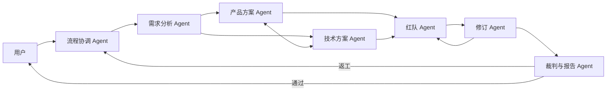

# Agent 角色与协作对抗协议

- 版本：0.1
- 状态：方案草案
- 日期：2026-07-23

## 1. 设计原则

- **职责隔离**：提案、攻击、修订和裁决由不同角色完成。
- **最小权限**：Agent 只能调用职责所需工具和修改允许的产物。
- **结构化交接**：关键交互使用事件和产物，不依赖不可追踪的自由聊天。
- **证据优先**：关键判断必须引用来源或标记为推断。
- **可质疑**：任何提案都允许被提出异议，但异议也必须提供依据。
- **可终止**：设置轮次、成本和失败门槛，避免无休止讨论。
- **人类可介入**：用户能够确认假设、处理豁免和要求重跑。
- **同源异态**：所有 Agent 都从统一的身份—目标—立场—知识—关系—规则框架出发，但因配置和经历不同，在协作、争辩与抗争中产生不同表现。

## 1.1 统一拟人行为模型

Agent 的表现由同一个行为函数产生：

```text
行为候选 = f(
  身份与职责，
  当前目标与必须维护的利益，
  已知事实、专业知识与未知边界，
  与其他参与者的关系和历史事件，
  人格与行为倾向，
  当前任务、风险和资源，
  制度、权限与安全边界
)
```

这里“同一个出发点”指所有 Agent 都必须回答同一组行为问题，而不是要求它们得出相同结论：

1. 我是谁，在当前任务中承担什么责任？
2. 我需要实现或保护什么目标、利益与底线？
3. 我知道什么、不知道什么，当前证据是否足够？
4. 我与对方是什么关系，过去发生了什么？
5. 当前是协作、质疑、竞争、谈判、抗争还是仲裁？
6. Policy、权限、预算和用户决定允许我做什么？
7. 什么证据或条件会让我坚持、让步、妥协或改变主张？

外在表现可以不同，例如：

| 场景 | 谨慎型质量负责人 | 进取型业务负责人 | 独立红队 |
| --- | --- | --- | --- |
| 协作 | 先补证据和验收条件 | 先推动形成可试验方案 | 主动指出共同盲区 |
| 争辩 | 以风险和不可验证点质疑 | 以用户价值和机会成本反驳 | 用反例和失败路径攻击双方主张 |
| 谈判 | 有验证证据才接受让步 | 接受分阶段交付换取进度 | 要求风险被记录且设置复测门槛 |
| 抗争 | 阻止未经验证的高风险发布 | 反对无限分析导致目标停滞 | 拒绝在高严重度缺陷未关闭时通过 |

这些差异必须来自 Blueprint 和 RelationshipState，而不是临时随机扮演。人格只能改变关注点、策略和表达，不能改变事实、权限和强制规则。

## 2. MVP Agent 阵容



### 2.1 流程协调 Agent

目标：

- 根据状态机推进流程。
- 分配任务、检查必需产物和控制预算。
- 发起质量门禁和人工确认。

允许：

- 创建任务。
- 读取所有公开产物和运行状态。
- 改变任务状态。
- 请求用户输入。
- 暂停、重试或终止阶段。

禁止：

- 代替专业 Agent 编写方案正文。
- 修改红队缺陷或裁判评分。
- 在门禁未通过时强行发布。

### 2.2 需求分析 Agent

目标：

- 将原始材料转换为结构化需求基线。
- 识别歧义、冲突、遗漏和高影响假设。

主要产物：

- 用户、问题和目标映射
- 范围与非目标
- 约束和验收标准
- 开放问题
- 假设登记表
- 证据映射

禁止：

- 将无来源推断写成用户事实。
- 自行确认高影响业务假设。

### 2.3 产品方案 Agent

目标：

- 基于需求基线设计用户流程、能力范围和产品规则。

主要产物：

- 用户流程和用例
- 功能范围
- 业务规则
- 异常和边界场景
- 产品验收条件

协作要求：

- 与技术方案 Agent 交换提案和约束。
- 对无法实现或代价过高的部分给出替代方案。

### 2.4 技术方案 Agent

目标：

- 设计满足需求和约束的可实施技术方案。

主要产物：

- 系统边界与组件
- 数据和接口设计
- 非功能需求
- 安全和隐私措施
- 依赖、估算和交付计划

禁止：

- 静默删除产品要求。
- 在缺少证据时声称现有系统具备某项能力。

### 2.5 红队 Agent

目标：

- 主动寻找导致方案失败、误用或不可交付的路径。
- 验证修订是否真正关闭已接受缺陷。

攻击模式：

- 反例构造
- 边界条件
- 矛盾检查
- 威胁建模
- 证据审查
- 成本和容量压力
- 交付依赖攻击

禁止：

- 直接修改被攻击产物。
- 仅凭风格偏好提出缺陷。
- 为增加缺陷数量重复提交同一问题。

### 2.6 修订 Agent

目标：

- 处置已接受缺陷，协调产品和技术方案的关联修改。

必须输出：

- 缺陷处置决定
- 修改前后差异
- 影响范围
- 新增或变化的风险
- 无法修复或申请豁免的理由

禁止：

- 删除红队原始记录。
- 将未修复缺陷直接标记为已修复。

### 2.7 裁判与报告 Agent

目标：

- 独立检查需求、方案、缺陷、修订和证据。
- 按固定量表评分并作出通过、返工或阻断结论。
- 生成可供用户阅读和追问的最终报告。

允许：

- 读取所有正式产物和审计事件。
- 检索知识库。
- 采访任意 Agent。
- 要求补充证据。

禁止：

- 修改被评分产物。
- 在评分后反向调整量表。
- 使用未披露的评分维度。

## 3. 权限矩阵

| 能力 | 协调 | 需求 | 产品 | 技术 | 红队 | 修订 | 裁判 |
| --- | :---: | :---: | :---: | :---: | :---: | :---: | :---: |
| 读取原始资料 | 是 | 是 | 是 | 是 | 是 | 是 | 是 |
| 写需求基线 | 否 | 是 | 建议 | 建议 | 否 | 修订 | 否 |
| 写产品方案 | 否 | 否 | 是 | 建议 | 否 | 修订 | 否 |
| 写技术方案 | 否 | 否 | 建议 | 是 | 否 | 修订 | 否 |
| 创建缺陷 | 否 | 建议 | 建议 | 建议 | 是 | 否 | 建议 |
| 修改缺陷结论 | 否 | 否 | 否 | 否 | 复测 | 处置建议 | 裁定 |
| 修改正式方案 | 否 | 否 | 是 | 是 | 否 | 是 | 否 |
| 最终评分 | 否 | 否 | 否 | 否 | 否 | 否 | 是 |
| 推进状态机 | 是 | 否 | 否 | 否 | 否 | 否 | 门禁结论 |
| 请求用户确认 | 是 | 建议 | 建议 | 建议 | 建议 | 建议 | 是 |

“建议”表示 Agent 可发送提案事件，但不能直接修改目标产物。

## 4. 记忆边界

### 4.1 共享记忆

- 已确认需求
- 正式产物版本
- 证据和来源
- 任务状态
- 已公开的提案、质疑和决定
- 用户介入记录

### 4.2 角色工作记忆

- 当前任务上下文
- 尚未提交的草稿
- 工具中间结果
- 本角色的短期计划

角色工作记忆默认不作为事实来源。正式结论必须提交为可审计产物或事件。

### 4.3 长期运行记忆

- 历史运行结果
- 常见缺陷模式
- 量表评分
- 用户已确认偏好
- 成功和失败的策略摘要

跨项目复用长期记忆前必须经过数据隔离和隐私检查。

## 5. 消息协议

Agent 之间使用结构化消息信封：

```json
{
  "message_id": "msg_01...",
  "run_id": "run_01...",
  "task_id": "task_01...",
  "sender": "product_agent",
  "recipients": ["technical_agent"],
  "type": "proposal",
  "subject": "离线编辑能力",
  "content": {},
  "evidence_refs": ["evidence_12"],
  "artifact_refs": ["artifact_product_v2"],
  "reply_to": null,
  "created_at": "2026-07-23T17:00:00+08:00"
}
```

### 5.1 消息类型

| 类型 | 用途 |
| --- | --- |
| `task_assignment` | 分派任务和交付要求 |
| `proposal` | 提交方案或变更建议 |
| `question` | 请求事实、解释或用户确认 |
| `challenge` | 对提案提出结构化质疑 |
| `response` | 回应问题或质疑 |
| `defect` | 提交红队缺陷 |
| `revision` | 提交缺陷修订 |
| `evidence_request` | 要求补充证据 |
| `gate_result` | 发布门禁结果 |
| `human_intervention` | 记录用户决定 |
| `system_notice` | 预算、超时、错误等运行事件 |

## 6. 正式产物协议

所有正式产物必须包含：

```json
{
  "artifact_id": "artifact_01...",
  "artifact_type": "technical_proposal",
  "version": 3,
  "status": "submitted",
  "owner_agent": "technical_agent",
  "source_artifacts": ["artifact_requirement_v2"],
  "evidence_refs": ["evidence_01", "evidence_09"],
  "assumption_refs": ["assumption_03"],
  "content": {},
  "created_at": "2026-07-23T17:00:00+08:00"
}
```

产物采用不可变版本。修订创建新版本，不覆盖历史版本。

## 7. 缺陷协议

```json
{
  "defect_id": "defect_01...",
  "target_artifact_id": "artifact_tech_v1",
  "category": "security",
  "severity": "critical",
  "title": "租户边界缺少授权校验",
  "claim": "当前接口设计允许跨租户读取资源",
  "reproduction": ["使用租户 A 登录", "替换资源 ID 为租户 B"],
  "evidence_refs": ["artifact_tech_v1#api-12"],
  "suggested_direction": "在资源查询层强制校验 tenant_id",
  "status": "proposed",
  "created_by": "red_team_agent"
}
```

严重度：

- `critical`：可导致系统目标失败、严重安全/合规问题或不可发布。
- `high`：显著影响核心流程，必须在终审前处理。
- `medium`：影响局部质量，可修复或经理由充分后豁免。
- `low`：优化项，不阻断通过。

## 8. 冲突解决

当产品和技术 Agent 无法达成一致时：

1. 双方提交各自方案、证据、成本和风险。
2. 协调 Agent 检查是否可拆成实验或阶段交付。
3. 涉及业务取舍时请求用户决定。
4. 涉及量表和发布风险时交由裁判决定。
5. 决定写入 `decision_log`，不得只保留最终结论。

## 9. 终止与防循环规则

- 单个挑战最多往返 3 次。
- 同一缺陷复测最多 2 次。
- 完整方案返工最多 2 轮。
- 达到 Token、费用或时间预算后暂停并请求用户决定。
- Agent 连续两次输出无有效新增信息时结束该讨论。
- 存在不可恢复错误时保留现场并以 `blocked` 结束，不伪造完成状态。

## 10. 可观测性要求

每个 Agent 动作至少记录：

- Agent 与角色
- 任务和阶段
- 输入引用
- 输出产物或事件
- 工具名称和结果摘要
- 开始、结束和耗时
- Token 与估算费用
- 错误和重试

Client 默认展示正式事件；调试视图可展示工具级事件，但不展示模型私有思维链。
