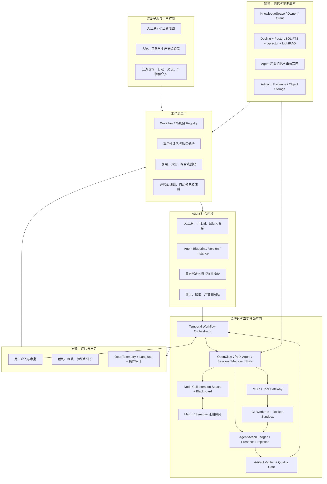
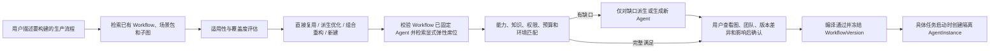
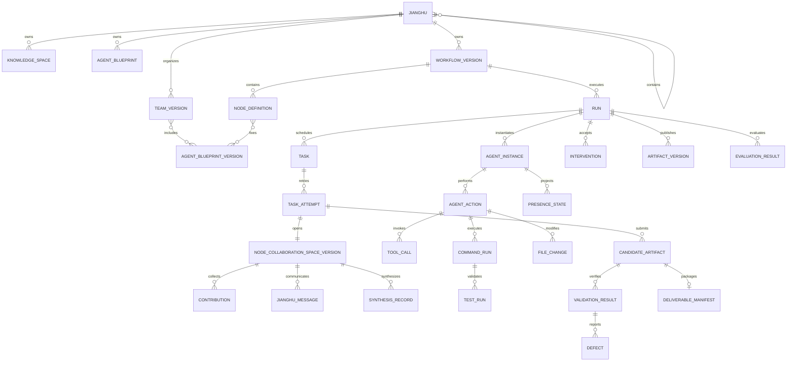

# 江湖 Online：Agent 社会体系、团队编排与工作流工厂逻辑设计

- 版本：0.3
- 日期：2026-08-06
- 状态：目标逻辑设计基线；技术架构以《系统详细设计说明书》第 4 章为准

## 1. 设计目标

江湖 Online 需要同时解决三个问题：

1. **如何建立一个有知识、角色、规则、关系和治理的 Agent 社会。**
2. **如何让用户建立包含多个小江湖的大江湖，让人物和团队可以跨任务复用、组合和演化。**
3. **如何根据不同目标复用、派生、组合或创建 Workflow，并让其中绑定的 Agent 团队真实完成交付。**

因此，平台不能只保存 Agent 提示词列表，不能把 Workflow 简化为固定串行 DAG，也不能把聊天结束当成工作完成。

## 2. Agent 社会的构成

| 社会概念 | 平台对象 |
| --- | --- |
| 公民 | Agent Blueprint / Agent Instance |
| 职业 | Role |
| 技能 | Capability |
| 工具 | Tool |
| 组织 | Team / Department |
| 制度 | Policy / Permission / Gate |
| 语言 | Message Schema |
| 合同 | Task Contract / Artifact Schema |
| 经济 | Token、费用、时间和工具预算 |
| 声誉 | Agent Evaluation / Reputation |
| 法庭 | Judge / Arbitration |
| 监督 | Red Team / Reviewer |
| 文化 | Method Library / Best Practice |
| 记忆 | Knowledge Space / Memory |
| 社会事件 | Domain Event |
| 工作环境 | Scenario / Run Environment |

## 3. 六层逻辑架构



读图说明：上图是目标架构，不是当前临时实现。Workflow 由平台 Registry、生成器和 Compiler 管理，由 Temporal 持久化执行；OpenClaw 负责每个拟人 Agent 的独立身份、上下文、记忆、Skill 和工具行动；同节点公共信息进入 Node Collaboration Space，并通过 Matrix 江湖房间让用户观察和介入；真实代码工作在隔离 Worktree 与容器中完成；Action Ledger 让用户看到人物读了什么、调用了什么工具、执行了什么命令、改了什么文件、测试结果和提交内容；Artifact Verifier 决定产物是否真正可交付。PostgreSQL 是正式状态真相源，LightRAG 等均为可重建检索投影。

### 3.1 场景构建与运行 Client

- 工作区
- 场景创建
- 知识连接
- Agent 社会设计
- 工作流编辑
- 实时运行
- 报告、评估和复盘

### 3.2 工作流工厂

- 需求与任务意图解释器
- Workflow/场景包 Registry 检索器
- 适用性评估与缺口分析器
- 复用、派生、组合和创建规划器
- 角色规划器
- 组织规划器
- 任务图生成器
- 协作协议生成器
- 对抗策略生成器
- 评估方案生成器
- WFDL Compiler 与定向自动修复器
- 版本差异、影响预览和冻结服务

### 3.3 Agent 社会内核

- Agent 蓝图
- Agent 实例
- 角色和能力
- 团队和组织
- 权限和政策
- 信任和声誉
- 协商、仲裁和升级规则

#### 3.3.1 Agent Registry 与团队选拔

Agent 社会内核必须同时提供 Workflow Registry 和 Agent Registry。用户创建生产流时，系统先判断已有 Workflow 是否适用，再决定直接复用、派生优化、组合重构或新建；只有新建或修改节点出现能力缺口时，才需要从 Agent Registry 补充人物。



读图说明：Workflow 是可复用、可派生和可组合的正式资产，不默认从零创建。WorkflowVersion 默认固定具体 `AgentBlueprintVersion`，因此用户选择一个已保存 Workflow 后不需要再次组队；只有该版本在构建时显式声明的 `dynamic_slot` 才允许运行时按规则选拔。无论固定或弹性，Run 都创建全新的隔离 AgentInstance，不带入旧项目的私有上下文。

推荐排序至少考虑：

- 能力契约覆盖程度；
- 领域和知识适配度；
- 工具与模型兼容性；
- 所需权限和安全风险；
- 同类场景中的质量、缺陷、返工、费用和时延；
- 与其他候选 Agent 的立场互补性和职责冲突；
- 当前可用性和本次 Run 的资源上限。

### 3.4 运行时与工具网关

- Temporal Workflow Orchestrator
- OpenClaw Adapter / Gateway / Agent Worker
- Node Team Controller / Team Planner
- Node Collaboration Service / Blackboard
- Matrix Room Bridge / Synapse
- Agent Action Ledger / Presence Projection
- Model Gateway
- MCP / Tool Gateway
- Artifact Registry / Artifact Verifier
- Human Intervention Service
- Git Worktree / Docker Sandbox Worker
- PostgreSQL Event / Outbox

#### 3.4.1 运行时组织调度

WorkflowVersion 负责冻结节点图、Artifact Contract、治理边界以及默认的具体 AgentBlueprintVersion。`fixed` 是默认绑定方式；`dynamic_slot` 只能由 Workflow 作者显式声明其能力、候选范围、人数、备用和扩缩条件。Run 创建时根据冻结定义产生 `TeamPlanVersion`，记录实际实例化和后续变化，但不得突破 WorkflowVersion 的权限、能力、预算与独立性边界。

动态调度必须满足：

- 默认从最小必要团队开始；
- 新增 Agent 必须说明能力、知识、立场、利益或工具差异；
- 只在能提高验收覆盖、Evidence、风险发现或缩短关键路径时扩容；
- 子 Agent 权限不得超过节点和父任务上限；
- 每次团队变化都产生新版本和正式事件；
- 离场不删除历史，已有成果必须明确采纳、拒绝或转交；
- Judge、审批者和被审对象之间的独立性由平台 Policy 强制保证。

#### 3.4.2 节点公共协作与相互独立

每个节点创建版本化 `NodeCollaborationSpaceVersion`，其中保存节点简报、获准上下文清单、输入产物、Blackboard、公开消息、Contribution、用户介入和 SynthesisRecord。每个 Agent 仍使用独立 OpenClaw Session、Workspace、短期记忆和 Prompt，先独立工作，再选择性公开 Proposal、Evidence、Challenge、Response 或 Handoff；不得把所有人的完整私有回答重新注入每个 Agent。

负责人合议时必须逐条说明贡献是采纳、部分采纳还是拒绝，以及依据的 Artifact、Evidence、Diff 或测试。Matrix 负责江湖房间和可观察交流，PostgreSQL 保存正式消息映射与协作状态；Matrix 房间不可用时不影响 Temporal 的正式 Workflow 状态。

#### 3.4.3 真实工程执行与可验证交付

代码、配置或可运行 Demo 节点必须在独立 Git Worktree 和 Docker Sandbox 中真实操作。OpenClaw 通过 MCP/Tool Gateway 调用文件、Shell、Git、浏览器和测试工具；Agent Action Ledger 持续记录命令、文件变化、Diff、构建、测试和公开提交。Agent 完成不等于节点完成，Artifact Verifier 必须在独立环境复验 OutputContract、关键命令、测试证据和 DeliverableManifest；不通过时生成 Defect，并由 Temporal 沿 `rework/loop_back` 返回责任节点创建新 Attempt。

### 3.5 知识、记忆与证据底座

- 文档接入
- 实体和关系
- 关键词、向量和图检索
- 事实、推断、假设和冲突
- 引用和证据链
- 短期、长期和跨运行记忆

### 3.6 治理、评估与学习

- 确定性检查
- 量表评估
- 红队测试
- 人工抽检
- 基线对比
- 成本和稳定性
- Agent 贡献度
- 工作流优化建议

## 4. 知识体系

### 4.1 知识分层

```text
平台知识
  - Agent 协作模式
  - 对抗模式
  - 工作流设计规则
  - 评估方法

组织知识
  - 制度
  - 组织架构
  - 权限
  - 流程
  - 历史经验

领域知识
  - 研发
  - 人力
  - 销售
  - 客户服务
  - 法务和安全

项目知识
  - 当前目标
  - 输入资料
  - 已确认事实
  - 项目决策

运行知识
  - 消息
  - 产物
  - 缺陷
  - 工具结果
  - 评分

Agent 私有记忆
  - 当前任务草稿
  - 角色策略
  - 尚未提交的观察

学习知识
  - 成功模式
  - 失败模式
  - 提示词效果
  - 工作流效果
```

### 4.2 知识隔离

每条知识至少携带：

- `workspace_id`
- `knowledge_space_id`
- `source_id`
- `classification`
- `allowed_roles`
- `valid_from`
- `valid_until`
- `confidence`
- `fact_type`
- `version`

Agent 只能读取任务需要且权限允许的知识。

### 4.3 知识写回

运行结果不能自动全部写入长期知识。

写回流程：

```text
候选经验
-> 去重和冲突检查
-> 证据检查
-> 人工或规则批准
-> 写入方法库或组织知识
```

## 5. Agent 蓝图

一个可复用 Agent 蓝图应包含：

```json
{
  "name": "顾清衡",
  "display_title": "安全与隐私审查师",
  "role": "security_reviewer",
  "identity_summary": "以独立审查者身份发现方案、代码和运行配置中的安全与隐私风险",
  "goal": "基于证据发现风险并推动可复验修复",
  "capabilities": ["threat_modeling", "evidence_review"],
  "model_policy": {},
  "system_prompt_version": "v3",
  "tools": ["knowledge_search", "code_scan"],
  "read_scopes": ["project", "security_policy"],
  "write_scopes": ["defect"],
  "input_schemas": ["technical_proposal"],
  "output_schemas": ["security_defect"],
  "budget_policy": {},
  "evaluation_suite": "security-review-v2"
}
```

Agent 蓝图不是运行中的 Agent。每次运行由蓝图创建隔离的 Agent Instance。

## 6. 社会组织

### 6.0 Agent 行为的共同出发点

江湖中的 Agent 可以有完全不同的职业、性格、立场和利益，因此在协作、争辩、竞争、抗争、谈判与妥协中会有不同表现。但它们使用同一套底层行为生成框架：

```text
身份与职责
+ 目标、利益与底线
+ 知识和证据边界
+ 人格行为倾向
+ 与参与者的关系状态
+ 当前情境与历史事件
+ 制度、权限和资源约束
-> 当前主张、策略、行动与公开理由摘要
```

统一框架保证行为可解释，不同参数与经历保证 Agent 不会千人一面。关系状态可以随正式事件变化，例如建立信任、合作受挫、利益冲突加剧或经裁决恢复合作；变化必须版本化，不能由聊天语气直接、隐式地改写。

### 6.1 组织关系

- `reports_to`：汇报关系
- `collaborates_with`：协作关系
- `reviews`：审查关系
- `challenges`：对抗关系
- `arbitrates`：仲裁关系
- `supplies`：产物供应关系
- `observes`：只读观察关系

### 6.2 社会制度

- 谁有权创建正式产物
- 谁有权提出缺陷
- 谁有权修改产物
- 谁有权批准风险豁免
- 谁可以调用高风险工具
- 冲突升级给谁
- 预算耗尽后如何处理
- 什么条件下停止或返工

### 6.3 信任和声誉

Agent 声誉不能由 Agent 自己声明。

声誉来源：

- 历史任务通过率
- 缺陷命中率
- 无效缺陷率
- 证据引用正确率
- 返工率
- 成本和时延
- 人工评价

声誉用于推荐和路由，不用于绕过权限。

声誉除单体质量外，还应包含团队贡献指标：有效并行贡献、关键路径缩短、与其他成员的互补度、停滞率、被替换率、无效重复率和汇总负担。单独评分最高的 Agent 不一定是当前团队的最优成员。

### 6.4 Agent 离场制度

Agent 社会必须具备与招聘对称的离场制度：

- 正常离场：任务完成或节点结束；
- 冗余离场：工作被覆盖或边际收益不足；
- 替换：能力不匹配、停滞、不可用或质量持续不达标；
- 强制终止：越权、违反 Policy、预算耗尽或分支取消。

离场由 Node Team Controller 提议，Policy Engine 校验；高风险审批者或独立 Judge 的替换可以要求用户确认。Agent 不得自行删除失败记录或把未被采纳的草稿写入正式产物。

## 7. 工作流工厂

### 7.1 输入

```json
{
  "goal": "完成一次客户投诉根因分析并提出处置方案",
  "scenario_type": "customer_complaint",
  "knowledge_spaces": [],
  "available_tools": [],
  "constraints": [],
  "risk_level": "high",
  "budget": {},
  "acceptance_criteria": []
}
```

### 7.2 生成步骤

```mermaid
flowchart LR
    A["理解生产流程目标"] --> B["检索 Workflow、场景包和子图"]
    B --> C["适用性、覆盖和缺口评估"]
    C --> D["复用、派生、组合或新建图"]
    D --> E["校验固定 Agent 并补充能力缺口"]
    E --> F["规划节点分工、协作、对抗和裁判"]
    F --> G["规划 Artifact、Loop、预算和介入"]
    G --> H["WFDL 静态编译和定向自动修复"]
    H --> I["用户查看图、Agent 和影响后确认"]
    I --> J["冻结可复用 WorkflowVersion"]
```



### 7.3 生成结果

- `WorkflowDefinition`
- `AgentTeamDefinition`
- `KnowledgeBinding`
- `ToolBinding`
- `PolicyBinding`
- `EvaluationPlan`
- `HumanCheckpointPlan`

所有结果都版本化，运行前必须通过静态校验。

## 8. 协作模式库

- 管道交接
- 并行专家
- 主从委派
- 黑板协作
- 辩论与综合
- 提案与评审
- 多方案竞赛
- 委员会投票
- 分层审批
- 人机共创

工作流工厂根据场景选择模式，而不是默认所有 Agent 自由群聊。

## 9. 对抗模式库

- 红队攻击
- 蓝队防守
- 事实核验
- 反例生成
- 边界条件测试
- 威胁建模
- 交叉审查
- 恶意输入模拟
- 偏见和合规检查
- 成本与容量压力测试
- 独立裁判

对抗必须绑定被测产物、攻击目标、严重度标准和通过条件。

## 10. 通用运行流程

```text
具体任务与输入材料
-> 选择已冻结 WorkflowVersion
-> 固定 Requirement / Acceptance / Output Contract 和知识快照
-> 根据固定绑定及显式弹性席位创建 TeamPlanVersion 与隔离 AgentInstance
-> Temporal 激活可运行节点
-> 节点创建公共协作空间，每个人物先在独立 OpenClaw Session 工作
-> 工具、命令、文件、测试和公开交流持续进入 Action Ledger
-> 人物选择性提交 Contribution，负责人形成有采纳理由的 SynthesisRecord
-> 提交 CandidateArtifact
-> 独立红队、裁判和 Artifact Verifier 执行真实验证
-> 通过则发布 ArtifactVersion；不通过则生成 Defect 并自动 Loop 返工
-> 用户可随时补充、纠偏、暂停、恢复、要求重做或终止
-> 达到最终验收后打包 DeliverableManifest 并发布结果
-> 经验只作为候选，经审核后写回组织知识或 Agent Memory
```

## 11. Client 产品结构

正式 Client 应包含：

1. **江湖空间**：创建大江湖和其下的小江湖，管理成员、组织、权限和资源。
2. **知识阁**：上传文件夹与多格式文件，查看来源、实体、关系、知识图谱和授权范围。
3. **人物志**：创建、编辑、复制、删除和版本化中文拟人 Agent，配置模型、Skill、工具、知识和 Memory Policy。
4. **组织谱**：用人物拼装多个可复用团队，编辑关系、职责、制度和治理。
5. **生产流工坊**：检索、创建、派生和编辑节点连线图，设置并行、Loop、节点团队、Artifact 和 Gate。
6. **任务发起台**：选择 WorkflowVersion 后输入具体任务、材料、知识与验收要求。
7. **江湖现场**：以地图和人物行动为主视角查看状态、公开交流、命令、Diff、测试、产物与返工，并中途介入。
8. **验武台**：查看裁判、红队、真实验证、基线、评分、成本和优化建议。
9. **公共市场**：发现、安装、派生和发布 Agent、团队、Workflow 与场景包。

## 12. 核心领域对象



读图说明：大江湖可以包含多个小江湖；知识、人物、团队和生产流都归属于明确江湖并可按授权复用。WorkflowVersion 的普通节点固定 AgentBlueprintVersion，Run 才创建隔离实例。每个 TaskAttempt 有自己的公共协作空间；人物的真实行动、命令、文件和测试可追踪；Candidate 必须经过验证才能发布正式 Artifact；用户介入和自动返工都保留历史。

## 13. 防止平台失控

- 自动生成的 Agent 和工作流先是草案。
- 高风险工具默认禁用。
- 权限由平台强制执行，不依赖提示词。
- 工作流必须有预算、超时和终止条件。
- 长期知识写回需要审批。
- 裁判结果必须包含证据和确定性检查。
- 跨工作区知识默认不可见。
- 任何 Agent 都不能同时拥有提案、修改和最终审批的全部权限。
