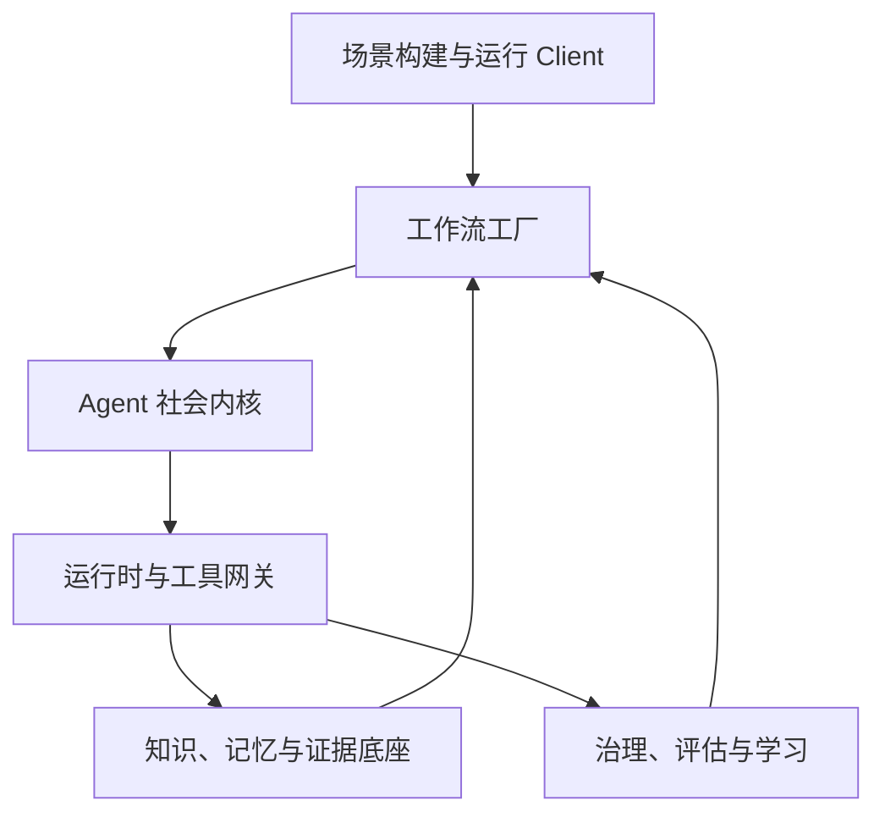
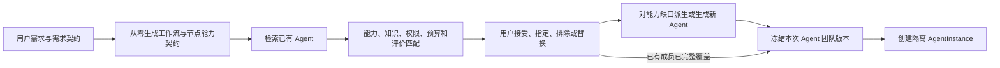
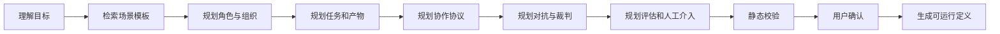
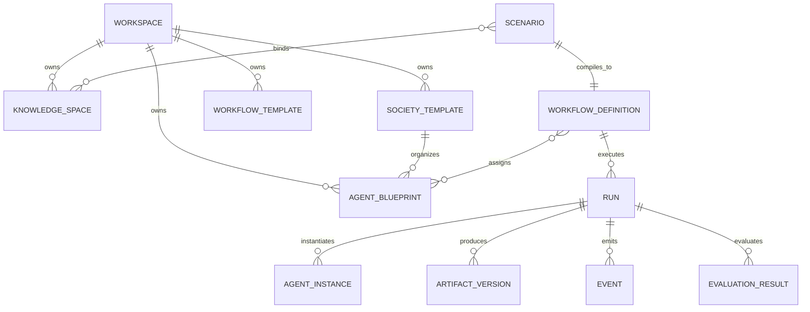

# Agent 社会体系、Agent 选拔与工作流工厂

- 版本：0.2
- 日期：2026-07-29
- 状态：概念架构

## 1. 设计目标

Agent Arena 需要同时解决两个问题：

1. **如何建立一个有知识、角色、规则、关系和治理的 Agent 社会。**
2. **如何根据不同业务目标，从这个社会中组建团队并生成工作流。**

因此，平台不能只保存 Agent 提示词列表，也不能只做固定 DAG。

## 2. Agent 社会的构成

| 社会概念 | 平台对象 |
| --- | --- |
| 公民 | Agent Blueprint / Agent Instance |
| 职业 | Role |
| 技能 | Capability |
| 工具 | Tool |
| 组织 | Team / Department |
| 制度 | Policy / Permission / Gate |
| 语言 | Message Schema |
| 合同 | Task Contract / Artifact Schema |
| 经济 | Token、费用、时间和工具预算 |
| 声誉 | Agent Evaluation / Reputation |
| 法庭 | Judge / Arbitration |
| 监督 | Red Team / Reviewer |
| 文化 | Method Library / Best Practice |
| 记忆 | Knowledge Space / Memory |
| 社会事件 | Domain Event |
| 工作环境 | Scenario / Run Environment |

## 3. 六层架构



### 3.1 场景构建与运行 Client

- 工作区
- 场景创建
- 知识连接
- Agent 社会设计
- 工作流编辑
- 实时运行
- 报告、评估和复盘

### 3.2 工作流工厂

- 场景解释器
- 角色规划器
- 组织规划器
- 任务图生成器
- 协作协议生成器
- 对抗策略生成器
- 评估方案生成器
- 人工确认编译器

### 3.3 Agent 社会内核

- Agent 蓝图
- Agent 实例
- 角色和能力
- 团队和组织
- 权限和政策
- 信任和声誉
- 协商、仲裁和升级规则

#### 3.3.1 Agent Registry 与团队选拔

Agent 社会内核必须提供 Agent Registry。用户提交新需求后，工作流工厂不是默认重新创造所有 Agent，而是先根据节点能力契约从社会中选拔合适成员：



读图说明：Workflow 仍然根据当前需求从零生成；系统随后按每个节点真正需要的能力，从已有 Agent 中选择成员。用户拥有最终选择权。只有没有合适成员的能力缺口才需要派生或新建 Agent。最终入选的是本次运行绑定的版本和实例，不会把旧项目的私有上下文带入新任务。

推荐排序至少考虑：

- 能力契约覆盖程度；
- 领域和知识适配度；
- 工具与模型兼容性；
- 所需权限和安全风险；
- 同类场景中的质量、缺陷、返工、费用和时延；
- 与其他候选 Agent 的立场互补性和职责冲突；
- 当前可用性和本次 Run 的资源上限。

### 3.4 运行时与工具网关

- Orchestrator
- Node Team Controller
- Team Planner
- Agent Worker
- Model Gateway
- Tool Gateway
- Message Bus
- Artifact Registry
- Event Store
- Sandbox

#### 3.4.1 运行时组织调度

Workflow 负责冻结节点能力契约和治理边界，不固定本次必须使用的具体 Agent。Run 创建及节点执行时，Team Planner 从 Agent Registry 检索候选、评分并形成 `TeamPlanVersion`；Node Team Controller 在节点范围内负责招聘、分工、并行、监督、扩缩、替换和解散。

动态调度必须满足：

- 默认从最小必要团队开始；
- 新增 Agent 必须说明能力、知识、立场、利益或工具差异；
- 只在能提高验收覆盖、Evidence、风险发现或缩短关键路径时扩容；
- 子 Agent 权限不得超过节点和父任务上限；
- 每次团队变化都产生新版本和正式事件；
- 离场不删除历史，已有成果必须明确采纳、拒绝或转交；
- Judge、审批者和被审对象之间的独立性由平台 Policy 强制保证。

### 3.5 知识、记忆与证据底座

- 文档接入
- 实体和关系
- 关键词、向量和图检索
- 事实、推断、假设和冲突
- 引用和证据链
- 短期、长期和跨运行记忆

### 3.6 治理、评估与学习

- 确定性检查
- 量表评估
- 红队测试
- 人工抽检
- 基线对比
- 成本和稳定性
- Agent 贡献度
- 工作流优化建议

## 4. 知识体系

### 4.1 知识分层

```text
平台知识
  - Agent 协作模式
  - 对抗模式
  - 工作流设计规则
  - 评估方法

组织知识
  - 制度
  - 组织架构
  - 权限
  - 流程
  - 历史经验

领域知识
  - 研发
  - 人力
  - 销售
  - 客户服务
  - 法务和安全

项目知识
  - 当前目标
  - 输入资料
  - 已确认事实
  - 项目决策

运行知识
  - 消息
  - 产物
  - 缺陷
  - 工具结果
  - 评分

Agent 私有记忆
  - 当前任务草稿
  - 角色策略
  - 尚未提交的观察

学习知识
  - 成功模式
  - 失败模式
  - 提示词效果
  - 工作流效果
```

### 4.2 知识隔离

每条知识至少携带：

- `workspace_id`
- `knowledge_space_id`
- `source_id`
- `classification`
- `allowed_roles`
- `valid_from`
- `valid_until`
- `confidence`
- `fact_type`
- `version`

Agent 只能读取任务需要且权限允许的知识。

### 4.3 知识写回

运行结果不能自动全部写入长期知识。

写回流程：

```text
候选经验
-> 去重和冲突检查
-> 证据检查
-> 人工或规则批准
-> 写入方法库或组织知识
```

## 5. Agent 蓝图

一个可复用 Agent 蓝图应包含：

```json
{
  "name": "Security Reviewer",
  "role": "security_reviewer",
  "goal": "发现方案中的安全与隐私风险",
  "capabilities": ["threat_modeling", "evidence_review"],
  "model_policy": {},
  "system_prompt_version": "v3",
  "tools": ["knowledge_search", "code_scan"],
  "read_scopes": ["project", "security_policy"],
  "write_scopes": ["defect"],
  "input_schemas": ["technical_proposal"],
  "output_schemas": ["security_defect"],
  "budget_policy": {},
  "evaluation_suite": "security-review-v2"
}
```

Agent 蓝图不是运行中的 Agent。每次运行由蓝图创建隔离的 Agent Instance。

## 6. 社会组织

### 6.0 Agent 行为的共同出发点

江湖中的 Agent 可以有完全不同的职业、性格、立场和利益，因此在协作、争辩、竞争、抗争、谈判与妥协中会有不同表现。但它们使用同一套底层行为生成框架：

```text
身份与职责
+ 目标、利益与底线
+ 知识和证据边界
+ 人格行为倾向
+ 与参与者的关系状态
+ 当前情境与历史事件
+ 制度、权限和资源约束
-> 当前主张、策略、行动与公开理由摘要
```

统一框架保证行为可解释，不同参数与经历保证 Agent 不会千人一面。关系状态可以随正式事件变化，例如建立信任、合作受挫、利益冲突加剧或经裁决恢复合作；变化必须版本化，不能由聊天语气直接、隐式地改写。

### 6.1 组织关系

- `reports_to`：汇报关系
- `collaborates_with`：协作关系
- `reviews`：审查关系
- `challenges`：对抗关系
- `arbitrates`：仲裁关系
- `supplies`：产物供应关系
- `observes`：只读观察关系

### 6.2 社会制度

- 谁有权创建正式产物
- 谁有权提出缺陷
- 谁有权修改产物
- 谁有权批准风险豁免
- 谁可以调用高风险工具
- 冲突升级给谁
- 预算耗尽后如何处理
- 什么条件下停止或返工

### 6.3 信任和声誉

Agent 声誉不能由 Agent 自己声明。

声誉来源：

- 历史任务通过率
- 缺陷命中率
- 无效缺陷率
- 证据引用正确率
- 返工率
- 成本和时延
- 人工评价

声誉用于推荐和路由，不用于绕过权限。

声誉除单体质量外，还应包含团队贡献指标：有效并行贡献、关键路径缩短、与其他成员的互补度、停滞率、被替换率、无效重复率和汇总负担。单独评分最高的 Agent 不一定是当前团队的最优成员。

### 6.4 Agent 离场制度

Agent 社会必须具备与招聘对称的离场制度：

- 正常离场：任务完成或节点结束；
- 冗余离场：工作被覆盖或边际收益不足；
- 替换：能力不匹配、停滞、不可用或质量持续不达标；
- 强制终止：越权、违反 Policy、预算耗尽或分支取消。

离场由 Node Team Controller 提议，Policy Engine 校验；高风险审批者或独立 Judge 的替换可以要求用户确认。Agent 不得自行删除失败记录或把未被采纳的草稿写入正式产物。

## 7. 工作流工厂

### 7.1 输入

```json
{
  "goal": "完成一次客户投诉根因分析并提出处置方案",
  "scenario_type": "customer_complaint",
  "knowledge_spaces": [],
  "available_tools": [],
  "constraints": [],
  "risk_level": "high",
  "budget": {},
  "acceptance_criteria": []
}
```

### 7.2 生成步骤



### 7.3 生成结果

- `WorkflowDefinition`
- `AgentTeamDefinition`
- `KnowledgeBinding`
- `ToolBinding`
- `PolicyBinding`
- `EvaluationPlan`
- `HumanCheckpointPlan`

所有结果都版本化，运行前必须通过静态校验。

## 8. 协作模式库

- 管道交接
- 并行专家
- 主从委派
- 黑板协作
- 辩论与综合
- 提案与评审
- 多方案竞赛
- 委员会投票
- 分层审批
- 人机共创

工作流工厂根据场景选择模式，而不是默认所有 Agent 自由群聊。

## 9. 对抗模式库

- 红队攻击
- 蓝队防守
- 事实核验
- 反例生成
- 边界条件测试
- 威胁建模
- 交叉审查
- 恶意输入模拟
- 偏见和合规检查
- 成本与容量压力测试
- 独立裁判

对抗必须绑定被测产物、攻击目标、严重度标准和通过条件。

## 10. 通用运行流程

```text
场景
-> 工作流定义
-> Agent 实例化
-> 知识和工具绑定
-> 执行任务
-> 提交正式产物
-> 对抗和验证
-> 修订或仲裁
-> 质量门禁
-> 人工确认
-> 发布结果
-> 经验候选写回
```

## 11. Client 产品结构

正式 Client 应包含：

1. **Workspace**：组织、成员、权限和资源。
2. **Knowledge Hub**：知识空间、来源、实体和证据。
3. **Agent Library**：Agent 蓝图、能力、模型和工具。
4. **Society Designer**：团队、关系、制度和治理。
5. **Scenario Builder**：目标、材料、约束和验收标准。
6. **Workflow Studio**：任务图、协议、对抗和人工节点。
7. **Live Arena**：运行、干预和实时观察。
8. **Evaluation Lab**：基线、评分、对比和优化。
9. **Template Library**：场景、社会和工作流模板。

## 12. 核心领域对象



## 13. 防止平台失控

- 自动生成的 Agent 和工作流先是草案。
- 高风险工具默认禁用。
- 权限由平台强制执行，不依赖提示词。
- 工作流必须有预算、超时和终止条件。
- 长期知识写回需要审批。
- 裁判结果必须包含证据和确定性检查。
- 跨工作区知识默认不可见。
- 任何 Agent 都不能同时拥有提案、修改和最终审批的全部权限。
