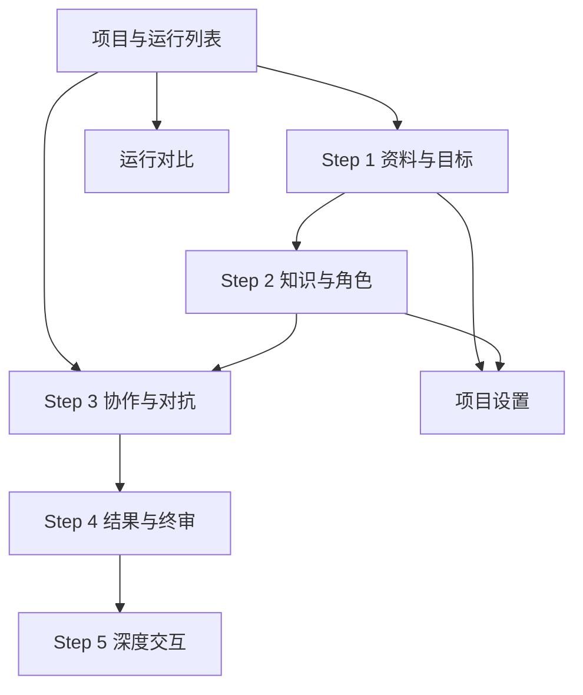

# Client 信息架构与交互设计

- 版本：0.1
- 状态：方案草案
- 日期：2026-07-23

## 1. 产品定位

Client 是多 Agent 生产流的操作台，不是宣传页。用户进入后应直接看到项目、运行状态或当前工作区，并能够：

- 配置一次多 Agent 运行。
- 观察协作和对抗过程。
- 在必要时介入。
- 检查产物、证据和评分。
- 采访 Agent 并复盘决策。

## 2. 设计原则

- **过程可见**：默认展示当前阶段、正在工作的 Agent 和最近事件。
- **结论可追溯**：报告、评分和 Agent 回答都能跳转到来源。
- **异常突出**：阻断缺陷、运行失败和等待人工处理不能被普通日志淹没。
- **高信息密度**：采用工作台式布局，避免营销式大标题和装饰性卡片。
- **稳定布局**：时间线、Agent 列表、工具栏和报告目录使用稳定尺寸。
- **逐层展开**：先展示正式事件和摘要，详细工具日志按需展开。
- **用户可控**：高风险行为、风险豁免和范围变化必须明确确认。

## 3. 全局信息架构



## 4. 应用外壳

### 4.1 顶栏

左侧：

- 产品名称
- 当前项目名称
- 返回项目列表

中间：

- `图谱`
- `双栏`
- `工作台`

使用分段控制切换观察方式，不改变当前运行和阶段。

右侧：

- 当前步骤，例如 `Step 3/5 协作与对抗`
- 运行状态和颜色标识
- Token/费用摘要
- 通知
- 项目菜单

### 4.2 状态颜色

| 含义 | 颜色方向 |
| --- | --- |
| 正常、通过、完成 | 绿色 |
| 运行中、信息 | 蓝色 |
| 等待用户、风险提示 | 琥珀色 |
| 红队攻击、失败、阻断 | 红色 |
| 未开始、已取消 | 中性灰 |

颜色必须配合文字或图标，不能作为唯一状态信号。

## 5. Step 1：资料与目标

### 5.1 页面目标

在启动 Agent 前形成完整、可解析的运行输入。

### 5.2 布局

左侧主区：

- 文件拖放与上传列表
- 直接输入需求
- 目标用户、业务结果、限制和交付物表单

右侧检查区：

- 解析状态
- 文件错误
- 已识别来源
- 输入完整度
- 预计成本范围

底部固定操作区：

- 保存草稿
- 继续到知识与角色

### 5.3 关键状态

- 尚未上传
- 解析中
- 部分解析失败
- 输入不完整
- 可以继续

解析失败的文件保留在列表中并显示原因，不静默忽略。

## 6. Step 2：知识与角色

### 6.1 图谱模式

主画布：

- 用户、问题、目标、需求、约束和系统实体
- 证据关系
- 冲突和未知关系

右侧详情：

- 实体属性
- 来源片段
- 置信度
- 事实/推断/假设标签
- 关联产物

工具栏：

- 搜索
- 类型筛选
- 关系筛选
- 缩放和适配画布
- 显示冲突

### 6.2 角色配置模式

角色以紧凑列表展示，不使用嵌套卡片：

- Agent 名称和角色
- 模型
- 工具权限
- Token/费用预算
- 是否启用
- 编辑按钮

右侧抽屉编辑：

- 目标
- 输入和产物 Schema
- 提示词版本
- 模型与参数
- 工具权限
- 记忆范围
- 超时和重试

### 6.3 启动前检查

- 必需角色是否启用
- 是否存在越权工具
- 预算是否设置
- 量表是否完整
- 输入是否满足最低要求

## 7. Step 3：协作与对抗

这是系统的核心运行页面。

### 7.1 双栏模式

```text
┌──────────────────────────────┬──────────────────────────┐
│ 协作/对抗时间线              │ Agent 与任务             │
│                              │                          │
│ 提案、质疑、缺陷、修订       │ 当前 Agent 状态          │
│ 门禁、人工介入、错误         │ 任务队列与依赖           │
│                              │ 工具调用与预算           │
├──────────────────────────────┴──────────────────────────┤
│ 运行控制 / 人工介入 / 输入回复                          │
└─────────────────────────────────────────────────────────┘
```

时间线筛选：

- 全部
- 协作
- 红队
- 修订
- 门禁
- 人工
- 错误

事件条目显示：

- 时间与阶段
- Agent
- 事件类型
- 摘要
- 关联产物/缺陷
- 展开详情

### 7.2 图谱模式

运行时图谱展示：

- Agent 节点
- 任务节点
- 产物节点
- 缺陷节点
- 证据节点
- 消息和依赖关系

可切换：

- 领域图谱
- 任务图谱
- Agent 协作图
- 证据图

### 7.3 工作台模式

左侧：

- 当前正式产物
- 版本差异
- 段落级证据引用

右侧：

- 相关 Agent
- 相关缺陷
- 讨论和质疑
- 请求修订或人工决定

### 7.4 运行控制

使用清晰的图标按钮和工具提示：

- 开始
- 暂停
- 继续
- 停止
- 注入事件
- 调整预算

停止是破坏性操作，需要确认并说明运行会进入 `cancelled`，不会标记为完成。

### 7.5 等待人工处理

运行进入 `awaiting_human` 时：

- 顶栏和页面显示琥珀色状态。
- 右侧固定显示待处理问题。
- 展示问题来源、影响和建议选项。
- 用户回答后创建 `human.input_received` 事件。

## 8. Step 4：结果与终审

### 8.1 报告布局

左侧固定目录：

- 执行摘要
- 需求基线
- 产品方案
- 技术方案
- 红队发现
- 修订记录
- 裁判评分
- 风险与开放问题
- 证据附录

中间正文：

- 报告章节
- 来源引用
- 产物版本
- 缺陷和修订跳转

右侧检查栏：

- 总分与各维度评分
- 门禁结果
- 未关闭缺陷
- 关键风险
- 运行成本和耗时

### 8.2 版本与差异

- 对比红队前后方案。
- 对比多次返工。
- 选择任意两个产物版本。
- 高亮新增、删除和变更。
- 从变更跳转到对应缺陷或用户决定。

### 8.3 裁判解释

每个评分维度必须显示：

- 分数
- 量表规则
- 证据
- 扣分原因
- 改进建议

## 9. Step 5：深度交互

借鉴用户提供的 MiroFish 工作台截图，采用“左报告、右交互”布局。

### 9.1 左侧报告

- 当前章节标题和正文
- 目录折叠
- 引用、缺陷和 Agent 名称可点击
- 点击后同步更新右侧上下文

### 9.2 右侧交互工具

顶部模式：

- 与裁判/报告 Agent 对话
- 与单个 Agent 对话
- 多 Agent 问卷
- 回答对比

Agent 选择区：

- 角色图标
- Agent 名称
- 当前状态
- 职责摘要
- 多选框
- 全选和清空

问卷区：

- 问题输入
- 目标 Agent
- 是否要求引用证据
- 是否将结果保存为正式附录
- 发送

结果区：

- 按 Agent 分组
- 回答内容
- 引用证据
- 回答时使用的产物版本
- 差异对比

### 9.3 访谈约束

- 回答必须标明基于哪个运行时间点。
- Agent 不应把运行后新信息伪装成运行时已知信息。
- 用户可选择“以运行时记忆回答”或“结合当前资料回答”。
- 正式报告默认不因访谈自动变化。
- 用户可将访谈结果提交为新一轮输入。

## 10. 项目与历史

项目列表采用适合扫描的表格：

- 项目名称
- 最近运行
- 当前阶段
- 终审结果
- 总分
- 成本
- 更新时间
- 操作菜单

支持：

- 创建项目
- 继续运行
- 克隆配置
- 运行对比
- 导出
- 归档

## 11. 运行对比

对比页面支持选择 2 至 4 次运行：

- Agent 配置
- 模型配置
- 质量得分
- 缺陷发现和修复
- 成本和耗时
- 人工介入
- 最终产物差异

用于展示单 Agent、多 Agent 协作和多 Agent 攻防三组实验差异。

## 12. 路由草案

```text
/projects
/projects/new
/projects/:projectId/intake
/projects/:projectId/knowledge
/projects/:projectId/agents
/projects/:projectId/runs
/runs/:runId/live
/runs/:runId/report
/runs/:runId/interact
/runs/compare
/settings
```

图谱、双栏和工作台是同一阶段的视图模式，可使用查询参数保存：

```text
/runs/:runId/live?view=split
```

## 13. 核心组件

- `AppShell`
- `ProjectSwitcher`
- `StageIndicator`
- `RunStatus`
- `ViewModeSegment`
- `SourceUploader`
- `KnowledgeGraph`
- `AgentRoster`
- `AgentDetailDrawer`
- `RunTimeline`
- `TaskQueue`
- `ArtifactViewer`
- `ArtifactDiff`
- `DefectList`
- `GateScorePanel`
- `HumanInputPanel`
- `ReportReader`
- `InterviewWorkbench`
- `CostMeter`

## 14. 实时事件到 UI 的映射

| 事件 | UI 响应 |
| --- | --- |
| `run.state_changed` | 更新顶栏状态和阶段 |
| `task.assigned` | Agent 任务队列新增 |
| `task.started` | Agent 状态变为工作中 |
| `agent.message_sent` | 时间线新增协作事件 |
| `artifact.submitted` | 产物面板出现新版本 |
| `defect.proposed` | 红队计数和缺陷面板更新 |
| `revision.submitted` | 缺陷显示待复测 |
| `gate.completed` | 显示评分和门禁结果 |
| `human.input_requested` | 打开人工处理面板 |
| `budget.threshold_reached` | 显示预算警告 |
| `task.failed` | 时间线和通知显示错误 |

## 15. 响应式策略

桌面端是主要工作环境。

- 宽屏：双栏或三栏工作台。
- 普通桌面：详情改为抽屉。
- 平板：主内容和侧栏使用标签切换。
- 手机：以状态查看、人工回复和访谈为主，不承载复杂图谱编辑。

固定格式元素应使用明确的网格轨道、最小宽度和滚动区域，避免动态内容改变整体布局。

## 16. 无障碍与可用性

- 所有图标按钮提供工具提示和可访问名称。
- 键盘可以操作导航、筛选、Agent 选择和对话。
- 状态不只依赖颜色。
- 焦点顺序与视觉顺序一致。
- 表格、时间线和图谱提供文本替代视图。
- 长 Agent 名称和长缺陷标题截断时可查看完整内容。
- 运行中的动态更新使用适当的实时区域，不反复打断读屏。

## 17. 视觉方向

- 白色和浅中性色为主，保持专业工作台气质。
- 正文使用高可读无衬线字体；报告标题可适度使用衬线字体。
- 卡片圆角不超过 8px。
- 页面区域以分栏和分隔线组织，不堆叠浮动卡片。
- 绿色只用于通过和主动选择，红色用于攻击和阻断。
- 避免大面积单色、渐变装饰和营销式 Hero。
- Agent 使用角色图标和短标签，不依赖随机头像。

## 18. MVP 页面范围

第一版实现：

1. 项目列表
2. 资料与目标
3. Agent 配置
4. 双栏运行页
5. 报告与评分
6. 深度交互工作台

图谱高级编辑、复杂运行对比和移动端完整能力放到后续迭代。

## 19. 验收场景

- 用户能创建项目、上传资料并配置目标。
- 用户能检查 Agent 阵容并启动运行。
- Client 断线重连后事件顺序正确且不重复。
- 用户能看出哪个 Agent 正在做什么。
- 红队缺陷可以跳转到目标产物。
- 修订可以跳转到原缺陷和新版本。
- 用户能看懂裁判扣分依据。
- 用户能采访单个 Agent，并向多个 Agent 发送相同问卷。
- 报告中的关键结论可以追溯到证据。
- 运行失败、阻断和取消不会显示为成功。
