# 江湖 Online 系统详细设计说明书 v1.1

## 0. 文档信息

| 项目 | 内容 |
| --- | --- |
| 文档类型 | 系统详细设计说明书 |
| 版本 | 1.1 设计基线 |
| 日期 | 2026-07-29 |
| 状态 | 待评审 |
| 上游需求 | `system-requirements-v2.md` |
| 核心运行框架 | OpenClaw Gateway + OpenClaw Adapter |
| 正式状态源 | PostgreSQL |
| 部署基线 | Kubernetes + Helm；本地开发使用 k3d/kind |

### 0.1 方案选型总览

江湖 Online 采用“**开源基础设施 + 江湖领域控制面 + 可替换 Adapter**”的方案，不从零开发所有基础能力，也不把任何一个开源 Agent 框架直接当成完整平台。

#### 0.1.1 已确定的总体组合

| 系统能力 | 最终采用方案 | 在江湖 Online 中负责什么 |
| --- | --- | --- |
| 平台业务与领域控制 | 江湖 Online 自有领域服务 | Workflow/Agent 资产、需求契约、正式产物、证据、缺陷、裁判、预算、权限、市场和审计 |
| 正式数据库 | PostgreSQL | 唯一正式状态源；保存所有版本、运行、产物、证据和操作记录 |
| 多 Agent 运行 | OpenClaw Gateway + OpenClaw Adapter | 创建独立 Agent/Session，运行模型、工具、子 Agent、工作区和沙箱 |
| Workflow 持久化执行 | Temporal | Workflow History、Activity、Retry、Timer、Signal、Update、取消、恢复和长任务等待 |
| 江湖协作房间 | Matrix + Synapse + OpenClaw Matrix Channel | Agent 独立身份、Room、Thread、讨论历史、用户旁观和介入 |
| 外部 Agent 互操作 | A2A Adapter | 连接跨 Runtime、跨 Gateway、跨组织和公共市场中的远程 Agent |
| 工具连接 | MCP + Tool Gateway | MCP 提供工具发现和调用；Tool Gateway 执行权限、审批、审计和幂等 |
| 文档解析 | Docling + 网页/Git 专用解析器 | 解析 PDF、Office、HTML、表格、图片、网页和代码资料 |
| 全文与向量检索 | PostgreSQL FTS + pgvector | 权限过滤后的全文、语义和混合检索 |
| 知识图谱检索 | LightRAG | 实体关系抽取、图谱投影、增量更新和图增强检索 |
| 跨服务可观测 | OpenTelemetry | 贯通 API、Workflow、OpenClaw、知识检索和工具调用 Trace |
| LLM 观测与评估 | Langfuse | 模型调用、Prompt 版本、费用、Judge 评估和用户反馈分析 |
| 系统部署 | Kubernetes + Helm | 统一部署 API、Temporal Worker、OpenClaw、Matrix、知识服务和可观测组件；本地使用 k3d/kind |

#### 0.1.2 各方案之间如何组合

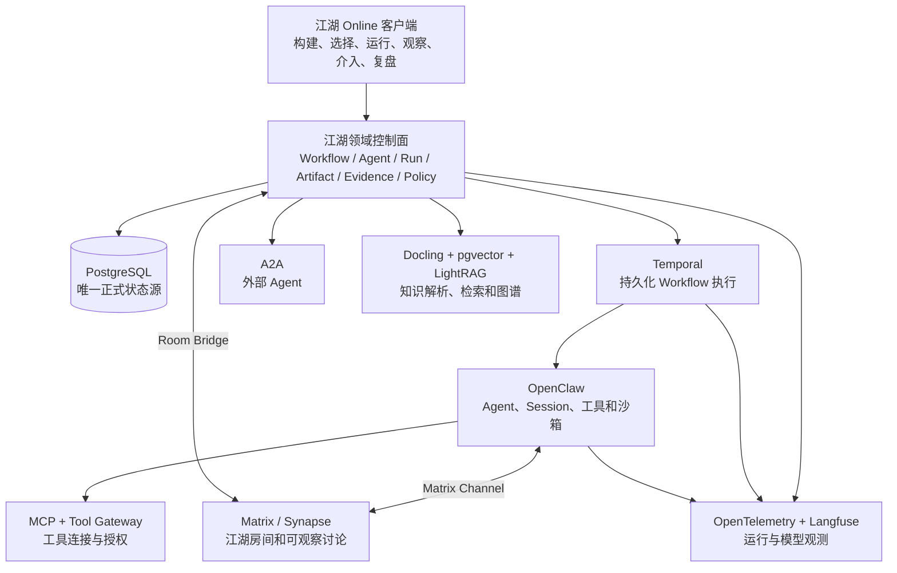

读图说明：用户操作江湖 Online；江湖领域控制面决定 Workflow 如何执行、使用哪些 Agent、产物是否合格以及流程是否推进。Temporal 负责运行不因进程退出而丢失；OpenClaw 负责让 Agent 真正调用模型和工具；Matrix 让人和 Agent 在房间中讨论和介入；A2A 连接外部 Agent；MCP 连接工具；Docling、pgvector 和 LightRAG 管理知识；所有正式结果最终以 PostgreSQL 中的领域记录为准。

#### 0.1.3 平台能力域与技术承载

江湖 Online 的完整能力不能只描述为“多 Agent + Workflow”。系统必须同时覆盖组织协作、知识管理、生产流程和个人 Agent 运行四个能力域。
```

四个能力域的实现责任如下：

| 能力域 | 江湖 Online 自有能力 | 开源技术承载 |
| --- | --- | --- |
| 组织与江湖协作 | Human/Agent 统一成员模型、团队角色、生命周期、关系、可见范围和操作审计 | Matrix/Synapse 承载房间；OpenClaw 承载 Agent Session；MCP 连接工具；Docker/Kubernetes 提供隔离和部署 |
| 知识空间与数据主权 | KnowledgeSpace、Owner、Grant、KnowledgeBinding、Evidence、撤回和影响分析 | PostgreSQL 保存所有权与授权；Docling 解析；pgvector + LightRAG 检索和图谱投影 |
| 生产流程与项目交付 | WFDL、WorkflowVersion、Run、Task、Artifact Contract、质量门禁和正式产物 | Temporal 承担持久化执行、重试、Timer、Signal、暂停和恢复 |
| 个人 Agent 运行能力 | AgentBlueprintVersion、人格、能力、知识边界、权限、记忆策略和实例映射 | OpenClaw 承担 Agent、Session、子 Agent、后台任务和真实工具操作 |

这里的 Human、Manager、Worker 不是固定职业模板，而是一次 TeamPlan 中的参与者类型和职责关系：真人和 Agent 都可以成为成员；Manager 负责分解、委托和协调，Worker 负责执行；是否允许某个真人或 Agent 管理其他成员由 Workflow 和 Policy 明确授权。

个人知识不会因为 Agent 加入某个 Room 或 Task 就自动公开。Orchestrator 在每次 Task 启动前根据知识所有权、KnowledgeBinding、Agent 身份和任务授权生成最小 `ContextManifest`；授权撤回后，后续调用立即停止使用相关知识，并触发缓存、向量索引、LightRAG 图投影和未完成 Task 的影响检查。

#### 0.1.4 明确不采用的方式

- 不把 OpenClaw 的聊天或 Session 树直接当成 Workflow；
- 不从零自研 durable queue、崩溃恢复、文档解析、向量数据库、图谱抽取和 LLM Trace；
- 不把 Matrix Room 当任务队列或正式 Artifact 存储；
- 不把 MCP 当 Agent-to-Agent 通信协议，也不把 A2A 当工具协议；
- 不同时引入 OpenClaw、CrewAI、AutoGen、Agent Framework 作为多个核心 Runtime；
- AutoGen 已进入 maintenance mode，不作为新平台主框架；
- ChatDev、MetaGPT、CAMEL、CrewAI 用于借鉴角色组织、SOP、协作和争辩，不成为平台正式状态源；
- Dify、Flowise、Langflow 用于借鉴 Workflow 编辑器和发布体验，不复用其领域数据模型。
- DBOS、Prefect、Dagster 不作为 Workflow 执行引擎；
- RAGFlow、Microsoft GraphRAG、LlamaIndex、Haystack 不进入正式知识运行栈；
- E2B 不进入正式代码执行栈，统一使用 Docker + Git Worktree；
- LangGraph、Microsoft Agent Framework、AutoGen、CrewAI 不进入正式 Agent Runtime。

完整开源候选矩阵、许可证、选定方案和淘汰理由见《[江湖 Online 开源实现调研与技术选型](../01-research/open-source-implementation-selection-2026-07-29.md)》。第 20 章给出确定的实现技术栈。

#### 0.1.5 Workflow 与 Agent 的绑定结论

**Workflow 保存时必须同时保存已经选定的 Agent。用户使用该 Workflow 执行任务时，系统默认直接启用这些 Agent，不要求再次选择。** 只有某个节点在创建 Workflow 时被明确设置为“允许临时补充或替换 Agent”，系统才可以按照该节点保存的能力、权限和数量范围自动选人。系统不能擅自更换已经固定的核心 Agent 或扩大权限。

### 0.2 设计目标

本文将系统需求转换为可直接分解开发任务的系统详细设计。前半部分给出总体架构和领域边界，后半部分给出生成算法、数据对象、接口、状态机、事务、事件、错误处理和客户端交互，明确：

- 系统边界和组件职责；
- Workflow、Agent、知识和市场资产如何复用；
- OpenClaw 如何承担真实多 Agent 运行；
- 大小江湖如何生成、扩缩和执行；
- Artifact、Evidence、Defect 和 Decision 如何流转；
- 数据库、知识库和知识图谱如何组织；
- 权限、沙箱、预算、恢复和审计如何落地；
- MVP 的实现顺序和技术风险。

本文是当前统一设计基线。MVP 核心对象、接口和状态转换必须在本文中定义；实现阶段允许补充物理索引、非核心字段和内部函数，但不得改变本文的领域边界、正式状态源、版本规则和安全约束。设计仍有待验证的内容必须明确标为 POC 或开放项，不能以“后续详细设计”代替。

## 1. 设计驱动因素

### 1.1 核心业务驱动

1. 用户输入需求和知识后，平台能够自主形成可运行生产流程；
2. Workflow 和 Agent 优先复用、其次派生、无适用资产时新建；
3. Agent 具有身份、人格、立场、知识边界、关系和操作能力；
4. OpenClaw 作为 P0 多 Agent 运行框架；
5. 步骤 Artifact 是正式流转对象，消息不是正式结果；
6. 多 Agent 可以协作、争辩、攻击、修订和裁判；
7. 系统支持小江湖、局部扩容和大江湖；
8. 知识库支持文件、网页、知识图谱、反馈更新和版本治理；
9. 系统能够执行真实代码、浏览器、Shell、文件和授权外部操作；
10. 公共 Agent 市场和场景包市场在 P0 同期上线。

### 1.2 关键非功能驱动

- 正式状态一致性和历史不可覆盖；
- 真实执行可恢复、可取消、可审计；
- Agent、模型、工具和知识权限隔离；
- 预算、时延和并发可控；
- 外部框架状态不能取代平台领域状态；
- 运行过程可观察，但不展示私有思维链；
- 单机 MVP 可部署，后续能扩展多 Worker 和远程存储。

## 2. 总体设计原则

### 2.1 领域状态与 Agent 运行分离

江湖 Online 管理正式生产状态，OpenClaw 管理 Agent 的实际执行状态。

```text
江湖 Online 正式状态
  Requirement / Workflow / Task
  Artifact / Evidence / Defect / Decision
  Budget / Approval / Evaluation

OpenClaw 运行状态
  Agent / Session / Binding
  Sub-agent / Message / Tool Call
  Workspace / Skill / Sandbox
```

OpenClaw Session 完成只能表示 Agent 运行结束，不能直接表示平台 Task 或 Artifact 已正式完成。

### 2.2 资产复用优先

Workflow、Agent、知识、Prompt、Policy、Artifact Schema 和场景包都采用版本化资产模型：

```text
检索已有资产
-> 完全适用：复用
-> 部分适用：创建派生版本
-> 无适用项：新建
-> 重新绑定当前需求、知识、权限和预算
-> 校验并冻结
```

### 2.3 正式产物优先

- 消息用于讨论和协调；
- Blackboard 用于共享约束、问题和信号；
- CandidateArtifact 用于提交候选结果；
- ArtifactVersion 用于正式流转；
- Evidence 用于证明来源；
- Decision 用于形成正式结论。

### 2.4 权限由运行时强制

Prompt 中的“禁止操作”只是说明，不是安全边界。权限必须同时由平台 Policy、Tool Gateway、OpenClaw 工具策略和沙箱强制执行。

### 2.5 追加式版本与事件

需求、Workflow、Agent、知识、产物和裁决不原地覆盖。关键状态变化通过追加式事件记录，便于恢复、审计和对比。

## 3. 系统上下文

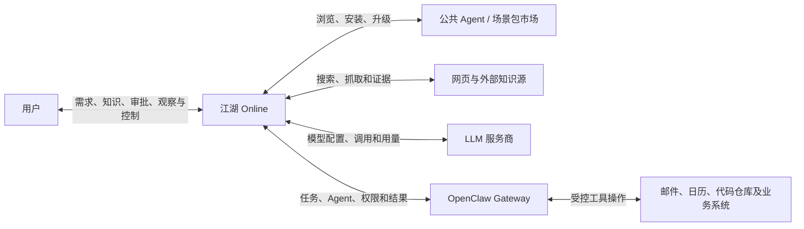

读图说明：用户只与江湖 Online 的产品界面交互。平台负责需求、流程、知识、资产、审批和正式结果。OpenClaw 是内部的 Agent 运行基础设施，通过平台下发的任务与权限连接模型和外部工具。

## 4. 总体逻辑架构

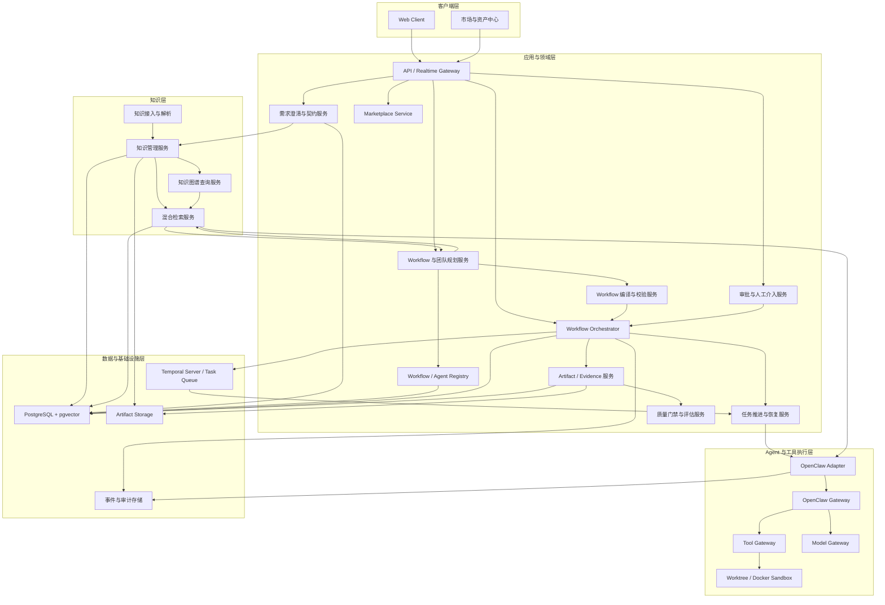

读图说明：领域层负责“做什么、谁来做、怎样验收”，执行层负责“Agent 如何实际运行和调用工具”。PostgreSQL 保存正式对象；Temporal 承担持久化调度、重试、Timer、Signal、取消和恢复；对象存储保存大文件；知识图谱和向量索引都可以从正式知识数据重建。

## 5. 核心组件职责

### 5.1 Web Client

- 项目和需求创建；
- Grill Me 问答；
- Workflow 图编辑；
- Agent 选择和团队调整；
- 大小江湖配置；
- 实时运行与人工介入；
- Artifact、Evidence、Defect 和 Decision 查看；
- 知识库和知识图谱管理；
- Agent/场景包市场；
- 对比实验与运行复盘。

### 5.2 API / Realtime Gateway

- 提供统一 REST API；
- 提供 SSE 实时事件；
- 校验请求和版本冲突；
- 执行用户身份和项目范围检查；
- 返回稳定错误码和 Trace ID；
- 不直接执行长任务。

### 5.3 需求澄清与契约服务

- 识别用户表达的是最终目标、过程委托、资产操作还是已有 Run 的后续指令；
- 将用户自然语言目标转换为 IntentDraft，但不要求用户预先选择 Workflow；
- 分析用户需求和知识缺口；
- 生成自适应 Grill Me 问题；
- 管理 RequirementContract；
- 生成 AcceptanceContract；
- 生成动态 OutputContract；
- 保存假设、开放问题和用户决定；
- 契约修改后执行影响分析。

### 5.4 Workflow 与团队规划服务

- 检索 Workflow Registry；
- 判断复用、派生或新建；
- 生成或调整节点、边和 Artifact Contract；
- 检索 Agent Registry 和公共市场资产；
- 规划 Agent 编队和关系；
- 推荐小江湖、大江湖或局部扩容；
- 生成选择理由、缺口和成本预测。

### 5.5 Workflow / Agent Registry

- 保存不可变 WorkflowVersion；
- 保存 AgentBlueprintVersion；
- 保存父子派生关系；
- 保存适用条件和兼容信息；
- 保存质量、费用、时延和失败评价；
- 支持私有、项目、用户和市场来源；
- 提供检索、比较和版本差异。

#### 5.5.1 Workflow 必须本地持久化

Workflow Registry 不是远程搜索代理，也不是只保存名称和摘要。所有被创建、安装、派生、冻结或实际运行过的 WorkflowVersion 都必须在江湖 Online 本地持久化。没有本地正式副本会导致：市场资产下架后无法运行、历史 Run 无法复现、父版本无法比较、离线环境不可用、外部内容变化破坏哈希和审计，因此 P0 不允许“只记录外部 URL、复用时再临时下载”。

本地存储分为三部分：

```text
PostgreSQL
  保存 Workflow、WorkflowVersion、Node、Edge、版本关系、适用条件、检索字段和哈希

对象存储
  保存完整规范化 Workflow Definition、附带说明、Schema 包和可选资源文件

检索索引
  保存 Workflow 的关键词、向量、能力、Artifact、行业、工具、评价和适用场景投影
```

PostgreSQL 是正式真相源。对象存储中的 Definition 必须由 PostgreSQL 中的固定 `definition_uri + content_hash` 引用；检索索引只是可重建投影，不能成为 Workflow 正式来源。

#### 5.5.2 Workflow 保存内容

保存一个可复用 Workflow 资产时，至少保存：

- 资产标识、名称、说明、所有者、可见范围和来源；
- 不可变 WorkflowVersion、父版本和组合来源版本；
- 完整节点、边、条件、有限循环、子图和入口出口；
- 每个节点的目标、输入、输出、Artifact Contract、Gate 和终止条件；
- 每个节点的 Agent 绑定模式；默认保存具体 AgentBlueprintVersion、职责与关系，弹性节点额外保存角色席位、能力契约、Registry 范围、规模、替换和退出 Policy；不保存某次 Run 的 AgentInstance；
- KnowledgeBinding 的知识需求和检索策略，但不复制项目私有知识正文；
- 工具、权限、Sandbox、模型兼容和环境要求；
- 默认预算、并发、轮次和超时建议；
- 适用条件、不适用条件、已知风险和生成/派生依据摘要；
- 历史评价的场景化统计、缺陷类型、费用和时延；
- Artifact Schema、Policy 和场景包依赖的固定版本引用；
- 内容哈希、签名、安全扫描和发布时间。

Workflow 不保存旧 Run 状态、旧 Task、旧 Agent 会话、模型私有思维链、用户 Secret 或其他项目私有上下文。

#### 5.5.3 复用时如何获取

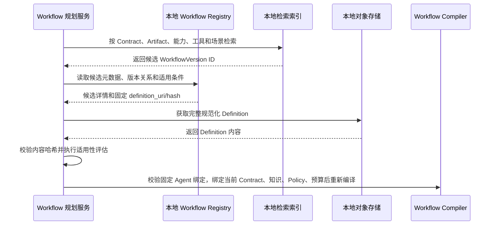

市场 Workflow 必须先安装到本地 Registry 才能进入正式 Run。允许匿名浏览远程市场元数据，但“选择使用”会固定安装 `PackageVersion`、复制 Definition 和依赖清单、验证签名与哈希，再创建本地资产映射。远程市场不可用不会影响已安装版本和历史 Run。

### 5.6 Workflow 编译与校验服务

- Schema 和节点类型检查；
- 入口、出口、连通性和可达性检查；
- 循环退出和轮次检查；
- Artifact 输入输出兼容检查；
- Agent 能力、知识和权限覆盖检查；
- Judge 独立性检查；
- 预算、并发、时间和工具容量检查；
- 返回结构化诊断；
- 为模型自动修复提供明确错误；
- 校验通过后冻结 WorkflowVersion。

### 5.7 Workflow Orchestrator

- 创建 Run；
- 根据依赖创建 Task；
- 推进状态机；
- 决定可运行节点；
- 调度确定性节点和 Agent 节点；
- 控制并发、预算、返工和取消；
- 处理人工审批和结构性介入；
- 决定 Candidate 是否进入 Gate；
- 维护平台正式运行状态。

### 5.8 任务推进与恢复服务

- 保存 Goal、Plan、Observation 和 Checkpoint；
- 管理 TaskAttempt；
- 检测重复调用、无产物变化和缺陷不收敛；
- 区分重试、返工、重跑和替换 Agent；
- 处理租约过期和 Worker/Gateway 故障；
- 处理 `budget_exhausted`、`generation_failed` 等终态；
- 防止无人推进的悬挂 Run。

### 5.9 Artifact / Evidence 服务

- 接收 CandidateArtifact；
- 执行内容摘要和 Schema 检查；
- 管理 ArtifactVersion；
- 管理 Claim 和 Evidence；
- 管理 Defect 和 Revision；
- 管理内容存储引用；
- 提供版本差异和全链路追溯。

### 5.10 质量门禁与评估服务

- 执行确定性规则；
- 检查 AcceptanceContract；
- 检查 Evidence 覆盖；
- 调用独立 Judge Agent；
- 保存评分、理由和 Decision；
- 执行单/多 Agent 和大小江湖对比；
- 生成 Run Report。

### 5.11 OpenClaw Adapter

- 将 AgentExecutionRequest 映射为 OpenClaw Agent/Session；
- 选择目标 Agent 和 Gateway；
- 下发身份、Prompt、Context、Skills、工具和沙箱；
- 订阅 OpenClaw 事件；
- 记录外部 Agent、Session、子 Agent 和工具标识；
- 将消息、工具结果和文件转换为平台事件和 Candidate；
- 执行取消、状态查询和未知结果恢复；
- 不直接修改平台正式状态。

### 5.12 OpenClaw Gateway

- 托管多个长期隔离 Agent；
- 管理 Agent Workspace、Session 和认证；
- 支持多 Agent 路由；
- 支持子 Agent 派生；
- 支持 Agent 间通信；
- 加载 Skills 和 MCP；
- 调用模型和工具；
- 执行 OpenClaw 侧工具权限与沙箱策略。

### 5.13 Tool Gateway

- 注册平台工具；
- 校验工具参数和权限；
- 统一封装浏览器、Shell、文件、Git 和外部 API；
- 生成 OperationIntent 和操作预览；
- 对高风险写操作请求审批；
- 保存工具结果、外部对象 ID 和补偿信息；
- 防止 Agent 通过另一个 Agent 绕过权限。

### 5.14 Marketplace Service

- 管理 Agent Package、Scenario Package 和 Plugin Package；
- 提供匿名浏览、搜索、筛选和比较；
- 提供详情、版本、评价、权限和兼容信息；
- 安装 Agent 到本地 Registry；
- 安装场景包到 Workflow/Scenario Registry；
- 进行 Schema、安全和敏感信息扫描；
- 管理下架、撤销、升级和操作日志。

## 6. 核心业务流程

### 6.1 两类主业务场景

江湖 Online 必须将“建设生产能力”和“使用生产能力”分成两个独立主场景。Workflow 和 Agent 是先被建设、确认和保存的可复用资产；具体业务任务是后续选择这些资产后发起的一次 Run。系统不得默认把 Workflow 生成完成直接等同于开始执行具体任务。

#### 6.1.1 场景一：构建或优化 Workflow 与多 Agent 资产

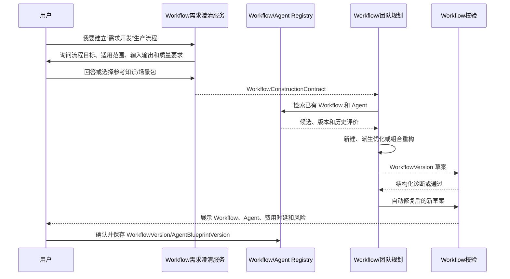

这一场景的终点是“资产已保存”，不是 Run 已执行。用户可以将资产保存为私有、项目、个人共享或公共市场候选版本。

#### 6.1.2 场景二：选择已有 Workflow 执行具体任务

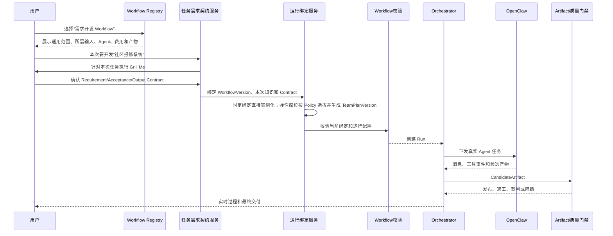

用户也可以先输入具体任务，再由系统推荐已有 Workflow；但在进入执行前，仍需明确选定一个 WorkflowVersion。若没有合适资产，系统提示转入场景一完成 Workflow 建设，保存后再返回本次任务执行。

### 6.2 Workflow 和 Agent 复用

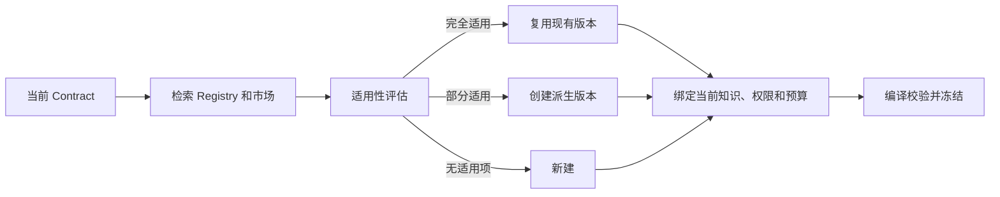

读图说明：复用的是定义资产，不复用旧 Run、旧 AgentInstance、旧私有上下文和旧权限。所有路径最终都需要绑定当前需求并重新校验。

### 6.3 Candidate 到正式 Artifact

```text
OpenClaw Agent / Deterministic Node
-> CandidateArtifact
-> 基础 Schema 校验
-> Artifact Contract 校验
-> Evidence 与权限校验
-> 规则 Gate
-> Reviewer / Red Team / Judge
-> ArtifactVersion 或 Rework / Block
```

### 6.4 红队、修订和裁判

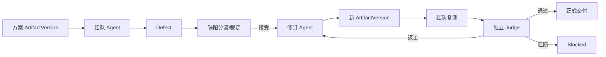

### 6.5 生成系统不是一次 Prompt

Agent 和 Workflow 生成采用“契约编译 + 资产检索 + 缺口规划 + 结构化生成 + 确定性校验 + 有限修复”的流水线，不允许用一个 Prompt 直接生成可运行配置。

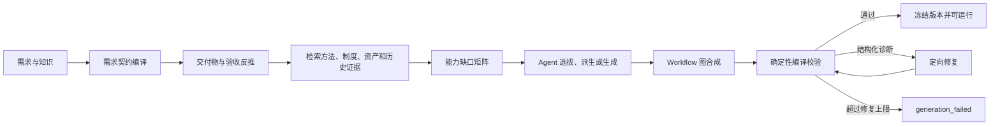

这里的“模型生成”只负责需要语义判断的候选设计；Schema、图连通性、数据类型、权限、预算、独立裁判和循环退出等约束由程序校验。平台保存生成依据摘要、候选比较和修改记录，不保存模型私有思维链。

### 6.6 生成任务输入与快照

每次构建或优化 Workflow 创建 `GenerationJob`。其输入是描述“这类流程应该如何工作”的 `WorkflowConstructionContract`，而不是某一次具体项目的 RequirementContract。固定以下输入版本，避免生成过程中知识或配置漂移：

```yaml
generation_job:
  id: gen_001
  mode: auto                 # auto | force_reuse | force_new | user_selected
  workflow_construction_contract_version_id: wcc_003
  input_contract_template_version_id: wfin_002
  output_contract_template_version_id: wfout_004
  knowledge_snapshot_id: ks_018
  scenario_package_refs: []  # 首次可以为空，不等于使用固定模板
  registry_snapshot_at: 2026-07-28T10:00:00+08:00
  policy_version_id: pol_007
  environment_profile_id: env_docker_01
  budget:
    max_parallel_agents: 5
    max_debate_rounds: 3
    node_timeout_seconds: 600
    run_timeout_seconds: 3600
    token_limit: 由模型配置给出
    cost_limit: 由模型配置给出
```

`GenerationJob` 状态为：

```text
created
-> contracting
-> retrieving_assets
-> planning_capabilities
-> composing_agents
-> composing_workflow
-> validating
-> repairing（可重复但有上限）
-> ready

任一步不可恢复错误 -> generation_failed
达到 Token/费用阈值 -> budget_exhausted
```

### 6.7 从需求生成能力缺口矩阵

生成器首先不创建 Agent，也不画节点，而是从 `OutputContract` 和 `AcceptanceContract` 反推完成交付所需的能力。处理步骤如下：

1. 将最终交付拆成一个或多个 `DeliverableSpec`；
2. 为每个交付物提取验收项、证据要求、风险级别和必须执行的验证；
3. 从知识库查询相关生产活动、法规、技术约束、历史缺陷和可用工具；
4. 将交付物生产、审查、验证、攻防和裁判转成 `CapabilityRequirement`；
5. 合并同义能力，保留互相冲突的立场和必须独立的职责；
6. 形成能力缺口矩阵，作为 Agent 和 Workflow 的共同输入。

```yaml
capability_requirement:
  id: cap_security_review
  purpose: 验证生成 Demo 的权限边界和高风险操作
  required_for:
    - artifact: runnable_demo
    - acceptance_item: AC-SEC-03
  proficiency: advanced
  knowledge_scopes: [project_security_policy, web_app_security]
  required_tools: [code_read, test_runner]
  forbidden_tools: [production_write]
  independence: reviewer_must_not_be_author
  evidence_required: true
  risk_level: high
```

能力矩阵同时标识：已有资产是否覆盖、覆盖度、缺口、冲突、是否必须多身份、是否可以由确定性程序完成。这样系统不会先随意创造一批角色，再尝试把他们塞进流程。

### 6.8 Agent 的选拔、派生与生成

#### 6.8.1 候选选拔顺序

对每个能力集合执行：

```text
Agent Registry 精确检索
-> 公共市场已安装 Agent 检索
-> 能力、知识、权限和历史表现粗排
-> 当前节点适配性重排
-> 团队互补性与同质化检查
-> 直接复用 / 派生 / 新建
```

建议的候选分数不是单一向量相似度：

```text
适配分 = 能力覆盖 + 知识覆盖 + 输入输出兼容 + 工具环境兼容
       + 场景历史表现 + 团队互补性
       - 权限冲突 - 成本超限 - 时延超限 - 同质化惩罚
```

硬约束不参与加权：缺少强制能力、违反权限、Judge 不独立、模型或工具不可用时，候选直接淘汰。

#### 6.8.2 何时派生，何时新建

- 已有 Agent 完全满足：直接绑定其不可变 BlueprintVersion；
- 能力主体满足，但需要调整当前领域知识、工具、立场或输出契约：创建派生版本；
- 没有任何候选达到最低能力覆盖：从零生成；
- 用户明确要求新身份：从零生成，但仍展示可替代资产和影响；
- Judge、审批者等独立身份不得从被评对象的运行上下文克隆。

#### 6.8.3 新 AgentBlueprint 的生成输入

Agent Generator 接收的是结构化缺口，不是整份无裁剪聊天：

```yaml
agent_generation_request:
  capability_requirements: [cap_architecture, cap_backend]
  node_purposes: [produce_architecture, implement_demo]
  project_domain_summary_ref: ctx_021
  allowed_knowledge_scopes: [project, software_delivery]
  allowed_tools: [repo_read, repo_write, shell_in_sandbox, browser_test]
  denied_permissions: [production_deploy, secret_read]
  relationship_needs:
    - can_collaborate_with: product_owner
    - must_be_challenged_by: red_team
  model_options: [model_policy_standard]
  output_schema: AgentBlueprintDraft/v1
```

生成结果必须是可校验蓝图：

```yaml
agent_blueprint_draft:
  display_name: 全栈交付工程师
  identity_summary: 负责把已确认需求实现为可运行且可测试的 Demo
  responsibilities: [技术拆分, 编码, 构建, 启动, 修复]
  goals: [满足验收契约, 提供可复现运行证据]
  capabilities:
    - id: cap_backend
      level: advanced
      source: generated_for_gap
  knowledge_bindings: [project_requirements, engineering_standards]
  stance_and_interests:
    primary_interest: 可运行性和可维护性
    risk_preference: conservative_on_external_writes
  behavioral_policy:
    collaboration: 先共享接口和依赖，再并行实现
    disagreement: 用测试、证据和契约挑战，不做人身化表达
    concession: 对方提供更强证据或验收结果时让步
  tools_and_permissions: [repo_write, sandbox_shell, test_runner]
  input_contracts: [module_spec]
  output_contracts: [source_code, build_result, test_result]
  prompt_fragments: [identity, duties, evidence_policy, tool_policy]
  model_policy_ref: model_policy_standard
  creation_rationale:
    uncovered_capabilities: [cap_backend]
    rejected_candidates: [agent_12]
```

#### 6.8.4 Agent Prompt 的组装

运行时 Prompt 不是 Blueprint 中的一段长文本，而由平台按固定层级装配：

```text
平台安全与事实标注规则（不可被资产覆盖）
-> 当前 Agent 身份、目标、职责、立场和行为策略
-> 当前节点目标与输入/输出 Artifact Contract
-> 当前关系、协作或争辩协议
-> 已授权知识 Context Manifest
-> 工具说明、权限、沙箱和审批规则
-> 预算、时间、停止条件和错误返回格式
```

Blueprint 可以提供身份和方法片段，但不能覆盖平台 Policy。每层独立版本化，最终保存 Prompt Manifest 和摘要后再下发 OpenClaw。

#### 6.8.5 拟人化不等于随机表演

不同 Agent 对同一问题都从“当前需求和证据”出发，差异来自职责、专业知识、利益目标、风险偏好、证据门槛和关系状态。协作、争辩或抗争必须服务于节点目标，并输出 Proposal、Challenge、Defect、Vote 或 Decision 等结构化结果；人格不得改变事实，不得绕过权限，也不得为了表现冲突而制造无价值对话。

### 6.9 Workflow 资产复用、派生优化、组合重构与新建

Workflow 的默认处理不是从零生成。系统应将历史保存的 Workflow、项目 Workflow、已安装场景包参考 Workflow 和公共市场候选统一纳入 Registry 检索，然后根据当前 Contract 决定直接复用、派生优化、组合重构或新建。

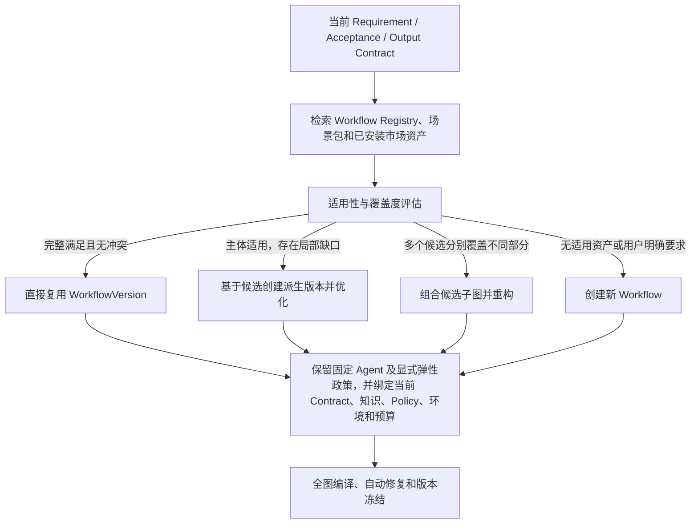

任何路径都不能跳过当前绑定校验。复用时保留 WorkflowVersion 已冻结的具体 AgentBlueprintVersion、关系和显式弹性政策，重新绑定本次需求、知识快照、运行权限、模型可用性、工具环境和预算。`fixed` 席位直接实例化，只有 `dynamic_slot` 才在创建 Run 或节点执行时选拔。历史 Workflow 不包含旧 Run、旧 AgentInstance、旧上下文或旧项目私有数据。

#### 6.9.1 Workflow 候选检索

检索输入至少包括：

- RequirementContract 的目标、范围、约束和业务领域；
- AcceptanceContract 的验收项、风险和必须验证内容；
- OutputContract 的交付物类型和 Artifact Schema；
- 当前环境可用的模型、工具、Sandbox 和外部系统；
- 当前知识空间、权限、预算、并发和时限；
- 用户指定、排除或偏好的 Workflow/场景包。

候选召回分为结构化过滤和语义召回。先按版本状态、可见范围、环境、工具、权限和强制 Artifact Contract 过滤，再按目标、能力、节点语义和历史适用场景召回。不能只根据名称或向量相似度推荐。

#### 6.9.2 Workflow 适用性评估

每个候选生成 `WorkflowFitAssessment`：

```yaml
workflow_fit_assessment:
  workflow_version_id: wf_product_delivery_v7
  hard_constraints:
    environment_compatible: true
    permission_compatible: true
    required_output_contracts: true
    forbidden_operation_conflict: false
  coverage:
    goals: 0.92
    acceptance_items: 0.86
    artifact_contracts: 0.90
    capabilities: 0.88
    knowledge_and_tools: 0.95
  gaps:
    - acceptance_item: AC-SEC-03
      missing: 独立安全红队及修复复测
  reusable_subgraphs:
    - requirement_to_architecture
    - implementation_and_e2e
  estimated_adaptation:
    changed_nodes: 3
    added_nodes: 2
    removed_nodes: 0
  recommendation: derive
  rationale_summary: 主生产链可复用，但需增加安全攻防和独立裁判
```

硬约束冲突的候选不可直接复用，但其中不受冲突影响的子图仍可作为组合候选。历史质量只能结合相似场景、模型版本、时间范围和样本量使用，不能以全局成功率决定适用性。

#### 6.9.3 四种处理策略

| 策略 | 适用条件 | 版本处理 |
| --- | --- | --- |
| 直接复用 | Contract 和环境完整覆盖，仅需绑定本次运行资源 | 引用原 WorkflowVersion，生成独立 Binding/Run 配置；若定义发生任何修改则转为派生 |
| 派生优化 | 主体结构适用，但节点、边、Artifact、Agent 策略或 Gate 存在局部缺口 | 创建新 WorkflowVersion，保存 `parent_version_id`、差异和优化原因 |
| 组合重构 | 多个 Workflow 或场景包分别覆盖不同生产阶段 | 创建新 WorkflowVersion，记录每个子图的来源、版本、映射和冲突解决结果 |
| 创建新 Workflow | 没有候选达到最低适用门槛，或用户明确要求从新方案开始 | 创建无父版本的新 WorkflowVersion，同时保存已评估候选和未采用原因 |

“优化”不是原地修改已保存 Workflow。系统可以优化节点合并、并行度、Agent 编队、Artifact 流、Gate、循环和成本策略，但必须产生派生版本，并确保历史 Run 继续引用原版本。

#### 6.9.4 派生与组合优化过程

派生优化只针对评估出的 Gap 和 Conflict 生成变更计划：

```text
候选 WorkflowVersion
-> 固定可复用子图
-> 将 Gap 映射到需要新增/修改/删除的节点和边
-> 检查受影响 Artifact Contract 与验收项
-> 调整 Agent 能力需求和执行策略
-> 生成派生 WorkflowDefinitionDraft
-> 展示父版本差异
-> 全图重新编译
```

组合多个 Workflow 时，必须处理：节点语义重复、Artifact Schema 不一致、入口出口不兼容、相同 Agent 职责冲突、权限扩大、循环嵌套和 Gate 重复。组合器先生成显式映射表，再合成图；禁止简单拼接两个流程定义。

#### 6.9.5 新建或补全节点时采用产物反向规划

只有创建新 Workflow，或派生/组合后仍有未覆盖部分时，Workflow Generator 才对缺口采用反向规划：从最终 OutputContract 或缺失的中间 Artifact Contract 开始，逐层寻找生产它所需的输入 Artifact、能力、验证和证据，直到所有输入都能由用户输入、知识来源、工具结果、复用子图或新建上游节点提供。

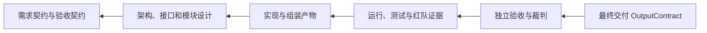

反向依赖确定后再转为正向可执行图。图中的节点数量、顺序、并行关系和 Agent 数量由本次需求与已复用子图共同决定，不从预制软件开发模板机械复制。场景包可以提供 Artifact Schema、能力规则、参考方法、评价 Policy 和参考 Workflow；使用参考 Workflow 时必须记录来源、适用性评估和派生或组合差异。

#### 6.9.6 节点创建和优化规则

每个节点必须回答以下问题才能进入草案：

1. 节点为什么存在，覆盖哪个验收项或下游依赖；
2. 输入来自哪个明确 ArtifactVersion 或运行输入；
3. 输出使用哪个 Artifact Contract；
4. 是确定性节点、单 Agent、多 Agent、人工节点还是 Gate；
5. 需要哪些能力、知识、工具和权限；
6. 完成、失败、超时、预算耗尽和返工条件是什么；
7. 谁能够审查，谁必须保持独立；
8. 是否可并行，合并时如何解决冲突；
9. 产生什么 Evidence、Defect 或 Decision。

#### 6.9.7 执行策略自动选择

```text
可由明确算法稳定完成 -> deterministic
语义任务且一个身份足够 -> single_agent
需要专业互补或并行探索 -> multi_agent_collaboration
高不确定且存在合理立场冲突 -> debate / adversarial
高风险缺陷发现 -> red_team
需要独立最终判断 -> independent_judge
需要用户授权或业务决定 -> human_gate
```

多 Agent 不是默认值。规划器必须给出相对单 Agent 的预期质量收益；收益不足或超过预算时退回单 Agent或确定性节点。

#### 6.9.8 WorkflowDefinitionDraft 示例

```yaml
workflow_definition_draft:
  creation_mode: derive
  parent_workflow_version_ids: [wf_product_delivery_v7]
  source_subgraphs:
    - source_version_id: wf_product_delivery_v7
      source_node_keys: [analyze_requirement, design_architecture, implement_demo]
  adaptation_summary: 增加安全红队和独立裁判，保留原实现与 E2E 子图
  construction_contract_ref: wcc_003
  input_contract_template_refs: [software_requirement/v1]
  output_contract_template_refs: [runnable_demo/v1, test_result/v1]
  entry_nodes: [analyze_requirement]
  nodes:
    - id: implement_demo
      type: agent_task
      purpose: 生成并运行满足已确认需求的 Demo
      covered_acceptance_items: [AC-FN-01, AC-E2E-01]
      inputs: [architecture_v1, module_specs_v1]
      outputs:
        - contract: runnable_demo/v1
        - contract: test_result/v1
      execution_policy:
        mode: multi_agent_collaboration
        required_capabilities: [cap_frontend, cap_backend, cap_test]
        max_agents: 3
        max_rounds: 2
      agent_bindings:
        - binding_key: frontend_engineer
          agent_blueprint_version_id: agent_frontend_v4
        - binding_key: backend_engineer
          agent_blueprint_version_id: agent_backend_v6
        - binding_key: test_engineer
          agent_blueprint_version_id: agent_test_v3
      tools: [repo_write, sandbox_shell, browser_test]
      permissions: [project_worktree_write]
      timeout_seconds: 600
      completion_condition: build_passed && e2e_passed
      on_failure: rework
    - id: final_judge
      type: judge
      inputs: [runnable_demo, test_result, red_team_defects]
      outputs: [judge_decision/v1]
      agent_bindings:
        - binding_key: independent_judge
          agent_blueprint_version_id: agent_delivery_judge_v2
      independence_policy: separate_identity_context_prompt
  edges:
    - from: implement_demo
      to: final_judge
      artifact_contract: runnable_demo/v1
```

### 6.10 Workflow 编译、自动修复与失败

生成草案后，编译器按固定顺序执行：

1. JSON/YAML Schema 和引用存在性；
2. 节点、边、入口出口、可达性和有向关系；
3. Artifact 生产者、消费者和 Schema 兼容；
4. 条件分支完备性、fan-in 规则、循环退出和最大轮次；
5. AcceptanceContract 与 OutputContract 覆盖率；
6. 能力与 Agent 覆盖、团队同质化和 Judge 独立性；
7. 知识范围、工具权限、审批和数据敏感等级；
8. 并发、Token、费用、节点超时和 Run 总时限；
9. OpenClaw、模型、Sandbox 和工具环境可执行性；
10. 所有终态是否能产生明确结果。

诊断使用机器可读格式：

```yaml
diagnostic:
  code: WF_ARTIFACT_MISSING_PRODUCER
  severity: error
  location: nodes.final_judge.inputs[0]
  message: runnable_demo 没有上游生产者
  related_contract: runnable_demo/v1
  allowed_repairs:
    - add_producer_node
    - change_input_binding
```

修复器只接收当前草案、诊断列表和允许修改边界，不重新自由生成整个 Workflow。每轮生成新的草案修订并保存 diff。默认最多 3 次自动修复；仍有 error 时进入 `generation_failed`，向用户展示图、错误位置、建议修改和已尝试方案。warning 可以按 Policy 阻断或由用户确认后继续。

### 6.11 Agent 与 Workflow 的联合收敛

Agent 和 Workflow 不是完全串行的一次生成，而是有边界的联合收敛：

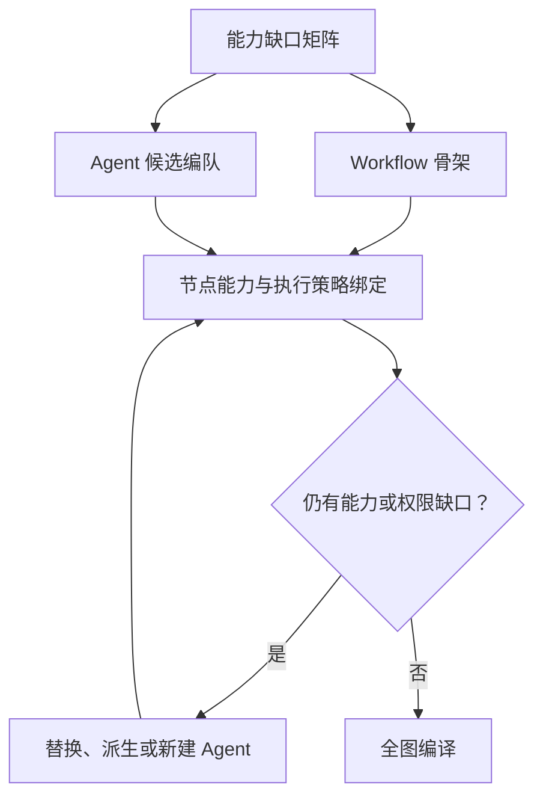

为防止无限往返，联合规划最多执行 3 轮，并要求每轮减少未覆盖能力或编译错误数；没有改善则提前停止并报告失败。Workflow 节点引用的是能力契约和 Agent BlueprintVersion，不直接引用一段临时 Persona 文本。

### 6.12 生成过程的 API 与客户端交互

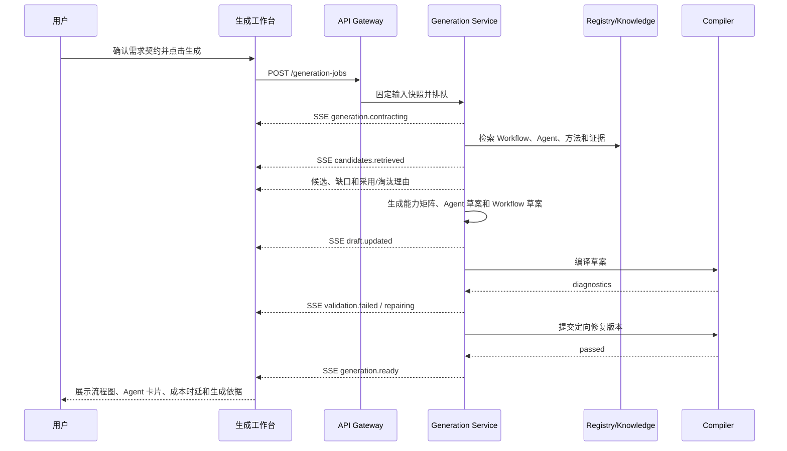

生成工作台必须同时展示：

- 当前阶段和已固定的 Contract/知识版本；
- 检索过的 Workflow/Agent 候选及未采用原因；
- 能力覆盖矩阵；
- 新建或派生 Agent 的字段、来源与理由；
- Workflow 节点、Artifact 流、并行和循环；
- 编译错误、自动修复次数和每次 diff；
- 预计质量、费用、时延、权限和风险；
- “替换 Agent”“排除候选”“调整节点策略”“要求从零生成”和“重新校验”操作。

主要接口为：

| 接口 | 用途 |
| --- | --- |
| `POST /generation-jobs` | 创建生成任务并固定输入快照 |
| `GET /generation-jobs/{id}` | 查询阶段、预算和终态 |
| `GET /generation-jobs/{id}/candidates` | 查询 Workflow/Agent 候选与评分依据 |
| `GET /generation-jobs/{id}/capability-matrix` | 查询能力覆盖和缺口 |
| `GET /generation-jobs/{id}/drafts` | 查询 Agent/Workflow 草案及修订 |
| `GET /generation-jobs/{id}/diagnostics` | 查询编译诊断和自动修复记录 |
| `POST /generation-jobs/{id}/commands` | 排除、替换、强制新建、调整策略或重试 |
| `POST /generation-jobs/{id}/freeze` | 校验通过后冻结 WorkflowVersion 和 AgentBlueprintVersion |

冻结之前都是 Draft；冻结后任何用户修改都创建新版本并重新执行静态校验。只有 `ready` 且冻结成功的版本可以创建 Run。

### 6.13 Workflow Definition Language（WFDL）

Workflow 使用平台自有、版本化的声明式 DSL，规范名为 `WFDL`。作者界面可以使用图形化编辑器或 YAML，但服务端最终统一规范化为 JSON。WFDL 描述业务执行语义，不保存 UI 坐标、OpenClaw Session 或某次运行状态。

WFDL 是江湖的**可复用资产协议**，不是持久化 Workflow 引擎。Compiler 将 WFDL 编译为平台 `CompiledWorkflow`，由 Temporal Workflow Interpreter 执行。Temporal 的 Workflow ID、Run ID、Activity、Task Queue 和 History 标识不得写入 WFDL 公共 Schema，只能保存在运行映射中。

```yaml
apiVersion: jianghu.io/workflow/v1alpha1
kind: WorkflowDefinition
metadata:
  workflowId: wf_delivery
  version: 3.2.0
spec:
  inputs:
    - name: requirement
      schemaRef: artifact://software_requirement/v1
  outputs:
    - name: runnable_demo
      schemaRef: artifact://runnable_demo/v1
  policies:
    maxRunSeconds: 3600
    maxParallelAgents: 5
    maxDebateRounds: 3
  nodes:
    clarify:
      type: agent_task
      inputs: [workflow.requirement]
      outputs: [requirement_contract]
      teamPolicyRef: team://clarify/v2
      completion: artifact.requirement_contract.schema_valid == true
    implement:
      type: subgraph
      graphRef: workflow://implementation/v4
  edges:
    - from: clarify.requirement_contract
      to: implement.requirement_contract
      type: artifact
  exits:
    completed: output.runnable_demo != null
    failed: run.has_unrecoverable_error == true
```

WFDL 分为：

- `metadata`：资产身份、版本、来源和兼容信息；
- `inputs/outputs`：Workflow 级 Artifact Contract；
- `nodes`：节点定义和节点级 Policy；
- `edges`：控制依赖与 Artifact 数据依赖；
- `policies`：预算、权限、并发、循环和恢复上限；
- `exits`：明确终态条件；
- `extensions`：经过命名空间注册的扩展字段，未知扩展不得静默执行。

### 6.14 图模型：定义层允许受控环，运行层按轮次展开

Workflow 不是严格 DAG，而是受约束的有向执行图。普通依赖构成 DAG；返工和辩论使用显式 `loop_back` 边，并必须定义最大轮次、退出条件、预算和超时。编译后每一轮实例化为无环的 `TaskGraphSlice`。

| 边类型 | 作用 |
| --- | --- |
| `control` | 上游达到指定状态后激活下游 |
| `artifact` | 传递固定 ArtifactVersion 或 Candidate 引用 |
| `conditional` | 保护条件为 true 时激活 |
| `failure` | 上游失败或超时时进入补偿/降级节点 |
| `rework` | Defect 或 Decision 触发返工 |
| `loop_back` | 进入下一轮，必须具有 `LoopPolicy` |
| `cancel` | 某分支成功后取消其余探索分支 |

```yaml
loopPolicy:
  loopId: red_team_revision
  maxIterations: 3
  continueWhen: defects.high_count > 0
  stopWhen: acceptance.passed == true
  onExhausted: blocked
  carryArtifacts: [latest_revision, unresolved_defects]
```

### 6.15 节点类型与执行器

| 节点类型 | 执行器 | 主要用途 |
| --- | --- | --- |
| `deterministic` | Python Worker | Schema 转换、合并、计算、规则校验 |
| `agent_task` | OpenClaw Adapter | 单 Agent 或固定团队语义任务 |
| `multi_agent` | Node Team Controller + OpenClaw | 协作、并行探索、争辩和对抗 |
| `judge` | 独立 OpenClaw Session | 独立裁判和质量判断 |
| `human_gate` | Approval Service | 用户决定、审批和高影响选择 |
| `tool_operation` | Tool Gateway | 浏览器、Shell、Git、外部 API 操作 |
| `merge` | Python Worker | fan-in、候选合并和冲突检测 |
| `subgraph` | Orchestrator | 引用固定 WorkflowVersion 子图 |
| `timer` | Scheduler | 截止时间、延迟、定时检查 |
| `webhook_wait` | API Gateway | 等待外部回调并验证签名 |

每个执行器实现统一 `NodeExecutorPort`：

```python
class NodeExecutorPort:
    async def prepare(self, task: TaskSnapshot) -> ExecutionPlan: ...
    async def start(self, plan: ExecutionPlan) -> ExecutionRef: ...
    async def poll(self, ref: ExecutionRef) -> ExecutionObservation: ...
    async def cancel(self, ref: ExecutionRef, reason: str) -> CancelResult: ...
    async def recover(self, ref: ExecutionRef) -> RecoveryResult: ...
```

### 6.16 条件表达式和数据访问

条件表达式采用受限 CEL 子集，编译成 AST 后保存，不允许 Python `eval`、模板执行或任意函数调用。表达式只能访问只读变量：

- `run`：状态、预算和时间；
- `task`：本节点和依赖状态；
- `artifact`：Schema 校验结果和声明式摘要字段；
- `defects`：按严重度和状态聚合；
- `acceptance`：验收项状态；
- `decision`：Judge 或人工 Decision；
- `usage`：Token、费用和时延。

大文本和任意 JSON 内容不得直接进入表达式环境；需要判断的字段必须先由确定性投影器生成类型化摘要，防止表达式成为隐式业务代码或注入入口。

### 6.17 编译产物

Compiler 通过后生成不可变 `CompiledWorkflow`：

```text
normalized_definition
+ resolved_schema_refs
+ resolved_workflow_refs
+ compiled_condition_asts
+ topological_regions
+ loop_regions
+ artifact_routing_table
+ executor_binding_table
+ permission_manifest
+ team_binding_manifest
+ budget_envelope
+ recovery_plan
+ content_hash
```

运行时只执行 `CompiledWorkflow`，不直接解释用户编辑中的 YAML。任何依赖版本、Schema、Agent、Policy 或子图变化都必须重新编译并产生新哈希。

### 6.18 Orchestrator 推进算法

以下算法描述领域推进语义。定时、持久化等待、Activity 重试、恢复、取消传播和 Task Queue 由 Temporal 承担；江湖 Orchestrator 负责判定节点是否满足输入、门禁和领域状态转换。

江湖正式状态持久化到业务 PostgreSQL；Temporal 将 Workflow History 持久化到其独立数据库/Schema。两者都不依赖 Worker 内存保存 Run 进度：

```text
读取 Run + CompiledWorkflow + 当前 Task/Artifact/Event
-> 获取 run lease
-> 归并迟到结果和外部状态
-> 计算已满足的控制边和 Artifact 边
-> 展开当前循环轮次/子图实例
-> 创建唯一 Task(run_id, node_key, iteration, shard)
-> 预算、权限、并发和取消预检
-> ready Task 写库 + Outbox
-> 事务提交
-> Temporal Task Queue 调度对应 Activity
```

Temporal Workflow 只保存确定性的编排状态，LLM、OpenClaw、知识检索和工具调用全部封装为 Activity。Activity 可以重试，因此所有外部副作用必须使用 `task_attempt_id` 幂等键；未知结果先查询 OpenClaw/工具状态，不得直接重复调用。领域 Task 的状态转换和 Outbox 写入仍由业务数据库事务保证，Temporal 通过 Signal/Update 与领域服务协调。

## 7. 大小江湖设计

### 7.1 规模不是固定人数

Agent Registry 是全部可用资产；江湖是某个 Run/节点实际参与的 Agent 网络。大小由任务、风险、认知多样性和预算决定。

### 7.2 小江湖生成策略

1. 先选择完成节点所需的最小能力集合；
2. 合并职责、知识和立场高度重复的候选；
3. 简单节点使用确定性程序或单 Agent；
4. 必要时增加 Reviewer、红队或 Judge；
5. 给出每个 Agent 的必要性说明。

### 7.3 大江湖生成策略

1. 以最小必要团队为基础；
2. 找出高风险、不确定和多利益相关方节点；
3. 增加不同专业、背景、立场、利益和风险偏好的 Agent；
4. 建立团队、阵营、层级、协作、竞争和对抗关系；
5. 设置讨论、争辩、投票或谈判协议；
6. 指定汇总者和收敛 Gate；
7. 限制人数、并发、轮次、消息量、Token、费用和时间。

### 7.4 局部扩容

WorkflowVersion 保存默认 `society_scale_policy`，NodeDefinition 可以覆盖：

```text
Run 默认 small
-> 需求分析节点 small
-> 高风险评审节点 large
-> 编码节点 small
-> 红队节点 custom/large
-> 最终 Judge 独立小团队
```

规模变化不要求派生新的 WorkflowVersion。WorkflowVersion 冻结的是允许变化的边界，Run 通过 `TeamPlanVersion` 记录每次实际编队。运行中扩缩容只影响当前节点及其子任务；已经提交的 Artifact、Evidence、事件和历史 AgentInstance 不得覆盖。

### 7.5 节点级弹性组队

江湖 Online 采用两级调度：

```text
Workflow Orchestrator
  - 推进正式节点、Artifact、Gate 和 Run 状态
  - 不直接决定每一个子 Agent 的执行细节
        ↓
Node Team Controller
  - 根据节点能力契约招聘、分工、并行、监督、替换和解散 Agent
  - 只能在 WorkflowVersion 声明的权限、预算、模型、工具和规模边界内行动
        ↓
Agent Worker
  - 执行一个有明确输入、输出和停止条件的 TaskAssignment
```

每个节点冻结 `team_policy`，至少包含：

- 必需能力、必需独立角色和职责隔离规则；
- 可从 Agent Registry 检索的范围和硬性过滤条件；
- 默认规模、最大人数、最大并发和最大派生层级；
- Token、费用、时间、消息量和工具容量；
- 扩容、缩容、替换、终止和请求人工介入的触发条件；
- 汇总者、收敛 Gate、正式 Artifact 责任人和 Judge 独立性；
- 动态 Agent 是否允许生成，以及是否允许在 Run 后申请保存为 Blueprint。

运行时形成不可变的 `TeamPlanVersion`：

```text
NodeDefinition.team_policy
+ 当前任务输入和 AcceptanceContract
+ Registry 候选、能力画像和实时可用性
+ 当前预算、风险、停滞和关键路径状态
-> Team Planner
-> TeamPlanVersion
-> AgentInstance + TaskAssignment
```

同一节点发生扩容、缩容或替换时创建新的 TeamPlanVersion，不改写旧版本。

### 7.6 自动扩缩容触发

默认从最小必要团队开始。满足以下信号时可以局部扩容：

- 可分解出多个相互独立且能缩短关键路径的子任务；
- Evidence 覆盖、验收项覆盖或结论置信度低于节点门槛；
- 出现高严重度缺陷、重大分歧或多利益相关方冲突；
- 需要不同专业、立场、方法或工具形成认知互补；
- 当前 Agent 停滞、不可用或能力缺口无法通过重规划解决；
- 用户明确要求增加视角、红队、复核或候选方案。

满足以下信号时应缩容或拒绝扩容：

- 新候选与现有成员在能力、知识、立场和工具上高度同质；
- 新增 Agent 不能减少关键路径，只增加汇总和沟通成本；
- 子任务已被其他 Agent 完成或探索分支价值已经消失；
- 剩余预算不足以完成最低交付和独立验收；
- 当前节点已经满足 AcceptanceContract。

### 7.7 有效并行与关键路径

平台不以 Agent 数量或工具调用次数作为并行价值。Task Planner 必须形成子任务依赖图，并记录：

- 可并行任务组；
- 关键路径及其预计剩余时间；
- 当前瓶颈 Agent/Task；
- 新增 Agent 对关键路径的预计缩短量；
- 新增执行、沟通、冲突和汇总成本。

只有预计收益覆盖额外成本时才建议扩容。大规模独立搜索、批量处理和分区验证适合水平扩展；强依赖的单篇方案写作、最终裁决和高风险审批默认保持少量、责任明确的参与者。

## 8. Agent 人格、关系与通信

### 8.1 AgentBlueprintVersion

建议包含：

- identity；
- responsibilities；
- goals；
- capabilities；
- domain_scope；
- knowledge_requirements；
- stance_and_interests；
- behavioral_traits；
- evidence_threshold；
- compromise_conditions；
- tools_and_permissions；
- model_policy；
- input_output_contract；
- supported_relationships；
- source_and_parent_version。

#### 8.1.1 Workflow 中的固定与弹性 Agent 绑定

WorkflowVersion 的 Agent 绑定分为两种模式：

- `fixed`：默认模式，冻结具体 AgentBlueprintVersion、职责和关系；Run 只创建 AgentInstance，不重新选拔；
- `dynamic_slot`：构建 Workflow 时显式声明的弹性席位，冻结能力、独立性、权限、Registry 范围和选拔/退出 Policy，运行时才选拔候选。

```yaml
node_team_policy:
  node_key: architecture_review
  binding_mode: fixed
  required_slots:
    - binding_key: architect
      agent_blueprint_version_id: agent_architect_v5
      capability_contract: [architecture_design, evidence_based_revision]
      duty: 主方案设计与修订
    - binding_key: security_challenger
      agent_blueprint_version_id: agent_security_v3
      capability_contract: [threat_modeling, security_review]
      duty: 独立安全挑战
      independence_required: true
  relationship_template_ref: rel_arch_security_v2
  registry_policy:              # 仅 dynamic_slot 或 fallback 使用
    scopes: [project, installed, public_approved]
    allow_dynamic_generation: true
  scale_policy:
    default: small
    max_agents: 6
    max_parallel: 4
  replacement_policy:
    allow_automatic: true
    max_replacements_per_slot: 2
```

`fixed` 模式只校验 Blueprint 当前可用性并实例化；主 Agent 不可用时，仅能使用 Workflow 中预先声明并校验的 fallback，否则节点进入 blocked。`dynamic_slot` 的实际选择必须生成候选评分、入选理由、未入选原因和能力覆盖矩阵。两种模式的备用切换或运行时替换都必须创建新 TeamPlanVersion、AgentInstance 和 TaskAttempt，并记录触发原因、权限撤销、上下文交接和产物采纳范围。修改固定 Blueprint 或弹性 Policy 本身必须派生 WorkflowVersion。

### 8.2 AgentInstance

每次 Run 从 Blueprint 创建独立实例，绑定：

- Run 和节点；
- OpenClaw Agent/Session；
- 本次执行上下文；
- 当前关系状态；
- 当前权限和预算；
- 临时记忆；
- 任务和公开状态。

### 8.2.1 Agent 生命周期、离场与替换

```text
candidate -> selected -> assigned -> working -> completed -> released
                                 |          |-> redundant -> released
                                 |          |-> stalled -> replaced
                                 |          |-> policy_violated -> terminated
                                 |          |-> budget_exhausted -> terminated
                                 |-> unavailable -> replaced/blocked
```

产品层区分：

- `released`：任务完成或分支结束后的正常离场；
- `terminated`：越权、预算耗尽、分支取消等强制终止；
- `replaced`：原 Agent 停滞、不可用或不匹配，由新实例接替；
- `redundant`：工作与其他成员重复，提前停止以控制成本。

“解雇 Agent”是上述终止或替换的产品化表达，不删除 AgentBlueprint、AgentInstance、事件、Attempt 或已产生的 Evidence。离场事件必须记录决定者、原因、消耗、已有成果、是否采纳、接替者和权限撤销结果。

### 8.3 关系状态

`RelationshipStateVersion` 保存：

- source_agent；
- target_agent；
- relationship_type；
- trust_level；
- cooperation_willingness；
- conflict_intensity；
- influence_weight；
- valid_scope；
- source_event；
- effective_time。

关系更新必须由正式事件触发，不能因为语言情绪自动写入长期关系。

### 8.4 消息协议

正式消息类型至少包括：

- task_assignment；
- proposal；
- question；
- challenge；
- response；
- evidence_share；
- handoff；
- negotiation_offer；
- concession；
- rejection；
- vote；
- escalation；
- completion_notice。

OpenClaw 原始消息由 Adapter 转换为平台消息信封，保存发送者、接收者、节点、类型、回复关系和可见范围。

### 8.5 Agent 通信协议选型

平台定义 `JianghuMessageEnvelope v1` JSON Schema，作为领域消息信封，而不是新的网络协议。P0 不自研传输、服务发现或远程 Agent 协议：同一 Gateway 内由 OpenClaw 原生消息/事件承载，跨 Runtime 或远程市场 Agent 由 A2A Adapter 承载，工具调用由 MCP + Tool Gateway 承载。OpenClaw Adapter 和 A2A Adapter 都要映射成相同领域信封，供审计、Blackboard 和客户端观察。

```text
平台 TaskAssignment / JianghuMessageEnvelope
-> OpenClaw Adapter
-> OpenClaw Agent/Session 原生消息通道
-> Agent 接收与响应
-> OpenClaw Event
-> Adapter 转换为 JianghuMessageEnvelope/Event
-> PostgreSQL Event + Blackboard/Artifact
```

Agent 通信不经过任务队列。公开讨论由 OpenClaw/Matrix 承载，正式消息映射、路由结果和必要审计摘要进入 PostgreSQL；Temporal Task Queue 只调度 Workflow Task 和 Activity Task；大内容进入 Artifact Storage。

### 8.6 JianghuMessageEnvelope 消息信封

```json
{
  "spec_version": "jianghu-message/1.0",
  "message_id": "msg_019...",
  "idempotency_key": "run_1:task_4:agent_a:proposal:2",
  "project_id": "prj_1",
  "run_id": "run_1",
  "node_key": "architecture_attack",
  "task_id": "task_4",
  "attempt_id": "attempt_2",
  "sender": {"type": "agent", "instance_id": "agent_a"},
  "recipients": [{"type": "agent", "instance_id": "agent_b"}],
  "message_type": "challenge",
  "conversation_id": "conv_9",
  "correlation_id": "msg_parent",
  "reply_to": "msg_parent",
  "sequence": 12,
  "visibility": "team",
  "content": {
    "summary": "当前权限模型没有覆盖跨项目数据隔离",
    "structured_payload": {"severity": "high", "target_claim_id": "claim_7"}
  },
  "artifact_refs": ["artifact://threat_model/v2"],
  "evidence_refs": ["evidence://policy/section-4"],
  "requires_response": true,
  "deadline_at": "2026-07-29T16:00:00+08:00",
  "created_at": "2026-07-29T15:56:00+08:00"
}
```

`content.summary` 是可观察的公开表达，不包含私有思维链。超过消息大小上限的方案、代码、日志和证据必须作为 Artifact/Evidence 引用，不得塞入对话消息。

### 8.7 路由模式

| 路由 | recipients | 使用场景 |
| --- | --- | --- |
| direct | 单个 AgentInstance | 提问、移交、定向挑战 |
| multicast | 明确 Agent 列表 | 专家组协作 |
| team | TeamPlanVersion | 节点团队公开消息 |
| role | binding_key | 发给当前承担某角色的实例 |
| coordinator | 协调者实例 | 汇报、请求分派和升级 |
| judge | 独立 Judge | 提交候选和裁决请求 |
| blackboard | BlackboardEntry | 跨 Agent 共享事实、计划或状态 |

Agent 不允许使用任意名称猜测接收者。Adapter 根据 Run、TeamPlanVersion、RelationshipState 和可见范围解析逻辑收件人，并拒绝越权跨项目、跨团队或绕过 Judge 独立性的消息。

### 8.8 交互协议

江湖领域交互规则在消息类型之上定义有限状态过程：

```text
任务委托：task_assignment -> accepted/rejected -> progress* -> completion_notice
问答：question -> response | escalation | timeout
挑战：challenge -> response -> concession/rejection -> defect/decision
提案：proposal -> review* -> revision? -> vote/decision
移交：handoff -> accepted -> context_received -> sender_released
裁判：judge_request -> evidence_request* -> judge_decision
```

每个协议定义允许消息、责任人、最大轮次、超时和结束产物。自由聊天可以作为 UI 表达，但必须映射到某个协议或标记 `informational`，不能单独推进正式 Task 状态。

### 8.9 顺序、重复与一致性

- 投递语义采用 at-least-once；消费者按 `message_id` 和 `idempotency_key` 去重；
- `sequence` 只保证同一 `conversation_id + sender` 内单调递增，不承诺全局顺序；
- 团队公共时间线使用平台 Event `sequence_no` 排序；
- 迟到消息保留，但若 Attempt 已关闭则标记 `late`，不得自动改变正式结果；
- `requires_response` 超时由 Node Team Controller 生成 timeout 事件并按 Policy 重试、替换或升级；
- 消息写入成功不代表对方接受任务，正式委托必须收到 `accepted`；
- Agent 消息不能直接修改 Artifact、Defect、Decision 或 Run 状态，只能提交 Candidate/Command，由领域服务校验。

### 8.10 Blackboard 与长期通信

Blackboard 用于共享结构化工作状态，不等同聊天记录：

```yaml
blackboard_entry:
  key: architecture.open_questions
  scope: node
  value_schema: open_question_list/v1
  value_ref: artifact://open_questions/v3
  writer_agent_instance_id: agent_architect_1
  expected_version: 2
  new_version: 3
  visibility: team
```

写入采用乐观并发控制，冲突时产生 `blackboard.conflict`，由 Merge 节点或协调者解决。Run 结束后 Blackboard 默认归档；只有通过知识反馈审核的内容才能进入长期知识空间。

### 8.11 通信安全和流控

- 每条消息继承发送者与节点权限，不因转发扩大权限；
- 敏感字段按 visibility 和数据分级过滤；
- Agent 不得把 Secret、完整工具凭据或未授权知识写入消息；
- 单节点限制消息数、消息字节、并发会话和对话轮次；
- 重复度、无新 Evidence、无 Artifact 变化或缺陷不收敛触发停滞检测；
- 广播默认禁止，必须使用明确 team 或角色范围；
- Judge 只接收裁判 Manifest 允许的 Artifact/Evidence，不读取被评 Agent 私有临时记忆。

### 8.12 Matrix 江湖房间

Matrix 作为人与 Agent 的可观察协作平面，通过自托管 Synapse 和 OpenClaw Matrix Channel 接入。它不替代 OpenClaw Session、Temporal Workflow、A2A、MCP 或 PostgreSQL 正式状态。

映射规则：Project/大江湖可映射为 Matrix Space；每个 Run/小江湖创建主 Room；多 Agent 争辩、红蓝对抗等节点可创建临时子 Room，普通 Task 使用主 Room Thread；AgentInstance 使用独立 Matrix 用户或 Application Service 虚拟用户；Artifact、Defect 和 Decision 只发布不可变引用卡片。

`MatrixRoomBridge` 负责：

- 创建和归档 Room、邀请和移除 AgentInstance；
- 将江湖公开消息投影为 Matrix Event；
- 将 Matrix 用户消息映射为 `JianghuMessageEnvelope`；
- 识别普通讨论、约束修改、审批和停止命令；
- 保存 `matrix_room_id`、`event_id`、`thread_root_event_id` 与平台 Event 的映射；
- 对编辑、撤回、迟到、重复和 Federation 事件执行 Policy；
- Room 不可用时降级到平台内置事件流，不阻断正式 Workflow。

生产 Room 默认关闭 Federation 和 E2EE，以支持权限检查、审计、检索与复盘；组织明确开启时必须展示数据边界影响。结构性用户命令不能只靠聊天文本直接执行，必须转换为平台命令，展示质量、费用、时延和权限影响并二次确认。

## 9. OpenClaw 集成设计

### 9.1 集成模式

```text
Workflow Orchestrator
-> AgentExecutionRequest
-> OpenClaw Adapter
-> OpenClaw Gateway
-> Agent / Sub-agent / Tool
-> OpenClaw Events
-> Adapter Event Mapper
-> CandidateArtifact / Platform Events
```

### 9.2 AgentExecutionRequest

建议包含：

- project_id、run_id、task_id、attempt_id、trace_id；
- agent_blueprint_version_id、agent_instance_id；
- target_openclaw_agent_id；
- task_contract；
- input_artifact_refs；
- output_schema；
- prompt_version_refs；
- context_manifest；
- knowledge_binding；
- tool_binding；
- model_policy；
- budget；
- timeout、retry、cancel；
- workspace、sandbox、network_policy；
- idempotency_key。

### 9.3 事件映射

| OpenClaw 事件/状态 | 平台事件 |
| --- | --- |
| Agent/Session 创建 | execution.accepted |
| Agent 开始 | execution.started |
| Agent 消息 | agent.message_published |
| 子 Agent 创建 | agent.child_spawned |
| 工具开始/完成 | tool.started / tool.completed |
| 文件或结果产生 | candidate.partial_produced |
| Agent 完成 | execution.result_available |
| Agent 失败 | execution.failed |
| Agent 取消 | execution.cancelled |
| 状态未知 | execution.unknown |

`execution.result_available` 仍需平台校验后才能产生 `candidate.submitted` 和正式 Artifact。

### 9.4 多 Agent 节点执行

多 Agent 节点由平台定义参与者、关系和协议，OpenClaw 负责运行：

- 并行专家：多个 Session 并行；
- 协调者模式：协调 Agent 分派并汇总；
- 直接讨论：参与 Agent 按名称通信；
- 父子委托：父 Agent 派生受限子 Agent；
- 红蓝对抗：不同 Agent 使用独立目标和上下文；
- Judge：独立 OpenClaw Agent/Session。

### 9.5 故障处理

| 故障 | 处理 |
| --- | --- |
| Gateway 不可用 | 阻止新 Agent Task，保留确定性操作和历史读取 |
| Session 启动失败 | Attempt 失败或安全重试 |
| 回传丢失 | 根据外部 ID 查询结果，不直接重跑 |
| 状态未知 | 标记 unknown，查询、人工核对或补偿 |
| 取消不及时 | 记录取消请求，隔离迟到结果 |
| 子 Agent 失控 | 达到深度/并发/预算即阻断或级联取消 |
| 工具越权 | OpenClaw 和 Tool Gateway 双重拒绝 |

## 10. 知识库总体设计

### 10.1 知识组织

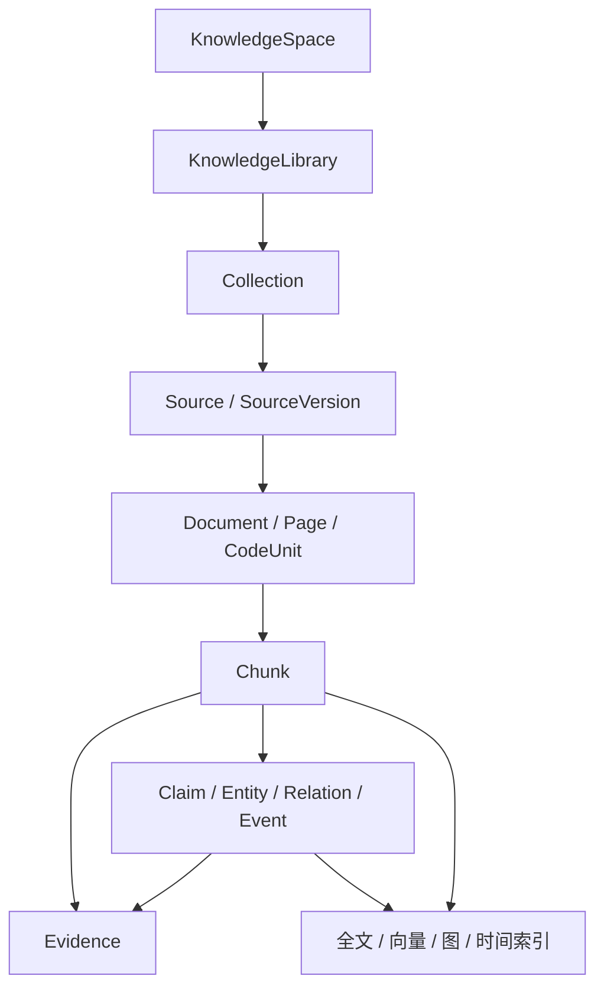

读图说明：管理上使用 Space、Library 和 Collection；语义上使用 Claim、Entity、Relation 和 Event；所有知识结论最终要能够回到 SourceVersion 和 Evidence。

### 10.2 知识空间

- 平台生产方法知识；
- 用户长期知识；
- 项目知识；
- 场景包知识；
- Agent 私有专业知识；
- Run 临时知识。

每次 Workflow 创建 KnowledgeBindingVersion，节点只能进一步收窄知识范围。

### 10.3 知识接入流水线

```text
Source Ingestion
-> Parser / OCR / Code Parser
-> Structure Extractor
-> Chunker
-> Ontology Generator / Selector
-> Entity / Relation / Claim Extractor
-> Entity Resolution
-> Evidence Binder
-> Full-text / Vector / Graph Index
-> Quality Check
-> Publish KnowledgeVersion
```

### 10.4 混合检索

`KnowledgeQueryPlanner` 根据任务选择：

- 精确查询；
- 关键词查询；
- 向量语义查询；
- 图邻域；
- 多跳图查询；
- 时间切片；
- 混合检索；
- 原始全文读取。

输出统一 `EvidenceBundle`，包含来源、片段、图路径、可信度、冲突、时间和裁剪说明。

### 10.5 知识图谱

PostgreSQL 保存 OntologyVersion、Entity、Relation、Claim 和 Evidence 元数据，LightRAG 负责实体关系抽取、图索引和图增强检索。LightRAG 图是可重建检索投影，正式事实、版本、权限和 Evidence 仍以 PostgreSQL 为准。本设计不引入 Neo4j、Nebula 或 Zep。

图谱主要服务：

- Workflow 生成；
- Agent 选拔；
- Persona 和关系生成；
- 节点上下文；
- 多跳影响分析；
- 红队和冲突查询；
- Judge 和报告；
- 最终生产溯源。

### 10.6 运行反馈写回

```text
Agent Observation / Run Memory
-> KnowledgeCandidate
-> 去重
-> 来源与证据检查
-> 实体消歧和冲突检测
-> 自动规则或人工审核
-> 新 KnowledgeVersion
-> 局部索引重建
-> 影响提示
```

运行消息和模型总结不能直接进入长期知识。

### 10.7 知识来源与连接器

P0 连接器采用拉取式快照，不要求实时双向同步：

| 来源 | 连接器 | 版本判定 |
| --- | --- | --- |
| 本地文件 | Upload Connector | SHA-256 + 文件名 + MIME |
| 网页 | Web Fetch Connector | canonical URL + ETag/Last-Modified + 内容哈希 |
| Git 仓库 | Git Connector | repository + commit SHA + path |
| 手工知识 | Manual Entry | 每次发布生成 SourceVersion |
| 历史 Artifact | Artifact Connector | ArtifactVersion ID |
| 场景包 | Package Connector | PackageVersion + manifest hash |

连接器只产生原始 `SourceVersion`，不能直接生成可信 Claim。网页抓取必须保存抓取时间、最终 URL、响应元数据和正文快照；Git 必须固定 commit；文件替换必须创建新版本而不是覆盖。

### 10.8 解析、切块与语义抽取

```text
原始 SourceVersion
-> MIME/文件安全检查
-> 格式解析和结构树
-> 页/章节/表格/代码单元识别
-> 结构感知切块
-> 语言和敏感等级检测
-> Embedding
-> Claim/Entity/Relation 候选抽取
-> Evidence 定位
-> 质量检查
-> 发布 IndexVersion
```

切块不得只使用固定字符长度：

- Markdown/Word 按标题层级和段落；
- PDF 保留页码、版面块、表格和标题关系；
- 网页去除导航和广告，保留 DOM/CSS selector 定位；
- 代码按 tree-sitter 的模块、类、函数和符号；
- 表格按表头与行组，不能把表头和数据分离；
- 超长单元再按 Token 窗口切分，并保存父子 Chunk 关系。

每个 Chunk 保存 `source_version_id`、结构路径、页码/行号、字符区间、内容哈希、语言、Token 数、敏感等级和 ACL 投影。

### 10.9 知识发布状态

```text
draft -> ingesting -> parsed -> indexed -> validating -> published
                 |          |          |-> rejected
                 |          |-> index_failed
                 |-> parse_failed

published -> superseded | revoked | archived
```

只有 `published` SourceVersion 可以进入普通检索。`superseded` 仍可被历史 Run 固定引用；`revoked` 默认从新查询中排除并触发影响分析；`archived` 只改变可见性，不删除历史证据。

### 10.10 KnowledgeQueryRequest 与 Context Manifest

```yaml
knowledge_query:
  principal: agent_instance_12
  project_id: project_3
  purpose: task_execution
  query: 如何设计多租户数据隔离
  knowledge_binding_version_id: kbv_8
  filters:
    effective_at: 2026-07-29T15:00:00+08:00
    trust_levels: [confirmed, trusted_source]
    content_types: [document, code, policy]
  retrieval:
    lexical_k: 40
    vector_k: 40
    graph_hops: 2
    final_k: 12
  token_budget: 8000
```

返回的 `ContextManifest` 必须记录每个片段的来源版本、检索通道、原始分数、重排分数、裁剪原因、权限决策和内容哈希。Prompt 只引用 Context Manifest，不直接引用“当前知识库最新内容”，从而支持重放和影响分析。

### 10.11 混合检索算法

P0 使用以下流水线：

```text
ACL + KnowledgeBinding + 版本/有效期前置过滤
-> PostgreSQL FTS BM25 风格召回
-> pgvector cosine 召回
-> Entity/Relation 邻域召回
-> Reciprocal Rank Fusion
-> 规则增益：可信等级、时间有效性、来源多样性
-> Cross-encoder/LLM rerank（按模型策略可选）
-> 去重与 MMR 多样化
-> Token budget 裁剪
-> EvidenceBundle
```

所有通道必须先做 ACL 过滤，禁止召回后再隐藏。RRF 和规则权重保存为 `RetrievalPolicyVersion`；查询日志只保存必要摘要，不默认保存敏感原文。

### 10.12 Claim、Evidence 与冲突

- Claim 是可判断真假的最小知识陈述；
- Evidence 指向固定 SourceVersion 的精确定位；
- Claim 可以被多个 Evidence 支持、反驳或仅相关；
- Relation 必须至少绑定一个 Evidence 或标为 `inferred_unverified`；
- 相互冲突的 Claim 不自动合并，保存 `conflicts_with` 和适用时间/范围；
- 模型抽取的 Entity/Relation 初始为 candidate，经规则或审核后才能 published；
- Judge 和报告必须看到冲突，而不是只返回最高分答案。

### 10.13 知识图谱实现边界

PostgreSQL 保存 `entity`、`relation`、`relation_evidence`、正式版本、权限和 Evidence；LightRAG 构建并维护可重建知识图索引，负责实体关系邻域、多跳和图增强检索。图索引中的任何关系都必须能够回指 PostgreSQL Evidence。当前设计不引入 Neo4j、Nebula、Zep 或其他专用图数据库。

### 10.14 知识反馈审核

`KnowledgeFeedback` 状态：

```text
proposed -> deduplicating -> evidence_check -> conflict_check
-> auto_approved | awaiting_review
-> approved -> publishing -> published
-> rejected
```

自动批准仅适用于低风险、已有可信 Evidence 明确支持且不改变高影响 Policy 的更新。涉及用户事实、权限、安全、法规、实体合并、删除或冲突覆盖时必须人工审核。发布事务创建新 SourceVersion/Claim/RelationVersion、Outbox 和受影响资产清单；索引异步构建成功后切换当前 IndexVersion。

### 10.15 删除、撤销与保留

- 用户删除来源时先进入 archived/revoked，不立即物理删除；
- 历史 Run 继续通过固定 SourceVersion 读取，除非法规或用户明确要求彻底删除；
- 彻底删除必须生成 tombstone，清理对象存储、Chunk、Embedding 和图投影，并保留不含原文的审计记录；
- 被删除知识支持的 Claim、Artifact 和 Workflow 产生影响告警；
- 市场包撤销后阻止新使用，但已安装、未受安全撤销影响的历史版本仍可复现；
- Run 临时知识按项目 Policy 定期清理，不能自动变成长久 Agent 记忆。

### 10.16 知识质量指标

至少持续计算：解析成功率、索引新鲜度、来源覆盖率、Evidence 绑定率、无来源 Claim 比例、冲突未处理数、重复 Chunk 比例、检索命中率、Recall@K、MRR/nDCG、回答引用正确率、权限泄漏测试结果和反馈采纳率。指标必须按 KnowledgeSpace、SourceType、语言和时间窗口分组，不能只给全局平均值。

## 11. 数据架构与数据库选型

### 11.1 选型

| 数据职责 | 技术选择 | 原因 |
| --- | --- | --- |
| 正式领域数据 | PostgreSQL | 事务、约束、版本、审计和成熟运维 |
| 向量索引 | pgvector | 与权限、Evidence 和版本查询保持在同一正式数据边界 |
| 全文检索 | PostgreSQL FTS | 与向量、权限和版本查询组成统一混合检索 |
| Workflow 与 Activity 调度 | Temporal Task Queue | 统一承担持久化调度、重试、Timer、取消和恢复 |
| 大文件和产物 | 本地对象存储抽象 / S3 | 避免数据库保存大 Blob |
| 知识图查询 | LightRAG + PostgreSQL 图谱元数据 | LightRAG 承担图检索，PostgreSQL 保持正式来源与权限真相 |

### 11.2 PostgreSQL 领域分区

建议按 Schema 或模块划分：

```text
core
  project / user_setting / policy / model_config

requirement
  requirement_version / requirement_contract
  acceptance_contract / output_contract

workflow
  workflow / workflow_version / node_definition / edge_definition
  workflow_asset_metric / workflow_binding

agent
  agent_blueprint / agent_blueprint_version / agent_instance
  relationship_state_version / capability / agent_capability

runtime
  run / task / task_attempt / checkpoint / lease
  agent_execution_snapshot / external_run_mapping

artifact
  artifact / artifact_version / candidate_artifact
  claim / evidence / defect / revision / decision

knowledge
  knowledge_space / library / collection
  source / source_version / chunk
  ontology_version / entity / relation / knowledge_feedback
  knowledge_binding_version / index_version

marketplace
  package / package_version / publisher
  installation / rating / security_scan / revocation

audit
  domain_event / operation_log / approval / usage_record
```

### 11.3 数据一致性

- 正式发布使用数据库事务；
- TaskAttempt 和 Artifact 发布使用唯一幂等键；
- Temporal Workflow History 和业务 PostgreSQL 通过 Run/Task/Attempt ID 对齐，恢复时先核对双方状态；
- 对象存储使用内容摘要验证；
- 向量和图索引都保存 IndexVersion；
- 索引失败保留上一可用版本；
- 历史 Run 固定引用当时版本。

## 12. Marketplace 设计

### 12.1 统一市场模型

Marketplace 使用统一 Package/PackageVersion 基础对象，通过类型区分：

- agent；
- scenario；
- plugin。

### 12.2 Agent 安装

```text
Marketplace AgentVersion
-> 安全与兼容检查
-> 用户确认权限
-> Installation
-> 本地只读来源 AgentBlueprintVersion
-> Workflow 选择
-> 用户修改时创建本地派生版本
```

### 12.3 场景包安装

```text
Marketplace ScenarioVersion
-> 安全与 Schema 检查
-> Installation
-> 本地 ScenarioPackageVersion
-> Workflow Registry 候选
-> 当前需求适用性评估
```

### 12.4 升级

市场资产不自动升级。升级时展示：

- 旧市场版本；
- 新市场版本；
- 本地派生修改；
- 权限和工具变化；
- 模型和 OpenClaw 兼容性；
- Prompt、人格和 Artifact Schema 变化。

## 13. 状态机设计

### 13.1 Run 状态

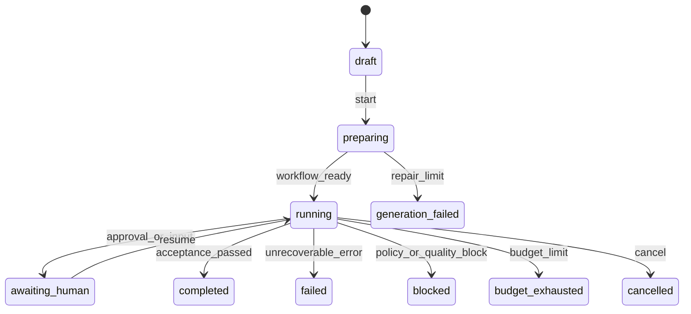

### 13.2 Task 状态

```text
pending
-> ready
-> leased
-> running
-> candidate_submitted
-> validating
-> completed / rework / blocked / failed / cancelled / timeout
```

### 13.3 Attempt

每次重试、返工、用户重跑或替换 Agent 都创建新 TaskAttempt。Task 保存业务工作单元，Attempt 保存一次具体执行。

## 14. 事件与实时设计

### 14.1 事件信封

```json
{
  "event_id": "...",
  "event_type": "task.started",
  "schema_version": 1,
  "project_id": "...",
  "run_id": "...",
  "task_id": "...",
  "attempt_id": "...",
  "agent_id": "...",
  "trace_id": "...",
  "causation_id": "...",
  "actor": {"type": "agent", "id": "..."},
  "occurred_at": "...",
  "public_summary": "...",
  "payload_ref": "..."
}
```

### 14.2 事件存储

- PostgreSQL 保存正式领域事件；
- SSE 从事件游标推送；
- Client 断线后按 Cursor 补发；
- 大 Payload 进入对象存储；
- 不保存模型私有思维链；
- OpenClaw 原始事件保存必要摘要和外部引用。

## 15. 权限与安全设计

### 15.1 权限维度

- Project；
- KnowledgeSpace；
- Agent；
- Tool；
- 文件路径；
- 网络域名；
- 外部账号；
-操作类型；
- 时间、金额和资源上限；
- Artifact 可见范围。

### 15.2 执行前检查

```text
Task + Agent + Knowledge + Tool
-> 平台 Policy
-> 敏感数据检查
-> 用户审批检查
-> OpenClaw 工具策略
-> Sandbox Policy
-> 执行
```

### 15.3 代码执行

- 每个编码 Task 使用独立 Worktree；
- 容器内安装依赖和执行命令；
- 默认不访问主工作区；
- 网络按域名白名单；
- 输出大小、时间和进程数受限；
- Patch/Commit Candidate 经用户确认后应用。

### 15.4 外部写操作

```text
OperationIntent
-> Policy Check
-> Preview
-> Approval
-> Idempotent Execute
-> Verify
-> Evidence
-> Compensate / Manual Reconcile
```

状态未知时先查询外部对象，不盲目重试。

## 16. 可靠性与恢复设计

### 16.1 Temporal 调度与恢复

- Orchestrator 将领域 Task 写入 PostgreSQL，并通过 Temporal Workflow/Activity 推进执行；
- Temporal Task Queue 调度 Workflow Task 和 Activity Task；
- Worker 退出后，未完成 Activity 按 RetryPolicy 和 Heartbeat Timeout 恢复；
- 长 Activity 必须定期 Heartbeat，并在取消时及时停止 OpenClaw 或工具运行；
- Attempt 幂等键防止 Activity 重试产生重复正式提交。

### 16.2 Checkpoint

至少在以下边界保存 Checkpoint：

- Workflow 冻结；
- Agent 任务下发；
- Candidate 提交；
- Artifact 发布；
- 人工等待；
- 外部写操作审批前后；
- 子 Agent 批次完成；
- 知识版本发布。

### 16.3 恢复顺序

```text
读取 PostgreSQL 正式状态
-> 查询 Temporal Workflow ID / Run ID / History
-> 检查 OpenClaw 外部运行映射
-> 查询 running/unknown Session
-> 恢复、取消、重试或人工核对
-> 重建 SSE 游标
```

## 17. API 总体设计

### 17.1 API 分组

- `/projects`；
- `/requirements`、`/contracts`；
- `/workflows`、`/workflow-versions`、`/validate`；
- `/agents`、`/agent-versions`、`/relationships`；
- `/runs`、`/tasks`、`/attempts`、`/control`；
- `/artifacts`、`/evidence`、`/defects`、`/decisions`；
- `/knowledge`、`/sources`、`/graph`、`/feedback`；
- `/marketplace`、`/installations`；
- `/tools`、`/operations`、`/approvals`；
- `/evaluations`、`/reports`；
- `/events`。

### 17.2 版本并发

版本化修改采用 `base_version_id` 或 ETag。客户端基于旧版本提交时返回冲突，不覆盖新版本。

### 17.3 长任务

创建 Run、知识解析、索引构建、市场安装和外部操作均返回 operation/task ID，通过事件查询进度。

## 18. Client 总体设计

### 18.1 主要页面

1. 项目首页；
2. 需求和 Grill Me；
3. Workflow 资产选择和编辑；
4. Agent 资产选择和团队配置；
5. 公共 Agent/场景包市场；
6. 生产运行视图；
7. 江湖关系视图；
8. Artifact 和证据视图；
9. 知识库和知识图谱管理；
10. 审批中心；
11. 运行历史和评估实验室；
12. 模型、OpenClaw 和工具设置。

### 18.2 三大运行视图联动

```text
生产视图选择节点
-> 江湖视图高亮参与 Agent 和关系
-> 产物视图显示输入、Candidate、Evidence、Defect 和 Decision
```

所有联动通过稳定 ID 完成，不依赖页面内临时状态。

### 18.3 客户端整体信息架构

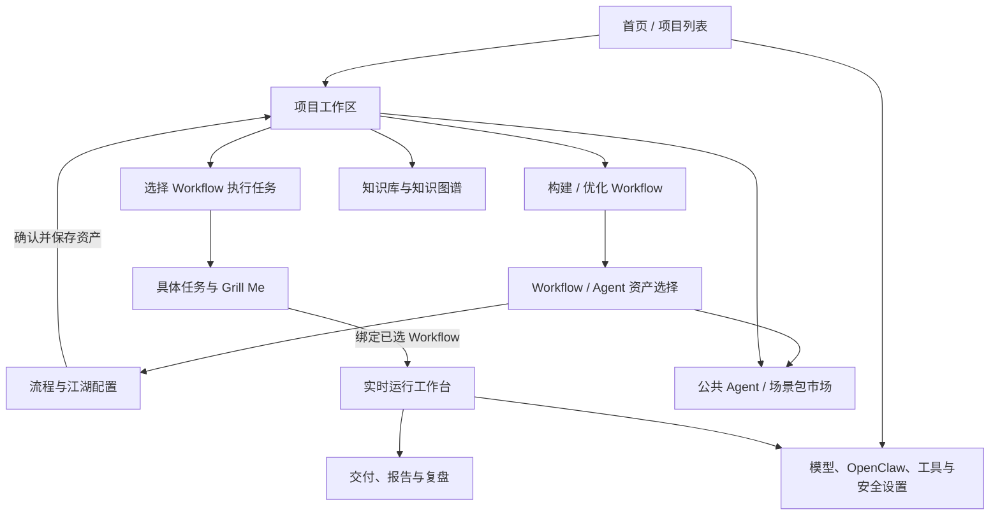

读图说明：客户端有两条并列主路径。第一条是“描述流程类型—构建或优化 Workflow/Agent—确认—保存资产”；第二条是“选择已有 Workflow—输入本次具体任务—澄清并绑定—运行—结果”。构建资产不会自动创建 Run。知识库、市场和系统设置为两条路径提供支撑。

### 18.4 项目工作区布局

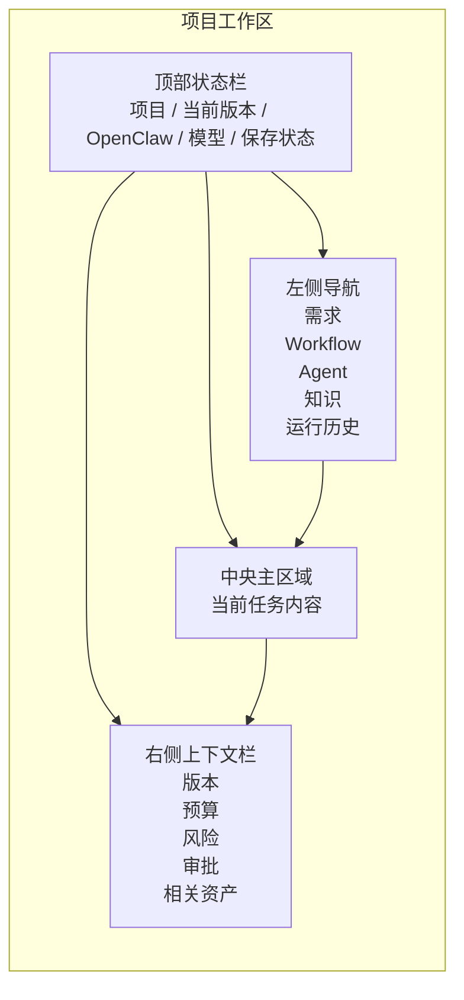

页面交互原则：

- 左侧负责切换业务对象；
- 中央负责当前核心操作；
- 右侧持续展示上下文、影响和风险；
- 顶部持续展示当前绑定版本、运行状态和基础服务健康度；
- 用户修改任何版本化对象时，页面明确显示“将创建新版本”；
- 高风险操作不使用普通确认框，而进入审批详情。

### 18.5 两类主入口与需求澄清交互

#### 18.5.1 预期输入方式

首页必须提供两个同等重要、语义明确的入口，不能用一个对话框混合处理 Workflow 建设和具体任务执行。

| 主入口 | 用户在表达什么 | 系统最终产出 |
| --- | --- | --- |
| 构建/优化 Workflow | “我需要建立一套需求开发任务流程” | 保存的 WorkflowVersion、AgentBlueprintVersion 和相关配置资产，不创建 Run |
| 使用 Workflow 完成任务 | “选择需求开发 Workflow，完成社区报修系统开发” | 基于已选 WorkflowVersion 创建具体 RequirementContract 和 Run |

以下表达分别路由：

| 用户表达 | 系统解释 |
| --- | --- |
| “我需要去做需求开发任务” | 进入 Workflow 构建入口，澄清这类流程的适用范围、标准输入输出、Agent 分工和质量规则 |
| “这个需求开发 Workflow 不符合我的要求” | 创建所选 WorkflowVersion 的副本，按用户要求派生优化并保存新版本 |
| “用需求开发 Workflow 完成社区报修系统” | 进入任务执行入口，先固定 WorkflowVersion，再澄清本次具体任务 |
| “开发 XXX 系统并直接帮我实现” | 系统先推荐已有 Workflow；用户确认使用哪个 Workflow 后再创建 Run；没有适用项则建议先构建 Workflow |
| “继续刚才的运行并替换测试 Agent” | 已有 Run/Workflow 的结构性介入，不创建新项目意图 |

因此输入语义分成四类：

```text
workflow_authoring
  新建一类可复用 Workflow 和多 Agent 资产

workflow_derivation
  复制已有 WorkflowVersion，按新要求优化并保存

workflow_execution
  选择已有 WorkflowVersion，输入本次具体任务并创建 Run

run_intervention
  用户对已有 WorkflowVersion 或 Run 发出继续、暂停、替换或调整指令
```

意图识别决定进入资产建设还是任务执行。若用户只描述具体任务但没有选择 Workflow，系统先展示推荐 Workflow，必须在用户确认或其预先配置的自动选择 Policy 生效后才能进入任务契约与 Run。低置信度时直接询问“你是要创建一套可复用流程，还是使用已有流程完成这次任务？”

#### 18.5.2 首页双入口

```text
┌──────────────────────────────────────────────────────────────┐
│ ① 构建或优化生产流程                                         │
│   描述你需要哪一类工作流，例如：需求开发、市场调研、合同审查   │
│   [描述流程用途……] [从已有 Workflow 创建副本] [开始构建]      │
│                                                              │
│ ② 使用已有流程完成任务                                       │
│   [选择 Workflow……] [浏览我的 Workflow] [访问公共市场]        │
│   选择后输入本次具体任务                                      │
└──────────────────────────────────────────────────────────────┘

入口一的完成状态：
  Workflow 与 Agent 草案通过校验 → 用户确认 → 保存到本地 Registry

入口二的完成状态：
  WorkflowVersion 已选定 → 本次任务契约已确认 → 创建 Run
```

构建入口允许引用知识库、场景包和已有 Workflow，但具体项目资料默认不固化进 Workflow。Workflow 构建阶段默认选定并冻结具体 AgentBlueprintVersion、职责和关系；只有明确需要弹性招聘的节点才保存 `dynamic_slot`。执行时固定席位直接实例化，普通用户无需重新选择 Agent。用户修改固定 Agent、能力契约、权限上限或团队治理规则时必须派生 WorkflowVersion；在已声明 fallback 或 dynamic_slot 边界内切换实例时只创建新 TeamPlanVersion。

#### 18.5.3 意图路由与澄清时序

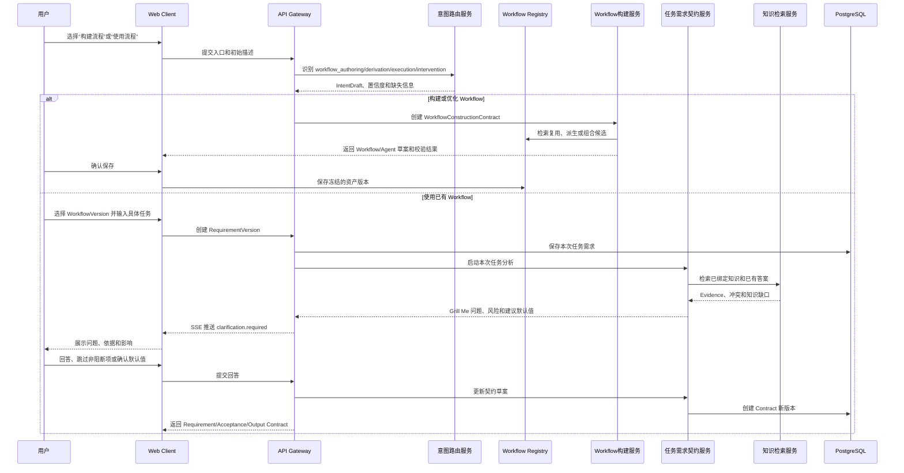

任务执行页面分为三块：

1. 原始需求与附件；
2. Grill Me 问答时间线；
3. 实时生成的目标、范围、假设、约束、验收和最终交付摘要。

用户必须能够点击任一契约条目查看：来源是用户回答、知识证据、系统默认还是模型推断。

任务契约满足最低可执行条件后，系统可以按用户设置自动创建 Run；但不能在 Workflow 构建完成时自动执行一个尚未输入的具体任务。目标歧义、不可逆外部写操作、敏感数据授权、费用超限和无法安全推断的验收条件仍必须阻断询问或审批。

### 18.6 Workflow 与 Agent 资产选择交互

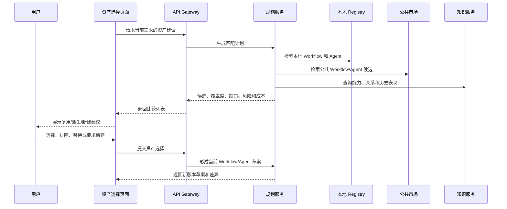

资产选择页面建议采用双栏：

```text
左侧：当前节点和能力缺口
右侧：候选 Workflow / Agent 卡片

卡片操作：
  查看详情
  加入候选
  指定使用
  排除
  与另一个资产比较
  创建派生版本
```

Agent 卡片必须直接显示人格、能力、知识、工具、权限、质量、费用、时延和来源，不能只显示名称和头像。

#### 18.6.1 Agent / Workflow 生成工作台

资产选择之后，如果需要派生或从零生成，页面切换到生成工作台，而不是让用户等待一个不透明的后台任务。

```text
┌──────────────────────────────────────────────────────────────────────────┐
│ 生成状态：Workflow 草案生成中（第 2/3 轮）  预算 18%  [暂停] [取消]       │
├──────────────────┬───────────────────────────────┬───────────────────────┤
│ 左：生成依据      │ 中：当前草案                  │ 右：校验与影响         │
│                  │                               │                       │
│ ✓ 需求契约 v3    │ [能力矩阵] [Agent] [Workflow] │ ERROR 2 / WARNING 3   │
│ ✓ 验收契约 v2    │                               │                       │
│ ✓ 输出契约 v4    │ Workflow 图 / Agent 关系图    │ 缺少产物生产者         │
│ ✓ 知识快照 18    │                               │ Judge 上下文不独立     │
│                  │ 选中对象的生成理由、来源、    │                       │
│ 候选资产：        │ 输入输出、能力和版本差异      │ 自动修复记录 1/3       │
│ Workflow 6 个    │                               │                       │
│ Agent 14 个      │                               │ 质量/费用/时延/权限    │
│ 排除及原因        │                               │                       │
├──────────────────┴───────────────────────────────┴───────────────────────┤
│ [排除候选] [替换 Agent] [调整执行策略] [强制新建] [重新生成] [确认并保存] │
└──────────────────────────────────────────────────────────────────────────┘
```

三个核心页签：

- **能力矩阵**：展示每项能力由哪个已有、新建或派生 Agent 覆盖，以及未覆盖原因；
- **Agent 草案**：展示身份、职责、立场、知识、工具、权限、行为规则、父版本和生成理由；
- **Workflow 草案**：展示节点、Artifact 流、执行策略、Agent 编队、并行/循环、Gate 和验收覆盖。

用户选中一个新 Agent 时，右侧必须能回答“为什么需要这个人、为什么不能用已有 Agent、他会在哪些节点做什么”；选中一个节点时，必须能回答“为什么需要这一步、标准输入是什么、输出给谁、失败后怎么办”。校验未通过时“确认并保存”不可用。保存成功后提供“使用此 Workflow 创建任务”，进入独立的任务执行入口。

### 18.7 Workflow 与江湖配置页面

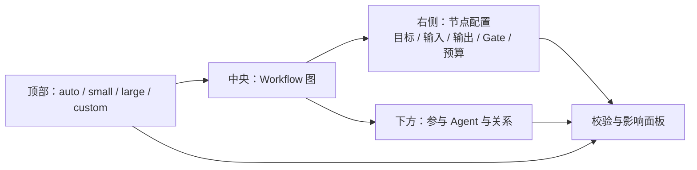

用户选择节点后可以：

- 查看为什么存在该节点；
- 查看复用来源或派生差异；
- 修改节点执行类型；
- 选择已有或市场 Agent；
- 查看 Agent 之间的协作、对抗和裁判关系；
- 为该节点单独设置小江湖、大江湖或自定义团队；
- 查看预计质量、费用、时间和权限影响；
- 提交新 WorkflowVersion 进行校验。

### 18.8 大小江湖配置交互

```mermaid
sequenceDiagram
    participant U as 用户
    participant UI as 江湖配置面板
    participant API as API Gateway
    participant PLAN as 团队规划服务
    participant VALID as Workflow 校验服务

    U->>UI: 选择 auto/small/large/custom
    UI->>API: 请求规模影响预览
    API->>PLAN: 评估复杂度、风险、预算和认知差异
    PLAN-->>API: Agent 增减、关系变化和成本预测
    API-->>UI: 展示前后对比
    U->>UI: 调整节点范围、人数、轮次或角色
    UI->>API: 创建新配置版本
    API->>VALID: 校验依赖、权限、预算和收敛规则
    VALID-->>UI: 通过或问题清单
```

大江湖预览必须明确展示：

- 新增哪些 Agent；
- 每个 Agent 为什么必要；
- 增加哪些关系和互动；
- 哪些节点被扩大；
- 预计增加多少费用和时间；
- 是否存在角色同质化；
- 由谁汇总、如何收敛和何时停止。

### 18.9 实时运行工作台

```mermaid
flowchart TB
    HEADER["运行状态栏\n状态 / 预算 / 时间 / OpenClaw / 暂停 / 取消"]
    subgraph BODY["运行主体"]
        FLOW["生产视图\n节点和依赖"]
        SOCIETY["江湖视图\nAgent、关系和互动"]
        ARTIFACT["产物视图\nArtifact、Evidence、Defect"]
    end
    TIMELINE["底部事件时间线\n消息 / 工具 / 审批 / 错误 / Checkpoint"]
    DETAIL["右侧详情抽屉\n当前选择对象的完整信息"]

    HEADER --> FLOW
    HEADER --> SOCIETY
    HEADER --> ARTIFACT
    FLOW --> TIMELINE
    SOCIETY --> TIMELINE
    ARTIFACT --> TIMELINE
    FLOW --> DETAIL
    SOCIETY --> DETAIL
    ARTIFACT --> DETAIL
```

联动规则：

- 选择 Workflow 节点，高亮该节点 Agent、输入和输出；
- 选择 Agent，高亮其任务、关系、消息、工具和产物；
- 选择 Artifact，显示生成 Attempt、Agent、证据、缺陷和裁决；
- 选择事件，反查关联节点、Agent 和 Artifact；
- 状态通过 SSE 更新，断线后按 Cursor 补发；
- 页面只展示公开消息和理由摘要，不展示私有思维链。

### 18.10 实时运行的前后台状态流

```mermaid
sequenceDiagram
    participant UI as 运行工作台
    participant API as API/SSE
    participant O as Orchestrator
    participant OC as OpenClaw Adapter/Gateway
    participant T as Tool Gateway
    participant A as Artifact/Quality Gate

    UI->>API: POST /runs/{id}/start
    API->>O: 启动 Run
    O-->>API: run.started
    API-->>UI: SSE run.started
    O->>OC: 启动 Agent Task
    OC-->>API: agent.started / message
    API-->>UI: 更新江湖视图和时间线
    OC->>T: 调用工具
    T-->>API: tool.started / tool.completed
    API-->>UI: 更新工具状态和费用
    OC-->>O: 候选结果
    O->>A: CandidateArtifact
    A-->>API: validating / accepted / rework
    API-->>UI: 更新产物和节点状态
```

### 18.11 用户介入交互

用户介入分为两类。

#### 非结构性介入

- 向 Agent 提问；
- 要求解释；
- 补充非正式参考；
- 催促或请求状态；
- 对当前讨论提供意见。

非结构性介入进入消息或 Blackboard，不自动修改 Workflow 和正式 Artifact。

#### 结构性介入

- 修改 Requirement/Acceptance/Output Contract；
- 修改 Workflow 节点或边；
- 锁定、排除或立即替换 Agent（创建新 TeamPlanVersion 和受影响 TaskAttempt）；
- 改变大小江湖；
- 改变知识绑定；
- 改变工具权限、模型或预算；
- 人工修改 Artifact。

其中，修改角色能力契约、Registry 范围、权限上限、最大规模或独立性规则属于 Workflow 结构变更，必须创建派生 WorkflowVersion；在既有政策边界内更换具体 Agent、提前离场或局部扩缩容属于 Run 配置变更，只创建新的 TeamPlanVersion。

```mermaid
sequenceDiagram
    participant U as 用户
    participant UI as 运行工作台
    participant API as API Gateway
    participant O as Orchestrator
    participant V as 版本与校验服务

    U->>UI: 提交结构性修改
    UI-->>U: 展示质量、费用、时延和权限影响
    U->>UI: 确认创建新版本
    UI->>API: 提交修改和 base_version_id
    API->>O: 暂停受影响 Task
    O-->>API: 保存 Checkpoint
    API->>V: 创建并校验新版本
    V-->>UI: 差异和校验结果
    U->>UI: 确认重新执行
    UI->>API: 从受影响边界重跑
```

### 18.12 审批中心交互

审批中心统一处理：

- 外部消息发送；
- 邮件和日历写入；
- 代码 Patch/Commit 应用；
- 主工作区修改；
- 高风险网络和 Shell；
- 插件安装和权限扩大；
- 高影响知识写回；
- 用户豁免缺陷或覆盖 Judge。

每个审批卡片展示：

- 谁提出；
- 代表谁执行；
- 目标对象；
- 操作预览；
- 输入和证据；
- 所需权限；
- 风险和不可逆性；
- 幂等和补偿方式；
- 批准、拒绝、修改后批准和转交选项。

### 18.13 知识库管理交互

```mermaid
flowchart LR
    LIST["知识空间 / Library / Collection"]
    SOURCE["来源与版本"]
    PARSE["解析和索引状态"]
    GRAPH["实体、关系和 Evidence 图谱"]
    FEEDBACK["反馈、冲突和更新队列"]
    IMPACT["影响分析和版本发布"]

    LIST --> SOURCE --> PARSE --> GRAPH
    GRAPH --> FEEDBACK --> IMPACT
    IMPACT --> SOURCE
```

知识页面需要支持：

- 上传、粘贴和网页抓取；
- 查看 SourceVersion 和解析失败；
- 查看 Chunk 和原文定位；
- 查看 Ontology、Entity、Relation 和 Evidence；
- 处理同名实体和错误合并；
- 查看冲突和过时知识；
- 提交 incorrect、outdated、conflict 等反馈；
- 查看知识变化会影响哪些 Workflow、Agent、Artifact 和 Run；
- 发布新版本、撤销和回滚；
- 重建全文、向量和图索引。

### 18.14 知识反馈前后台交互

```mermaid
sequenceDiagram
    participant U as 用户/Agent
    participant UI as 知识管理页面
    participant API as API Gateway
    participant K as Knowledge Service
    participant G as 图谱与索引服务
    participant DB as PostgreSQL

    U->>UI: 标记知识错误、过时或冲突
    UI->>API: POST /knowledge/feedback
    API->>DB: 保存 KnowledgeFeedback
    API->>K: 执行去重、来源和影响分析
    K-->>UI: 显示受影响对象和建议处理
    U->>UI: 接受、修改、拒绝或要求补证据
    UI->>API: 提交处理决定
    API->>K: 创建新 KnowledgeVersion
    K->>G: 局部重建全文、向量和图索引
    G-->>API: index.completed
    API-->>UI: 显示新版本和影响提示
```

### 18.15 公共市场交互

```mermaid
sequenceDiagram
    participant U as 用户
    participant UI as 市场页面
    participant API as API Gateway
    participant M as Marketplace Service
    participant R as 本地 Registry
    participant S as 安全扫描与权限检查

    U->>UI: 搜索并打开 Agent/场景包
    UI->>API: 请求详情和当前环境兼容性
    API->>M: 获取 PackageVersion
    API->>S: 检查模型、OpenClaw、工具和权限
    API-->>UI: 展示能力、评价、风险和兼容性
    U->>UI: 点击安装
    UI-->>U: 展示权限和影响预览
    U->>UI: 确认
    UI->>API: POST /marketplace/installations
    API->>S: 扫描和验证
    S-->>API: 通过或阻断
    API->>R: 创建本地来源版本
    API-->>UI: 安装完成，可加入 Workflow
```

市场 Agent 安装后应立即出现于 Agent 选择器，但默认不自动获得项目知识、工具权限和外部账号。

### 18.16 结果交付和复盘页面

结果页至少包含：

- 最终 Artifact；
- AcceptanceContract 完成情况；
- Demo 运行和测试入口；
- 关键 Evidence；
- 红队缺陷和修订记录；
- Judge 评分和 Decision；
- 未关闭风险和限制；
- Workflow、Agent、知识和模型版本；
- Token、费用和时延；
- 单/多 Agent 或大小江湖对比；
- 导出、复制配置、保存 Workflow/Agent/场景包操作。

### 18.17 页面操作与后台服务映射

| 用户操作 | 前端页面 | 主要 API | 后台处理 | 实时反馈 |
| --- | --- | --- | --- | --- |
| 提交需求 | 需求页 | `/projects`、`/requirements` | 契约服务、知识检索 | Grill Me 问题 |
| 选择 Workflow | 资产选择 | `/workflows/search` | Registry、适用性评估 | 候选和差异 |
| 构建 Workflow 时选择 Agent | 团队配置 | `/agents/search` | Registry、市场、能力图谱 | 匹配和缺口 |
| 切换大小江湖 | 江湖配置 | `/workflows/{id}/scale-preview` | 团队规划、预算评估 | 质量/费用预览 |
| 启动运行 | 运行工作台 | `/runs` | Orchestrator、OpenClaw | SSE 状态流 |
| 向 Agent 提问 | 江湖视图 | `/messages` | OpenClaw Adapter | Agent 消息 |
| 修改 Workflow | Workflow 编辑器 | `/workflow-versions` | 新版本、校验 | 差异和错误 |
| 审批操作 | 审批中心 | `/approvals` | Tool Gateway、Orchestrator | 执行结果 |
| 修改知识 | 知识管理 | `/knowledge/feedback` | 知识审核和索引 | 更新进度 |
| 安装市场 Agent | 市场 | `/marketplace/installations` | 扫描、Registry | 安装状态 |
| 查看结果 | 结果页 | `/reports`、`/artifacts` | Artifact、Evaluation | 报告完成 |

### 18.18 Client 状态管理原则

- 服务端领域状态是唯一真相，前端状态只是投影；
- 所有编辑草稿与已发布版本分离；
- SSE 事件必须按 event_id 去重；
- 页面刷新后根据 API 和 Cursor 恢复；
- 前端不得自行推断 Task 已完成；
- 乐观更新仅用于低风险 UI 状态，不用于 Artifact、审批和正式版本；
- 版本冲突时展示差异，不自动覆盖；
- 权限变化后立即清理前端缓存中的不可见数据。

## 19. 部署设计

### 19.1 Kubernetes 部署拓扑

```mermaid
flowchart TB
    B["Browser"] --> ING["Kubernetes Ingress"]
    ING --> WEB["Web Client"]
    ING --> API["FastAPI API / SSE"]
    ING --> MATRIX["Matrix Synapse"]
    API --> DOMAIN["Domain Services"]
    DOMAIN --> TEMPORAL["Temporal Server"]
    TEMPORAL --> TWORKER["Temporal Workers"]
    TWORKER --> OC["OpenClaw Gateway"]
    OC --> SANDBOX["隔离 Sandbox Pod / Git Worktree"]
    DOMAIN --> PG["PostgreSQL + pgvector"]
    DOMAIN --> KB["Docling + LightRAG Workers"]
    DOMAIN --> BLOB["Artifact Object Storage"]
    OC <-->|"Matrix Channel"| MATRIX
    DOMAIN --> OTEL["OpenTelemetry Collector"]
    TWORKER --> OTEL
    OC --> OTEL
    OTEL --> LANGFUSE["Langfuse"]
```

生产与本地开发统一使用 Kubernetes 资源模型和 Helm Chart。本地使用 k3d 或 kind 创建单机集群，不再维护另一套 Docker Compose 正式部署定义，避免环境行为分叉。

### 19.2 进程建议

- `web`：Vue 3；
- `api`：FastAPI；
- `domain-service`：领域状态、资产、权限、产物和市场；
- `temporal-server`：持久化 Workflow 服务；
- `temporal-worker`：Workflow Interpreter、Activity 和确定性任务；
- `knowledge-worker`：解析、抽取和索引；
- `openclaw-gateway`：多 Agent 运行；
- `matrix-synapse`：Human/Agent Room、Thread 和事件；
- `matrix-appservice`：AgentInstance 虚拟用户与 Room Bridge；
- `sandbox-runner`：按 Run/Task 创建隔离 Pod，执行代码和高风险工具；
- `postgres`；
- `artifact-storage`；
- `otel-collector`；
- `langfuse`。

### 19.3 Kubernetes 隔离与伸缩规则

- API、Temporal Worker、OpenClaw Gateway 和 Knowledge Worker 使用独立 Deployment 与 ServiceAccount；
- Sandbox 使用独立 Namespace、NetworkPolicy、ResourceQuota、LimitRange 和短生命周期 Pod；
- Agent/Task 的 Secret 通过短期凭据挂载，不进入镜像、Prompt、Matrix Event 或 Artifact；
- PostgreSQL、Temporal、Synapse、对象存储和 Langfuse 使用 StatefulSet/Operator 或受管服务，但逻辑接口保持一致；
- Worker 根据 Temporal Task Queue backlog 和资源指标通过 HPA/KEDA 横向伸缩；
- 每个租户和项目通过 Namespace/Policy/数据库 RLS 的组合隔离，不只依赖 Kubernetes Namespace。

## 20. 技术选型

本章技术栈已经完成单一选型。完整候选矩阵、许可证和淘汰原因见《[江湖 Online 开源实现调研与技术选型](../01-research/open-source-implementation-selection-2026-07-29.md)》。后续验证用于修正集成实现和运行参数，不再用于切换到另一套核心技术。

| 层 | 选择 | 说明 |
| --- | --- | --- |
| Client | Vue 3 + TypeScript + Vite | 延续现有实现 |
| API | FastAPI + Pydantic | 异步、Schema、SSE 友好 |
| Deployment | Kubernetes + Helm；本地 k3d/kind | 统一生产和本地资源模型、隔离、伸缩、Secret 与 NetworkPolicy |
| Agent Runtime | OpenClaw Gateway | 多 Agent 核心运行框架 |
| Agent Integration | OpenClaw Adapter + Agent Execution Port | 隔离平台领域和框架对象 |
| Collaboration Room | Matrix + Synapse | 独立身份、Room、Thread、历史和用户介入；不作为正式状态源 |
| Workflow Asset | WFDL + 自有领域模型 | 保存可复用资产、Agent 固定/弹性绑定、产物与验收语义；不等于底层执行引擎 DSL |
| Durable Execution | Temporal | 统一承担持久化 Workflow、Activity、Retry、Timer、Signal、取消和恢复 |
| External Agent Protocol | A2A Adapter | 跨 Runtime、跨 Gateway 和远程市场 Agent 互操作 |
| Tool Protocol | MCP + Tool Gateway | MCP 管工具发现/调用，平台负责授权、审批和审计 |
| Database | PostgreSQL | 唯一真相源 |
| Vector | pgvector | 正式向量索引，与权限和 Evidence 联动 |
| Queue | Temporal Task Queue | 统一调度 Workflow Task 和 Activity Task；Redis 不作为任务队列或正式状态源 |
| Blob | 本地/S3 兼容对象存储 | 原文、代码和大产物 |
| Document Parsing | Docling + 网页/Git 专用解析器 | 复用成熟版面和多格式解析，统一转换为 KnowledgeDocument |
| Knowledge Retrieval | PostgreSQL FTS + pgvector + LightRAG | Evidence/权限在 PostgreSQL；LightRAG 图谱作为可重建检索投影 |
| Sandbox | Docker + Git Worktree | 真实代码执行和隔离 |
| Observability | OpenTelemetry + Langfuse | 跨服务 trace 与 LLM 调用、评估、Prompt 观测 |
| Realtime | SSE 优先 | 状态和事件推送 |
| Test | Pytest + Vitest + Playwright | API、Client 和真实 Demo |

### 20.1 开源采用与自研边界

| 确定采用 | 只作设计参考、不进入运行栈 | 江湖必须自有 |
| --- | --- | --- |
| OpenClaw、Temporal、Matrix/Synapse、A2A、MCP、Docling、pgvector、LightRAG、OpenTelemetry、Langfuse、Docker | ChatDev、MetaGPT、CAMEL、Dify、Flowise、Langflow 仅用于设计参考，不进入运行栈 | Requirement/Acceptance/Output Contract、Workflow/Agent 资产版本、Artifact/Evidence/Defect/Revision/Decision、Policy、预算、市场治理、审计 |

AutoGen 已进入 maintenance mode，不作为新平台主框架。CrewAI、MetaGPT、ChatDev、CAMEL 用于吸收团队组织、角色协作、SOP、争辩和可观察生产过程，不作为江湖 Online 的正式状态源。

## 21. 需求追溯

| 需求域 | 主要设计组件 |
| --- | --- |
| 需求澄清 | 需求契约服务、知识检索 |
| 客户端交互与前后台联动 | 项目工作区、Workflow/Agent 资产选择、江湖配置、实时运行工作台、审批中心、知识管理、市场、结果复盘、SSE 事件流 |
| Agent 与 Workflow 生成 | GenerationJob、能力缺口矩阵、Agent Generator、Workflow Generator、Prompt Manifest、Compiler、Repairer、生成工作台 |
| Workflow 复用与生成 | Workflow Registry、规划服务、编译校验服务 |
| Agent 复用与市场选择 | Agent Registry、Marketplace、团队规划服务 |
| 大小江湖 | 团队规划、RelationshipState、节点规模策略 |
| OpenClaw | OpenClaw Adapter、Gateway、事件映射、外部运行映射 |
| 多 Agent 协作和对抗 | Orchestrator、OpenClaw、消息协议、Artifact/Defect |
| 正式产物 | Artifact/Evidence 服务、对象存储、质量门禁 |
| 知识库与图谱 | 知识管理、混合检索、图查询、反馈审核 |
| 数据与执行基础设施 | PostgreSQL、pgvector、Temporal、对象存储 |
| 真实代码 Demo | Tool Gateway、Worktree、Docker Sandbox、Playwright |
| 公共市场 | Marketplace Service、PackageVersion、Installation |
| 安全与审批 | Policy、Tool Gateway、Approval、Sandbox |
| 恢复和审计 | Checkpoint、Lease、Event、ExternalRunMapping |

## 22. MVP 实施分期

### 阶段 1：正式领域底座

- PostgreSQL Schema；
- Project、Contract、WorkflowVersion；
- AgentBlueprintVersion；
- Run、Task、Attempt；
- Artifact、Evidence、Decision；
- 事件和 SSE。

### 阶段 2：OpenClaw 单 Agent 闭环

- OpenClaw Gateway 部署；
- Adapter start/events/result/cancel；
- 单 Agent、工具和沙箱；
- Candidate 到 Artifact；
- 错误和用量记录。

### 阶段 3：真实多 Agent 与江湖

- 多 Agent 并行；
- Agent 间消息；
- 子 Agent；
- 协作、争辩、红队和独立 Judge；
- 小江湖、局部扩容和大江湖；
- 故障恢复和预算控制。

### 阶段 4：知识库和图谱

- 文件和网页接入；
- Chunk、Evidence 和混合检索；
- Ontology、Entity 和 Relation；
- KnowledgeBinding；
- 反馈、版本、索引重建和回滚。

### 阶段 5：市场与资产复用

- Workflow/Agent Registry；
- Agent/场景包市场；
- 安装、派生、比较和升级；
- 安全扫描和撤销。

### 阶段 6：真实 Demo 和评估

- Worktree 和 Docker；
- 代码生成、构建、启动和 E2E；
- 单/多 Agent 对比；
- 大小江湖对比；
- 完整追溯和比赛报告。

## 23. 实施验证与风险

验证只用于确认实现满足要求，不再承担重新选择核心技术的职责。

### 23.1 OpenClaw 集成验证

必须验证：

- 多长期 Agent 隔离；
- 并行 Session；
- 子 Agent 深度和取消；
- 工具权限和沙箱；
- 消息和结果回传；
- Gateway 重启和未知状态；
- 与平台 TaskAttempt 的幂等映射；
- Windows/Docker 部署可行性；
- 版本升级兼容性。

### 23.2 Temporal Workflow 验证

Temporal 已确定为持久化 Workflow 引擎，实施前验证具体映射和运行参数：

- 动态 fan-out/fan-in 和三轮有限辩论；
- 人工审批的持久化等待、暂停和恢复；
- 进程在外部 Agent 调用中途退出后的恢复与幂等；
- 5 个并发 Agent、单节点 10 分钟、单 Run 60 分钟；
- 取消传播、预算耗尽和 `budget_exhausted`；
- WorkflowVersion、业务 PostgreSQL 与 Temporal Workflow History 的边界；
- Continue-As-New、History 大小、Worker 重启和版本兼容策略。

### 23.3 知识集成验证

- Docling 对 PDF、Office、HTML、表格和图片的解析质量；
- PostgreSQL FTS + pgvector + LightRAG 混合检索；
- Entity/Relation 关系表和多跳查询；
- Evidence 绑定率；
- 增量更新和索引重建；
- 权限过滤不泄露图关系；
- 运行反馈只进入候选知识，审核后生成新版本；
- MiroFish 知识组织思路在 PostgreSQL + LightRAG 中的实现结果。

### 23.4 通信与可观测集成验证

- OpenClaw 原生通信映射江湖领域消息信封；
- A2A 远程 Agent 的发现、任务、进度、结果和取消；
- MCP 工具调用经过 Tool Gateway 权限和审批；
- OpenTelemetry trace 贯通 API、Temporal、OpenClaw、知识检索和工具；
- Langfuse 关联模型用量、Prompt 版本、Judge 评估和用户反馈。

### 23.5 主要风险

| 风险 | 处理方向 |
| --- | --- |
| OpenClaw 变化快 | Adapter 隔离、版本锁定、契约测试 |
| Temporal History 过大 | 按节点/轮次拆分 Child Workflow，使用 Continue-As-New，正式大产物只保存引用 |
| 双状态不一致 | PostgreSQL 正式状态、外部 ID 映射、恢复扫描 |
| 大江湖成本失控 | 节点级扩容、预算上限、同质化检测 |
| Agent 讨论不收敛 | 有限轮次、汇总者、Artifact Gate、Judge |
| 知识污染 | Run Memory 与长期知识分离、审核写回 |
| 图谱错误合并 | 候选实体、可撤销合并、Evidence 约束 |
| 外部写操作重复 | 幂等键、状态查询、补偿和人工核对 |
| 市场资产恶意内容 | 声明式限制、扫描、签名、权限预览、沙箱 |

## 24. 详细数据模型

### 24.1 通用存储规则

- 主键统一使用 UUIDv7；
- 时间统一保存为 `timestamptz`，API 使用 ISO 8601；
- 不可变版本表不执行原地更新，修改时插入新版本；
- 业务表包含 `project_id`，跨项目资产通过安装或显式授权引用；
- JSONB 只承载可版本化扩展字段，核心查询、唯一性和外键字段必须列化；
- 大文本、代码包、运行日志和原始文件进入对象存储，PostgreSQL 保存摘要、URI、哈希和元数据；
- 每个写操作保存 `created_by_type`、`created_by_id`、`trace_id` 和 `created_at`；
- 软删除只用于 Registry 展示对象；运行、事件、版本、审批和审计记录不可删除。

### 24.2 项目与契约表

| 表 | 核心字段 | 关键约束 |
| --- | --- | --- |
| `project` | id、name、status、owner_id、default_policy_version_id | name 在 owner 范围唯一 |
| `workflow_construction_contract` | id、project_id、version_no、process_goal、applicability_scope、standard_inputs、standard_outputs、quality_policy、constraints | 描述一类可复用生产流程，不包含某次具体任务数据 |
| `requirement_version` | id、project_id、version_no、content_uri、content_hash、parent_id | `(project_id, version_no)` 唯一 |
| `requirement_contract` | id、requirement_version_id、facts、assumptions、constraints、open_questions | facts 必须记录来源类型 |
| `acceptance_contract` | id、requirement_contract_id、items、gate_policy | item ID 在契约内唯一 |
| `output_contract` | id、acceptance_contract_id、deliverables、schema_refs | 每个验收项至少映射一个交付物或明确豁免 |
| `user_decision` | id、project_id、scope_type、scope_id、decision_type、content、impact | 追加式保存，不覆盖历史决定 |

### 24.3 生成与资产表

| 表 | 核心字段 | 关键约束 |
| --- | --- | --- |
| `generation_job` | id、project_id、status、mode、input_manifest_id、budget_json、repair_count | 输入 Manifest 创建后不可变 |
| `generation_revision` | id、job_id、revision_no、draft_uri、draft_hash、change_summary | `(job_id, revision_no)` 唯一 |
| `generation_candidate` | id、job_id、asset_type、asset_version_id、score_json、decision、reason | 保存被淘汰候选 |
| `capability_requirement` | id、job_id、code、purpose、constraints、coverage_status | code 在 Job 内唯一 |
| `capability_coverage` | capability_id、agent_blueprint_version_id、score、gaps | 硬约束失败时 score 不得使其入选 |
| `workflow` | id、registry_scope、name、current_version_id、visibility | current 指针可更新，版本不可变 |
| `workflow_version` | id、workflow_id、version_no、definition_uri、content_hash、parent_id、creation_mode、status、source_package_version_id | frozen 后不可修改；Definition 必须存在于本地对象存储 |
| `node_definition` | id、workflow_version_id、node_key、type、purpose、policy_json | node_key 在版本内唯一 |
| `edge_definition` | id、workflow_version_id、from_node、to_node、condition、artifact_contract | 外键必须属于同一 WorkflowVersion |
| `node_team_policy` | id、node_definition_id、binding_mode、required_slots、registry_policy、scale_policy、replacement_policy、convergence_policy | `fixed` 默认冻结 Blueprint；`dynamic_slot` 冻结选拔边界 |
| `workflow_source_version` | workflow_version_id、source_workflow_version_id、source_subgraph、mapping_json | 保存组合重构的多个来源 |
| `workflow_applicability` | workflow_version_id、domains、goal_tags、artifact_types、capabilities、environment_constraints、known_limits | 用于结构化过滤和适用性解释 |
| `workflow_search_projection` | workflow_version_id、search_text、embedding、quality_summary、updated_at | 可重建检索投影，不是正式真相源 |
| `workflow_dependency` | workflow_version_id、dependency_type、dependency_id、version_range、required | 场景包、Schema、Policy、Plugin 等依赖 |
| `agent_blueprint` | id、registry_scope、name、current_version_id、visibility | 支持私有、项目、用户、公共 |
| `agent_blueprint_version` | id、blueprint_id、version_no、spec_uri、hash、parent_id、status | 发布版本不可修改 |
| `relationship_template` | id、workflow_version_id、source_blueprint、target_blueprint、policy_json | 不保存 Run 中动态关系值 |

### 24.4 运行与产物表

| 表 | 核心字段 | 关键约束 |
| --- | --- | --- |
| `run` | id、project_id、workflow_version_id、status、budget_state、started_at、ended_at | 只能引用 frozen WorkflowVersion |
| `run_binding` | id、run_id、workflow_version_id、requirement_contract_id、acceptance_contract_id、output_contract_id、knowledge_snapshot_id、policy_version_id、configuration_hash | 固定本次任务与所选 Workflow 的完整绑定 |
| `task` | id、run_id、node_definition_id、status、input_manifest_id、output_manifest_id | 同一 Run/节点可因循环有 sequence_no |
| `task_attempt` | id、task_id、attempt_no、status、execution_config_id、lease_until | `(task_id, attempt_no)` 唯一 |
| `team_plan_version` | id、run_id、task_id、version_no、trigger、candidate_scores、selected_bindings、critical_path_snapshot、budget_snapshot | 每次组队、扩缩容或替换都追加新版本 |
| `task_assignment` | id、team_plan_version_id、task_id、agent_instance_id、goal、completion_contract、context_manifest_id、budget、status | 一个 Agent 只按结构化 Assignment 执行 |
| `agent_instance` | id、run_id、blueprint_version_id、source_type、openclaw_agent_id、context_manifest_id、lifecycle_status、selected_reason、released_reason | 每次 Run 独立实例；动态 Agent 可无长期 Blueprint，结束后按政策决定是否转正 |
| `agent_lifecycle_event` | id、agent_instance_id、team_plan_version_id、event_type、reason_code、decided_by、replacement_instance_id、usage_snapshot、artifact_disposition | 追加式记录招聘、离场、终止和替换，不删除历史 |
| `external_run_mapping` | id、attempt_id、provider、external_run_id、session_id、last_seen_at | provider/external_run_id 唯一 |
| `artifact` | id、project_id、artifact_type、current_version_id | 逻辑产物容器 |
| `artifact_version` | id、artifact_id、version_no、schema_ref、content_uri、hash、status | 发布后不可修改 |
| `candidate_artifact` | id、attempt_id、schema_ref、content_uri、validation_status | 通过 Gate 后才能形成 ArtifactVersion |
| `evidence` | id、project_id、source_version_id、locator、content_hash、trust_level | locator 必须可追溯到固定来源版本 |
| `claim` | id、artifact_version_id、text、claim_type、verification_status | 区分事实、推断、假设 |
| `claim_evidence` | claim_id、evidence_id、relation、support_strength | 多对多 |
| `defect` | id、artifact_version_id、severity、category、description、status | close 必须有关联 Revision 或驳回 Decision |
| `revision` | id、defect_id、from_artifact_version_id、to_artifact_version_id、summary | 前后版本不得相同 |
| `decision` | id、subject_type、subject_id、judge_instance_id、result、score_json、reason_summary | Judge 必须通过独立性校验 |

### 24.5 知识与图谱表

| 表 | 核心字段 | 说明 |
| --- | --- | --- |
| `knowledge_space` | id、scope_type、scope_id、name、policy_version_id | 项目、场景、Agent、Run 分层 |
| `knowledge_source` | id、space_id、source_type、canonical_uri、status | 文档、网页、代码、人工条目 |
| `knowledge_source_version` | id、source_id、version_no、content_uri、hash、effective_at | 历史 Run 固定引用版本 |
| `knowledge_chunk` | id、source_version_id、ordinal、text、embedding、metadata | FTS 与 pgvector 索引 |
| `ontology_version` | id、space_id、version_no、schema_json、status | 图谱类型系统 |
| `entity` | id、space_id、ontology_version_id、entity_type、canonical_name、status | 合并前允许 candidate 状态 |
| `entity_alias` | entity_id、alias、source_version_id | 支持可追溯别名 |
| `relation` | id、source_entity_id、target_entity_id、relation_type、valid_from、valid_to | 必须绑定 Evidence |
| `relation_evidence` | relation_id、evidence_id | 图关系证据 |
| `knowledge_feedback` | id、target_type、target_id、action、proposal、status、reviewer_id | 不直接写正式知识 |
| `index_build` | id、space_id、source_version_id、index_type、status、error | 支持重建和回滚 |

### 24.6 事件、审批与市场表

| 表 | 核心字段 |
| --- | --- |
| `event` | id、project_id、run_id、sequence_no、event_type、aggregate_type、aggregate_id、payload、trace_id、created_at |
| `operation_intent` | id、attempt_id、tool_name、arguments_hash、risk_level、preview_uri、idempotency_key、status |
| `approval` | id、operation_intent_id、status、requested_at、decided_at、decided_by、reason |
| `tool_execution` | id、operation_intent_id、provider_call_id、status、result_uri、compensation_json |
| `market_package` | id、package_type、publisher_id、slug、visibility、current_version_id |
| `market_package_version` | id、package_id、version、manifest_uri、hash、signature、scan_status |
| `installation` | id、project_id、package_version_id、local_asset_id、status、installed_by |

## 25. 服务内部详细设计

### 25.1 Generation Service

内部模块：

```text
GenerationCoordinator
├─ ContractReader
├─ AssetRetriever
├─ CapabilityPlanner
├─ AgentComposer
├─ WorkflowComposer
├─ GenerationCompilerClient
├─ RepairCoordinator
├─ BudgetGuard
└─ RevisionRepository
```

协调器只推进状态和持久化修订；Retriever 只返回候选；Composer 只生成 Draft；Compiler 不调用模型；RepairCoordinator 只能根据诊断允许的修改类型创建下一修订。

### 25.2 Workflow Compiler

编译入口：

```python
compile_workflow(
    draft: WorkflowDefinitionDraft,
    contracts: ContractBundle,
    agents: list[AgentBlueprintDraft],
    policy: PolicySnapshot,
    environment: EnvironmentProfile,
) -> CompilationResult
```

返回：

```yaml
compilation_result:
  passed: false
  diagnostics: []
  coverage:
    acceptance: 0.92
    capability: 1.0
    artifact_contract: 0.88
  estimated_resources:
    max_parallel_agents: 4
    max_rounds: 3
    estimated_tokens: 220000
    estimated_cost: 由模型价格计算
    estimated_duration_seconds: 1800
  normalized_definition_uri: null
```

编译通过后输出规范化 Definition：节点和边稳定排序、默认值显式展开、引用解析成固定版本 ID、表达式编译成受限 AST，并计算内容哈希。

### 25.3 Orchestrator 调度循环

每次调度事务执行：

1. 锁定一个可推进 Run；
2. 读取 frozen WorkflowVersion 和最新 Task 状态；
3. 计算依赖已满足的节点；
4. 检查预算、并发、超时、审批和取消；
5. 使用唯一 `(run_id, node_key, sequence_no)` 创建 Task；
6. 写入 `task.ready` 事件；
7. 事务提交后投递队列；
8. Worker 通过租约领取 Attempt。

数据库事务不包围 LLM 或工具调用。外部调用前提交 Attempt 状态和幂等标识，回调后在新事务中写入结果。

### 25.4 OpenClaw Adapter 接口

```python
class AgentExecutionPort:
    async def start(request: AgentExecutionRequest) -> ExternalExecutionRef: ...
    async def get_status(ref: ExternalExecutionRef) -> ExternalStatus: ...
    async def stream_events(ref: ExternalExecutionRef, cursor: str | None): ...
    async def cancel(ref: ExternalExecutionRef, reason: str) -> CancelResult: ...
    async def collect_result(ref: ExternalExecutionRef) -> AgentExecutionResult: ...
```

Adapter 必须保证：平台 Attempt ID 可映射到 OpenClaw Agent/Session；重复 start 不创建第二次执行；未知状态先查询而不是重试；原始事件先落 `external_event`/Event 再转换；CandidateArtifact 只能由 Orchestrator 接收。

### 25.5 Knowledge Service 查询流程

```text
QueryRequest
-> 身份与 KnowledgeBinding 权限过滤
-> 关键词召回 + 向量召回 + 图谱邻域召回
-> Reciprocal Rank Fusion
-> 来源版本、有效期和可信等级过滤
-> rerank
-> Context Manifest 裁剪
-> 返回 Chunk、Entity、Relation 和 Evidence 引用
```

权限过滤必须在召回阶段参与查询，禁止先召回机密内容再在返回阶段隐藏。

## 26. 核心 API 详细契约

### 26.1 创建生成任务

`POST /api/v1/projects/{project_id}/generation-jobs`

```json
{
  "workflow_construction_contract_version_id": "wcc_003",
  "input_contract_template_version_id": "wfin_002",
  "output_contract_template_version_id": "wfout_004",
  "mode": "auto",
  "excluded_asset_version_ids": [],
  "budget": {
    "max_parallel_agents": 5,
    "max_debate_rounds": 3,
    "node_timeout_seconds": 600,
    "run_timeout_seconds": 3600
  }
}
```

返回 `202 Accepted`：

```json
{
  "generation_job_id": "gen_001",
  "status": "created",
  "events_url": "/api/v1/generation-jobs/gen_001/events"
}
```

### 26.2 生成命令

`POST /api/v1/generation-jobs/{id}/commands`

```json
{
  "command": "replace_agent",
  "base_revision_no": 2,
  "target": {"node_key": "architecture_review", "agent_ref": "agent_42:v3"},
  "reason": "用户指定安全架构师"
}
```

支持 `exclude_candidate`、`replace_agent`、`derive_agent`、`force_new_agent`、`change_execution_policy`、`force_new_workflow`、`retry_generation`。命令成功创建新 GenerationRevision，不在原草案上覆盖。

### 26.3 保存 Workflow 资产与创建具体运行

`POST /api/v1/generation-jobs/{id}/freeze` 仅在最后一次 CompilationResult passed 时成功。返回并保存 frozen WorkflowVersion、AgentBlueprintVersion 列表和预计资源，但不创建 Run。

用户随后可以通过 `POST /api/v1/workflows/{workflow_version_id}/task-drafts` 输入一次具体任务并启动 Grill Me。任务契约确认后，再调用 `POST /api/v1/runs`。

`POST /api/v1/runs` 必须提供：

- frozen WorkflowVersion ID；
- Contract Bundle ID；
- Knowledge Snapshot ID；
- Policy Version ID；
- 用户确认后的预算；
- 可选的运行参数覆盖版本。

### 26.4 Attempt 结果回传

内部接口 `POST /internal/v1/attempts/{id}/results` 使用服务身份和幂等键。请求包含 external ref、usage、tool calls、candidate artifacts、public message summary 和 terminal status。重复回传相同哈希返回原结果，不重复发布 Artifact。

### 26.5 列表和并发约定

- 列表统一使用 Cursor 分页；
- 版本化写操作必须带 `If-Match` 或 `base_version_id`；
- 冲突返回 `409 VERSION_CONFLICT` 和服务端当前版本；
- 长任务返回 `202`，不得保持 HTTP 连接等待模型完成；
- SSE 以 Event ID 支持断线续传。

## 27. 事件与错误码详细设计

### 27.1 核心事件目录

| 事件 | 生产者 | 主要消费者 |
| --- | --- | --- |
| `generation.started` | Generation Service | Client、Audit |
| `generation.candidates_retrieved` | Generation Service | Client |
| `generation.draft_revised` | Generation Service | Client、Compiler |
| `generation.validation_failed` | Compiler | Repairer、Client |
| `generation.ready` | Generation Service | Client |
| `run.started` | Orchestrator | Client、Evaluator |
| `task.ready` | Orchestrator | Worker |
| `attempt.started` | Worker | Client、Recovery |
| `agent.message_public` | OpenClaw Adapter | Client、Audit |
| `tool.approval_required` | Tool Gateway | Approval Center |
| `candidate.submitted` | Adapter/Worker | Artifact Service |
| `artifact.published` | Artifact Service | Orchestrator、Client |
| `defect.created` | Red Team/Gate | Orchestrator、Client |
| `decision.created` | Judge/Gate | Orchestrator、Client |
| `budget.exhausted` | Budget Guard | Orchestrator、Client |

### 27.2 错误响应

```json
{
  "error": {
    "code": "WF_ARTIFACT_MISSING_PRODUCER",
    "message": "产物 runnable_demo 没有上游生产者",
    "trace_id": "tr_01",
    "details": {"location": "nodes.final_judge.inputs[0]"},
    "retryable": false
  }
}
```

错误码域：`REQ_*`、`GEN_*`、`WF_*`、`AGENT_*`、`RUN_*`、`TASK_*`、`OC_*`、`TOOL_*`、`KNOWLEDGE_*`、`MARKET_*`、`AUTH_*`。模型输出不合法属于 `GEN_MODEL_OUTPUT_INVALID`，只能由有限修复处理，不能返回伪造默认结果。

## 28. 状态转换与事务边界

### 28.1 GenerationJob

状态转换采用 compare-and-set：更新语句必须包含期望旧状态。`validating -> repairing` 同时插入诊断和新 Revision 任务；`validating -> ready` 同时保存通过的 CompilationResult；修复次数达到上限时原子进入 `generation_failed`。

### 28.2 Run / Task / Attempt

- Run 完成条件：所有必需出口节点成功、最终 OutputContract 满足、Judge/Gate 通过；
- Task 成功条件：至少一个 Attempt 成功且所需 Candidate 已发布；
- Attempt 失败不会直接等于 Task 失败，重试策略决定是否创建下一 Attempt；
- 取消 Run 时先阻止新 Task，再取消活动 Attempt，最后进入 cancelled；
- budget_exhausted 时停止新增模型/工具调用，允许已完成结果落库和生成报告；
- 外部状态 unknown 时进入 reconciliation，不得直接重跑。

### 28.3 Outbox

领域状态变化和待发布事件写入同一 PostgreSQL 事务。Outbox Worker 发布成功后记录 delivery；消费者按 Event ID 幂等。SSE 从正式 Event 表或投影读取，不依赖内存广播作为唯一来源。

## 29. Client 组件与状态详细设计

### 29.1 路由

```text
/projects
/projects/:projectId/requirements
/projects/:projectId/generation/:jobId
/projects/:projectId/workflows/:versionId
/projects/:projectId/runs/:runId
/projects/:projectId/knowledge
/projects/:projectId/agents
/marketplace
/approvals
```

### 29.2 生成工作台组件

```text
GenerationWorkbench
├─ GenerationStatusBar
├─ InputSnapshotPanel
├─ CandidateAssetPanel
├─ CapabilityMatrix
├─ AgentDraftInspector
├─ WorkflowGraphEditor
├─ CompilationDiagnosticsPanel
├─ ImpactEstimatePanel
└─ GenerationCommandBar
```

Pinia Store 分为服务端投影和本地草稿：`generationProjection` 只由 API/SSE 更新；`workflowEditDraft` 保存未提交编辑；提交命令成功后清空本地草稿并等待新 Revision 事件。客户端不能自行将状态改为 ready。

### 29.3 Workflow 图编辑

节点表单由 Node Type Schema 动态生成。连边时客户端可以提前检查 Artifact 类型，但服务端 Compiler 是最终裁决。每次保存产生新草案修订；冻结版本只读；修改 frozen 版本先执行“创建派生版本”。

### 29.4 运行工作台一致性

三视图共享 `selectedEntityRef`。事件到达后按 `event_id` 去重，按 `sequence_no` 应用；发现序号缺口时暂停投影更新并调用补偿接口；刷新页面先加载快照，再从快照 Cursor 续订 SSE。

## 30. 安全实现细节

### 30.1 Prompt 与知识隔离

- 系统 Policy 层不可由 AgentBlueprint、市场包或用户知识覆盖；
- 检索内容以数据块传入，不拼接为高优先级指令；
- 市场资产安装前扫描 Prompt Injection、越权工具声明和敏感信息；
- Judge 使用独立 AgentInstance、Context Manifest 和 Prompt Manifest；
- Agent 间消息不能扩大接收方工具、知识或数据权限。

### 30.2 Sandbox

每个代码 Attempt 使用独立 Worktree 和容器。默认无宿主写权限、无 Docker Socket、无生产凭据；网络按白名单开放；CPU、内存、磁盘、进程数和执行时间受限；产物通过受控出口复制到对象存储。

### 30.3 Secret

数据库只保存 Secret Reference。Tool Gateway 在调用前按 Agent、项目、工具、操作范围临时解析；Secret 不进入 Prompt、Event、Artifact 或普通日志；输出经过敏感信息过滤。

## 31. MVP 测试与验收设计

### 31.1 必须通过的端到端场景

1. 用户仅输入一份新需求和本地/网页知识，系统不使用固定 Workflow 模板，从零生成 Agent 和 Workflow；
2. 生成过程中展示候选资产、能力缺口、新 Agent 理由和 Workflow 节点理由；
3. 人为制造缺少产物生产者的草案，Compiler 阻断并自动修复；
4. 使用真实 LLM、真实并行 Agent 和 OpenClaw 完成运行；
5. 开发流程生成真实代码 Demo，在 Docker 中构建、启动并执行 E2E；
6. 红队创建 Defect，修订 Agent 产生新版本，独立 Judge 使用独立身份、上下文和 Prompt 裁决；
7. 达到费用或 Token 阈值后停止新增调用并进入 `budget_exhausted`；
8. OpenClaw Gateway 重启后通过 external mapping 恢复或进入明确未知状态；
9. 用户修改 Agent 或节点策略后生成新 WorkflowVersion、重新编译并只重跑影响边界；
10. 成功 Workflow 和 Agent 保存到 Registry，并可发布/安装市场版本；
11. 知识反馈先审核再形成新 SourceVersion，历史 Run 仍引用旧快照；
12. 所有 Requirement、Task、Attempt、Artifact、Evidence、Defect、Revision 和 Decision 可追溯。

### 31.2 测试层次

| 层次 | 范围 |
| --- | --- |
| 单元测试 | Compiler 规则、状态转换、预算计算、权限决策、RRF |
| Schema 契约测试 | Workflow、Agent、Artifact、OpenClaw Adapter、市场包 |
| 集成测试 | PostgreSQL 事务、Outbox、Temporal Workflow/Activity、对象存储、pgvector |
| Adapter 契约测试 | start/status/events/cancel/result 和幂等恢复 |
| 安全测试 | Prompt Injection、越权工具、知识泄露、Secret 泄露、Sandbox 逃逸 |
| E2E | Playwright 操作需求输入、生成工作台、运行、审批、结果和复盘 |
| 对比实验 | 单 Agent/多 Agent、小江湖/大江湖的质量、费用、时延和缺陷率 |

### 31.3 发布门槛

- P0 Schema 和状态机测试 100% 通过；
- 不存在未处理的高危权限或 Sandbox 缺陷；
- 真实端到端场景连续成功不少于 3 次；
- 每次 Run 有完整事件、预算、Artifact 和 Decision 追溯；
- 失败场景均进入明确终态，不存在悬挂 Run；
- 自动修复达到上限后必须可查看和人工修改，不能静默采用不合法 Workflow。
