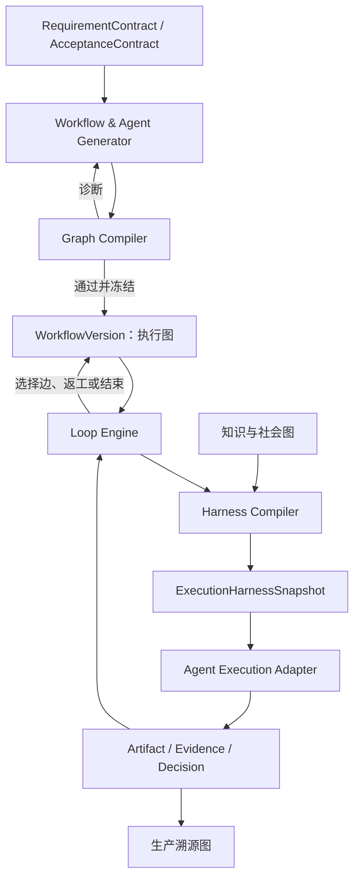
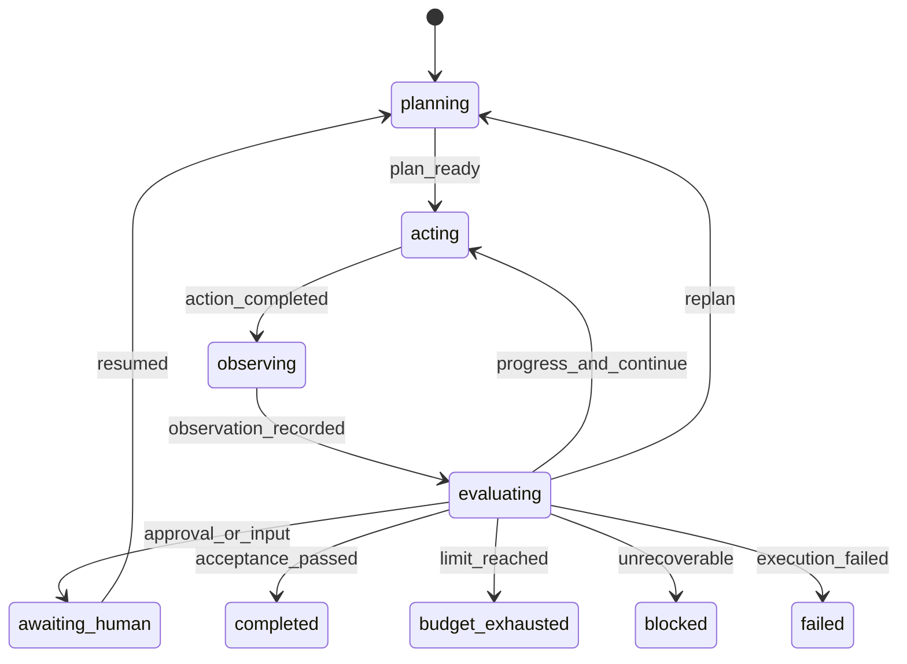

# Harness、Loop 与 Graph Engineering 设计基线

- 版本：0.1
- 日期：2026-07-28
- 状态：已确认的架构方向
- 上游：`system-requirements-v1.md` 第 26 章、`ADR-0005-domain-runtime-and-pluggable-agent-adapters.md`

## 1. 设计结论

江湖 Online 的运行内核必须同时实现三条正交主线：

- Harness Engineering：把 Agent 执行变成受约束、可复现、可审计的工程活动；
- Loop Engineering：让长任务能够持续推进、验证、纠错、恢复并可靠终止；
- Graph Engineering：把流程、知识/社会关系和生产溯源建模为可编译、可执行、可演化的类型图。

三者都由平台领域层掌握，Agent Adapter 只负责执行，不拥有正式状态。

## 2. 总体协作模型



中文解释：需求先驱动模型从零生成流程并规划本次 Agent 编队。编队成员可以从已有 Agent 库选择、从已有蓝图派生，也可以针对能力缺口从零生成。Graph Compiler 不提供固定流程模板，只检查生成图是否满足平台 Policy 和当前 Artifact Contract。运行时，Loop Engine 从图中选择可执行节点；Harness Compiler 为该次执行冻结身份、上下文、工具、权限、模型和沙箱；Adapter 返回候选产物后，结果进入溯源图，再由 Loop Engine 决定是否继续、返工或结束。

## 3. Harness Engineering

### 3.0 已有 Agent 的选择与实例化

```text
RequirementContract + Node Capability Contract
-> Agent Registry 检索
-> 候选 Agent 排序与能力覆盖分析
-> 用户接受 / 指定 / 排除 / 替换
-> 缺口派生或从零生成 AgentBlueprintVersion
-> 创建隔离 AgentInstance
-> 编译 ExecutionHarnessSnapshot
```

已有 Agent 是可复用的身份与能力蓝图，不是携带旧会话继续工作的常驻进程。复用时可以继承角色、方法知识、工具声明和经过验证的能力，但不能继承其他项目的私有上下文、临时记忆或未经授权的数据。

### 3.1 Harness 快照

建议核心对象：

```text
ExecutionHarnessSnapshot
  identity: AgentBlueprintVersion + AgentInstance
  task: goal + completion criteria + output schema
  prompt: system/developer/role prompt version refs
  context: ContextManifest + ArtifactVersion refs
  knowledge: retrieval policy + evidence refs
  tools: ToolBinding + permission scopes
  runtime: model + adapter + sandbox + workspace
  control: budget + timeout + retry + stop conditions
  validation: schema + evidence + quality gates
  provenance: hashes + version refs + created_at
```

快照是 `TaskAttempt` 的事实输入。运行中策略变化只能用于新的 Attempt 或新的 WorkflowVersion，不能修改已启动 Attempt 的历史。

### 3.2 编译过程

```text
NodeDefinition
+ AgentBlueprintVersion
+ Input ArtifactVersions
+ Knowledge Binding
+ Tool/Permission Policy
+ Model/Budget Policy
-> Harness Compiler
-> Preflight Validation
-> immutable ExecutionHarnessSnapshot
-> Adapter-specific projection
```

Harness Compiler 是平台层；把快照映射成 LangGraph、AgentScope、OpenClaw 或其他框架配置的是 Adapter 层。这保证更换执行框架不会改变权限、产物和审计语义。

## 4. Loop Engineering

### 4.1 两级循环

平台需要区分两种循环：

1. Run 级生产循环：调度节点、选择分支、处理返工、等待用户并决定最终状态；
2. Node 级 Agent 循环：计划、调用模型/工具、观察结果、校验和修订。

Node 级循环不能自行推进全局 Workflow，只能提交事件和 CandidateArtifact，由 Run 级 Loop Engine 作出正式状态转换。

### 4.2 状态与停止



中文解释：循环不是由 Agent 自己喊“完成”结束。每次行动后都要产生可验证观察，再由规则 Gate、独立 Judge 或用户依据 AcceptanceContract 判定继续、重规划、等待、完成或终止。所有状态都持久化，服务重启后从最近 Checkpoint 恢复。

### 4.3 停滞检测

至少组合以下信号：

- 连续 Artifact 内容摘要不变；
- 同一工具和参数重复调用；
- 同一 Defect 在多轮中未收敛；
- 计划开放事项长期不变；
- 新增 Token/费用没有带来新 Evidence 或可测进展；
- Agent 在相同参与者间重复转交任务。

检测到停滞后按策略重规划、换 Agent/模型/工具、缩小问题、请求裁判或用户，最后进入明确终态。

## 5. Graph Engineering

### 5.1 三种逻辑图

| 图 | 典型节点 | 典型边 | 真相来源 |
| --- | --- | --- | --- |
| 执行图 | Workflow、Node、Gate、Subgraph | depends_on、branches_to、joins、reworks_to | WorkflowVersion 与 NodeDefinition |
| 知识/社会图 | Ontology、Entity、Persona、Agent、Evidence | relates_to、knows、opposes、supports | Knowledge Service 的版本化投影 |
| 生产溯源图 | Requirement、Attempt、Artifact、Claim、Defect、Revision、Decision | generated_by、derived_from、cites、resolves、judged_by | PostgreSQL 领域对象与事件 |

“三种图”是三套逻辑 Schema，并不要求 MVP 部署三种图数据库。MVP 可用 PostgreSQL 保存正式对象和边，通过 Graph Query Service 提供投影；未来替换图后端也不能改变对象 ID、版本和证据语义。

### 5.2 图编译流水线

```text
模型生成 Graph Draft
-> Schema 解析
-> 类型检查
-> 结构检查（入口、出口、连通、可达、环）
-> 数据流检查（Artifact 输入输出）
-> Policy 检查（权限、预算、审批、Judge 独立性）
-> 能力覆盖检查（Acceptance/Output Contract）
-> 生成结构化诊断
-> 自动修复（最多规定次数）
-> 冻结 WorkflowVersion
```

编译器只规定合法性和能力覆盖，不规定软件开发、文档生产或其他固定业务流程，因此仍然满足“从零生成”。

## 6. 领域组件调整

建议在现有架构中明确增加：

- `Graph Schema Registry`：节点、边、Artifact 和 Policy Schema；
- `Graph Compiler`：静态检查、诊断、自动修复输入和版本冻结；
- `Harness Compiler`：生成不可变执行快照并投影到 Adapter；
- `Loop Engine`：Checkpoint、进展评估、停滞检测、恢复和终态；
- `Graph Query Service`：执行图、知识图和溯源图的权限化查询；
- `Progress Ledger`：目标、开放事项、进展证据和剩余预算。

## 7. 实现顺序

1. 先确定 Graph、Harness、Loop 的 Pydantic Schema 和数据库对象；
2. 实现 Graph Compiler 最小静态校验和结构化诊断；
3. 实现 Native Adapter 所需 Harness Compiler 与预检；
4. 实现持久 Loop 状态、Checkpoint、租约、重试和预算终态；
5. 完成真实 LLM + 并行 Agent + 代码 Demo 的故障恢复 E2E；
6. 再用同一平台契约验证 LangGraph/Microsoft Agent Framework/AgentScope Adapter。

## 8. 非目标

- 不把某个 Agent 框架的 graph/checkpoint/session 对象直接当作平台领域对象；
- 不承诺 LLM 输出逐字可复现，而是保证输入、环境、轨迹和差异可解释；
- 不把无限自治、无限自我改写或无限循环视为高级能力；
- 不通过展示模型私有思维链实现可观察性；
- 不因采用图工程而预制固定业务流程。
