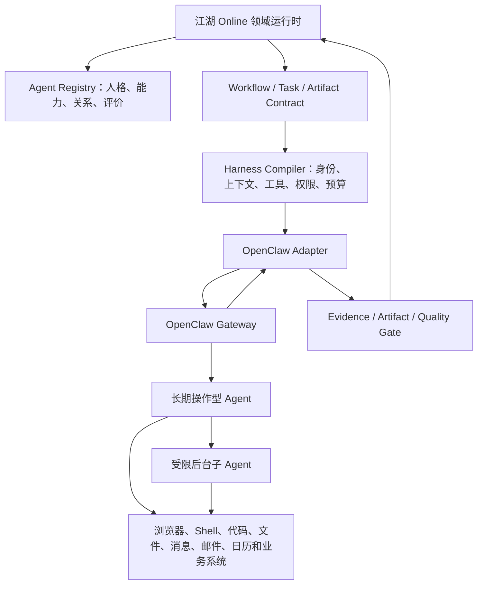

# 长期操作型 Agent 与 OpenClaw Adapter 设计

- 版本：0.1
- 日期：2026-07-28
- 状态：已确认方向，P1 实现 / P0 预留协议

## 1. 设计结论

江湖 Online 支持两类相互兼容的 Agent：

1. 生产流程 Agent：在一次 Workflow/Run 中完成分析、协作、争辩、攻击、修订或裁判；
2. 长期操作型 Agent：具有长期身份、能力、知识、关系、外部账号和工具，可以跨 Run 被选拔，并在授权范围内执行真实操作。

OpenClaw 适合作为第二类 Agent 的可插拔运行时。江湖 Online 仍是流程、权限决策、正式产物和审计的真相源。

## 2. 总体架构



读图说明：江湖 Online 决定使用哪个 Agent、允许做什么、预算多少以及怎样验收；OpenClaw 负责装载长期身份、渠道、Skills 和工具并完成实际操作。任何结果都必须回到江湖 Online，先成为候选产物和证据，再通过 Gate 发布。

## 3. 长期身份模型

长期 AgentBlueprintVersion 建议增加：

```text
persona
capabilities
knowledge_boundaries
relationship_defaults
external_identity_refs
delegation_principals
skill_bindings
tool_capability_requirements
preferred_runtime
standing_orders
reputation_by_scenario
```

外部账号凭证不进入 Blueprint 正文，只保存密钥引用和授权元数据。每次运行从 Blueprint 创建隔离 AgentInstance，并由 Harness 冻结实际权限。

## 4. 操作能力分级

| 等级 | 行为 | 示例 |
| --- | --- | --- |
| L1 只读/草拟 | 可以读取、分析和生成操作草案，不产生外部写入 | 阅读邮件、生成回复草稿、分析仓库 |
| L2 审批后写入 | 每次或每批高影响操作必须经用户批准 | 发送邮件、创建会议、发布内容、合并代码 |
| L3 受限自主执行 | 按 StandingOrderVersion 在硬边界内自动执行，事后可审计和停用 | 每日简报、定期巡检、已批准队列发布 |

操作等级只是上限，还必须按资源、目标、时间、金额、网络域名、文件路径和工具参数继续收窄。

## 5. 专业 Agent Lane

每个长期 Agent 应具有 Lane Contract：

```text
Owns：负责的工作
Non-goals：不应执行的工作
Chat Budget：直接响应和后台任务的边界
Handoff Rule：转交条件和目标
Tool Posture：最小工具面
Priority：任务优先级
Concurrency：并发和子 Agent 上限
```

Agent 不应为了表现全能而执行不属于自身职责的操作。越界请求应转成类型化 Handoff，由 Workflow 决定接收者。

## 6. OpenClaw Adapter 映射

| 江湖 Online | OpenClaw 投影 |
| --- | --- |
| AgentBlueprintVersion | Agent workspace、SOUL/AGENTS 配置、Skills 与模型配置 |
| AgentInstance | 某次受控 Session/Run |
| Agent Selection | Agent ID 与 Binding/目标 Agent 选择 |
| Harness Snapshot | 运行参数、工作目录、沙箱、工具策略、模型和 Spawn Prompt |
| Background Task | `sessions_spawn` 或等价子 Agent 运行 |
| Handoff | 平台类型化 Handoff + OpenClaw 消息/目标会话 |
| Tool Event | Gateway 工具事件转换为平台标准事件 |
| CandidateArtifact | Adapter 结构化返回，不直接由聊天消息发布 |

## 7. Adapter 边界

OpenClaw Adapter 必须提供：

- Agent 能力发现与健康检查；
- 启动、查询、事件流、取消和结果读取；
- 平台 Attempt ID 与外部 Session/Run ID 映射；
- 工具调用、外部对象、文件、命令和使用量证据；
- 权限、沙箱和工作空间实际配置摘要；
- 未知结果、超时、迟到结果和重复回传处理；
- 子 Agent 深度、并发、预算和级联取消映射。

OpenClaw 不得直接：

- 推进全局 Workflow；
- 发布正式 ArtifactVersion；
- 修改 Evidence、Defect、Revision 或 Decision；
- 扩大平台下发权限；
- 将 Session 历史视为正式上下文；
- 以 announce 或聊天回复代替可靠完成确认。

## 8. 外部写操作协议

```text
OperationIntent
-> Policy Check
-> Preview Artifact
-> User/Rule Approval
-> Idempotent Execution
-> External Result Verification
-> Operation Evidence
-> Success / Compensation / Manual Reconciliation
```

对于不可安全重试的操作，超时后不得自动再次执行。必须先查询外部系统确认是否已经成功，再决定补偿或人工核对。

## 9. 实现顺序

1. P0 先在统一 Tool Gateway、Harness 和事件协议中预留操作型 Agent 能力；
2. Native Adapter 完成文件、代码、Shell、浏览器和测试闭环；
3. 实现 OpenClaw Adapter POC，验证两个长期 Agent 的身份、工具和沙箱隔离；
4. 验证后台子 Agent、取消、Gateway 重启、迟到结果和未知外部写入；
5. P1 接入消息、邮件、日历、定时任务和 Delegate 身份；
6. 通过后再开放 L3 受限自主执行。
