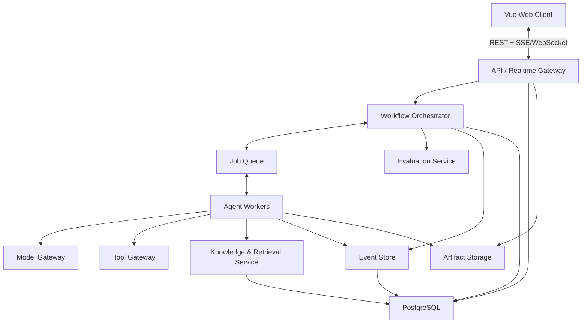
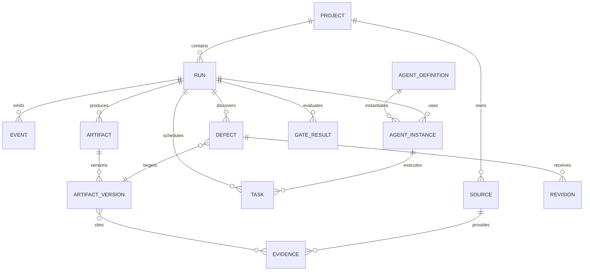
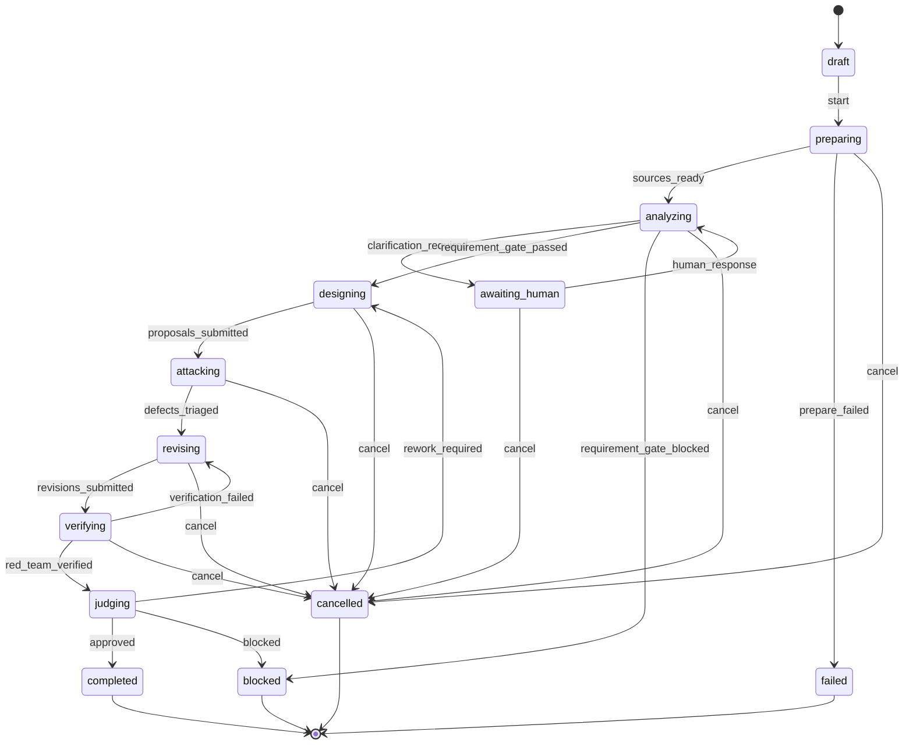

# 系统架构、事件模型与运行状态机

- 版本：0.1
- 状态：候选架构
- 日期：2026-07-23

## 1. 架构目标

- 支持多 Agent 并行、串行和返工。
- 全流程可观察、可暂停、可恢复、可回放。
- 正式产物不可变并可追溯到证据。
- Agent、模型、工具和存储可替换。
- Client 实时看到状态，但不与 Agent 运行时强耦合。
- MVP 可以使用 Docker Compose 在单机部署。
- 后续能够扩展为多 Worker 和远程对象存储。

## 2. 逻辑架构



## 3. 组件职责

### 3.1 Web Client

- 项目和运行配置
- 图谱、双栏、工作台等可视化
- 运行控制和人工介入
- Agent 访谈和问卷
- 报告、缺陷、评分和历史对比

### 3.2 API / Realtime Gateway

- 提供项目、运行、Agent、产物和报告 API。
- 校验用户权限和请求参数。
- 将运行事件推送给 Client。
- 不在请求线程中直接执行长时间 Agent 任务。

### 3.3 Workflow Orchestrator

- 执行生产流状态机。
- 解析阶段依赖和质量门禁。
- 创建 Agent 任务。
- 控制重试、返工、预算和终止。
- 处理用户介入后恢复运行。

### 3.4 Agent Worker

- 装载角色配置和任务上下文。
- 从知识服务获取最小必要上下文。
- 调用模型和工具。
- 校验并提交结构化消息和产物。
- 记录执行指标和错误。

Worker 不直接改变全局运行阶段，由 Orchestrator 根据事件推进。

### 3.5 Model Gateway

- 屏蔽不同模型供应商差异。
- 统一结构化输出、超时、重试和限流。
- 记录模型、Token、延迟和估算成本。
- 支持按角色配置不同模型。
- 对敏感数据执行发送策略检查。

### 3.6 Tool Gateway

- 注册和执行 Agent 工具。
- 校验角色权限。
- 约束文件、网络、代码和外部系统访问。
- 保存参数摘要、执行状态和结果引用。
- 为高风险写操作增加人工审批。

### 3.7 Knowledge & Retrieval Service

- 解析输入文档并保存来源片段。
- 提供关键词、向量和关系检索。
- 管理事实、推断、假设和冲突。
- 保存产物到证据的引用关系。
- 提供 Agent 和 Report/Judge Agent 查询接口。

### 3.8 Evaluation Service

- 执行确定性规则检查。
- 计算量表评分。
- 运行对比实验和统计。
- 将机器规则结果与裁判 Agent 判断分开保存。

### 3.9 Event Store

- 追加写入所有领域事件。
- 支持 Client 实时订阅。
- 支持运行回放、审计和故障恢复。
- 不保存模型私有思维链。

### 3.10 Artifact Storage

- 保存原始上传文件和大体积产物。
- 数据库存储元数据、版本和引用。
- 本地开发可使用文件目录，部署时切换兼容 S3 的对象存储。

## 4. 候选技术栈

| 层 | MVP 候选 |
| --- | --- |
| Client | Vue 3、TypeScript、Vite |
| API | Python、FastAPI、Pydantic |
| 异步任务 | Redis 队列与 Python Worker，具体库原型后确定 |
| 主数据库 | PostgreSQL |
| 向量检索 | PostgreSQL 向量扩展或可替换向量接口 |
| 图关系 | MVP 使用关系表；复杂图谱阶段再评估专用图数据库 |
| 对象存储 | 本地目录 / S3 兼容存储 |
| 实时推送 | SSE 优先；需要双向会话时增加 WebSocket |
| 部署 | Docker Compose |
| 测试 | Pytest、Vitest、Playwright |

选择 FastAPI 而不是直接沿用 MiroFish 的 Flask，是因为本系统包含较多异步运行、结构化事件和实时接口。该选择仍需通过原型验证并形成正式 ADR。

## 5. 核心领域对象



核心对象：

- `Project`：资料、配置和多次运行的容器。
- `Run`：一次可复现的生产流执行。
- `AgentDefinition`：角色模板、提示词、模型和工具权限。
- `AgentInstance`：某次运行中的具体 Agent。
- `Task`：带依赖、输入、输出约束和预算的工作单元。
- `ArtifactVersion`：不可变正式产物版本。
- `Evidence`：来源片段、工具结果或已确认事实。
- `Defect`：针对某个产物版本的结构化攻击结果。
- `Revision`：缺陷处置和新产物版本之间的关系。
- `Event`：所有状态变化的追加式记录。
- `GateResult`：规则和裁判的门禁结论。

## 6. 运行状态机



### 6.1 终态

- `completed`
- `blocked`
- `failed`
- `cancelled`

只有 `completed` 表示已通过终审。运行停止不等于完成。

### 6.2 恢复

- `awaiting_human` 可在收到用户回复后继续。
- `failed` 可从最近一次成功检查点创建新尝试。
- `blocked` 需要修改项目输入或约束后创建新运行。
- 历史事件和产物不覆盖。

## 7. 任务状态机

```text
pending
  -> ready
  -> running
  -> submitted
  -> validating
  -> completed
```

异常分支：

```text
running -> retry_wait -> ready
running -> failed
running -> cancelled
validating -> rejected -> ready
```

每个任务包含：

- 输入产物版本
- 期望输出 Schema
- 可用工具
- 模型配置
- 依赖任务
- 最大尝试次数
- Token、费用和时间预算
- 质量校验器

## 8. 事件模型

统一事件信封：

```json
{
  "event_id": "evt_01...",
  "sequence": 42,
  "project_id": "proj_01...",
  "run_id": "run_01...",
  "task_id": "task_01...",
  "agent_instance_id": "agent_01...",
  "type": "artifact.submitted",
  "visibility": "project",
  "payload": {},
  "correlation_id": "corr_01...",
  "causation_id": "evt_00...",
  "created_at": "2026-07-23T17:00:00+08:00",
  "schema_version": 1
}
```

关键事件：

- `run.created`
- `run.state_changed`
- `task.assigned`
- `task.started`
- `task.completed`
- `task.failed`
- `agent.message_sent`
- `tool.started`
- `tool.completed`
- `artifact.submitted`
- `artifact.validated`
- `defect.proposed`
- `defect.status_changed`
- `revision.submitted`
- `gate.completed`
- `human.input_requested`
- `human.input_received`
- `budget.threshold_reached`

## 9. 实时协议

MVP Client 通过 SSE 订阅：

```text
GET /api/runs/{run_id}/events?after_sequence=41
```

设计要求：

- 使用单调递增 `sequence` 排序。
- Client 断线后从最后序号恢复。
- 心跳与领域事件分开。
- 大产物只推送摘要和引用，不塞入事件流。
- 用户控制命令使用 REST，访谈流式输出可单独使用 SSE。

## 10. API 初稿

```text
POST   /api/projects
POST   /api/projects/{id}/sources
GET    /api/projects/{id}/knowledge
POST   /api/projects/{id}/runs
GET    /api/runs/{id}
POST   /api/runs/{id}/start
POST   /api/runs/{id}/pause
POST   /api/runs/{id}/resume
POST   /api/runs/{id}/cancel
GET    /api/runs/{id}/events
GET    /api/runs/{id}/tasks
GET    /api/runs/{id}/agents
GET    /api/runs/{id}/artifacts
GET    /api/runs/{id}/defects
GET    /api/runs/{id}/report
POST   /api/runs/{id}/human-input
POST   /api/runs/{id}/interviews
```

## 11. 安全边界

- 项目级数据隔离。
- Agent 工具权限服务端强制校验。
- 上传文件进行类型、大小和恶意内容检查。
- 外部内容视为不可信输入，防御提示注入。
- 密钥只保存在服务端配置或密钥服务中。
- 高风险外部写操作必须人工批准。
- 日志对密钥、个人数据和原始模型响应进行脱敏。
- 运行导出时明确包含的数据范围。

## 12. 故障与一致性

- 事件先持久化，再向 Client 发布。
- 产物提交使用幂等键。
- Worker 重试不得产生重复正式产物。
- 门禁基于固定产物版本运行。
- 裁判开始后若目标版本变化，当前裁判任务失效并重新执行。
- 外部模型或工具超时记录为失败事件，不伪造成空结果。

## 13. MVP 部署

```text
docker compose
  - web
  - api
  - worker
  - postgres
  - redis
```

开发阶段对象存储可使用挂载目录。生产化阶段再增加反向代理、S3 兼容存储、备份、监控和独立 Worker 扩缩容。

## 14. 尚待验证

- 是否需要引入专用 Agent 编排库，还是使用领域状态机封装。
- Redis 队列的具体实现。
- PostgreSQL 向量检索能否满足首个数据规模。
- SSE 是否覆盖所有实时交互需求。
- 图谱视图需要真实图数据库，还是从关系表投影即可。
- 各模型在结构化产物和裁判稳定性上的表现。
