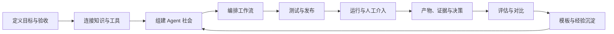
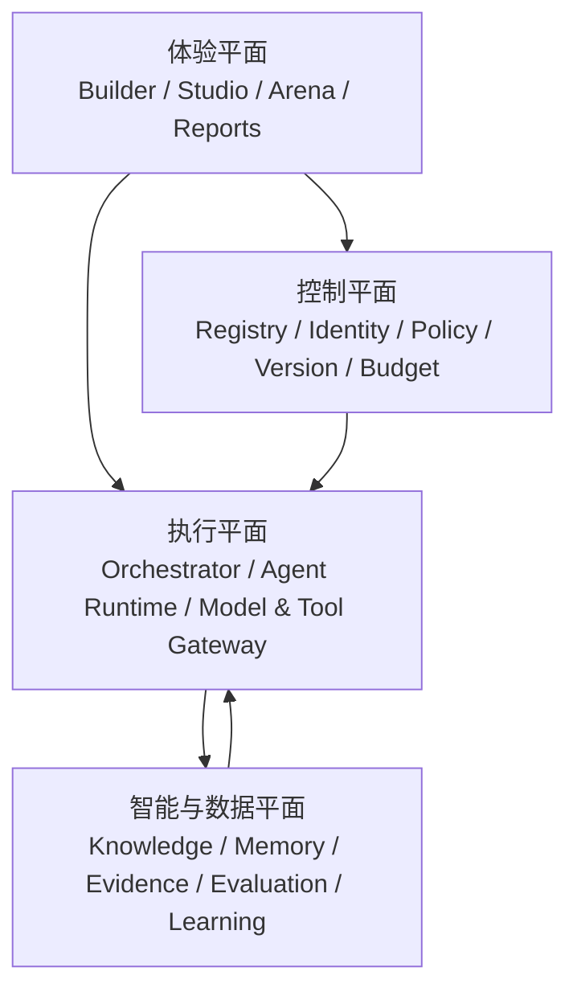
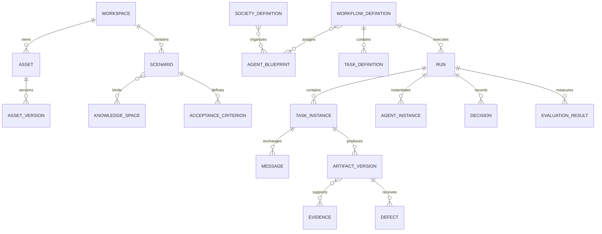
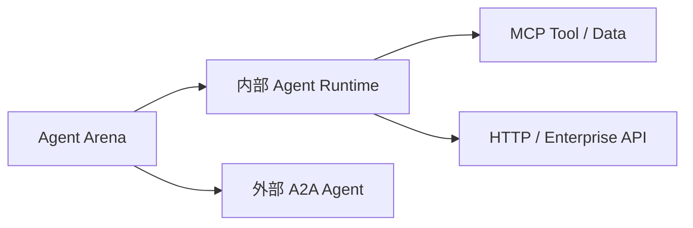

# Agent Arena 目标产品蓝图

- 版本：1.0
- 日期：2026-07-24
- 状态：目标蓝图草案
- 输入：用户需求基线 v2、两轮竞品调研、MiroFish/CAMEL/OASIS 调研

## 1. 愿景

> 让组织能够像组建和管理真实团队一样，组建、运行、监督和改进 AI Agent 团队。

Agent Arena 最终不是“Agent 聊天页面”，而是一个从业务意图到受治理执行的闭环平台。

## 2. 北极星产品闭环



平台价值来自完整闭环，而不是某一个 Agent 的回答质量。

## 3. 产品信息架构

### 3.1 一级模块

| 模块 | 用户问题 |
| --- | --- |
| Home / Control Center | 我的 Agent 资产、运行和风险整体如何？ |
| Workspaces | 哪些组织、成员和资源属于同一安全边界？ |
| Scenario Builder | 这次业务目标、资料、风险和验收是什么？ |
| Knowledge Hub | Agent 可以依据哪些知识，证据来自哪里？ |
| Agent Registry | 有哪些 Agent，它们能做什么、谁负责、效果如何？ |
| Tool Registry | Agent 能调用什么，风险和权限是什么？ |
| Society Designer | Agent 之间是什么组织关系和权责？ |
| Workflow Studio | 任务如何流转、协作、对抗和终止？ |
| Test & Evaluation Lab | 这套配置是否有效，是否优于基线？ |
| Live Arena | 当前运行到了哪里，谁在做什么，是否要介入？ |
| Artifacts & Reports | 最终交付物、证据、缺陷和决定是什么？ |
| Templates | 哪些经过验证的组织运行包可以复用？ |
| Governance | 身份、策略、版本、预算和审计如何管理？ |

### 3.2 Client 核心体验

保留 MiroFish 值得借鉴的三类视图，但服务于生产任务：

- **图谱视图**：Agent、任务、关系、Artifact、Evidence。
- **双栏视图**：左侧产物/报告，右侧 Agent、证据、缺陷和交互工具。
- **工作台视图**：设计、运行、干预、评测的完整操作界面。

首页不加载固定案例，而是显示 Workspace、最近运行、待审批、风险和资产概况。

## 4. 四个产品平面



### 4.1 体验平面

- 面向业务用户的场景向导。
- 面向设计者的 Society 与 Workflow Studio。
- 面向操作者的 Live Arena。
- 面向审核者的 Evaluation 与 Report。

### 4.2 控制平面

- Agent、工具、模型、知识和模板目录。
- Workspace、身份、权限和凭据。
- 版本、发布、环境和回滚。
- 策略、预算、风险和人工审批。
- 外部 A2A Agent 与 MCP Server 注册。

### 4.3 执行平面

- Workflow Orchestrator。
- Agent Runtime 与 Worker。
- Routing、Delegation、Handoff、Debate 策略。
- Model Gateway、Tool Gateway、Knowledge Gateway。
- Event Bus、Task Store、Artifact Store。
- Pause/Resume/Cancel/Retry/Checkpoint。

### 4.4 智能与数据平面

- 文档、代码和企业数据连接。
- 关键词、向量和关系检索。
- 会话、任务、长期和 Agent 私有记忆。
- Evidence Graph 和 Artifact Registry。
- Evaluation Suite、Benchmark、A/B Run。
- 模板、方法和经验学习。

## 5. 核心领域模型



### 5.1 一等资产

- Scenario Template
- Knowledge Space
- Agent Blueprint
- Published Agent
- Tool Definition
- Society Definition
- Workflow Definition
- Evaluation Suite
- Run
- Artifact Version
- Evidence
- Template Package

### 5.2 组织运行包

平台最有价值的复用单位是 `Organization Package`：

```text
场景模板
+ Agent 团队
+ 社会关系与制度
+ 工作流
+ 知识和工具绑定规则
+ Artifact Schema
+ Evaluation Suite
+ 人工介入策略
```

它比单个 Prompt、Agent 或工作流更完整，能够表达一个经过验证的生产方法。

## 6. 双运行内核

### 6.1 Deterministic Workflow

适合：

- 固定业务步骤。
- 数据转换和规则检查。
- 审批、发布和高风险操作。
- 需要复现的生产任务。

结构：

- 顺序、并行、条件、循环、等待、人工节点。

### 6.2 Agentic Society

适合：

- 任务分解、探索和创造。
- 多专家协作。
- 方案竞争与辩论。
- 红队攻击与裁判。

策略：

- Routing
- Delegation
- Handoff
- Debate
- Committee
- 后续 Swarm

### 6.3 组合原则

```text
Workflow 是骨架
Agent Society 是局部自主团队
Policy 是边界
Artifact 是交付
Evidence 是依据
Evaluation 是反馈
Human 是最终责任主体
```

## 7. Agent 社会模型

### 7.1 Agent 身份

每个 Agent 有：

- 身份、职责、目标和能力。
- 所有者和发布版本。
- 模型、Prompt 和上下文策略。
- 知识、工具和数据权限。
- 输入输出和 Handoff 契约。
- 预算、风险等级和 Evaluation Suite。

### 7.2 社会关系

- `reports_to`
- `delegates_to`
- `collaborates_with`
- `hands_off_to`
- `reviews`
- `challenges`
- `arbitrates`
- `observes`

### 7.3 社会制度

- 角色权责分离。
- Artifact 创建、修改、批准和发布权限。
- 冲突升级与仲裁。
- 工具调用和预算策略。
- 证据要求和质量门。
- 失败、取消、超时和补偿。

### 7.4 事件环境

借鉴 MiroFish 的“上帝视角”，用户可在运行中：

- 注入新事实或约束。
- 改变预算和优先级。
- 回答开放问题。
- 批准或拒绝动作。
- 暂停、接管或终止。

这些操作全部形成审计事件。

## 8. 知识、记忆与证据

```text
Knowledge：运行前已存在、可授权访问的信息
Memory：Agent/任务/运行过程中保留的状态
Evidence：用于支持具体主张、缺陷或决策的可追溯依据
Artifact：可交付、可版本化的正式结果
Learning：从多次评测中提炼、经审批后复用的方法
```

平台禁止将所有聊天记录直接当作长期知识。学习写回需要：

```text
候选经验 -> 去重 -> 冲突检查 -> 证据检查 -> 人工批准 -> 发布
```

## 9. 测试与评估蓝图

### 9.1 评测对象

- Agent Blueprint/Version
- Router/Handoff
- Tool
- Knowledge Retrieval
- Workflow
- Society/Team
- Artifact
- 完整 Organization Package

### 9.2 指标层

| 层 | 指标示例 |
| --- | --- |
| 路由 | Agent 选择正确率、无效 Handoff 数 |
| 工具 | 工具选择、参数、成功率、越权阻断 |
| 知识 | 召回率、证据正确率、过期知识命中 |
| 产物 | 完整性、正确性、可执行性、格式 |
| 对抗 | 有效缺陷率、无效缺陷率、修复率 |
| 系统 | 时延、Token、费用、重试、稳定性 |
| 人机 | 审批等待、人工修改量、接管率 |
| 业务 | 验收通过率、风险降低、周期缩短 |

### 9.3 基线

每个正式场景至少保留：

- 无 Agent 或原人工流程基线。
- 单 Agent 基线。
- 多 Agent 协作版本。
- 多 Agent 协作 + 对抗版本。

只有质量、风险或人工效率出现可重复改善，多 Agent 才具备价值。

## 10. 开放协议蓝图



- MCP：工具和数据访问。
- A2A：外部 Agent 的发现、任务、消息、状态和 Artifact。
- 内部领域模型保持 A2A 语义兼容。
- Society、Policy、Evidence、Evaluation 由 Agent Arena 提供。

## 11. 分阶段目标状态

### M0：可视化原型

当前状态：

- 固定场景。
- 固定 Agent。
- 模拟事件。
- 基础 Client。

### M1：可配置平台

- Workspace、Scenario。
- Agent/Tool/Knowledge Registry。
- Workflow Definition。
- 数据持久化。

完成标志：无需改代码即可定义不同场景和 Agent。

### M2：真实执行平台

- 真实模型与工具。
- Routing、Delegation、Handoff、Debate。
- Live Arena 与人工介入。
- Artifact/Evidence/Defect/Decision。

完成标志：可运行和复盘真实多 Agent 生产流。

### M3：可治理平台

- 版本、发布、审批和回滚。
- Evaluation Lab 与回归门禁。
- Society Policy。
- MCP/A2A、权限和审计。

完成标志：Agent 能作为组织资产被安全复用。

### M4：学习型 Agent 社会

- Organization Package。
- 自动推荐团队和流程。
- 能力画像、声誉和优化建议。
- 跨场景模板与方法库。
- 可选的大规模社会模拟。

完成标志：平台能基于历史证据持续改善组织方案。

## 12. 第一目标版本

第一目标版本聚焦从 M0 到 M2：

1. 移除固定 Demo 入口。
2. 实现 Workspace、Scenario 和资产目录。
3. 实现 Agent Blueprint、Knowledge Space、Tool Definition。
4. 实现可保存的 Workflow Definition。
5. 接入真实模型并运行四 Agent 闭环。
6. 实现 Artifact、Evidence、Defect 和 Decision。
7. 实现 Live Arena、暂停和人工批准。
8. 实现单 Agent 与多 Agent 对比。
9. 最后选取一个需求开发案例完成课题验收。

## 13. 蓝图验收原则

- 案例通过平台配置产生，不在代码中硬编码。
- 工作流不是聊天脚本，而是可执行、可恢复的状态图。
- Agent 是独立资产，不是前端卡片数据。
- 结论必须能追溯到 Artifact、Evidence 和运行事件。
- 对抗必须导致缺陷、修订、复测或明确驳回。
- 用户始终拥有暂停、接管和否决权。
- 多 Agent 必须通过基线实验证明价值。

