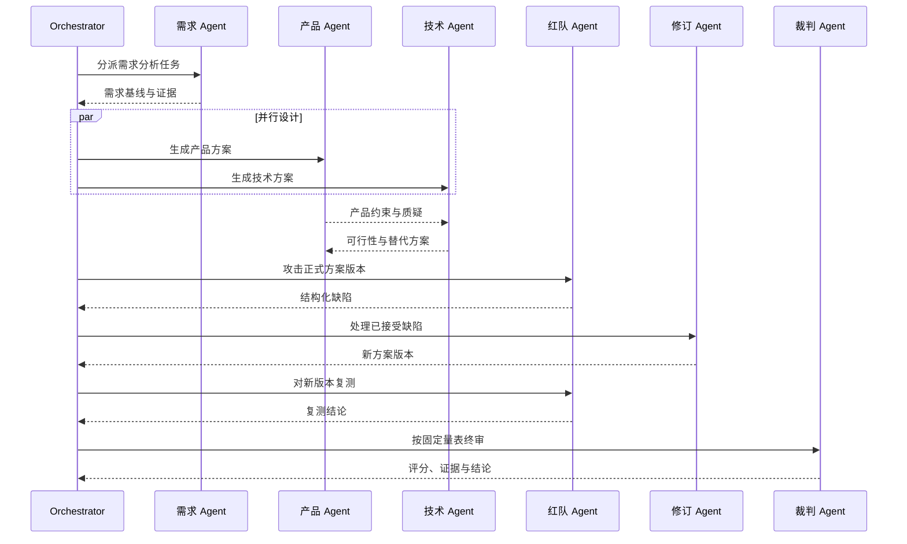

# 多 Agent 协作与对抗体现在哪里

- 日期：2026-07-23
- 当前版本：MVP 0.1

## 1. 结论

当前 Agent Arena 已经实现了多 Agent 协作与对抗的：

- 角色模型
- 权限与消息协议
- 运行状态机
- 事件契约
- Client 可视化
- 固定流程演示

但当前版本**尚未实现多个真实 LLM Agent 的自主执行**。

目前看到的需求分析、产品提案、技术提案、红队缺陷、修订和裁判评分，来自后端固定事件模拟器，用于验证系统交互和数据契约。

## 2. 当前版本如何体现协作

### 2.1 角色分工

系统定义七类 Agent：

1. 流程协调
2. 需求分析
3. 产品方案
4. 技术方案
5. 红队攻击
6. 修订处理
7. 裁判报告

这些角色显示在 Client 的 Agent 列表和图谱中。

### 2.2 任务交接

演示流程依次产生：

```text
需求分析 Agent
  -> 提交需求基线
产品方案 Agent
  -> 向技术方案 Agent 提出分层权限方案
技术方案 Agent
  -> 提交技术方案
```

Client 使用时间线显示 Agent、任务、事件和结果。

### 2.3 正式协作协议

设计文档定义了：

- `task_assignment`：任务分派
- `proposal`：方案提议
- `question`：问题
- `challenge`：结构化质疑
- `response`：回应
- `revision`：修订
- `gate_result`：门禁结果

正式实现后，Agent 之间不会只发送自由文本，而是提交带证据和产物引用的结构化消息。

## 3. 当前版本如何体现对抗

对抗不是让 Agent 随机争论，而是一个受控的攻防闭环：

```text
产品/技术方案
  -> 红队构造失败场景
  -> 提交结构化缺陷
  -> 修订 Agent 处理缺陷
  -> 红队重新测试
  -> 裁判 Agent 评分
```

当前演示中的具体攻击是：

> 企业知识助手的共享回答可能通过引用链接泄露用户无权访问的跨空间文档。

事件状态依次为：

```text
defect.proposed
  -> revision.submitted
  -> defect.status_changed: fixed
  -> gate.completed
```

Client 中对应：

- 红色红队事件
- 红队缺陷面板
- 修订事件
- 红队复测
- 最终评分和通过结论

## 4. 协作与对抗的制度设计

为了避免“所有 Agent 都能修改一切”，设计中实行权限隔离：

| 行为 | 负责角色 |
| --- | --- |
| 提炼需求 | 需求分析 Agent |
| 编写产品方案 | 产品方案 Agent |
| 编写技术方案 | 技术方案 Agent |
| 提出攻击和缺陷 | 红队 Agent |
| 修改正式方案 | 产品、技术或修订 Agent |
| 复测缺陷 | 红队 Agent |
| 最终评分 | 裁判 Agent |
| 推进流程 | 协调 Agent |

关键限制：

- 红队不能直接修改被攻击方案。
- 修订 Agent 不能删除红队记录。
- 裁判不能修改被评分产物。
- 协调 Agent 不能代替专业 Agent 编写方案。
- 所有修订生成新版本，不覆盖历史。

## 5. 当前已实现与未实现

| 能力 | 状态 |
| --- | --- |
| 七类 Agent 定义 | 已实现 |
| Agent 状态和任务展示 | 已实现 |
| 协作/攻击/修订/门禁事件 | 已实现 |
| SSE 实时事件流 | 已实现 |
| 缺陷状态变化 | 已实现 |
| 评分展示 | 已实现 |
| 图谱、双栏和工作台 | 已实现 |
| 每个 Agent 独立调用 LLM | 未实现 |
| Agent 独立上下文和私有记忆 | 未实现 |
| Agent 真实结构化消息传递 | 未实现 |
| Agent 动态选择工具 | 未实现 |
| 红队根据方案自主生成攻击 | 未实现 |
| 修订 Agent 根据缺陷动态改稿 | 未实现 |
| 裁判根据量表和证据动态评分 | 未实现 |
| PostgreSQL 事件和产物持久化 | 未实现 |

## 6. 为什么先实现模拟器

先实现固定事件模拟器是为了验证：

- Client 是否能正确展示完整生产流。
- SSE 是否能支撑实时状态。
- 事件、缺陷和评分数据结构是否合理。
- 桌面与移动端布局是否可用。
- 在消耗真实模型费用前，先稳定系统边界。

模拟器不是最终多 Agent 引擎，而是后续真实 Agent Worker 的接口替身。

## 7. 真实多 Agent 版本如何运行

下一阶段应实现：



每个 Agent 需要具备：

- 独立系统提示词
- 独立任务上下文
- 受限工具权限
- 私有短期记忆
- 共享正式产物
- 结构化输出 Schema
- Token、时间和重试预算

## 8. 下一实现目标

真实多 Agent 的最小闭环应先接入四个 Agent：

1. 需求分析 Agent
2. 方案 Agent
3. 红队 Agent
4. 裁判 Agent

首个闭环跑通后，再拆分产品、技术和修订角色。这样能够尽快验证：

- 真实方案是否会影响红队攻击。
- 红队结果是否会影响修订。
- 修订是否会改变裁判评分。
- 不同模型和提示词配置是否产生可测量差异。

## 9. 为什么当前显示“智能需求评审示例”

当前 Client 启动后直接调用：

```text
GET /api/demo
```

后端 `create_demo_run()` 固定创建：

- 项目名称：`智能需求评审示例`
- 运行标题：`企业知识助手需求评审与方案攻防`

这样设计是为了让 MVP 在没有上传资料、配置模型或创建项目的情况下，也能立即演示完整协作与攻防事件流。

它不是最终的项目创建方式。正式版本应先进入：

```text
创建项目
  -> 填写生产流目标
  -> 上传资料
  -> 配置 Agent
  -> 启动运行
```

## 10. 当前在哪里配置 Agent

当前版本没有 Client Agent 配置入口。

七类 Agent 目前由后端 `server/app/store.py` 中的 `AGENT_DEFINITIONS` 常量固定创建。Client 只能读取并展示这些 Agent。

虽然 Client 信息架构已经设计了“角色配置模式”，但该页面和对应 API 尚未实现。

正式配置能力需要包括：

- 新增、复制、启用和停用 Agent
- Agent 名称和职责
- 系统提示词
- 模型和参数
- 工具权限
- 可读取的记忆范围
- 输入和输出 Schema
- Token、费用、时间和重试预算
- Agent 在生产流中的阶段和依赖

在该功能完成前，修改 `AGENT_DEFINITIONS` 只能改变演示角色名称和列表，不能形成通用的动态 Agent 编排。
