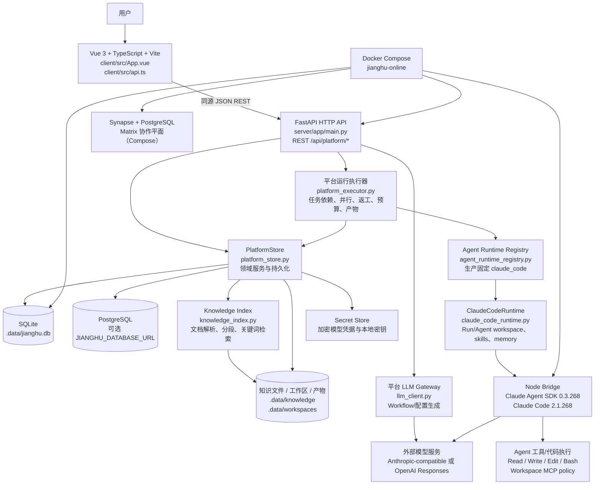
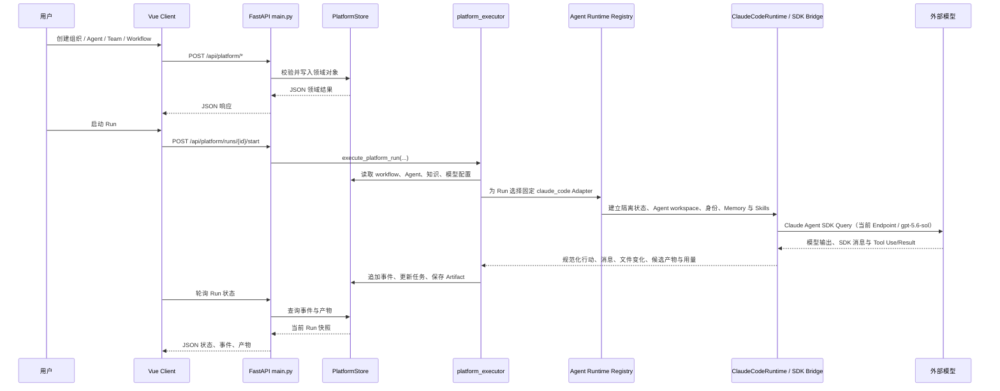

# Agent Arena 当前仓库技术架构图

> 本图仅依据当前工作区可读取的源码、配置和设计文档整理，不执行应用代码，不把设计文档中尚未落地的组件当作当前实现。

## 1. 当前实现架构

## 2. 请求与运行时主链路

## 3. 代码分层与职责

| 层 | 当前源码 | 责任 |
|---|---|---|
| 表现层 | `client/src/App.vue`、`client/src/api.ts`、`client/src/components/` | 江湖、组织、Agent、团队、Workflow、Run、知识和设置页面；通过 REST 调用后端 |
| API 层 | `server/app/main.py` | FastAPI 应用、Pydantic 请求模型、平台路由、静态前端托管、运行控制 |
| 领域/应用层 | `server/app/platform_store.py` | 组织、Agent、Team、Workflow、Knowledge Source、Run、Event、Artifact 等对象及事务操作 |
| 执行层 | `server/app/platform_executor.py` | Workflow 依赖解析、节点执行、模型/工具调用、重试、返工、测试命令、代码清单和产物验证 |
| 模型适配层 | `server/app/llm_client.py` | Anthropic Messages 与 OpenAI Responses 协议、JSON 输出解析、网络/HTTP 重试 |
| Agent Runtime Port | `server/app/agent_runtime.py`、`server/app/agent_runtime_registry.py` | 框架无关合同；产品 Registry 固定为 `claude_code`，误配其他 Runtime 明确失败 |
| Claude Agent 运行时 | `server/app/claude_code_runtime.py`、`server/claude_agent_runtime/` | Claude Agent SDK Bridge、运行隔离目录、Agent workspace、身份/规范/记忆/技能同步、工具策略与进程回收 |
| 知识层 | `server/app/knowledge_index.py` | 文本、PDF、DOCX、XLSX、PPTX 解析，分段及检索评分 |
| 安全与存储 | `server/app/secret_store.py`、`.data/` | 模型 Token 加密、本地密钥、SQLite/文件系统持久化 |
| 部署层 | `Dockerfile`、`compose.yaml`、`compose.postgres.yaml` | 单容器平台部署；可选 PostgreSQL；Compose 中附带 Synapse 协作平面 |

## 4. 已实现与规划边界

- **已实现主路径**：Vue → FastAPI → `PlatformStore` → `platform_executor` → Runtime Registry → `ClaudeCodeRuntime` / Claude Agent SDK Bridge → 事件和产物回写。
- **已实现持久化**：默认 SQLite；`PlatformStore` 提供 PostgreSQL 兼容适配，正式切换由 `JIANGHU_DATABASE_URL` 控制。
- **已实现知识处理**：文件上传、格式解析、chunk、简单相关度检索，知识元数据与内容落在 `.data`。
- **已实现 Agent 运行隔离**：每次 Run 有独立 Claude Runtime 状态；Agent 版本拥有独立 workspace，保存技能、身份、规范和记忆文件；平台证据包向获准人物提供安全事件投影、Artifact 原始字节和 Runtime Attestation。
- **OpenClaw 当前边界**：生产 Registry 不导入、不注册 OpenClaw，新 Run 无法选择旧底座；旧状态路由和旧事件名只用于历史读取兼容，基线脚本可直接构造旧 Adapter 做迁移对照。
- **已实现模型适配**：无 Mock/fallback；缺配置、网络异常、模型错误和非 JSON 输出会显式失败。
- **Compose 增强项**：当前 `compose.yaml` 定义了 Synapse 与其 PostgreSQL，但源码目录中未发现对应 `matrix_bridge.py` / `collaboration.py`，因此图中将 Synapse 标注为部署层协作平面，而非已确认的应用领域调用链。
- **设计文档中的未来组件**：Graph Compiler、Loop Engine、Harness Compiler、Evaluation Service、Queue、对象存储等在 `docs/04-design/system-architecture.md` 中有规划，但不应视为当前源码已独立实现的服务。

## 5. 关键技术栈

- 前端：Vue 3、TypeScript、Vite、Lucide Vue。
- 后端：Python 3.13、FastAPI、Pydantic、Uvicorn。
- 数据：SQLite 默认；PostgreSQL 可选；文件系统保存知识、workspace 和运行产物。
- AI：Claude Agent SDK / Claude Code Bridge 承载 Agent 回合；当前已验证用户的 Anthropic-compatible GPT Endpoint 与 `gpt-5.6-sol`。`llm_client.py` 继续服务平台级普通 LLM 生成，不作为 Agent Runtime fallback。
- 文档解析：pypdf、openpyxl、OpenXML 读取 DOCX/PPTX。
- 部署：Docker Compose；默认平台端口 8000，Synapse 默认端口 8008。
- 测试：Pytest Runtime/平台合同、Node Bridge tests、Vue TypeScript 检查与 Vite production build；真实浏览器 UI Run 作为最终 E2E 门禁，Fake 仅做回归辅助。
